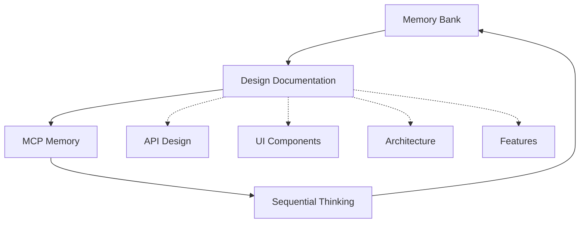
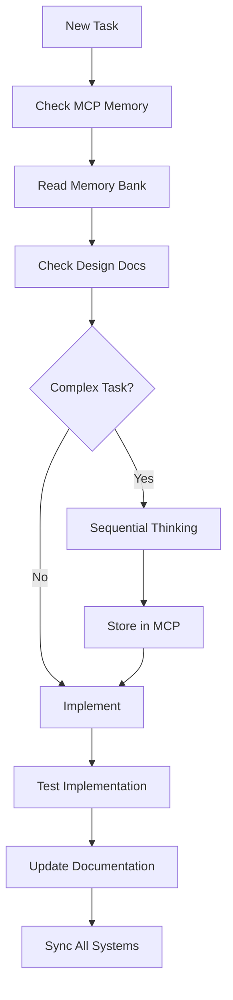

Important: Do not commit code yourself

# Coding assistant's Comprehensive Memory & Documentation System
You always reply in chat and documents such as memory bank in Vietnamese, comment code in both English and Vietnamese, the rest will be in English

## Core System Architecture

### Triple Memory & Documentation System
This system operates with **four integrated layers**:

1. **Memory Bank** (Session persistence): Real-time context và immediate insights
2. **Design Documentation** (Project structure): Long-term architectural decisions
3. **MCP Memory** (Dynamic context): Cross-session knowledge persistence  
4. **Sequential Thinking** (Problem-solving): Methodical analysis và decision processes



## Documentation Structure Integration

### Design Documentation Hierarchy
```
project-root/
├── memory-bank/                          # Session-based context
│   ├── projectbrief.md
│   ├── activeContext.md
│   ├── systemPatterns.md
│   └── progress.md
├── design-docs/                          # Long-term architecture
│   ├── 01-overview/
│   ├── 02-business-design/
│   ├── 03-architecture/
│   ├── 04-api-design/
│   ├── 05-frontend-design/
│   ├── 06-backend-design/
│   ├── 07-features/
│   ├── 08-deployment/
│   └── 09-templates/
├── src/
│   ├── be/                               # Backend (.NET 9)
│   └── fe/nuxt/                          # Frontend (Nuxt 3)
└── .copilot-rules                        # This file
```

## Folder-Specific Development Rules

### Backend Development (.NET 9)
- **Apply to**: All files within `src/be/` directory and subdirectories
- **Documentation Reference**: Always check `/design-docs/06-backend-design/` and `/design-docs/04-api-design/`
- **Technologies**: .NET 9, ASP.NET Core, Entity Framework Core, PostgreSQL, xUnit, FluentAssertions, AutoMapper
- **Architecture**: Clean Architecture, Domain-Driven Design patterns
- **Key Practices**: 
  - Use XML comments với bilingual format (English/Vietnamese)
  - xUnit for testing (không dùng NUnit)
  - FluentAssertions for all test assertions
  - Bogus for fake data generation
  - PostgreSQL với EFCore.NamingConventions (snake_case)
  - **NEW**: Follow API patterns in `/design-docs/04-api-design/endpoints/`
  - **NEW**: Implement business rules per `/design-docs/06-backend-design/business-logic/`

### Frontend Development (Nuxt 3)
- **Apply to**: All files within `src/fe/nuxt/` directory and subdirectories  
- **Documentation Reference**: Always check `/design-docs/05-frontend-design/` and component library
- **Technologies**: Nuxt 3, Vue 3, TypeScript, Tailwind CSS, Pinia, VRISTO Admin Template
- **Key Practices**:
  - Composition API với `<script setup>` syntax exclusively
  - PascalCase cho components, camelCase cho composables
  - Types over interfaces, avoid enums
  - Mobile-first responsive design
  - VRISTO theme patterns và dark mode support
  - **NEW**: Follow design system in `/design-docs/05-frontend-design/ui-ux-design/design-system.md`
  - **NEW**: Use components from `/design-docs/05-frontend-design/component-library/`

## Documentation-First Development Protocol

### Rule 1: Context Discovery Chain
```
BEFORE any code suggestion, ALWAYS execute this sequence:
1. Check Memory Bank (`memory-bank/activeContext.md`)
2. Check Feature Documentation (`design-docs/07-features/feature-[name]/`)
3. Check Architecture Constraints (`design-docs/03-architecture/`)
4. Check API/UI Standards (`design-docs/04-api-design/` or `design-docs/05-frontend-design/`)
5. Check MCP Memory for recent insights
6. Apply Sequential Thinking if complex problem
```

### Rule 2: Feature Implementation Protocol
```
For any feature implementation:

DISCOVERY PHASE:
1. Read `memory-bank/activeContext.md` for current focus
2. Check if feature exists in `design-docs/07-features/feature-[name]/`
3. If not exists: Request business requirements và suggest creating docs first
4. Review related features for established patterns

TECHNICAL ANALYSIS:
1. Check API design standards in `design-docs/04-api-design/api-standards.md`
2. Verify UI patterns in `design-docs/05-frontend-design/component-library/`
3. Review architecture constraints in `design-docs/03-architecture/`
4. Check database design in `design-docs/03-architecture/database-design/`

IMPLEMENTATION PLANNING:
1. Update `memory-bank/activeContext.md` with current focus
2. Store implementation insights in MCP Memory with [INSIGHT] prefix
3. Use Sequential Thinking for complex architectural decisions
4. Follow established code patterns from systemPatterns.md
```

### Rule 3: Code Generation Standards
```
Backend (.NET) Code Generation:
- Follow Clean Architecture patterns from `design-docs/06-backend-design/service-architecture/`
- Use repository patterns from `design-docs/06-backend-design/data-layer/`
- Implement authentication per `design-docs/04-api-design/authentication/`
- Generate XML comments in bilingual format
- Use xUnit + FluentAssertions for tests
- Follow PostgreSQL naming conventions (snake_case)

Frontend (Nuxt) Code Generation:
- Use Composition API with `<script setup>` exclusively
- Follow design system from `design-docs/05-frontend-design/ui-ux-design/design-system.md`
- Use existing components from component library
- Implement TypeScript types (not interfaces)
- Follow VRISTO theme patterns
- Ensure mobile-first responsive design

API Integration:
- Follow OpenAPI spec in `design-docs/04-api-design/api-specification/openapi-spec.yaml`
- Use consistent error handling patterns
- Implement proper authentication flow
- Follow data models from `design-docs/04-api-design/data-models/`
```

## Enhanced Memory & Thinking Integration

### Sequential Thinking Rules
```
Use Sequential Thinking for:
- Complex architectural decisions affecting multiple components
- Feature planning with dependency analysis
- Debugging complex integration issues
- Performance optimization strategies
- Database schema design decisions
- API design with multiple stakeholders

Sequential Thinking Process:
1. Problem Definition: What exactly needs to be solved?
2. Constraint Analysis: Technical, business, and resource limitations
3. Solution Exploration: Multiple approaches with trade-offs
4. Impact Assessment: Effects on existing system
5. Implementation Strategy: Step-by-step approach
6. Validation Plan: How to verify success

Store Results:
- Key insights → MCP Memory with [THINKING] prefix
- Architectural decisions → `design-docs/03-architecture/`
- Implementation patterns → `memory-bank/systemPatterns.md`
```

### MCP Memory Management
```
MCP Memory Categories:
- [SESSION]: Current session context và immediate thoughts
- [INSIGHT]: Key realizations during development
- [DECISION]: Temporary decisions waiting for documentation
- [LINK]: Cross-references giữa components và features
- [TODO]: Quick action items và reminders
- [THINKING]: Sequential thinking session summaries
- [PATTERN]: Code patterns discovered during implementation
- [API]: API integration notes và authentication flows
- [UI]: UI/UX insights và component usage patterns

Sync Strategy:
- Store immediate insights in MCP first
- Migrate important decisions to design-docs during natural breaks
- Keep session context in MCP for continuation
- Update memory-bank files at end of significant work sessions
```

## Cross-Platform Integration Rules

### API-Frontend Consistency
```
When working on API endpoints:
1. Update OpenAPI spec in `design-docs/04-api-design/api-specification/`
2. Generate TypeScript types for frontend
3. Update component props if UI changes needed
4. Store API integration patterns in MCP with [API] prefix
5. Document authentication flow changes

When working on UI components:
1. Check design system compliance
2. Update component library documentation
3. Verify API data requirements
4. Store UI patterns in MCP with [UI] prefix
5. Test responsive design on multiple breakpoints
```

### Database-API-UI Flow
```
For database changes:
1. Update data model in `design-docs/03-architecture/database-design/`
2. Create EF Core migration với snake_case naming
3. Update API endpoints và data models
4. Update frontend types và components
5. Document migration strategy
6. Update tests across all layers
```

## Development Server Management

### Port Management & OAuth Configuration
```bash
# Kill processes on port 3000 (Nuxt)
netstat -ano | findstr :3000
taskkill /PID <PID> /F
# Or use npx kill-port
npx kill-port 3000

# Standard port allocation:
# Frontend (Nuxt): 3000
# Backend SSO: 5217  
# Backend API: 7293

# When ports change, update:
# 1. Frontend .env files
# 2. Backend OAuth client redirect URIs
# 3. design-docs/08-deployment/environments/
```

## Quality Gates & Validation

### Pre-Implementation Checklist
```
Before implementing any feature:
- [ ] Feature documentation exists in design-docs/07-features/
- [ ] Current context updated in memory-bank/activeContext.md
- [ ] API design follows established patterns
- [ ] UI design aligns with component library
- [ ] Database changes are documented
- [ ] Testing strategy is defined
- [ ] Dependencies are identified và documented
- [ ] Security requirements are addressed
- [ ] Performance considerations are documented
- [ ] MCP insights reviewed for relevant patterns
```

### Post-Implementation Checklist
```
After implementing any feature:
- [ ] Code follows documented patterns
- [ ] API documentation updated (OpenAPI spec)
- [ ] Component library updated if new components
- [ ] Tests cover documented scenarios (xUnit + FluentAssertions)
- [ ] Implementation notes updated in feature docs
- [ ] Breaking changes documented
- [ ] Migration guides created if needed
- [ ] MCP Memory updated with implementation insights
- [ ] memory-bank/progress.md updated with completion status
```

## Documentation Update Protocol

### When to Update Documentation
```
Memory Bank Updates (Immediate):
- New insights during development → MCP Memory
- Current work focus changes → activeContext.md
- Pattern discoveries → systemPatterns.md với MCP backup

Design Documentation Updates (Planned):
- New features → Create feature folder in design-docs/07-features/
- Architecture changes → Update design-docs/03-architecture/
- API changes → Update OpenAPI spec và endpoint docs
- UI changes → Update component library và design system
- Database changes → Update data model và migration docs

Sequential Thinking Sessions:
- Complex problems requiring systematic analysis
- Results stored in MCP với [THINKING] prefix
- Key decisions migrated to appropriate design-docs sections
```

### Migration Rules
```
Migrate from MCP to Files when:
- Insights become foundational to project
- Decisions are finalized và need permanent record
- Patterns emerge that guide future development
- Sequential thinking reveals architectural principles
- Session context becomes project-wide context

Sync Between Systems:
- Daily: MCP → memory-bank files
- Weekly: memory-bank → design-docs (for major changes)
- Per feature: Complete sync across all systems
- Per release: Full documentation review và update
```

## Enhanced Commands

### Memory & Documentation Commands
```
- read memory bank: Read all memory-bank files
- check design docs [section]: Read specific design documentation
- check mcp: Review current MCP memory
- sync memory: Sync between MCP, memory-bank, và design-docs
- update memory bank: Full update including MCP migration
- store insight [text]: Quick store to MCP with [INSIGHT] prefix
- note [text]: Quick store to MCP with [SESSION] prefix
- think through [problem]: Initiate sequential thinking session
- analyze [topic]: Use sequential thinking for systematic analysis
- review thinking: Check previous sequential thinking sessions
- check feature [name]: Read feature documentation
- update feature [name]: Update feature implementation status
- sync api docs: Update OpenAPI spec với current implementation
- check patterns: Review systemPatterns.md và related design docs
```

## Best Practices Integration

### Development Workflow


### Code Quality Discipline
```
1. Bilingual Comments: XML comments in English/Vietnamese
2. Pattern Consistency: Follow established patterns in systemPatterns.md
3. API Standards: Adhere to OpenAPI specifications
4. UI Consistency: Use design system và component library
5. Testing: xUnit + FluentAssertions for backend, proper test coverage
6. Documentation: Keep all four systems synchronized
7. Performance: Follow caching strategies và async patterns
8. Security: Implement proper authentication và validation
```

REMEMBER: After every session reset, I begin completely fresh. The integrated system (Memory Bank + Design Documentation + MCP Memory + Sequential Thinking) is my only link to previous work. All systems must be maintained with precision, clarity, và proper Vietnamese/English bilingual support for maximum effectiveness.