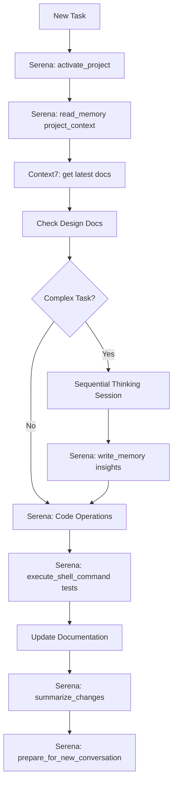
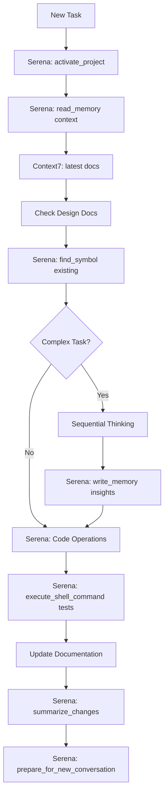

# CLAUDE.md

This file provides guidance to Claude Code (claude.ai/code) when working with code in this repository.

## Project Overview

TiHoMo is a comprehensive personal finance management system built with modern web technologies using a microservices architecture. The system provides users with tools to track expenses, manage budgets, plan investments, and monitor their financial health.

### Core Architecture

- **Backend**: .NET 9 microservices with PostgreSQL databases
- **Frontend**: Nuxt 3 SPA with TypeScript and Tailwind CSS  
- **API Gateway**: Ocelot for request routing and authentication
- **Infrastructure**: Docker Compose for development, with production TrueNAS deployment
- **Authentication**: JWT tokens with Google/Facebook OAuth social login
- **Messaging**: RabbitMQ for inter-service communication
- **Monitoring**: Grafana, Prometheus, and Loki for observability

### Microservices

1. **CoreFinance**: Main financial data management, transactions, accounts
2. **Identity**: Authentication and user management with social login
3. **MoneyManagement**: Budget and expense tracking
4. **PlanningInvestment**: Investment portfolio management
5. **ExcelApi**: Excel file processing and data import
6. **Ocelot.Gateway**: API Gateway for routing and security

## MCP Tools Integration

### Enhanced Development Toolkit

The project leverages multiple MCP (Model Context Protocol) tools through **OpenCode** for enhanced development experience. Configuration files are structured as follows:

- **opencode.json**: Main configuration with all MCP servers
- **opencode.local.json**: Fallback configuration without Serena
- **src/fe/nuxt/opencode.json**: Frontend-specific configuration
- **src/be/opencode.json**: Backend-specific configuration

The project leverages multiple MCP tools:

#### Serena - Advanced Code Agent Toolkit
**Primary coding agent** for direct codebase manipulation with intelligent project understanding:

**Project Management:**
- `activate_project`: Switch between different TiHoMo projects (microservices)
- `get_active_project`: Check current active project context
- `onboarding`: Auto-discover project structure and essential tasks
- `check_onboarding_performed`: Verify project setup completion

**Code Intelligence & Navigation:**
- `find_symbol`: Global/local symbol search across microservices
- `find_referencing_code_snippets`: Find code references for refactoring
- `find_referencing_symbols`: Symbol dependency analysis
- `get_symbols_overview`: Quick file/directory structure overview

**File Operations (Enhanced):**
- `create_text_file`: Create files with project-aware context
- `read_file`: Read with symbol understanding
- `list_dir`: Intelligent directory listing with recursion
- `search_for_pattern`: Advanced pattern search across codebase

**Precision Code Editing:**
- `insert_at_line` / `insert_after_symbol` / `insert_before_symbol`: Precise insertions
- `replace_lines` / `replace_symbol_body`: Targeted replacements
- `delete_lines`: Clean line removal

**Memory & Context Management:**
- `write_memory` / `read_memory` / `list_memories` / `delete_memory`: Project-specific memory store
- `prepare_for_new_conversation`: Context continuity between sessions
- `summarize_changes`: Track development progress

**Advanced Features:**
- `execute_shell_command`: Direct command execution with project context
- `restart_language_server`: Maintain IDE integration
- `switch_modes`: Activate different development modes
- `think_about_*`: Built-in reasoning tools for task completion

#### Context7 - Live Code Documentation
**Up-to-date documentation** for libraries and frameworks:
- Real-time API documentation and examples
- Integration patterns for .NET 9 và Nuxt 3
- Best practices from latest community knowledge
- Dependency compatibility checking

#### Sequential Thinking - Systematic Problem Solving
**Enhanced reasoning** for complex architectural decisions:
- Multi-step problem analysis
- Trade-off evaluation
- Implementation strategy planning
- Decision documentation

#### Time Management Integration
**Development timing and scheduling:**
- Task time tracking
- Development milestone planning
- Deployment scheduling coordination

#### Fetch - Enhanced Data Retrieval
**External data integration:**
- API documentation fetching
- Dependency version checking
- External service integration testing

### MCP-Enhanced Development Workflow



## Enhanced Development Commands

### MCP-Integrated Project Management

```bash
# Serena Project Lifecycle
activate_project TiHoMo                    # Activate main project
get_active_project                         # Check current project
onboarding                                 # Discover project structure  
check_onboarding_performed                 # Verify setup

# Enhanced Context Discovery
read_memory project_status                 # Get stored project context
list_memories                              # See all stored insights
find_symbol UserController                 # Find symbols across services
get_symbols_overview src/be/CoreFinance    # Quick structure overview
```

### MCP-Enhanced Code Operations

```bash
# Intelligent File Operations (Serena)
create_text_file src/be/NewService/NewController.cs  # Create with context
read_file src/fe/nuxt/pages/dashboard.vue             # Read with symbols
search_for_pattern "IUserRepository"                  # Find patterns
list_dir src/be --recursive                           # Smart directory listing

# Precision Code Editing (Serena)
insert_after_symbol GetUserById "// New method here"
replace_symbol_body UserController "// Updated implementation"
insert_at_line src/api/UserApi.cs 45 "// New validation"

# Context-Aware Development
write_memory api_integration_pattern "OAuth flow with JWT refresh"
read_memory database_patterns
think_about_task_adherence                # Check if on track
```

### Enhanced Documentation & Learning

```bash
# Context7 Integration
# Automatically fetches latest documentation for:
- .NET 9 best practices
- Nuxt 3 composition API patterns
- PostgreSQL optimization techniques
- Docker deployment strategies
- JWT authentication flows

# Sequential Thinking Sessions
think_through "microservices communication patterns"
analyze "database transaction consistency across services" 
review_thinking                           # Check previous sessions
```

### MCP-Enhanced Testing & Quality

```bash
# Serena-Powered Testing
execute_shell_command "dotnet test --logger trx"
find_referencing_symbols IUserService     # Find all usages before refactor
restart_language_server                   # Refresh IDE after major changes

# Quality Assurance Flow
search_for_pattern "TODO|FIXME|HACK"      # Find technical debt
summarize_changes                         # Generate change summary
think_about_whether_you_are_done          # Completion verification
```

### Traditional Development Commands (Preserved)

#### Docker Environment Management (Primary Method)

```bash
# Full development setup and start
make dev

# Start all services
make up

# Start infrastructure only (databases, cache, messaging)  
make up-infra

# Start API services only
make up-apis

# Start frontend only
make up-frontend

# Start monitoring stack
make up-monitoring

# Stop all services
make down

# View service status
make status

# View logs
make logs                # All services
make logs-api           # API services only
make logs-frontend      # Frontend only

# Health check all services
make health

# Database operations
make db-migrate         # Run migrations
make db-reset          # Reset databases (WARNING: deletes data)

# Build Docker images
make build              # All images
make build-frontend     # Frontend only
make build-apis        # API services only

# Show service URLs
make urls
```

#### Frontend Development (Nuxt 3)

```bash
cd src/fe/nuxt

# Install dependencies
npm install

# Development server
npm run dev

# Build for production
npm run build

# Generate static files
npm run generate

# Preview production build
npm run preview
```

#### Backend Development (.NET 9)

```bash
cd src/be

# Restore dependencies
dotnet restore

# Build solution
dotnet build

# Run specific service
cd CoreFinance/CoreFinance.Api
dotnet run

# Run tests
dotnet test

# Run tests with coverage
dotnet test --collect:"XPlat Code Coverage"

# Entity Framework migrations
cd CoreFinance
dotnet ef migrations add MigrationName
dotnet ef database update

# Identity service migrations
cd Identity
dotnet ef migrations add MigrationName
dotnet ef database update
```

### Service URLs (Development)

- **Frontend**: http://localhost:3500
- **API Gateway**: http://localhost:5800
- **Identity API**: http://localhost:5801
- **CoreFinance API**: http://localhost:5802
- **Excel API**: http://localhost:5805
- **Grafana**: http://localhost:3000 (admin/admin123)
- **RabbitMQ Management**: http://localhost:15672 (tihomo/tihomo123)
- **pgAdmin**: http://localhost:8080 (admin@tihomo.local/admin123)

## MCP-Enhanced Architecture & Patterns

### Backend (.NET 9) with MCP Integration

- **Architecture**: Clean Architecture với Domain-Driven Design
- **MCP Enhancement**: Serena provides symbol-aware refactoring và Context7 supplies latest .NET patterns
- **Database**: PostgreSQL với Entity Framework Core (snake_case naming)
- **Testing**: xUnit với FluentAssertions (avoid NUnit) + Serena automated test execution
- **Authentication**: JWT với social OAuth providers
- **API Documentation**: Swagger/OpenAPI specifications + Context7 live examples
- **Code Comments**: XML documentation in English/Vietnamese bilingual format
- **Shared Code**: Shared.EntityFramework project for common utilities
- **MCP Memory**: Serena stores project-specific patterns và architectural decisions

### Frontend (Nuxt 3) with MCP Integration

- **Framework**: Nuxt 3 với Vue 3 Composition API
- **MCP Enhancement**: Context7 provides latest Nuxt 3 patterns và Serena handles component generation
- **Language**: TypeScript (prefer types over interfaces)
- **Styling**: Tailwind CSS với VRISTO admin template
- **State Management**: Pinia stores
- **Authentication**: Social login (Google/Facebook OAuth)
- **Syntax**: Use `<script setup>` exclusively
- **Naming**: PascalCase for components, camelCase for composables
- **MCP Intelligence**: Serena finds component references và dependencies automatically

### Database Schema

Each microservice has its own PostgreSQL database:
- **identity**: User accounts, roles, OAuth tokens
- **corefinance**: Accounts, transactions, recurring transactions  
- **db_money**: Budget management và expense tracking
- **db_planning**: Investment portfolios và planning
- **db_reporting**: Analytics và reporting data

**MCP Enhancement**: Serena can search across all database schemas và find cross-service dependencies.

## Enhanced Development Guidelines with MCP Tools

### MCP-Powered Development Protocol

**CRITICAL: ENHANCED sequence with MCP tools:**

1. **Serena**: `activate_project TiHoMo` → ensure correct project context
2. **Serena**: `read_memory current_task` → get stored task context
3. **Memory Bank**: Check `memory-bank/activeContext.md` for current focus
4. **Context7**: Fetch latest documentation for relevant technologies
5. **Design Docs**: Check `design-docs/07-features/feature-[name]/` for feature documentation
6. **Architecture**: Check `design-docs/03-architecture/` for constraints
7. **Standards**: Check `design-docs/04-api-design/` or `design-docs/05-frontend-design/`
8. **Sequential Thinking**: Apply for complex problems với documented reasoning
9. **Serena**: `write_memory` key insights for future reference

### MCP-Enhanced Communication & Documentation Standards

- **Language Protocol**: Always reply in Vietnamese, code comments bilingual English/Vietnamese, code in English
- **Memory System**: 5-layer integrated system (Memory Bank + Design Documentation + MCP mem0 + Sequential Thinking + **Serena Memory**)
- **Context Preservation**: Serena maintains project-specific context across sessions
- **Live Documentation**: Context7 provides up-to-date library documentation

### Backend (.NET 9) MCP-Enhanced Rules

**Critical Practices với MCP Integration:**
- **Serena-Powered Development**: Use `find_symbol` before creating new classes to avoid duplication
- **Context7 Patterns**: Always check latest .NET 9 patterns before implementation
- Use **xUnit + FluentAssertions** for testing (NEVER use NUnit)
- **Serena Test Execution**: Use `execute_shell_command` for automated test runs
- **XML comments in bilingual format**:
  ```csharp
  /// <summary>
  /// English summary here (EN)<br/>
  /// Tóm tắt tiếng Việt ở đây (VI)
  /// </summary>
  ```
- Use **Bogus** for fake data generation in tests
- **Serena Memory**: Store successful patterns với `write_memory architectural_pattern`
- Follow **Clean Architecture + Domain-Driven Design**
- Use **PostgreSQL với EFCore.NamingConventions (snake_case)**
- **Symbol Intelligence**: Use `get_symbols_overview` to understand existing code structure

### Frontend (Nuxt 3) MCP-Enhanced Rules

**Critical Practices với MCP Integration:**
- **Serena Component Generation**: Use `create_text_file` với project-aware component templates
- **Context7 Integration**: Always check latest Nuxt 3 composition patterns
- Use **Composition API với `<script setup>` exclusively**
- **TypeScript**: Prefer types over interfaces, avoid enums
- **VRISTO Admin Template** patterns với dark mode support
- **Mobile-first responsive design**: Tailwind CSS với sm:, md:, lg:, xl: breakpoints
- **Naming**: PascalCase for components, camelCase for composables
- **Serena Search**: Use `search_for_pattern` to find existing similar components
- **Component Intelligence**: Use `find_referencing_symbols` before modifying shared components

### MCP-Enhanced Quality Gates & Validation

**Pre-Implementation Checklist với MCP:**
- [ ] **Serena**: `activate_project` và `read_memory project_status`
- [ ] **Context7**: Check latest technology documentation
- [ ] Feature documentation exists in design-docs/07-features/
- [ ] **Serena**: `find_symbol` to check for existing implementations
- [ ] Current context updated in memory-bank/activeContext.md
- [ ] API design follows established patterns
- [ ] UI design aligns với component library
- [ ] Database changes are documented
- [ ] **Sequential Thinking**: Complex problems analyzed systematically
- [ ] Testing strategy defined
- [ ] Security requirements addressed

**Post-Implementation Checklist với MCP:**
- [ ] **Serena**: `execute_shell_command` to run all tests
- [ ] Code follows documented patterns
- [ ] **Serena**: `summarize_changes` for documentation
- [ ] API documentation updated (OpenAPI spec)
- [ ] Component library updated if new components
- [ ] **Serena**: `write_memory implementation_insights` for future reference
- [ ] Tests cover documented scenarios (xUnit + FluentAssertions)
- [ ] Implementation notes updated in feature docs
- [ ] **Serena**: `prepare_for_new_conversation` for context continuity

### Enhanced Memory & Documentation Commands

**MCP-Integrated Commands:**
```bash
# Serena Project Management
activate_project [name]              # Switch project context
get_active_project                   # Check current project
onboarding                          # Discover project structure
read_memory [key]                   # Get stored insights
write_memory [key] [value]          # Store insights
list_memories                       # List all stored context

# Serena Code Intelligence  
find_symbol [name]                  # Find symbols globally
find_referencing_symbols [symbol]   # Find symbol dependencies
get_symbols_overview [path]         # Quick structure overview
search_for_pattern [pattern]        # Advanced pattern search

# Serena Development Operations
create_text_file [path]             # Create với context
execute_shell_command [cmd]         # Run commands với project context
insert_after_symbol [symbol] [content]  # Precise insertions
replace_symbol_body [symbol] [content]   # Targeted replacements
summarize_changes                   # Generate change summary

# Context7 Documentation
check_latest_docs [technology]      # Get up-to-date documentation
verify_api_compatibility [library]  # Check compatibility

# Sequential Thinking (Enhanced)
think_through [problem]             # Systematic analysis
analyze [topic]                     # Deep analysis session
review_thinking                     # Check previous sessions

# Traditional Commands (Preserved)
read memory bank                    # Read all memory-bank files
check design docs [section]        # Read specific design documentation
check mcp                          # Review current MCP memory
sync memory                        # Sync between all systems
check feature [name]               # Read feature documentation
update feature [name]              # Update feature status
```

### MCP-Enhanced Cross-Platform Integration Rules

**API-Frontend Consistency với MCP:**
1. **Serena**: `find_referencing_symbols` before API changes
2. **Context7**: Check latest OpenAPI patterns
3. Update OpenAPI spec in `design-docs/04-api-design/api-specification/`
4. Generate TypeScript types for frontend
5. **Serena**: `search_for_pattern` to find affected components
6. Update component props if UI changes needed
7. **Serena**: `write_memory api_integration_pattern` with insights
8. Document authentication flow changes

**Database-API-UI Flow với MCP:**
1. **Sequential Thinking**: Analyze impact across all layers
2. **Serena**: `find_symbol` to check existing data models
3. Update data model in `design-docs/03-architecture/database-design/`
4. Create EF Core migration với snake_case naming
5. **Serena**: `execute_shell_command` to run migrations
6. Update API endpoints và data models
7. Update frontend types và components
8. **Serena**: `summarize_changes` for migration documentation
9. Update tests across all layers

### MCP-Enhanced Development Workflow



## Common Troubleshooting với MCP Integration

### MCP Tools Issues
```bash
# Serena Language Server Issues
restart_language_server             # Refresh IDE integration

# Context Issues
get_current_config                  # Check agent configuration
switch_modes [mode_list]            # Activate specific modes

# Memory Issues  
list_memories                       # Check stored memories
delete_memory [key]                 # Clean corrupted memories
```

### Traditional Issues (Preserved)

#### Port Conflicts
```bash
# Serena-Enhanced Port Management
execute_shell_command "npx kill-port 3500"
execute_shell_command "netstat -ano | findstr :3500"

# Traditional Method
npx kill-port 3500
netstat -ano | findstr :3500
taskkill /PID <PID> /F
```

#### JWT Authentication Issues
- **Serena**: `search_for_pattern "JWT_SECRET_KEY"` to find all references
- **Context7**: Check latest OAuth integration patterns
- Verify JWT_SECRET_KEY consistency across services
- Check JWT issuer/audience configuration matches
- Ensure OAuth client IDs are properly configured

#### Database Connection Issues
- **Serena**: `execute_shell_command "docker ps"` to check containers
- **Serena**: `search_for_pattern "ConnectionString"` to find configurations
- Verify PostgreSQL containers are running
- Check connection strings in environment variables
- Run `make db-migrate` to ensure schemas are current

## Security Considerations với MCP Integration

- **Serena Memory Security**: Project-specific memories are isolated
- **Context7**: Only fetches public documentation, no sensitive data
- All API endpoints require JWT authentication
- IP whitelisting for API keys
- Rate limiting per API key
- CORS configured for cross-origin requests
- Sensitive data encrypted at rest
- OAuth tokens stored securely
- **MCP Command Validation**: All shell commands are validated before execution

## Performance Optimizations với MCP

- **Serena**: Intelligent caching of symbol information và project structure
- **Context7**: Cached documentation fetching to avoid repeated requests
- Redis caching for frequently accessed data
- Database connection pooling
- Async/await patterns throughout
- Optimized Docker builds với multi-stage images
- CDN-ready static asset generation
- **MCP Memory**: Efficient storage và retrieval of development context

## Production Deployment với MCP Support

The system includes GitHub Actions workflow for automated deployment to TrueNAS infrastructure:

```bash
# MCP-Enhanced Deployment workflow:
# - Serena can summarize changes for release notes
# - Context7 provides latest deployment best practices
# - Sequential Thinking analyzes deployment risks

# Deployment workflow triggers on:
# - Push to master (production)
# - Push to develop (development)  
# - Manual workflow dispatch

# Key deployment features:
# - Security scanning với Trivy
# - Rolling deployment với health checks
# - Automatic database backups
# - Comprehensive validation
# - Discord notifications
# - Serena change summaries in deployment logs
```

### Memory Bank Context với MCP Integration

The project maintains active context in `memory-bank/activeContext.md` which tracks:
- Current development focus và completed features
- Recent fixes và implementations
- Deployment status và CI/CD pipeline health
- Integration status between services
- **NEW: Serena Memory Sync**: Automatic synchronization với Serena project memories
- **NEW: Context7 Pattern Updates**: Latest documentation patterns applied
- **NEW: Sequential Thinking Sessions**: Links to major architectural decisions

**MCP Integration Protocol**: Always check both traditional memory bank files AND Serena project memories for complete context before making modifications.

REMEMBER: After every session reset, the integrated MCP system (Serena + Context7 + Sequential Thinking + Traditional Memory) is the primary link to previous work. All systems must be maintained với precision, clarity, và proper Vietnamese/English bilingual support for maximum effectiveness.

**Critical MCP Workflow**: Start every session với `activate_project TiHoMo` và `read_memory project_status` to ensure proper context continuity.