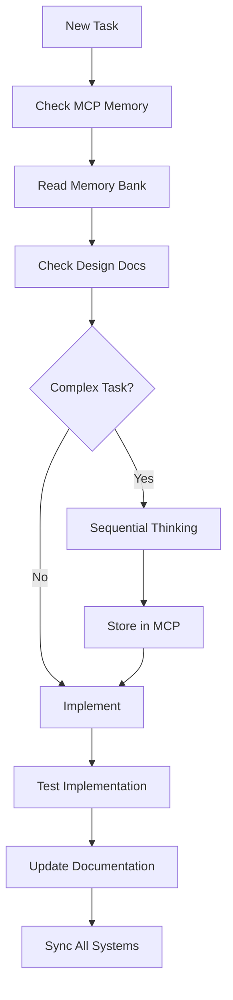

# CLAUDE.md

This file provides guidance to Claude Code (claude.ai/code) when working with code in this repository.

## Project Overview

TiHoMo is a comprehensive personal finance management system built with modern web technologies using a microservices architecture. The system provides users with tools to track expenses, manage budgets, plan investments, and monitor their financial health.

### Core Architecture

- **Backend**: .NET 9 microservices with PostgreSQL databases
- **Frontend**: Nuxt 3 SPA with TypeScript and Tailwind CSS  
- **API Gateway**: Ocelot for request routing and authentication
- **Infrastructure**: Docker Compose for development, with production TrueNAS deployment
- **Authentication**: JWT tokens with Google/Facebook OAuth social login
- **Messaging**: RabbitMQ for inter-service communication
- **Monitoring**: Grafana, Prometheus, and Loki for observability

### Microservices

1. **CoreFinance**: Main financial data management, transactions, accounts
2. **Identity**: Authentication and user management with social login
3. **MoneyManagement**: Budget and expense tracking
4. **PlanningInvestment**: Investment portfolio management
5. **ExcelApi**: Excel file processing and data import
6. **Ocelot.Gateway**: API Gateway for routing and security

## Development Commands

### Docker Environment Management (Primary Method)

```bash
# Full development setup and start
make dev

# Start all services
make up

# Start infrastructure only (databases, cache, messaging)  
make up-infra

# Start API services only
make up-apis

# Start frontend only
make up-frontend

# Start monitoring stack
make up-monitoring

# Stop all services
make down

# View service status
make status

# View logs
make logs                # All services
make logs-api           # API services only
make logs-frontend      # Frontend only

# Health check all services
make health

# Database operations
make db-migrate         # Run migrations
make db-reset          # Reset databases (WARNING: deletes data)

# Build Docker images
make build              # All images
make build-frontend     # Frontend only
make build-apis        # API services only

# Show service URLs
make urls
```

### Frontend Development (Nuxt 3)

```bash
cd src/fe/nuxt

# Install dependencies
npm install

# Development server
npm run dev

# Build for production
npm run build

# Generate static files
npm run generate

# Preview production build
npm run preview
```

### Backend Development (.NET 9)

```bash
cd src/be

# Restore dependencies
dotnet restore

# Build solution
dotnet build

# Run specific service
cd CoreFinance/CoreFinance.Api
dotnet run

# Run tests
dotnet test

# Run tests with coverage
dotnet test --collect:"XPlat Code Coverage"

# Entity Framework migrations
cd CoreFinance
dotnet ef migrations add MigrationName
dotnet ef database update

# Identity service migrations
cd Identity
dotnet ef migrations add MigrationName
dotnet ef database update
```

### Service URLs (Development)

- **Frontend**: http://localhost:3500
- **API Gateway**: http://localhost:5800
- **Identity API**: http://localhost:5801
- **CoreFinance API**: http://localhost:5802
- **Excel API**: http://localhost:5805
- **Grafana**: http://localhost:3000 (admin/admin123)
- **RabbitMQ Management**: http://localhost:15672 (tihomo/tihomo123)
- **pgAdmin**: http://localhost:8080 (admin@tihomo.local/admin123)

## Code Architecture & Patterns

### Backend (.NET 9)

- **Architecture**: Clean Architecture with Domain-Driven Design
- **Database**: PostgreSQL with Entity Framework Core (snake_case naming)
- **Testing**: xUnit with FluentAssertions (avoid NUnit)
- **Authentication**: JWT with social OAuth providers
- **API Documentation**: Swagger/OpenAPI specifications
- **Code Comments**: XML documentation in English/Vietnamese bilingual format
- **Shared Code**: Shared.EntityFramework project for common utilities

### Frontend (Nuxt 3)

- **Framework**: Nuxt 3 with Vue 3 Composition API
- **Language**: TypeScript (prefer types over interfaces)
- **Styling**: Tailwind CSS with VRISTO admin template
- **State Management**: Pinia stores
- **Authentication**: Social login (Google/Facebook OAuth)
- **Syntax**: Use `<script setup>` exclusively
- **Naming**: PascalCase for components, camelCase for composables

### Database Schema

Each microservice has its own PostgreSQL database:
- **identity**: User accounts, roles, OAuth tokens
- **corefinance**: Accounts, transactions, recurring transactions  
- **db_money**: Budget management and expense tracking
- **db_planning**: Investment portfolios and planning
- **db_reporting**: Analytics and reporting data

## Key Development Guidelines

### Social Authentication Flow

The system uses social login (Google/Facebook) instead of traditional username/password:
- OAuth tokens are managed by Identity service
- JWT tokens provide API authentication
- Frontend handles OAuth redirect flows
- No SSO server (migrated to social login)

### API Key Management

Enhanced API key system for external integrations:
- Multi-layered security with IP whitelisting
- Rate limiting and usage analytics
- Real-time monitoring with geographic analysis
- Comprehensive audit logging

### Environment Configuration

Main environment variables (see `.env.template`):
- Database connection strings and credentials
- JWT signing configuration  
- Redis and RabbitMQ passwords
- OAuth client IDs and secrets
- CORS policy settings

### Testing Strategy

- **Backend**: xUnit + FluentAssertions + Bogus for test data
- **Integration Tests**: Test with real database connections
- **API Tests**: Comprehensive endpoint testing
- **Health Checks**: Built into all services for monitoring

### Docker Development Workflow

**Development Mode:**
1. Use `make up-infra` to start databases first
2. Run `make db-migrate` to apply schemas
3. Start APIs with `make up-apis`  
4. Start frontend with `make up-frontend`
5. Access via API Gateway at http://localhost:5800

**Production Mode (Manual Testing):**
```bash
# Set production environment
export NUXT_BUILD_TARGET=production
export NODE_ENV=production

# Deploy with production override
docker compose -f docker-compose.yml -f docker-compose.prod.yml up --build frontend-nuxt
```

### Security Considerations

- All API endpoints require JWT authentication
- IP whitelisting for API keys
- Rate limiting per API key
- CORS configured for cross-origin requests
- Sensitive data encrypted at rest
- OAuth tokens stored securely

### Performance Optimizations

- Redis caching for frequently accessed data
- Database connection pooling
- Async/await patterns throughout
- Optimized Docker builds with multi-stage images
- CDN-ready static asset generation

### Monitoring & Observability

- Structured logging with Serilog
- Prometheus metrics collection
- Grafana dashboards for visualization
- Loki for log aggregation
- Health check endpoints for all services

## Production Deployment

The system includes GitHub Actions workflow for automated deployment to TrueNAS infrastructure:

```bash
# Deployment workflow triggers on:
# - Push to master (production)
# - Push to develop (development)  
# - Manual workflow dispatch

# Key deployment features:
# - Security scanning with Trivy
# - Rolling deployment with health checks
# - Automatic database backups
# - Comprehensive validation
# - Discord notifications
```

### Memory Bank Context

The project maintains active context in `memory-bank/activeContext.md` which tracks:
- Current development focus and completed features
- Recent fixes and implementations
- Deployment status and CI/CD pipeline health
- Integration status between services

Always check the memory bank for current project state and recent changes before making modifications.

## Common Troubleshooting

### Port Conflicts
```bash
# Kill process on port 3500 (Nuxt)
npx kill-port 3500

# Or use netstat/taskkill on Windows
netstat -ano | findstr :3500
taskkill /PID <PID> /F
```

### JWT Authentication Issues
- Verify JWT_SECRET_KEY is consistent across services
- Check JWT issuer/audience configuration matches
- Ensure OAuth client IDs are properly configured

### Database Connection Issues
- Verify PostgreSQL containers are running
- Check connection strings in environment variables
- Run `make db-migrate` to ensure schemas are current

### Docker Issues
- Use `make clean` to reset Docker environment
- Check `docker-compose logs <service>` for specific errors
- Verify all required environment variables are set

## Development Rules & Guidelines

### Documentation-First Development Protocol

**CRITICAL: BEFORE any code suggestion, ALWAYS execute this sequence:**

1. Check `memory-bank/activeContext.md` for current focus
2. Check `design-docs/07-features/feature-[name]/` for feature documentation
3. Check `design-docs/03-architecture/` for architecture constraints
4. Check `design-docs/04-api-design/` or `design-docs/05-frontend-design/` for standards
5. Check MCP Memory for recent insights
6. Apply Sequential Thinking for complex problems

### Communication & Documentation Standards

- **Language Protocol**: Always reply in chat and documents in Vietnamese, code comments in bilingual English/Vietnamese format, code in English
- **Memory System**: Maintain 4-layer integrated system (Memory Bank + Design Documentation + MCP mem0 + Sequential Thinking)
- **Context Preservation**: Always check memory bank and design documentation before implementing features

### Backend (.NET 9) Specific Rules

**Critical Practices:**
- Use **xUnit + FluentAssertions** for testing (NEVER use NUnit)
- **XML comments in bilingual format**:
  ```csharp
  /// <summary>
  /// English summary here (EN)<br/>
  /// Tóm tắt tiếng Việt ở đây (VI)
  /// </summary>
  ```
- Use **Bogus** for fake data generation in tests
- Follow **Clean Architecture + Domain-Driven Design**
- Use **PostgreSQL với EFCore.NamingConventions (snake_case)**
- Implement **async/await** for all I/O operations
- Use **AutoMapper** for object mapping
- Follow **FluentAssertions** for all test assertions

### Frontend (Nuxt 3) Specific Rules

**Critical Practices:**
- Use **Composition API với `<script setup>` exclusively**
- **TypeScript**: Prefer types over interfaces, avoid enums
- **VRISTO Admin Template** patterns with dark mode support
- **Mobile-first responsive design**: Tailwind CSS với sm:, md:, lg:, xl: breakpoints
- **Naming**: PascalCase for components, camelCase for composables
- Use **useFetch/useAsyncData** for data fetching
- Wrap SSR-sensitive components with **client-only**
- Use **Pinia** for state management following useAppStore pattern

### Quality Gates & Validation

**Pre-Implementation Checklist:**
- [ ] Feature documentation exists in design-docs/07-features/
- [ ] Current context updated in memory-bank/activeContext.md
- [ ] API design follows established patterns
- [ ] UI design aligns with component library
- [ ] Database changes are documented
- [ ] Testing strategy is defined
- [ ] Security requirements are addressed

**Post-Implementation Checklist:**
- [ ] Code follows documented patterns
- [ ] API documentation updated (OpenAPI spec)
- [ ] Component library updated if new components
- [ ] Tests cover documented scenarios (xUnit + FluentAssertions)
- [ ] Implementation notes updated in feature docs
- [ ] MCP Memory updated with implementation insights

### Development Workflow



### Key Memory & Documentation Commands

- `read memory bank`: Read all memory-bank files
- `check design docs [section]`: Read specific design documentation
- `check mcp`: Review current MCP memory
- `think through [problem]`: Initiate sequential thinking session
- `check feature [name]`: Read feature documentation
- `sync memory`: Sync between MCP, memory-bank, và design-docs

### Cross-Platform Integration Rules

**API-Frontend Consistency:**
1. Update OpenAPI spec in `design-docs/04-api-design/api-specification/`
2. Generate TypeScript types for frontend
3. Update component props if UI changes needed
4. Store API integration patterns in MCP with [API] prefix
5. Document authentication flow changes

**Database-API-UI Flow:**
1. Update data model in `design-docs/03-architecture/database-design/`
2. Create EF Core migration với snake_case naming
3. Update API endpoints và data models
4. Update frontend types và components
5. Document migration strategy
6. Update tests across all layers

This architecture supports a complete personal finance platform with modern development practices, comprehensive security, production-ready deployment capabilities, and strict development protocols for consistent code quality.