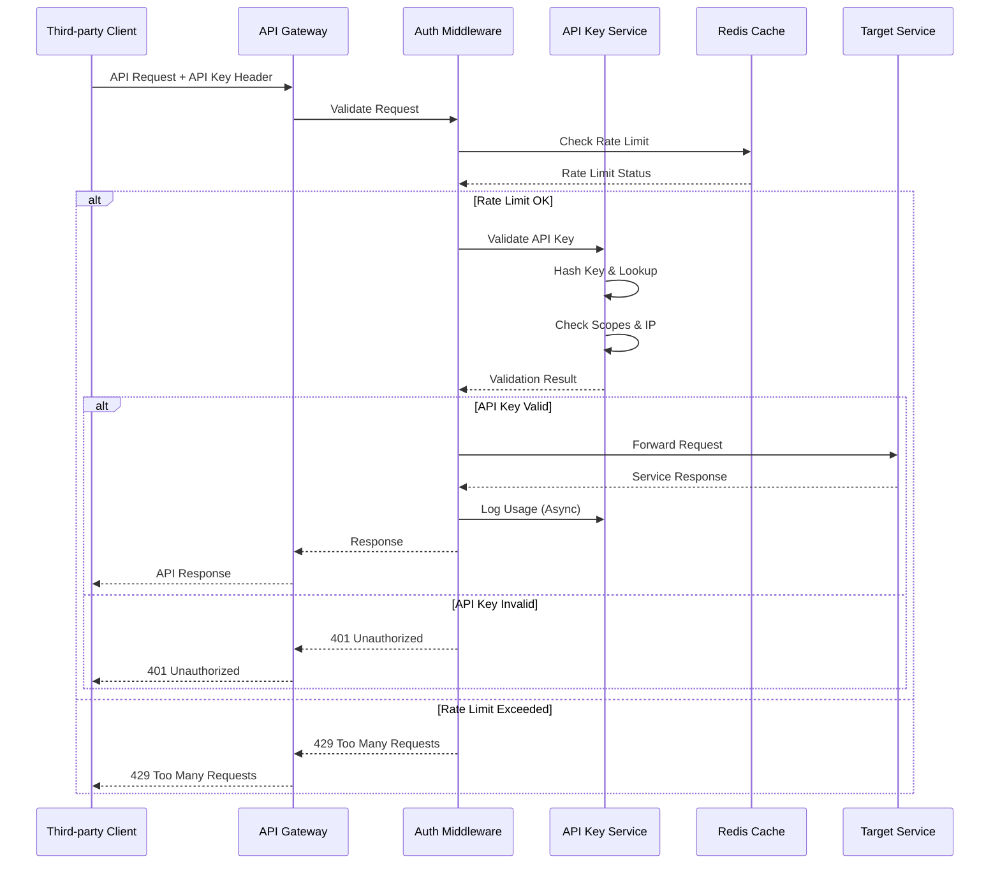
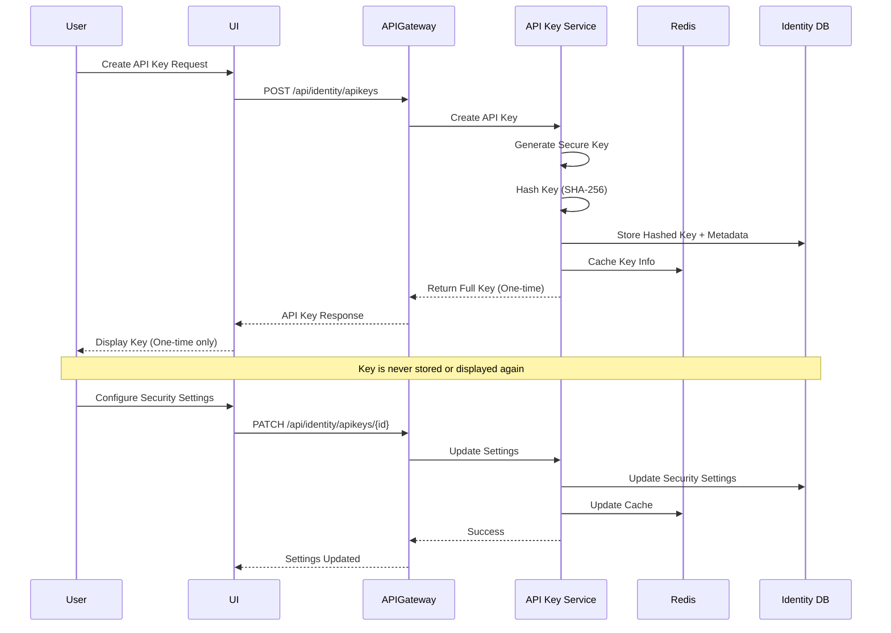
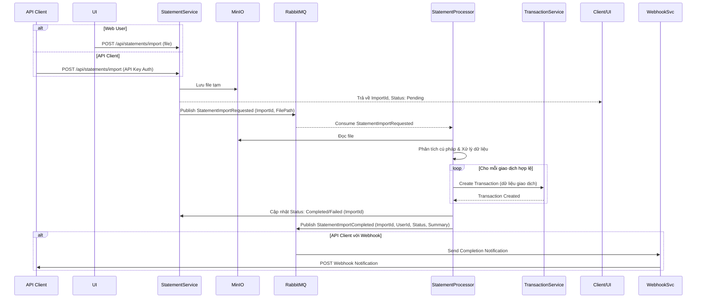

# Tài liệu Thiết kế Phân tích Nghiệp vụ (BA Design) - TiHoMo

## 1. Executive Summary

Tài liệu này mô tả thiết kế phân tích nghiệp vụ cho hệ thống Quản lý Tài chính Cá nhân (TiHoMo). Hệ thống được xây dựng theo kiến trúc microservices, sử dụng n8n làm engine điều phối workflow (dựa trên `projectbrief.md`), nhằm mục đích tự động hóa quy trình, tích hợp linh hoạt các dịch vụ, và cung cấp trải nghiệm quản lý tài chính toàn diện cho người dùng. 

Với **Enhanced API Key Management**, hệ thống mở rộng khả năng tích hợp với third-party applications, mobile apps, financial tools, và automation scripts. Điều này tạo ra một ecosystem mở rộng cho phép users access financial data từ multiple platforms một cách secure và controlled.

Mục tiêu chính là giải quyết các vấn đề về kết nối hệ thống, đơn giản hóa quản lý tài chính và tăng hiệu suất (dựa trên `productContext.md` và `projectbrief.md`).

## 2. Business Context & Background

*   **Lý do dự án tồn tại:** Nhu cầu tự động hóa các quy trình nghiệp vụ tài chính cá nhân, giảm thiểu lỗi thủ công và tăng hiệu suất quản lý tài chính (`productContext.md`). Đặc biệt, nhu cầu ngày càng tăng về **third-party integrations** và **mobile-first approach** đòi hỏi một hệ thống API management mạnh mẽ.

*   **Vấn đề cần giải quyết:** 
    - Khó khăn trong việc tổng hợp dữ liệu từ nhiều nguồn (ngân hàng, ví điện tử)
    - Theo dõi chi tiêu, lập ngân sách, đặt mục tiêu tài chính và quản lý các khoản đầu tư/nợ một cách hiệu quả
    - Cần kết nối nhiều hệ thống và đơn giản hóa việc xây dựng workflow quản lý (`productContext.md`)
    - **Thiếu khả năng tích hợp với external applications**: Users muốn access data từ mobile apps, budgeting tools, investment platforms
    - **Không có secure API access control**: Cần system để manage API keys với proper security, monitoring, và governance
    - **Limited automation capabilities**: Users cần API access cho automation scripts và third-party financial tools

*   **Môi trường nghiệp vụ:** Thị trường personal finance management đang chuyển hướng sang **multi-platform ecosystem** với nhu cầu cao về **API-first architecture**. Users mong muốn access financial data từ mobile apps, integrate với external tools như YNAB, Mint alternatives, và automation platforms như Zapier.

## 3. Scope & Objectives

### 3.1 Scope
*   Xây dựng hệ thống TiHoMo dựa trên kiến trúc microservices được mô tả trong `design/architech_design/overview_v4.md`.
*   Bao gồm các bounded context: Identity & Access, Core Finance, Money Management, Planning & Investment, Reporting & Integration.
*   **Enhanced API Key Management**: Complete lifecycle management cho API keys với enterprise-grade security features.
*   Tích hợp các dịch vụ bên ngoài (ngân hàng, ví điện tử - cần xác định cụ thể).
*   Cung cấp giao diện người dùng (web/mobile - cần xác định) để quản lý tài chính.
*   **API ecosystem development**: Enable third-party developers, mobile app developers, và automation tool creators.
*   Hỗ trợ import sao kê ngân hàng.
*   Cung cấp báo cáo tài chính cơ bản và nâng cao.
*   **Developer portal và documentation**: Comprehensive API documentation với examples và SDKs.
*   Đảm bảo bảo mật, khả năng mở rộng và bảo trì (`projectbrief.md`).

### 3.2 Objectives
*   **OBJ-1:** Cung cấp một nền tảng tập trung để quản lý tất cả các tài khoản tài chính.
*   **OBJ-2:** Tự động hóa việc phân loại giao dịch và tạo báo cáo chi tiêu.
*   **OBJ-3:** Cho phép người dùng đặt và theo dõi ngân sách (budget) và mục tiêu tài chính (goal).
*   **OBJ-4:** Hỗ trợ quản lý nợ và các khoản đầu tư.
*   **OBJ-5:** Đảm bảo tính bảo mật và riêng tư cho dữ liệu tài chính người dùng.
*   **OBJ-6:** Cung cấp giao diện người dùng trực quan, dễ sử dụng (`productContext.md`, `projectbrief.md`).
*   **OBJ-7:** Giảm thời gian quản lý tài chính thủ công > 50% (Cần định lượng cụ thể hơn).
*   **OBJ-8:** Tăng tỷ lệ người dùng đạt được mục tiêu tài chính > 20% (Cần định lượng cụ thể hơn).
*   **OBJ-9:** **Enable comprehensive API ecosystem**: Cung cấp secure, scalable API access cho third-party developers.
*   **OBJ-10:** **Increase user engagement**: Tăng daily active users thông qua mobile app integrations và automation capabilities.
*   **OBJ-11:** **Expand market reach**: Attract developers và partners để build on TiHoMo platform.
*   **OBJ-12:** **Improve user retention**: Users có thể access data từ preferred tools, increasing platform stickiness.

## 4. Functional Requirements

(Phần này cần được chi tiết hóa dựa trên user stories hoặc yêu cầu nghiệp vụ cụ thể. Dưới đây là các nhóm yêu cầu dựa trên kiến trúc)

### 4.1 Identity & Access (Enhanced với API Key Management)
*   **FR-IA-1:** Người dùng có thể đăng ký tài khoản mới. (Acceptance Criteria: Cần email/số điện thoại, mật khẩu; xác thực email/số điện thoại).
*   **FR-IA-2:** Người dùng có thể đăng nhập bằng email/mật khẩu. (AC: Xác thực thành công trả về token; xử lý sai mật khẩu, khóa tài khoản).
*   **FR-IA-3:** Người dùng có thể khôi phục mật khẩu. (AC: Gửi link/code reset qua email/số điện thoại).
*   **FR-IA-4:** Quản trị viên có thể quản lý người dùng (thêm, sửa, xóa, khóa/mở khóa).
*   **FR-IA-5:** Hệ thống hỗ trợ phân quyền dựa trên vai trò (ví dụ: User, Admin).
*   **FR-IA-6:** **API Key Creation**: Người dùng có thể tạo API keys với descriptive names, scopes, và security settings. (AC: Tạo key với "pfm_" prefix, SHA-256 hashing, one-time display).
*   **FR-IA-7:** **API Key Management**: Người dùng có thể view, update, regenerate, và revoke API keys. (AC: Simple/Advanced modes, bulk operations support).
*   **FR-IA-8:** **Scope-based Authorization**: API keys có granular permissions (read, write, transactions:read, budgets:write, etc.). (AC: Predefined scopes, custom scope creation).
*   **FR-IA-9:** **Rate Limiting Configuration**: Per-key rate limiting với configurable limits (requests per minute/day). (AC: Real-time rate limit monitoring, automatic throttling).
*   **FR-IA-10:** **IP Whitelisting**: API keys có thể restrict access by IP addresses/CIDR ranges. (AC: Support cho multiple IPs, CIDR notation, geographic restrictions).
*   **FR-IA-11:** **Usage Analytics**: Comprehensive tracking của API key usage với detailed statistics. (AC: Real-time metrics, historical data, usage patterns analysis).
*   **FR-IA-12:** **Security Monitoring**: Real-time monitoring và alerting cho suspicious API key activities. (AC: Anomaly detection, security incident alerts, audit logging).

### 4.2 Core Finance (API-Enabled)
*   **FR-CF-1:** Người dùng có thể thêm/sửa/xóa các tài khoản tài chính (ngân hàng, ví, tiền mặt, thẻ tín dụng). (AC: Cần nhập tên tài khoản, loại tài khoản, số dư ban đầu, đơn vị tiền tệ).
*   **FR-CF-2:** Người dùng có thể ghi nhận giao dịch thủ công (thu, chi, chuyển khoản). (AC: Cần nhập ngày, số tiền, tài khoản nguồn/đích, danh mục, ghi chú).
*   **FR-CF-3:** Hệ thống có thể import sao kê từ các ngân hàng được hỗ trợ (định dạng file: CSV, Excel - cần xác định cụ thể). (AC: Tự động nhận diện định dạng, khớp giao dịch, thông báo lỗi nếu có).
*   **FR-CF-4:** Hệ thống tự động/cho phép người dùng phân loại giao dịch. (AC: Đề xuất danh mục dựa trên lịch sử/quy tắc; cho phép tạo danh mục tùy chỉnh).
*   **FR-CF-5:** Người dùng có thể xem lịch sử giao dịch theo tài khoản, thời gian, danh mục.
*   **FR-CF-6:** **API Key Authentication**: Tất cả endpoints support API key authentication với proper scope validation. (AC: Secure key validation, scope enforcement, rate limiting).
*   **FR-CF-7:** **Third-party Integration**: Mobile apps và external tools có thể access account data via API keys. (AC: RESTful APIs, proper error handling, data filtering by scope).
*   **FR-CF-8:** **Bulk Operations**: API endpoints cho batch transaction processing và account management. (AC: Batch import, bulk updates, transaction validation).
*   **FR-CF-9:** **Real-time Webhooks**: API-triggered notifications cho transaction events và balance changes. (AC: Configurable webhooks, retry mechanisms, payload customization).

### 4.3 Money Management (API-Accessible)
*   **FR-MM-1:** Người dùng có thể tạo/sửa/xóa ngân sách theo danh mục, theo tháng/quý/năm. (AC: Nhập danh mục, số tiền, chu kỳ; hiển thị tiến độ thực hiện ngân sách).
*   **FR-MM-2:** Hệ thống hỗ trợ mô hình quản lý tài chính (ví dụ: 6 Hũ - SixJars). (AC: Cho phép phân bổ thu nhập vào các hũ; theo dõi chi tiêu theo từng hũ).
*   **FR-MM-3:** Người dùng có thể tạo nhóm và quản lý chi tiêu chung. (AC: Mời thành viên, ghi nhận chi tiêu, tự động tính toán công nợ giữa các thành viên).
*   **FR-MM-4:** **Budget API Access**: Third-party budgeting tools có thể integrate để sync budget data. (AC: Read/write budget APIs, category mapping, period synchronization).
*   **FR-MM-5:** **Expense Analysis APIs**: External analytics tools có thể access spending patterns và trends. (AC: Aggregated data APIs, customizable time periods, category breakdowns).
*   **FR-MM-6:** **Category Management APIs**: Programmatic category creation, updates, và hierarchy management. (AC: Bulk category operations, custom categorization rules, ML-based suggestions).

### 4.4 Planning & Investment (Integration-Ready)
*   **FR-PI-1:** Người dùng có thể ghi nhận và theo dõi các khoản nợ (vay, trả góp). (AC: Nhập thông tin chủ nợ, số tiền vay, lãi suất, kỳ hạn; nhắc lịch trả nợ).
*   **FR-PI-2:** Người dùng có thể tạo và theo dõi các mục tiêu tài chính (mua nhà, mua xe, nghỉ hưu). (AC: Nhập tên mục tiêu, số tiền cần, thời hạn; gợi ý số tiền cần tiết kiệm định kỳ).
*   **FR-PI-3:** Người dùng có thể ghi nhận và theo dõi các khoản đầu tư (cổ phiếu, trái phiếu, quỹ, bất động sản). (AC: Nhập thông tin tài sản, số lượng, giá mua; cập nhật giá trị thị trường - có thể cần tích hợp API).
*   **FR-PI-4:** Người dùng có thể tạo và quản lý các mẫu giao dịch định kỳ (recurring transaction template) bao gồm thông tin về tên, mô tả, số tiền, loại giao dịch, danh mục, tài khoản, ngày bắt đầu, tần suất, và thời hạn. (AC: Cần nhập các thông tin cơ bản và quy tắc lặp lại).
*   **FR-PI-5:** Hệ thống tự động sinh ra các giao dịch dự kiến (expected transactions) dựa trên mẫu giao dịch định kỳ để dự báo dòng tiền trong tương lai. (AC: Giao dịch dự kiến được sinh ra đúng lịch trình và hiển thị trong báo cáo kế hoạch tiền mặt).
*   **FR-PI-6:** Người dùng có thể liên kết các giao dịch thực tế với giao dịch dự kiến tương ứng. (AC: Cập nhật trạng thái giao dịch dự kiến khi có giao dịch thực tế tương ứng).
*   **FR-PI-7:** Hệ thống hiển thị thông báo khi có giao dịch định kỳ sắp đến hạn hoặc đã quá hạn mà chưa được ghi nhận. (AC: Thông báo được gửi đúng thời điểm qua các kênh đã cấu hình).
*   **FR-PI-8:** **Investment API Integration**: Portfolio sync với external investment platforms (Robinhood, E*Trade, etc.). (AC: Real-time portfolio data, performance tracking, automated sync).
*   **FR-PI-9:** **Goal Tracking APIs**: Third-party goal tracking apps có thể monitor progress và update milestones. (AC: Goal CRUD operations, progress tracking, milestone notifications).
*   **FR-PI-10:** **Debt Management APIs**: External debt consolidation tools có thể access debt data và payment schedules. (AC: Debt tracking APIs, payment scheduling, interest calculations).

### 4.5 Reporting & Integration (Enhanced API Support)
*   **FR-RI-1:** Hệ thống cung cấp các báo cáo tài chính cơ bản (tổng quan tài sản, dòng tiền, thu chi theo danh mục). (AC: Cho phép lọc theo thời gian, tài khoản; hiển thị biểu đồ).
*   **FR-RI-2:** Hệ thống cung cấp các báo cáo phân tích nâng cao (phân tích chi tiêu, so sánh kỳ, dự báo). (AC: Cần định nghĩa cụ thể các chỉ số và dạng biểu đồ).
*   **FR-RI-3:** Hệ thống gửi thông báo cho người dùng (sắp đến hạn trả nợ, vượt ngân sách, đạt mục tiêu). (AC: Cấu hình kênh thông báo: in-app, email, push notification).
*   **FR-RI-4:** Hệ thống tích hợp với các dịch vụ bên ngoài (ví dụ: API ngân hàng để lấy sao kê tự động - cần xác định cụ thể).
*   **FR-RI-5:** **Report API Endpoints**: Programmatic access to all report types với customizable parameters. (AC: Report generation APIs, data export formats, scheduled reports).
*   **FR-RI-6:** **Data Export APIs**: Bulk data export cho external analytics tools (CSV, JSON, Excel). (AC: Filtered exports, large dataset handling, compression support).
*   **FR-RI-7:** **Custom Report Generation**: API-driven custom report creation với user-defined parameters. (AC: Report templates, dynamic filtering, visualization options).
*   **FR-RI-8:** **Webhook Management**: Configurable webhooks cho real-time notifications to external systems. (AC: Event-based triggers, retry logic, payload customization).

### 4.6 API Key Management (New Functional Area)
*   **FR-AK-1:** **API Key Lifecycle Management**: Complete CRUD operations cho API keys với proper validation. (AC: Create với scopes, update settings, regenerate keys, soft/hard delete).
*   **FR-AK-2:** **Security Configuration**: Configure HTTPS requirements, CORS settings, IP restrictions per key. (AC: Security policy templates, inheritance from user settings, override capabilities).
*   **FR-AK-3:** **Usage Monitoring**: Real-time usage tracking với detailed analytics và alerting. (AC: Request counting, latency tracking, error rate monitoring, usage patterns).
*   **FR-AK-4:** **Rate Limit Management**: Configure và monitor per-key rate limits với different tiers. (AC: Configurable limits, burst allowances, rate limit headers, graceful degradation).
*   **FR-AK-5:** **Audit Logging**: Comprehensive audit trail cho all API key activities và access patterns. (AC: Immutable logs, compliance reporting, security incident tracking).
*   **FR-AK-6:** **Scope Management**: Granular permission control với predefined và custom scopes. (AC: Scope inheritance, permission templates, least-privilege principle).
*   **FR-AK-7:** **Key Rotation**: Automated và manual key rotation capabilities với zero-downtime transitions. (AC: Scheduled rotation, overlap periods, notification systems).
*   **FR-AK-8:** **Developer Tools**: API documentation, code examples, testing tools, và SDKs. (AC: Interactive documentation, code generators, testing sandbox, multiple language SDKs).

## 5. Non-Functional Requirements

*   **NFR-1 (Performance):** Thời gian phản hồi của các API chính (đăng nhập, xem giao dịch, xem báo cáo) phải dưới 2 giây với 1000 người dùng đồng thời. Import sao kê 1000 dòng phải hoàn thành dưới 30 giây. **API key validation phải dưới 100ms**.
*   **NFR-2 (Scalability):** Hệ thống phải có khả năng mở rộng (scale-out) từng microservice độc lập để đáp ứng lượng người dùng tăng gấp 10 lần trong 2 năm tới. **Support 100,000+ active API keys per user và 1M+ API requests per day**.
*   **NFR-3 (Availability):** Độ sẵn sàng của hệ thống phải đạt 99.9% (ngoại trừ thời gian bảo trì định kỳ có thông báo trước). API Gateway và các Core service phải có cơ chế HA (High Availability). **API key validation service phải đạt 99.95% uptime**.
*   **NFR-4 (Security):**
    *   Tuân thủ các tiêu chuẩn bảo mật OWASP Top 10.
    *   Mã hóa dữ liệu nhạy cảm (mật khẩu, token, thông tin tài chính) cả khi lưu trữ (at rest) và truyền đi (in transit).
    *   Xác thực và phân quyền chặt chẽ (OpenID Connect, JWT, RBAC).
    *   Có cơ chế chống tấn công phổ biến (XSS, CSRF, SQL Injection).
    *   Logging và giám sát các hành vi truy cập bất thường.
    *   **API Key Security**: SHA-256 hashing, secure generation, one-time display, automatic rotation.
    *   **Rate Limiting Security**: DDoS protection, per-key limits, IP whitelisting.
    *   **Audit Security**: Immutable audit logs, compliance reporting, incident response.
*   **NFR-5 (Maintainability):** Code phải tuân theo Clean Architecture, SOLID, có unit test và integration test coverage > 80%. Có tài liệu kiến trúc và API đầy đủ. (`systemPatterns.md`) **API documentation phải auto-generated với examples và SDKs**.
*   **NFR-6 (Usability):** Giao diện người dùng phải trực quan, dễ học và dễ sử dụng cho đối tượng người dùng mục tiêu (`productContext.md`, `projectbrief.md`). Thời gian hoàn thành các tác vụ chính (ghi giao dịch, xem báo cáo) không quá 3 bước. **API key management phải có simple/advanced modes với progressive disclosure**.
*   **NFR-7 (Reliability):** Dữ liệu tài chính phải được đảm bảo tính toàn vẹn và nhất quán, ngay cả khi có lỗi xảy ra (sử dụng transaction, event-driven sync, retry mechanism). Có cơ chế backup và restore dữ liệu định kỳ (`systemPatterns.md`). **API key validation phải consistent across all services với failover support**.
*   **NFR-8 (Compliance):** (Cần xác định các quy định về tài chính, bảo mật dữ liệu cần tuân thủ tại thị trường mục tiêu, ví dụ: GDPR, PCI DSS nếu có xử lý thẻ). **API access phải comply với financial data protection regulations**.

## 6. Solution Overview & Architecture

(Dựa trên `design/architech_design/overview_v4.md` và `systemPatterns.md`)

### 6.1 Tổng quan kiến trúc
Hệ thống TiHoMo được thiết kế theo kiến trúc microservices, bao gồm các bounded context chính: Identity & Access, Core Finance, Money Management, Planning & Investment, Reporting & Integration. Mỗi service có database riêng (PostgreSQL) và giao tiếp không đồng bộ qua Message Bus (RabbitMQ) hoặc đồng bộ qua API Gateway (Ocelot).

**Enhanced với API Key Management**: Hệ thống implement dual authentication strategy với JWT tokens cho web users và API keys cho third-party integrations. API Gateway được enhanced với comprehensive API key authentication middleware.

### 6.2 Sơ đồ kiến trúc tổng thể (Updated)
```mermaid
graph TD
    subgraph User Interface
        UI[Web/Mobile App]
        ThirdParty[Third-party Apps]
        MobileApps[Native Mobile Apps]
        AutomationTools[Automation Scripts]
    end

    subgraph API Layer
        APIGateway[Enhanced API Gateway (Ocelot)]
        AuthMiddleware[API Key Auth Middleware]
        RateLimiter[Rate Limiting Service]
        IPWhitelist[IP Whitelisting Service]
    end

    subgraph Infrastructure
        MessageBus[Message Bus (RabbitMQ)]
        Redis[Redis Cache]
        DB_Identity[(db_identity)]
        DB_Finance[(db_finance)]
        DB_Money[(db_money)]
        DB_Planning[(db_planning)]
        DB_Reporting[(db_reporting)]
        MinIO[(File Storage)]
    end

    subgraph Services
        subgraph Identity & Access
            AuthSvc[AuthService]
            UserSvc[UserService]
            RoleSvc[RoleService]
            ApiKeySvc[API Key Service]
        end
        subgraph Core Finance
            AccSvc[AccountService]
            TransSvc[TransactionService]
            StmtSvc[StatementService]
            StmtProcessor[Statement Processor]
        end
        subgraph Money Management
            BudgetSvc[BudgetService]
            JarSvc[JarService]
            SharedExpSvc[SharedExpenseService]
        end
        subgraph Planning & Investment
            DebtSvc[DebtService]
            GoalSvc[GoalService]
            InvestSvc[InvestmentService]
        end
        subgraph Reporting & Integration
            ReportSvc[ReportingService]
            NotifySvc[NotificationService]
            IntegSvc[IntegrationService]
            WebhookSvc[Webhook Service]
        end
    end

    UI --> APIGateway
    ThirdParty --> APIGateway
    MobileApps --> APIGateway
    AutomationTools --> APIGateway

    APIGateway --> AuthMiddleware
    AuthMiddleware --> RateLimiter
    RateLimiter --> IPWhitelist
    IPWhitelist --> Services

    ApiKeySvc --> Redis
    ApiKeySvc --> DB_Identity
    
    AuthMiddleware --> ApiKeySvc
    RateLimiter --> Redis
    
    Services --> MessageBus
    Services --> Redis
    
    # Database connections
    AuthSvc --> DB_Identity
    UserSvc --> DB_Identity
    RoleSvc --> DB_Identity

    AccSvc --> DB_Finance
    TransSvc --> DB_Finance
    StmtSvc --> DB_Finance
    StmtSvc --> MinIO

    BudgetSvc --> DB_Money
    JarSvc --> DB_Money
    SharedExpSvc --> DB_Money

    DebtSvc --> DB_Planning
    GoalSvc --> DB_Planning
    InvestSvc --> DB_Planning

    ReportSvc --> DB_Reporting
    WebhookSvc --> DB_Reporting
    
    # Message Bus connections
    StmtProcessor --> MessageBus
    NotifySvc --> MessageBus
    IntegSvc --> MessageBus
    WebhookSvc --> MessageBus
    
    # Event publishing
    TransSvc --> MessageBus
    GoalSvc --> MessageBus
    UserSvc --> MessageBus
    ApiKeySvc --> MessageBus
```

### 6.3 Công nghệ chính (Updated)
*   **Backend:** .NET Core (C#), ASP.NET Core
*   **API Gateway:** Ocelot với enhanced authentication middleware
*   **Message Bus:** RabbitMQ
*   **Database:** PostgreSQL
*   **Caching:** Redis cho API key validation và rate limiting
*   **Containerization:** Docker, Kubernetes (cho production)
*   **Authentication:** 
    *   JWT Bearer tokens cho web applications
    *   **API key authentication** cho third-party integrations
    *   OpenIddict cho OAuth/OpenID Connect
*   **File Storage:** MinIO
*   **Logging/Monitoring:** ELK/EFK, Prometheus, Grafana với **API usage metrics**
*   **(Frontend):** Nuxt 3, Vue 3, TypeScript, Tailwind CSS với **API key management UI**

### 6.4 API Key Management Architecture
*   **Secure Key Generation**: Cryptographically secure random keys với "pfm_" prefix
*   **SHA-256 Hashing**: Keys được hash trước khi store trong database
*   **Scope-based Authorization**: Granular permissions với predefined scopes
*   **Rate Limiting**: Per-key rate limiting với Redis backend
*   **IP Whitelisting**: CIDR notation support cho geographic restrictions
*   **Usage Analytics**: Real-time metrics collection và historical analysis
*   **Audit Logging**: Comprehensive logging cho compliance và security monitoring
*   **Key Rotation**: Automated rotation capabilities với overlap periods

### 6.5 Lựa chọn giải pháp (Updated)
*   **API Key Authentication:**
    *   **Option 1: Simple API Keys:** Basic key validation without advanced features. (Pros: Simple implementation. Cons: Limited security, no granular control). Effort: Low.
    *   **Option 2: Enhanced API Key Management (Selected):** Complete lifecycle management với security features. (Pros: Enterprise-grade security, comprehensive monitoring. Cons: Complex implementation). Effort: High.
    *   **Option 3: OAuth 2.0 Client Credentials:** Standard OAuth flow cho third-party apps. (Pros: Industry standard. Cons: Complex for simple integrations). Effort: Medium.
    *   **Recommendation:** Implement Option 2 với phased approach, starting với basic features và gradually adding advanced capabilities.

*   **Rate Limiting Strategy:**
    *   **Option 1: In-Memory Rate Limiting:** Simple rate limiting trong application memory. (Pros: Fast, simple. Cons: Not distributed, lost on restart). Effort: Low.
    *   **Option 2: Redis-based Rate Limiting (Selected):** Distributed rate limiting với Redis. (Pros: Scalable, persistent. Cons: Additional infrastructure). Effort: Medium.
    *   **Option 3: Database-based Rate Limiting:** Store rate limit data trong database. (Pros: Persistent, consistent. Cons: Slower, database load). Effort: Medium.

## 7. Data Models & Process Flows

### 7.1 Data Models (Enhanced với API Key Management)
*   **User:** UserId, Email, PasswordHash, FullName, CreatedAt, IsActive.
*   **Account:** AccountId, UserId, AccountName, AccountType (Bank, Wallet, Cash), Currency, InitialBalance, CurrentBalance, CreatedAt.
*   **Transaction:** TransactionId, AccountId, UserId, Amount, Type (Income, Expense, Transfer), TransactionDate, CategoryId, Notes, IsImported, LinkedTransactionId (for transfers).
*   **Category:** CategoryId, UserId, Name, ParentCategoryId, Type (Income, Expense).
*   **Budget:** BudgetId, UserId, CategoryId, Amount, Period (Monthly, Quarterly, Yearly), StartDate, EndDate.
*   **Goal:** GoalId, UserId, Name, TargetAmount, CurrentAmount, TargetDate, Description.
*   **StatementImport:** ImportId, UserId, FileName, FilePath (MinIO), Status (Pending, Processing, Completed, Failed), ImportDate, RawData.
*   **ApiKey (New):** ApiKeyId, UserId, Name, KeyHash, KeyPrefix, Description, Scopes, Status, ExpiresAt, LastUsedAt, UsageCount, CreatedAt, UpdatedAt.
*   **ApiKeySecuritySettings (New):** ApiKeyId, RequireHttps, AllowedOrigins, IpWhitelist, RateLimitPerMinute, RateLimitPerDay.
*   **ApiKeyUsageLog (New):** LogId, ApiKeyId, RequestPath, Method, StatusCode, ResponseTime, IpAddress, UserAgent, Timestamp.

### 7.2 Process Flows (Enhanced)

**API Key Authentication Flow (New):**


**API Key Management Flow (New):**


**(Existing flows updated với API key integration...)**

**Luồng Import Sao kê (Enhanced với API Key Support):**


## 8. UI/UX Mockups (Enhanced với API Key Management)

*   **Mockup-1:** Dashboard chính (Tổng quan tài sản, chi tiêu gần đây, tiến độ ngân sách/mục tiêu, **API usage summary**).
*   **Mockup-2:** Màn hình quản lý tài khoản.
*   **Mockup-3:** Màn hình danh sách và lọc giao dịch.
*   **Mockup-4:** Màn hình báo cáo (biểu đồ thu chi).
*   **Mockup-5:** Màn hình tạo/quản lý ngân sách.
*   **Mockup-6 (New):** **API Key Management** (Create, list, configure, monitor API keys).
*   **Mockup-7 (New):** **API Usage Analytics** (Usage charts, rate limiting status, security alerts).
*   **Mockup-8 (New):** **Developer Portal** (API documentation, code examples, testing tools).

## 9. Risks, Assumptions & Dependencies

### 9.1 Risks (Enhanced)
*   **RISK-1:** Khó khăn trong việc tích hợp với API của các ngân hàng/ví điện tử khác nhau (định dạng, độ ổn định, chi phí). Mitigation: Bắt đầu với import thủ công, đánh giá kỹ các lựa chọn tích hợp tự động.
*   **RISK-2:** Người dùng lo ngại về bảo mật dữ liệu tài chính cá nhân. Mitigation: Áp dụng các biện pháp bảo mật mạnh mẽ, minh bạch về chính sách dữ liệu.
*   **RISK-3:** Yêu cầu nghiệp vụ thay đổi thường xuyên trong quá trình phát triển. Mitigation: Quy trình quản lý thay đổi linh hoạt (Agile), BA làm việc sát với stakeholder.
*   **RISK-4:** Hiệu năng hệ thống không đáp ứng khi lượng dữ liệu lớn. Mitigation: Thiết kế tối ưu database, query; sử dụng caching; thực hiện performance testing sớm.
*   **RISK-5:** Phụ thuộc vào các dịch vụ bên thứ ba (nếu sử dụng aggregator). Mitigation: Có kế hoạch dự phòng, đánh giá SLA của nhà cung cấp.
*   **RISK-6 (New):** **API key security vulnerabilities** (key compromise, unauthorized access). Mitigation: Implement comprehensive security measures, regular security audits, incident response procedures.
*   **RISK-7 (New):** **Rate limiting accuracy và performance** under high load. Mitigation: Thorough load testing, Redis clustering, graceful degradation strategies.
*   **RISK-8 (New):** **Third-party integration complexity** và support overhead. Mitigation: Clear API documentation, developer portal, automated testing tools.

### 9.2 Assumptions (Enhanced)
*   **ASSUMP-1:** Người dùng có kiến thức cơ bản về quản lý tài chính cá nhân.
*   **ASSUMP-2:** Dữ liệu sao kê từ các nguồn là chính xác và đủ thông tin cần thiết.
*   **ASSUMP-3:** API Gateway và Message Bus đủ khả năng xử lý tải dự kiến.
*   **ASSUMP-4:** Các microservices có thể được phát triển và triển khai độc lập.
*   **ASSUMP-5 (New):** **Third-party developers** sẽ adopt API ecosystem và contribute to platform growth.
*   **ASSUMP-6 (New):** **Redis infrastructure** có thể handle rate limiting load với acceptable latency.
*   **ASSUMP-7 (New):** **Users sẽ properly manage** API keys và follow security best practices.

### 9.3 Dependencies (Enhanced)
*   **DEP-1:** Thiết kế UI/UX phải được hoàn thành trước khi bắt đầu phát triển frontend.
*   **DEP-2:** Cần có môi trường staging mô phỏng production để kiểm thử tích hợp.
*   **DEP-3:** Phụ thuộc vào hạ tầng Cloud/Server để triển khai.
*   **DEP-4:** Phụ thuộc vào các thư viện/framework (.NET Core, RabbitMQ Client, Ocelot, etc.).
*   **DEP-5:** (Nếu tích hợp) Phụ thuộc vào tài liệu và sự ổn định của API/dịch vụ bên ngoài.
*   **DEP-6 (New):** **Redis cluster setup** cho production rate limiting và caching.
*   **DEP-7 (New):** **Security audit và penetration testing** cho API key management system.
*   **DEP-8 (New):** **Developer portal infrastructure** cho API documentation và testing tools.

## 10. Appendices

*   **Appendix A:** Bảng chú giải thuật ngữ (Glossary) - Enhanced với API key terminology.
*   **Appendix B:** Danh sách các bên liên quan (Stakeholders) - Including third-party developers.
*   **Appendix C:** User Stories chi tiết (nếu có) - Including API key management user stories.
*   **Appendix D:** Đặc tả API chi tiết (link tới Swagger/OpenAPI docs) - **Enhanced với API key authentication examples**.
*   **Appendix E (New):** **API Key Management Security Guidelines** - Best practices cho developers.
*   **Appendix F (New):** **Third-party Integration Examples** - Code samples và use cases.

---
*Tài liệu này được tạo dựa trên `design/architech_design/overview_v4.md` và các tệp trong Memory Bank.*
*Cần bổ sung và chi tiết hóa các phần yêu cầu nghiệp vụ, UI/UX, và các quyết định thiết kế cụ thể hơn.*

*Updated: December 28, 2024 - Enhanced with comprehensive API Key Management business analysis*
