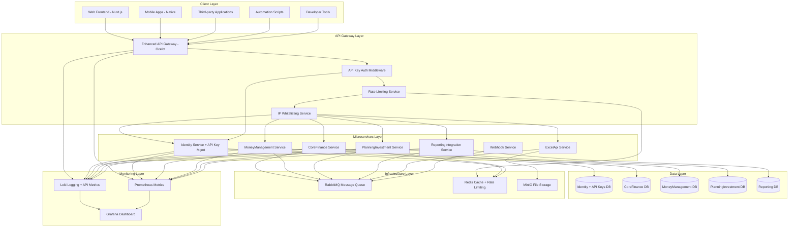
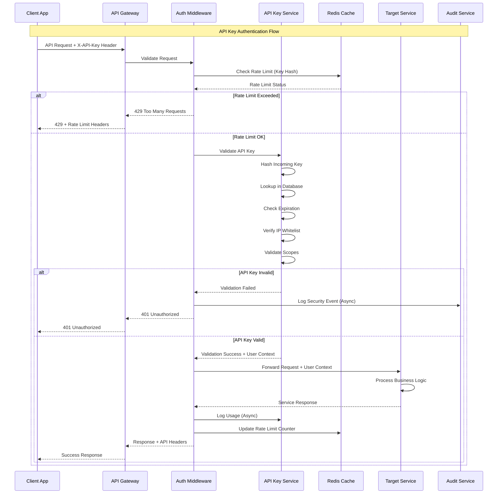
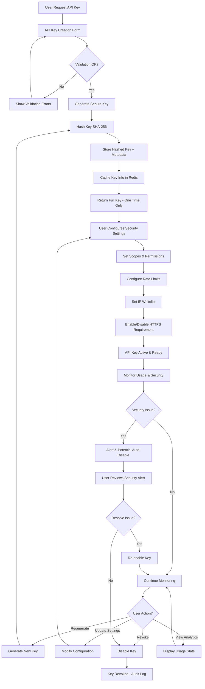
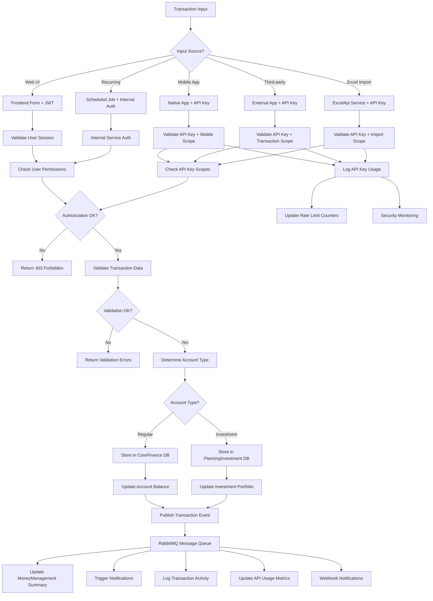
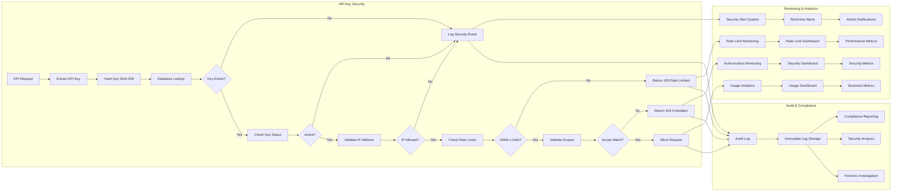
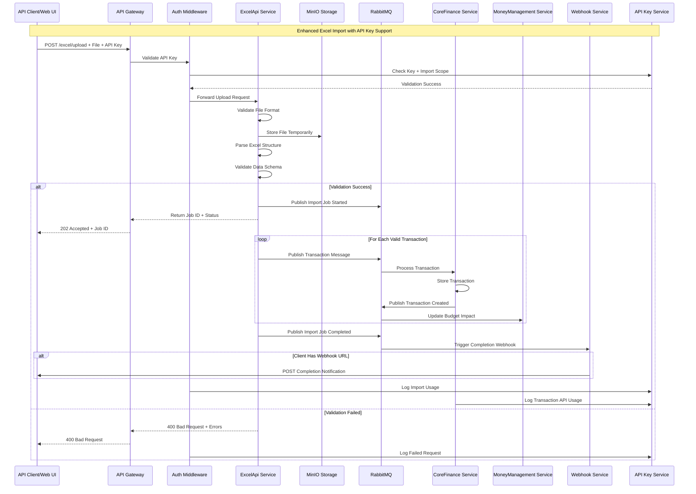
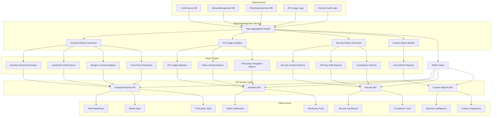
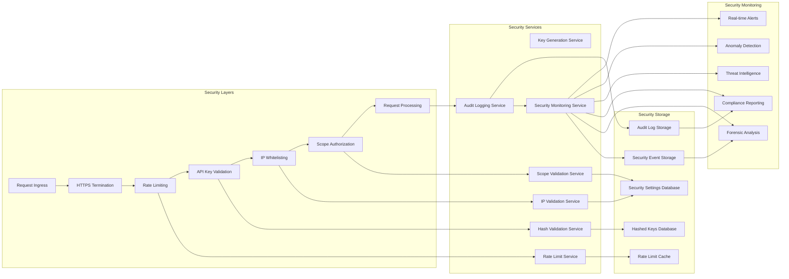

# System Architecture Flowcharts v4

## Overview
This document contains the detailed flowcharts for TiHoMo (Tiny House Money) personal finance management system architecture version 4. **Enhanced with API Key Management** for comprehensive third-party integration support.

## 1. Enhanced High-Level System Architecture

## 2. Enhanced Authentication & Authorization Flow

## 3. API Key Management Lifecycle Flow

## 4. Enhanced Transaction Processing with API Key Support

## 5. API Key Security & Monitoring Flow

## 6. Enhanced Excel Import Processing with API Key Authentication

## 7. Comprehensive Reporting & Analytics with API Access

## 8. Enhanced Message Queue Event Flow with API Key Events

```mermaid
graph TD
    subgraph Event Publishers
        CF[CoreFinance Service]
        MM[MoneyManagement Service]
        PI[PlanningInvestment Service]
        RI[ReportingIntegration Service]
        EA[ExcelApi Service]
        ID[Identity Service - API Keys]
        WEBHOOK[Webhook Service]
    end
    
    subgraph RabbitMQ Exchange System
        EX1[Account Exchange]
        EX2[Transaction Exchange]
        EX3[Investment Exchange]
        EX4[Notification Exchange]
        EX5[API Key Exchange - NEW]
        EX6[Security Exchange - NEW]
        EX7[Webhook Exchange - NEW]
    end
    
    subgraph Message Queues
        Q1[Account.Created Queue]
        Q2[Account.Updated Queue]
        Q3[Transaction.Created Queue]
        Q4[Transaction.Updated Queue]
        Q5[Investment.Updated Queue]
        Q6[Notification.Email Queue]
        Q7[Notification.SMS Queue]
        Q8[ApiKey.Created Queue - NEW]
        Q9[ApiKey.Used Queue - NEW]
        Q10[Security.Alert Queue - NEW]
        Q11[Webhook.Trigger Queue - NEW]
    end
    
    subgraph Event Consumers
        MM2[MoneyManagement Consumer]
        RI2[Reporting Consumer]
        NS[Notification Service]
        LS[Logging Service]
        AS[Analytics Service - NEW]
        SS[Security Service - NEW]
        WS[Webhook Service - NEW]
    end
    
    %% Publishers to Exchanges
    CF --> EX1
    CF --> EX2
    PI --> EX3
    EA --> EX2
    ID --> EX5
    ID --> EX6
    WEBHOOK --> EX7
    
    %% Exchanges to Queues
    EX1 --> Q1
    EX1 --> Q2
    EX2 --> Q3
    EX2 --> Q4
    EX3 --> Q5
    EX4 --> Q6
    EX4 --> Q7
    EX5 --> Q8
    EX5 --> Q9
    EX6 --> Q10
    EX7 --> Q11
    
    %% Queues to Consumers
    Q1 --> MM2
    Q2 --> MM2
    Q3 --> MM2
    Q3 --> RI2
    Q4 --> RI2
    Q5 --> RI2
    Q6 --> NS
    Q7 --> NS
    Q8 --> AS
    Q9 --> AS
    Q9 --> LS
    Q10 --> SS
    Q10 --> NS
    Q11 --> WS
    
    %% New API Key specific flows
    Q8 --> LS
    Q9 --> SS
    Q10 --> LS
    Q11 --> LS
```

## 9. Enhanced Monitoring & Observability with API Key Metrics

```mermaid
flowchart TB
    subgraph Service Metrics
        S1[CoreFinance + API Metrics]
        S2[MoneyManagement + API Metrics]
        S3[PlanningInvestment + API Metrics]
        S4[ReportingIntegration + API Metrics]
        S5[ExcelApi + API Metrics]
        S6[Identity + API Key Metrics]
        S7[Enhanced API Gateway]
    end
    
    subgraph API Key Specific Metrics
        AK1[API Key Usage Counters]
        AK2[Rate Limiting Metrics]
        AK3[Security Event Counters]
        AK4[Authentication Success/Failure Rates]
        AK5[Scope Validation Metrics]
        AK6[IP Whitelisting Metrics]
    end
    
    subgraph Logging Infrastructure
        S1 --> L[Enhanced Loki]
        S2 --> L
        S3 --> L
        S4 --> L
        S5 --> L
        S6 --> L
        S7 --> L
        
        AK1 --> L
        AK2 --> L
        AK3 --> L
        AK4 --> L
        AK5 --> L
        AK6 --> L
    end
    
    subgraph Metrics Collection
        S1 --> P[Enhanced Prometheus]
        S2 --> P
        S3 --> P
        S4 --> P
        S5 --> P
        S6 --> P
        S7 --> P
        
        AK1 --> P
        AK2 --> P
        AK3 --> P
        AK4 --> P
        AK5 --> P
        AK6 --> P
    end
    
    subgraph Visualization & Alerting
        L --> G[Enhanced Grafana]
        P --> G
        
        G --> A1[Performance Alerts]
        G --> A2[Error Rate Alerts]
        G --> A3[Business Metric Alerts]
        G --> A4[API Key Security Alerts - NEW]
        G --> A5[Rate Limiting Alerts - NEW]
        G --> A6[Third-party Integration Alerts - NEW]
    end
    
    subgraph Dashboards
        G --> D1[System Performance Dashboard]
        G --> D2[Business Metrics Dashboard]
        G --> D3[API Usage Dashboard - NEW]
        G --> D4[Security Monitoring Dashboard - NEW]
        G --> D5[Third-party Integration Dashboard - NEW]
        G --> D6[Developer Analytics Dashboard - NEW]
    end
```

## 10. API Key Integration Security Architecture

## Notes

- **Enhanced Authentication**: Dual authentication strategy with JWT tokens for web users and API keys for third-party integrations
- **Comprehensive Security**: Multi-layer security with rate limiting, IP whitelisting, scope-based authorization, and comprehensive audit logging
- **API-First Architecture**: All services designed with API access in mind, supporting web, mobile, and third-party integrations
- **Real-time Monitoring**: Enhanced monitoring with API-specific metrics, security event tracking, and comprehensive alerting
- **Developer Experience**: Complete developer portal with documentation, testing tools, and analytics
- **Scalable Design**: Redis-based caching and rate limiting for high-performance API key validation
- **Compliance Ready**: Comprehensive audit logging and compliance reporting for financial data protection regulations

*Updated: December 28, 2024 - Enhanced with comprehensive API Key Management architecture*
