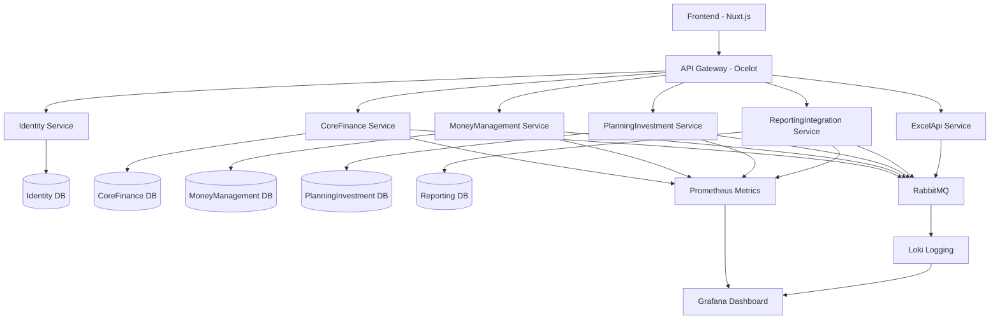
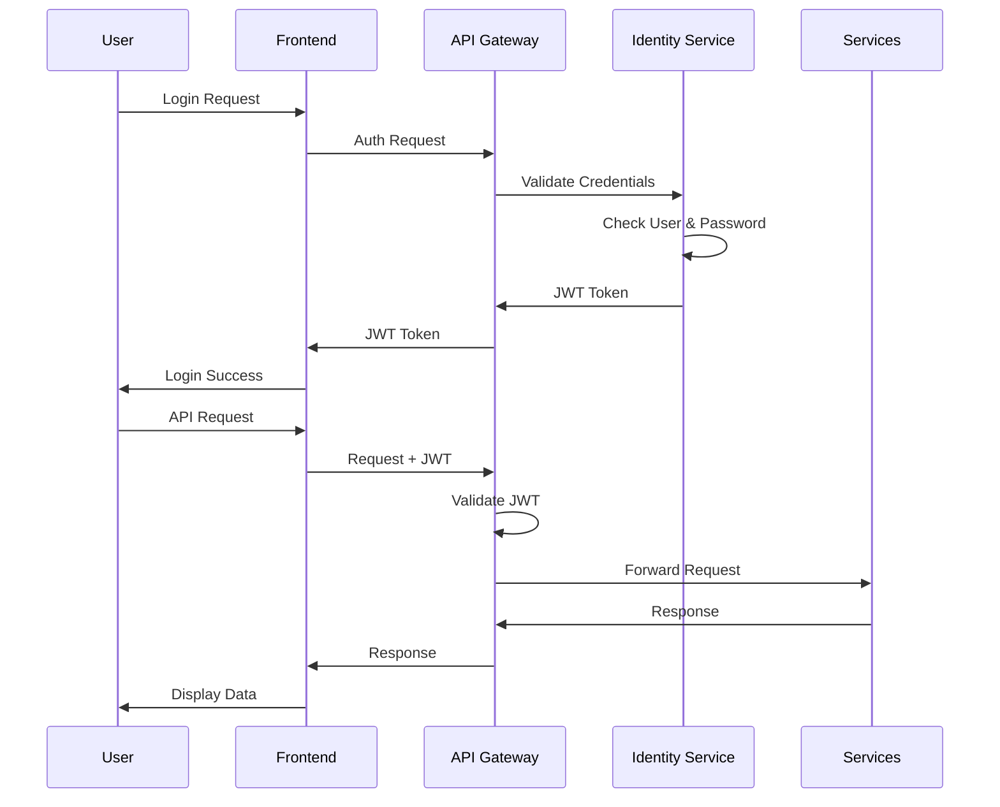
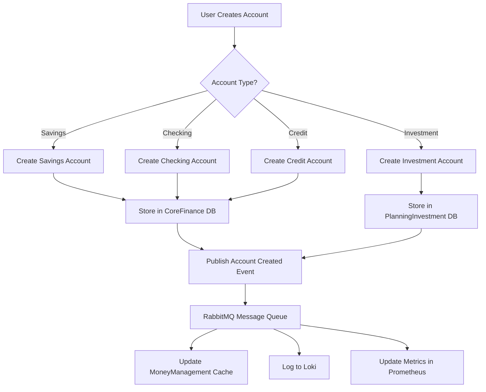
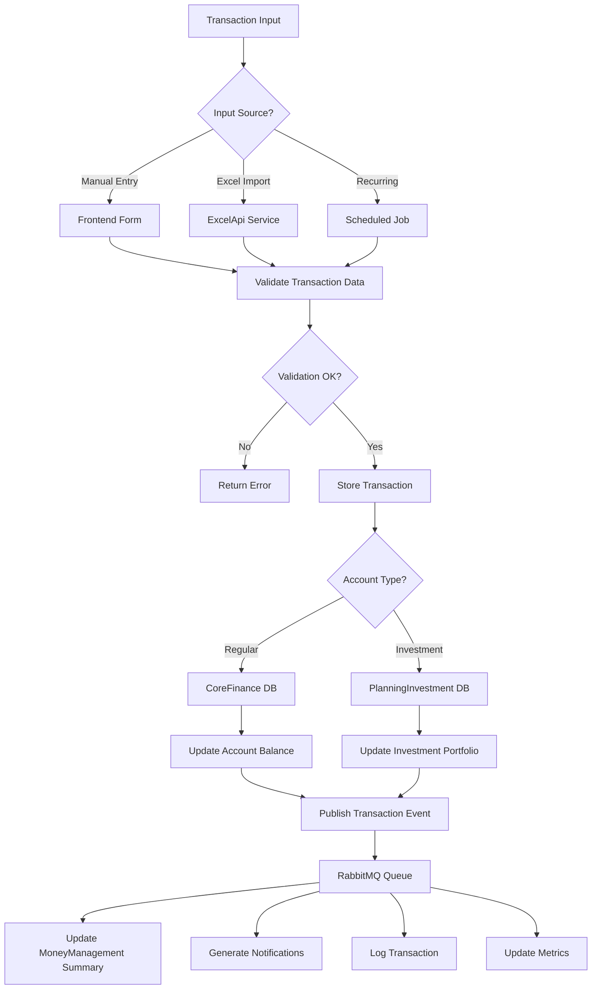
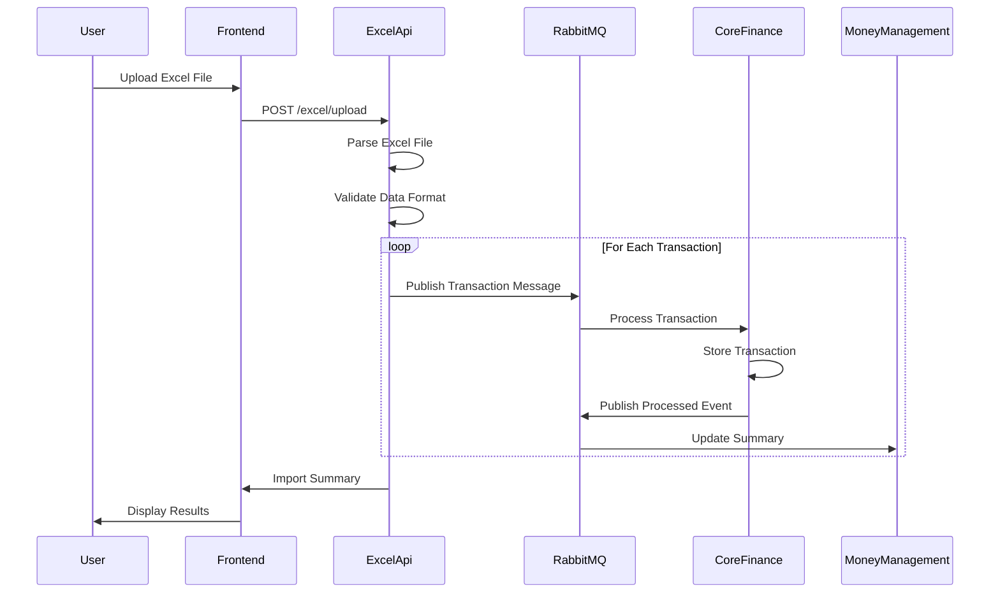
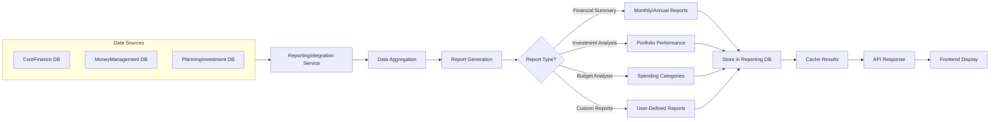
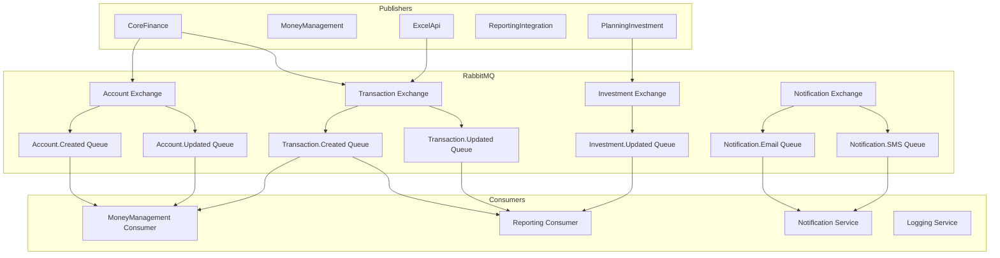
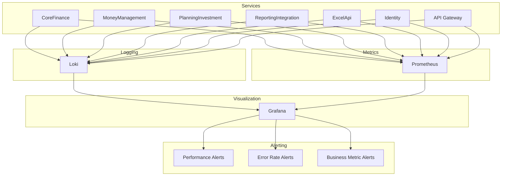
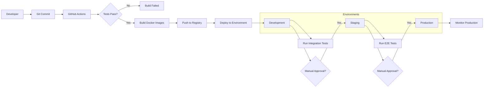
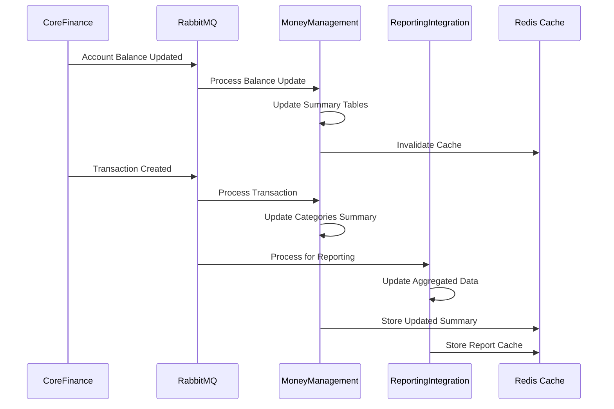

# System Architecture Flowcharts v4

## Overview
This document contains the detailed flowcharts for TiHoMo (Tiny House Money) personal finance management system architecture version 4.

## 1. High-Level System Architecture

## 2. Authentication & Authorization Flow

## 3. Account Management Flow

## 4. Transaction Processing Flow

## 5. Excel Import Processing Flow

## 6. Reporting & Analytics Flow

## 7. Message Queue Event Flow

## 8. Monitoring & Observability Flow

## 9. Development & Deployment Flow

## 10. Data Synchronization Flow

## Notes

- All services communicate through the API Gateway for external requests
- Internal service communication happens via RabbitMQ message queues
- Each service has its own database following microservices principles
- Monitoring is implemented using Prometheus for metrics and Loki for logs
- Grafana provides unified dashboards for observability
- Redis is used for caching frequently accessed data
- All flows include proper error handling and retry mechanisms
