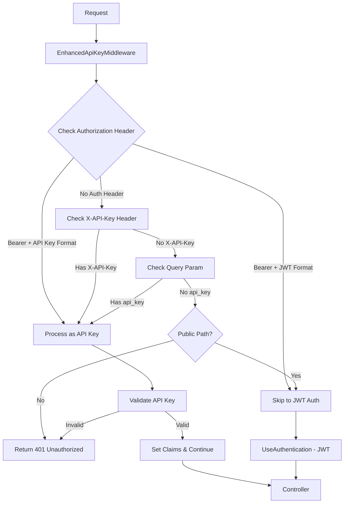

# TiHoMo Identity API - Hybrid Authentication Solution Brainstorm

## 📋 Executive Summary

**Problem**: Identity API hiện tại chỉ support API Key authentication, causing JWT authentication endpoints to fail với error "Invalid API key format" khi test qua Gateway.

**Root Cause**: `EnhancedApiKeyAuthenticationMiddleware` chạy trước `UseAuthentication()` và block tất cả requests không có valid API Key, including JWT Bearer tokens.

**Solution**: Implement hybrid authentication middleware hỗ trợ cả JWT và API Key authentication trong cùng một system.

---

## 🎯 Solution Options Analysis

### Option 1: Single Hybrid Middleware ⭐
**Architecture**: One middleware handles both JWT và API Key detection/validation
```
Risk: Medium | Effort: 2-3 days | Maintainability: Medium
```

**Pros:**
- Centralized authentication logic
- High performance (single middleware)
- Clean token format detection
- Unified error handling

**Cons:**
- Complex logic consolidation
- More difficult unit testing
- Single point of failure

### Option 2: Coordinated Middlewares (RECOMMENDED) ⭐⭐⭐
**Architecture**: Modified API Key middleware với JWT detection + coordination
```
Risk: Low | Effort: 1-2 days | Maintainability: High
```

**Pros:**
- ✅ Minimal changes to existing code
- ✅ Reuses tested components
- ✅ Easy rollback capability
- ✅ Backward compatible
- ✅ Quick implementation

**Cons:**
- Slight coordination overhead
- State management between middlewares

### Option 3: Authentication Schemes
**Architecture**: ASP.NET Core native authentication schemes
```
Risk: High | Effort: 3-4 days | Maintainability: High
```

**Pros:**
- Framework-native approach
- Excellent for complex authorization
- Policy-based authentication
- Future-proof design

**Cons:**
- Major architectural change
- Learning curve
- Migration complexity

---

## 🚀 Recommended Implementation: Phased Approach

### Phase 1: Quick Fix (Option 2)
**Timeline**: 1-2 days
**Goal**: Solve immediate problem with minimal risk

#### Implementation Details

**1. Modify EnhancedApiKeyAuthenticationMiddleware**
```csharp
private bool ShouldSkipApiKeyAuth(HttpContext context)
{
    // NEW: Skip if JWT Bearer token detected
    var authHeader = context.Request.Headers.Authorization.FirstOrDefault();
    if (!string.IsNullOrEmpty(authHeader) && authHeader.StartsWith("Bearer "))
    {
        var token = authHeader.Substring("Bearer ".Length).Trim();
        if (IsJwtFormat(token)) return true; // Let JWT middleware handle
    }
    
    // Existing public paths logic...
    return ShouldSkipAuthentication(context);
}

private bool IsJwtFormat(string token)
{
    // JWT has 3 parts separated by dots
    // API Key format: tihomo_xxx (single string)
    return token.Split('.').Length == 3 && 
           !token.StartsWith("tihomo_", StringComparison.OrdinalIgnoreCase);
}
```

**2. Update Middleware Pipeline**
```csharp
// Current order in Program.cs
app.UseEnhancedApiKeyAuthentication(); // Modified with JWT detection
app.UseAuthentication(); // JWT will work for skipped requests
app.UseAuthorization();
```

**3. Enhanced Public Paths Logic**
```csharp
private bool ShouldSkipAuthentication(HttpContext context)
{
    var path = context.Request.Path.Value?.ToLowerInvariant();
    
    var publicPaths = new[]
    {
        "/health",
        "/swagger", 
        "/metrics",
        "/api/auth/login",         // Allow JWT login
        "/api/auth/refresh",       // Allow JWT refresh
        "/api/auth/social-login",  // Allow social login
        // Gateway routing duplicates
        "/api/api/auth/login",
        "/api/api/auth/refresh",
        "/api/api/auth/social-login"
    };

    return publicPaths.Any(publicPath => path?.StartsWith(publicPath) == true);
}
```

### Phase 2: Long-term Solution (Option 3)
**Timeline**: 3-4 days (future sprint)
**Goal**: Implement proper authentication schemes architecture

---

## 🔍 Technical Analysis

### Token Format Detection Strategy

| Token Type | Format | Detection Logic |
|------------|---------|-----------------|
| **JWT** | `eyJ...` (3 parts: header.payload.signature) | `token.Split('.').Length == 3` |
| **API Key** | `tihomo_xxx` | `token.StartsWith("tihomo_")` |
| **Bearer JWT** | `Bearer eyJ...` | `authHeader.StartsWith("Bearer ") && IsJwtFormat(token)` |
| **Bearer API Key** | `Bearer tihomo_xxx` | `authHeader.StartsWith("Bearer ") && !IsJwtFormat(token)` |

### Authentication Flow Diagram



### Security Considerations

#### JWT Authentication
- ✅ Standard JWT validation (signature, expiration, issuer)
- ✅ Claims-based authorization
- ✅ Stateless authentication
- ✅ Short-lived tokens with refresh capability

#### API Key Authentication  
- ✅ Database validation with caching
- ✅ IP address restrictions
- ✅ Rate limiting per key
- ✅ Scope-based permissions
- ✅ Usage tracking and analytics

#### Hybrid Security
- ✅ No information leakage in error messages
- ✅ Consistent error handling
- ✅ Proper CORS handling
- ✅ Request/response logging

---

## 📊 Implementation Priority Matrix

| Feature | Priority | Effort | Risk | Impact |
|---------|----------|--------|------|--------|
| JWT Detection Logic | HIGH | Low | Low | High |
| Middleware Coordination | HIGH | Low | Low | High |
| Public Path Updates | HIGH | Low | Low | High |
| Error Handling | MEDIUM | Medium | Low | Medium |
| Performance Optimization | LOW | Medium | Medium | Medium |
| Monitoring & Logging | LOW | Low | Low | High |

---

## 🧪 Testing Strategy

### Unit Tests
- [ ] JWT format detection logic
- [ ] API Key format detection logic
- [ ] Public path matching
- [ ] Error handling scenarios

### Integration Tests
- [ ] JWT login flow through Gateway
- [ ] API Key validation through Gateway
- [ ] Mixed authentication scenarios
- [ ] Error handling end-to-end

### Postman Collection Tests
- [ ] `{{base_url}}/api/identity/auth/login` (JWT)
- [ ] `{{base_url}}/api/identity/users/me` (JWT Bearer)
- [ ] `{{base_url}}/api/identity/apikeys` (JWT Bearer)
- [ ] `{{base_url}}/api/identity/apikeys/validate` (API Key)

---

## 🎯 Success Criteria

### Phase 1 (Quick Fix)
- [x] Sequential thinking analysis completed
- [ ] JWT endpoints work through Gateway (HTTP 200)
- [ ] API Key endpoints continue working (HTTP 200)  
- [ ] No breaking changes to existing functionality
- [ ] Postman collection tests pass
- [ ] Performance impact < 5ms per request

### Phase 2 (Long-term)
- [ ] Authentication schemes implemented
- [ ] Policy-based authorization
- [ ] Enhanced testing coverage
- [ ] Performance optimizations
- [ ] Comprehensive documentation

---

## 📈 Performance Considerations

### Current Performance Profile
- API Key validation: ~50ms (database lookup)
- JWT validation: ~5ms (cryptographic verification)
- Middleware overhead: ~1ms

### Optimization Strategies
1. **Caching**: Redis cache for API Key lookups
2. **Detection**: Fast token format detection (regex-free)
3. **Short-circuit**: Skip unnecessary validations
4. **Async**: Non-blocking database operations

---

## 🔧 Implementation Checklist

### Phase 1: Quick Fix
- [ ] Backup current `EnhancedApiKeyAuthenticationMiddleware.cs`
- [ ] Implement `IsJwtFormat()` method
- [ ] Update `ShouldSkipApiKeyAuth()` logic
- [ ] Update public paths array
- [ ] Test with Postman collection
- [ ] Monitor performance impact
- [ ] Deploy to development environment

### Phase 2: Long-term
- [ ] Design authentication schemes architecture
- [ ] Implement `ApiKeyAuthenticationHandler`
- [ ] Update controller authorization attributes
- [ ] Migration testing
- [ ] Performance benchmarking
- [ ] Production deployment

---

## 📚 References

### Technical Documentation
- [ASP.NET Core Authentication](https://docs.microsoft.com/en-us/aspnet/core/security/authentication/)
- [JWT Bearer Authentication](https://docs.microsoft.com/en-us/aspnet/core/security/authentication/jwt)
- [Custom Authentication Schemes](https://docs.microsoft.com/en-us/aspnet/core/security/authentication/authenticationschemes)

### Project Context
- `src/be/Identity/Identity.Api/Middleware/EnhancedApiKeyAuthenticationMiddleware.cs`
- `src/be/Identity/Identity.Api/Program.cs` - Authentication configuration
- `postman/TiHoMo_API_Key_Management.postman_collection.json` - Test cases
- `design-docs/04-api-design/authentication/` - Authentication specifications

---

## 🤝 Team Coordination

### Stakeholders
- **Backend Developer**: Implement middleware changes
- **QA Engineer**: Test authentication flows
- **DevOps**: Deploy and monitor
- **Frontend Developer**: Update Nuxt.js auth (Phase 2)

### Communication Plan
- Daily standup updates on implementation progress
- Demo session after Phase 1 completion
- Architecture review before Phase 2

---

**Document Status**: ✅ Ready for Implementation  
**Next Action**: Begin Phase 1 implementation  
**Owner**: Backend Development Team  
**Timeline**: Phase 1 by end of sprint, Phase 2 in next sprint