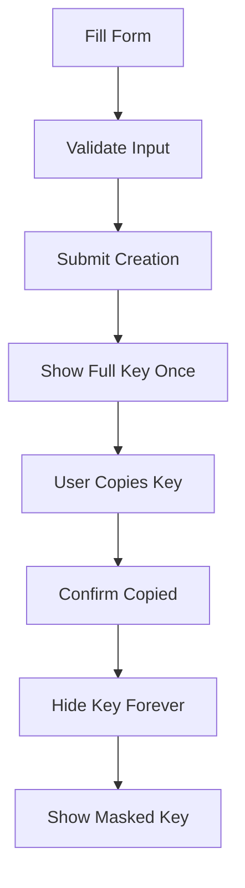

# API Key Management Screen Design

## 🎯 Mục tiêu

Thiết kế UI/UX và logic quản lý cho màn hình "Quản lý API Key" trong ứng dụng TiHoMo, cho phép users tạo, xem, chỉnh sửa và revoke API keys để integrate với third-party systems.

---

## 🧩 1. Giao diện mặc định (Simple Mode)

### ✅ Trường hiển thị mặc định trong API Key Creation Form:

| Trường             | Loại nhập                    | Gợi ý UX                              |
| ------------------ | ---------------------------- | ------------------------------------- |
| `Name`             | Text input                   | Tên API key dễ nhận biết              |
| `Description`      | Textarea                     | Mô tả mục đích sử dụng (optional)     |
| `ExpiresAt`        | DateTime picker              | Ngày hết hạn (optional, default 1 năm)|
| `Scopes`           | Multi-select checkboxes      | Quyền truy cập (read, write, admin)   |
| `RateLimitPerMinute` | Number input               | Giới hạn requests/phút (default: 100) |
| Nút \[Bảo mật nâng cao] | Toggle UI              | Hiện thêm các cài đặt bảo mật         |

---

## 🚀 2. Giao diện mở rộng (Advanced Security Mode)

### 🔒 Nhóm "Cài đặt bảo mật nâng cao":

* `IpWhitelist` - Danh sách IP được phép (CIDR support)
* `DailyUsageQuota` - Hạn mức sử dụng hàng ngày
* `RequireHttps` - Bắt buộc HTTPS
* `AllowCorsRequests` - Cho phép CORS requests
* `AllowedOrigins` - Danh sách origins được phép

### 📊 Nhóm "Monitoring & Analytics":

* `EnableUsageAnalytics` - Bật theo dõi usage
* `MaxRequestsPerSecond` - Giới hạn requests/giây
* `AlertThreshold` - Ngưỡng cảnh báo usage

---

## 🔒 3. Ràng buộc logic & Security

### Scope Definitions:
```typescript
enum ApiKeyScope {
  Read = "read",                    // Xem dữ liệu
  Write = "write",                  // Tạo/sửa dữ liệu
  Delete = "delete",                // Xóa dữ liệu
  TransactionsRead = "transactions:read",
  TransactionsWrite = "transactions:write",
  AccountsRead = "accounts:read",
  AccountsWrite = "accounts:write",
  Admin = "admin"                   // Toàn quyền
}
```

### Validation Rules:

* `Name`: Bắt buộc, 3-50 ký tự, unique per user
* `Description`: Tùy chọn, tối đa 500 ký tự
* `ExpiresAt`: Phải > thời gian hiện tại, tối đa 2 năm
* `Scopes`: Ít nhất 1 scope được chọn
* `RateLimitPerMinute`: 1-1000 requests/phút
* `DailyUsageQuota`: 100-100,000 requests/ngày
* `IpWhitelist`: Valid IP addresses hoặc CIDR notation

### Security Logic:

* **Hierarchical Scopes**: `admin` bao gồm tất cả permissions
* **Scope Validation**: UI hiển thị warning khi chọn powerful scopes
* **IP Validation**: Real-time validation của IP addresses
* **Rate Limit Suggestions**: Gợi ý rate limits dựa trên scopes

---

## 🔑 4. API Key Display & Security

### Frontend Security:
* **Key Display**: Chỉ hiển thị full key **một lần duy nhất** sau khi tạo
* **Key Masking**: Sau đó chỉ hiển thị prefix: `pfm_abc123...`
* **Copy to Clipboard**: Secure copy với auto-clear clipboard sau 30s
* **Key Regeneration**: Cho phép rotate key với confirmation
* **Download Option**: Download key as secure file với instructions

### Key Creation Flow:


### Security Warnings:
* **One-time Display**: "Đây là lần duy nhất bạn có thể xem API key này"
* **Storage Warning**: "Lưu trữ API key ở nơi an toàn"
* **Regeneration Impact**: "Regenerate key sẽ làm vô hiệu hóa key cũ"

---

## 📋 5. Tính năng UX nâng cao

### Smart Features:
* **Scope Templates**: Pre-defined scope combinations (Read-only, Full Access, etc.)
* **Usage Prediction**: Gợi ý rate limits dựa trên intended usage
* **Security Score**: Đánh giá mức độ bảo mật của API key
* **Integration Examples**: Code samples cho popular languages
* **Testing Tool**: Built-in API testing interface

### User Experience:
* **Progressive Disclosure**: Simple → Advanced settings
* **Contextual Help**: Tooltips và help text cho mỗi field
* **Real-time Validation**: Instant feedback cho user input
* **Smart Defaults**: Sensible default values cho new users
* **Bulk Operations**: Select multiple keys for bulk actions

---

## 🖥️ 6. Giao diện danh sách API Keys (Main Page)

### Layout Structure:

```
┌─────────────────────────────────────────────────────────────┐
│ Header: "API Keys" + [Create New API Key] Button           │
├─────────────────────────────────────────────────────────────┤
│ Filters: [Status] [Scope] [Search by name]                 │
├─────────────────────────────────────────────────────────────┤
│ API Keys Table                                              │
│ ┌─────────┬─────────┬─────────┬─────────┬─────────┬───────┐ │
│ │ Name    │ Prefix  │ Scopes  │ Status  │ Usage   │ Actions│ │
│ ├─────────┼─────────┼─────────┼─────────┼─────────┼───────┤ │
│ │ Prod API│pfm_abc..│ R,W     │ Active  │ 45/100  │ ⋯     │ │
│ │ Test API│pfm_def..│ R       │ Active  │ 2/50    │ ⋯     │ │
│ └─────────┴─────────┴─────────┴─────────┴─────────┴───────┘ │
├─────────────────────────────────────────────────────────────┤
│ Detail Pane (when API key selected) - 50% width            │
└─────────────────────────────────────────────────────────────┘
```

### Responsive Behavior:

* **Desktop (≥1024px)**: Split layout như trên
* **Tablet (768px-1023px)**: Detail pane 60% width
* **Mobile (<768px)**: Full-screen detail, hide list

### Default Display:

* Hiển thị **tất cả API keys** của user hiện tại
* **Sorting mặc định**: `CreatedAt` giảm dần (mới nhất trên đầu)
* **Status filter**: Active keys mặc định
* **Pagination**: 20 items per page

### Table Columns:

#### 🔹 Simple Mode (mặc định):
1. **Name** - Tên API key + status indicator
2. **Key Prefix** - `pfm_abc123...` với copy button
3. **Scopes** - Badge list với colors
4. **Status** - Active/Revoked/Expired với colors
5. **Usage** - Current usage/limit với progress bar
6. **Actions** - Dropdown menu với actions

#### 🔹 Advanced Mode:
Thêm các cột:
* **Created Date** - Relative time
* **Expires Date** - Relative time với warning colors
* **Last Used** - Relative time
* **Rate Limit** - Requests/minute
* **IP Restrictions** - Count of whitelisted IPs

### Filter Options:

```vue
<template>
  <div class="filters-bar">
    <!-- Status Filter -->
    <select v-model="statusFilter" class="filter-select">
      <option value="">Tất cả trạng thái</option>
      <option value="active">Active</option>
      <option value="revoked">Revoked</option>
      <option value="expired">Expired</option>
    </select>
    
    <!-- Scope Filter -->
    <select v-model="scopeFilter" class="filter-select">
      <option value="">Tất cả quyền</option>
      <option value="read">Read Only</option>
      <option value="write">Read + Write</option>
      <option value="admin">Admin</option>
    </select>
    
    <!-- Search -->
    <input 
      v-model="searchQuery"
      type="text"
      placeholder="Tìm theo tên API key..."
      class="search-input"
    />
    
    <!-- Advanced Filters Toggle -->
    <button @click="showAdvancedFilters = !showAdvancedFilters">
      <Icon name="filter" /> Bộ lọc nâng cao
    </button>
  </div>
  
  <!-- Advanced Filters Panel -->
  <div v-if="showAdvancedFilters" class="advanced-filters">
    <div class="filter-group">
      <label>Ngày tạo</label>
      <DateRangePicker v-model="createdDateRange" />
    </div>
    <div class="filter-group">
      <label>Usage level</label>
      <select v-model="usageFilter">
        <option value="">Tất cả</option>
        <option value="low">Thấp (&lt;25%)</option>
        <option value="medium">Trung bình (25-75%)</option>
        <option value="high">Cao (&gt;75%)</option>
      </select>
    </div>
  </div>
</template>
```

---

## 🎨 7. Giao diện chi tiết API Key (Detail Pane)

### Section Layout:

#### 📊 Section 1: API Key Overview
```vue
<template>
  <div class="api-key-overview">
    <div class="header">
      <h3>{{ apiKey.name }}</h3>
      <StatusBadge :status="apiKey.status" />
    </div>
    
    <div class="key-display">
      <label>API Key</label>
      <div class="key-value">
        <code>{{ maskedKey }}</code>
        <button @click="copyKey" class="copy-btn">
          <Icon name="copy" />
        </button>
      </div>
      <p class="key-warning">
        Key đã được ẩn để bảo mật. Chỉ hiển thị một lần khi tạo.
      </p>
    </div>
    
    <!-- Usage Summary Cards -->
    <div class="usage-cards">
      <div class="usage-card">
        <span class="usage-label">Hôm nay</span>
        <span class="usage-value">{{ apiKey.todayUsage }}/{{ apiKey.dailyQuota }}</span>
        <div class="usage-progress">
          <div 
            class="progress-bar" 
            :style="{ width: usagePercentage + '%' }"
          ></div>
        </div>
      </div>
      
      <div class="usage-card">
        <span class="usage-label">Rate Limit</span>
        <span class="usage-value">{{ apiKey.rateLimitPerMinute }}/min</span>
      </div>
      
      <div class="usage-card">
        <span class="usage-label">Last Used</span>
        <span class="usage-value">{{ formatRelativeTime(apiKey.lastUsedAt) }}</span>
      </div>
    </div>
  </div>
</template>
```

#### 🔧 Section 2: Configuration
```vue
<template>
  <div class="api-key-config">
    <h4>Cấu hình</h4>
    
    <div class="config-grid">
      <div class="config-item">
        <label>Scopes</label>
        <div class="scopes-list">
          <span 
            v-for="scope in apiKey.scopes" 
            :key="scope"
            class="scope-badge"
            :class="getScopeClass(scope)"
          >
            {{ scope }}
          </span>
        </div>
      </div>
      
      <div class="config-item">
        <label>Expiry Date</label>
        <span :class="getExpiryClass(apiKey.expiresAt)">
          {{ formatDate(apiKey.expiresAt) || 'Never' }}
        </span>
      </div>
      
      <div class="config-item" v-if="apiKey.ipWhitelist.length > 0">
        <label>IP Whitelist</label>
        <div class="ip-list">
          <code 
            v-for="ip in apiKey.ipWhitelist" 
            :key="ip"
            class="ip-address"
          >
            {{ ip }}
          </code>
        </div>
      </div>
      
      <div class="config-item">
        <label>Security Settings</label>
        <div class="security-flags">
          <span v-if="apiKey.securitySettings.requireHttps" class="security-flag">
            🔒 HTTPS Required
          </span>
          <span v-if="apiKey.securitySettings.allowCorsRequests" class="security-flag">
            🌐 CORS Enabled
          </span>
        </div>
      </div>
    </div>
  </div>
</template>
```

#### 📈 Section 3: Usage Analytics
```vue
<template>
  <div class="usage-analytics">
    <h4>Usage Analytics</h4>
    
    <!-- Usage Chart -->
    <div class="chart-container">
      <canvas ref="usageChart"></canvas>
    </div>
    
    <!-- Usage Stats -->
    <div class="usage-stats">
      <div class="stat-item">
        <span class="stat-label">Total Requests</span>
        <span class="stat-value">{{ apiKey.totalRequests.toLocaleString() }}</span>
      </div>
      <div class="stat-item">
        <span class="stat-label">Success Rate</span>
        <span class="stat-value">{{ successRate }}%</span>
      </div>
      <div class="stat-item">
        <span class="stat-label">Avg Response Time</span>
        <span class="stat-value">{{ avgResponseTime }}ms</span>
      </div>
    </div>
    
    <!-- Recent Activity -->
    <div class="recent-activity">
      <h5>Recent Activity</h5>
      <div class="activity-list">
        <div 
          v-for="activity in recentActivity" 
          :key="activity.id"
          class="activity-item"
        >
          <span class="activity-time">{{ formatTime(activity.timestamp) }}</span>
          <span class="activity-method" :class="getMethodClass(activity.method)">
            {{ activity.method }}
          </span>
          <span class="activity-path">{{ activity.path }}</span>
          <span class="activity-status" :class="getStatusClass(activity.status)">
            {{ activity.status }}
          </span>
        </div>
      </div>
    </div>
  </div>
</template>
```

#### ⚙️ Section 4: Actions
```vue
<template>
  <div class="api-key-actions">
    <h4>Actions</h4>
    
    <div class="action-buttons">
      <!-- Primary Actions -->
      <button @click="editApiKey" class="btn-primary">
        <Icon name="edit" /> Edit Settings
      </button>
      
      <button @click="regenerateKey" class="btn-secondary">
        <Icon name="refresh" /> Regenerate Key
      </button>
      
      <!-- Secondary Actions -->
      <button @click="downloadKey" class="btn-secondary">
        <Icon name="download" /> Download Config
      </button>
      
      <button @click="testApiKey" class="btn-secondary">
        <Icon name="play" /> Test API Key
      </button>
      
      <button @click="viewLogs" class="btn-secondary">
        <Icon name="list" /> View Logs
      </button>
      
      <!-- Danger Zone -->
      <div class="danger-zone">
        <h5>Danger Zone</h5>
        <button @click="revokeKey" class="btn-danger">
          <Icon name="x-circle" /> Revoke API Key
        </button>
      </div>
    </div>
  </div>
</template>
```

---

## 🔧 8. Modal Components

### 8.1 Create API Key Modal

```vue
<template>
  <Modal v-model="show" title="Create New API Key" size="large">
    <form @submit.prevent="createApiKey" class="api-key-form">
      <!-- Basic Information -->
      <div class="form-section">
        <h3>Basic Information</h3>
        
        <div class="form-group">
          <label for="name">Name *</label>
          <input 
            id="name"
            v-model="form.name" 
            type="text" 
            required 
            placeholder="e.g., Production API, Mobile App"
            class="form-input"
          />
          <small class="form-hint">Choose a descriptive name for this API key</small>
        </div>
        
        <div class="form-group">
          <label for="description">Description</label>
          <textarea 
            id="description"
            v-model="form.description" 
            rows="3"
            placeholder="Describe the purpose and usage of this API key..."
            class="form-textarea"
          ></textarea>
        </div>
        
        <div class="form-group">
          <label for="expiresAt">Expires At</label>
          <input 
            id="expiresAt"
            v-model="form.expiresAt" 
            type="datetime-local" 
            class="form-input"
          />
          <small class="form-hint">Leave empty for no expiration</small>
        </div>
      </div>
      
      <!-- Permissions -->
      <div class="form-section">
        <h3>Permissions</h3>
        <ScopeSelector v-model="form.scopes" />
      </div>
      
      <!-- Rate Limiting -->
      <div class="form-section">
        <h3>Rate Limiting</h3>
        
        <div class="form-row">
          <div class="form-group">
            <label for="rateLimit">Requests per minute</label>
            <input 
              id="rateLimit"
              v-model.number="form.rateLimitPerMinute" 
              type="number" 
              min="1" 
              max="1000"
              class="form-input"
            />
          </div>
          
          <div class="form-group">
            <label for="dailyQuota">Daily quota</label>
            <input 
              id="dailyQuota"
              v-model.number="form.dailyUsageQuota" 
              type="number" 
              min="100"
              class="form-input"
            />
          </div>
        </div>
      </div>
      
      <!-- Advanced Security (Collapsible) -->
      <div class="form-section">
        <button 
          type="button"
          @click="showAdvancedSecurity = !showAdvancedSecurity"
          class="section-toggle"
        >
          <Icon :name="showAdvancedSecurity ? 'chevron-down' : 'chevron-right'" />
          Advanced Security Settings
        </button>
        
        <div v-if="showAdvancedSecurity" class="advanced-settings">
          <div class="form-group">
            <label for="ipWhitelist">IP Whitelist</label>
            <textarea 
              id="ipWhitelist"
              v-model="ipWhitelistText" 
              rows="3"
              placeholder="192.168.1.1&#10;10.0.0.0/8&#10;2001:db8::/32"
              class="form-textarea"
            />
            <small class="form-hint">One IP address or CIDR block per line</small>
          </div>
          
          <div class="form-group">
            <div class="checkbox-group">
              <label class="checkbox-label">
                <input 
                  type="checkbox" 
                  v-model="form.securitySettings.requireHttps"
                  class="form-checkbox"
                />
                Require HTTPS
              </label>
              
              <label class="checkbox-label">
                <input 
                  type="checkbox" 
                  v-model="form.securitySettings.allowCorsRequests"
                  class="form-checkbox"
                />
                Allow CORS requests
              </label>
            </div>
          </div>
        </div>
      </div>
      
      <!-- Form Actions -->
      <div class="form-actions">
        <button type="button" @click="show = false" class="btn-secondary">
          Cancel
        </button>
        <button 
          type="submit" 
          class="btn-primary" 
          :disabled="!isFormValid || isCreating"
        >
          <Icon v-if="isCreating" name="spinner" class="animate-spin" />
          {{ isCreating ? 'Creating...' : 'Create API Key' }}
        </button>
      </div>
    </form>
  </Modal>
</template>
```

### 8.2 API Key Created Success Modal

```vue
<template>
  <Modal 
    v-model="show" 
    title="API Key Created Successfully" 
    size="medium"
    :closable="false"
  >
    <div class="success-modal">
      <!-- Warning -->
      <div class="warning-banner">
        <Icon name="exclamation-triangle" class="warning-icon" />
        <div class="warning-content">
          <h4>Important: Save your API key now</h4>
          <p>This is the only time you'll be able to see the full API key. Make sure to copy and store it securely.</p>
        </div>
      </div>
      
      <!-- API Key Display -->
      <div class="api-key-display">
        <label>Your new API Key:</label>
        <div class="key-container">
          <code class="api-key-value">{{ apiKey }}</code>
          <button @click="copyToClipboard" class="copy-button">
            <Icon :name="copied ? 'check' : 'copy'" />
            {{ copied ? 'Copied!' : 'Copy' }}
          </button>
        </div>
      </div>
      
      <!-- Quick Start Guide -->
      <div class="quick-start">
        <h4>Quick Start</h4>
        <div class="code-examples">
          <div class="example-tabs">
            <button 
              v-for="lang in ['curl', 'javascript', 'python']"
              :key="lang"
              @click="selectedLanguage = lang"
              class="tab-button"
              :class="{ active: selectedLanguage === lang }"
            >
              {{ lang.toUpperCase() }}
            </button>
          </div>
          
          <div class="code-block">
            <pre><code>{{ getCodeExample(selectedLanguage) }}</code></pre>
          </div>
        </div>
      </div>
      
      <!-- Actions -->
      <div class="modal-actions">
        <button @click="downloadConfig" class="btn-secondary">
          <Icon name="download" /> Download Config
        </button>
        <button @click="confirmSaved" class="btn-primary">
          I've saved the key securely
        </button>
      </div>
    </div>
  </Modal>
</template>

<script setup lang="ts">
const getCodeExample = (language: string) => {
  const examples = {
    curl: `curl -H "Authorization: Bearer ${apiKey}" \\
     https://api.tihomo.com/api/accounts`,
    javascript: `fetch('https://api.tihomo.com/api/accounts', {
  headers: {
    'Authorization': 'Bearer ${apiKey}'
  }
})`,
    python: `import requests

headers = {'Authorization': f'Bearer ${apiKey}'}
response = requests.get('https://api.tihomo.com/api/accounts', headers=headers)`
  }
  return examples[language]
}
</script>
```

### 8.3 Scope Selector Component

```vue
<template>
  <div class="scope-selector">
    <div class="scope-categories">
      <!-- Predefined Templates -->
      <div class="scope-templates">
        <h4>Quick Templates</h4>
        <div class="template-buttons">
          <button 
            v-for="template in scopeTemplates"
            :key="template.name"
            @click="applyTemplate(template)"
            class="template-button"
          >
            {{ template.name }}
          </button>
        </div>
      </div>
      
      <!-- Individual Scopes -->
      <div class="individual-scopes">
        <h4>Individual Permissions</h4>
        
        <div class="scope-groups">
          <div v-for="group in scopeGroups" :key="group.name" class="scope-group">
            <h5>{{ group.name }}</h5>
            <div class="scope-checkboxes">
              <label 
                v-for="scope in group.scopes"
                :key="scope.value"
                class="scope-checkbox"
                :class="{ 
                  'dangerous': scope.dangerous,
                  'selected': selectedScopes.includes(scope.value)
                }"
              >
                <input 
                  type="checkbox"
                  :value="scope.value"
                  v-model="selectedScopes"
                  class="scope-input"
                />
                <div class="scope-info">
                  <span class="scope-name">{{ scope.name }}</span>
                  <span class="scope-description">{{ scope.description }}</span>
                  <Icon v-if="scope.dangerous" name="exclamation-triangle" class="danger-icon" />
                </div>
              </label>
            </div>
          </div>
        </div>
      </div>
    </div>
    
    <!-- Selected Scopes Summary -->
    <div class="selected-summary">
      <h4>Selected Permissions ({{ selectedScopes.length }})</h4>
      <div class="selected-scopes">
        <span 
          v-for="scope in selectedScopes"
          :key="scope"
          class="selected-scope"
        >
          {{ scope }}
          <button @click="removeScope(scope)" class="remove-scope">×</button>
        </span>
      </div>
    </div>
  </div>
</template>

<script setup lang="ts">
const scopeTemplates = [
  {
    name: 'Read Only',
    description: 'View data only',
    scopes: ['read', 'accounts:read', 'transactions:read']
  },
  {
    name: 'Full Access',
    description: 'Complete access to all features',
    scopes: ['read', 'write', 'delete', 'accounts:read', 'accounts:write', 'transactions:read', 'transactions:write']
  },
  {
    name: 'Transactions Only',
    description: 'Manage transactions only',
    scopes: ['transactions:read', 'transactions:write']
  }
]

const scopeGroups = [
  {
    name: 'General',
    scopes: [
      { value: 'read', name: 'Read', description: 'View all data', dangerous: false },
      { value: 'write', name: 'Write', description: 'Create and modify data', dangerous: false },
      { value: 'delete', name: 'Delete', description: 'Delete data', dangerous: true },
      { value: 'admin', name: 'Admin', description: 'Full administrative access', dangerous: true }
    ]
  },
  {
    name: 'Accounts',
    scopes: [
      { value: 'accounts:read', name: 'View Accounts', description: 'View account information', dangerous: false },
      { value: 'accounts:write', name: 'Manage Accounts', description: 'Create and modify accounts', dangerous: false }
    ]
  },
  {
    name: 'Transactions',
    scopes: [
      { value: 'transactions:read', name: 'View Transactions', description: 'View transaction history', dangerous: false },
      { value: 'transactions:write', name: 'Manage Transactions', description: 'Create and modify transactions', dangerous: false }
    ]
  }
]
</script>
```

---

## ⌨️ 9. Keyboard Shortcuts

* **ESC**: Đóng detail pane hoặc modal
* **Ctrl/Cmd + N**: Tạo API key mới
* **Ctrl/Cmd + C**: Copy API key (khi focused)
* **Enter**: Submit form trong modal
* **Tab**: Di chuyển giữa các trường nhập liệu
* **↑/↓**: Di chuyển giữa các API keys trong danh sách
* **Ctrl/Cmd + R**: Regenerate selected API key
* **Delete**: Revoke API key đang chọn (với confirmation)

---

## 🎨 10. UI/UX Design System

### Status Colors:
* **Active**: `text-green-600 bg-green-100` (xanh lá)
* **Revoked**: `text-red-600 bg-red-100` (đỏ)
* **Expired**: `text-yellow-600 bg-yellow-100` (vàng)

### Scope Colors:
* **Read**: `text-blue-600 bg-blue-100` (xanh dương)
* **Write**: `text-orange-600 bg-orange-100` (cam)
* **Delete**: `text-red-600 bg-red-100` (đỏ)
* **Admin**: `text-purple-600 bg-purple-100` (tím)

### Usage Indicators:
* **Low Usage** (<25%): `text-green-600` (xanh lá)
* **Medium Usage** (25-75%): `text-yellow-600` (vàng)
* **High Usage** (>75%): `text-red-600` (đỏ)

### Key Display:
```css
.api-key-value {
  @apply font-mono text-sm bg-gray-100 px-3 py-2 rounded border;
  font-feature-settings: 'tnum';
  letter-spacing: 0.5px;
}

.masked-key {
  @apply text-gray-500;
}
```

---

## 🔧 11. Technical Implementation Notes

### Component Structure:
```
pages/settings/api-keys/
├── index.vue                    # Main API Keys page
├── components/
│   ├── ApiKeyList.vue          # Table component
│   ├── ApiKeyDetail.vue        # Detail pane
│   ├── CreateApiKeyModal.vue   # Creation modal
│   ├── ApiKeySuccessModal.vue  # Success modal
│   ├── ScopeSelector.vue       # Scope selection
│   ├── UsageChart.vue          # Analytics chart
│   └── SecuritySettings.vue    # Security form
├── composables/
│   ├── useApiKeys.ts           # API operations
│   ├── useApiKeyValidation.ts  # Validation logic
│   └── useApiKeyUsage.ts       # Usage analytics
└── types/
    └── api-key.ts              # TypeScript types
```

### State Management:
```typescript
// stores/apiKeys.ts
export const useApiKeysStore = defineStore('apiKeys', {
  state: () => ({
    apiKeys: [] as ApiKey[],
    selectedApiKey: null as ApiKey | null,
    isLoading: false,
    filters: {
      status: '',
      scope: '',
      search: ''
    }
  }),
  
  actions: {
    async loadApiKeys() {
      this.isLoading = true
      try {
        const response = await $fetch('/api/apikeys')
        this.apiKeys = response.data
      } finally {
        this.isLoading = false
      }
    },
    
    async createApiKey(request: CreateApiKeyRequest) {
      const response = await $fetch('/api/apikeys', {
        method: 'POST',
        body: request
      })
      this.apiKeys.unshift(response)
      return response
    },
    
    async revokeApiKey(id: string) {
      await $fetch(`/api/apikeys/${id}`, { method: 'DELETE' })
      const index = this.apiKeys.findIndex(key => key.id === id)
      if (index !== -1) {
        this.apiKeys[index].status = 'revoked'
      }
    }
  }
})
```

### Security Considerations:
* **No key storage**: Never store full API keys in frontend state
* **Secure clipboard**: Auto-clear clipboard after copy
* **HTTPS enforcement**: All API key operations over HTTPS
* **Input validation**: Client-side và server-side validation
* **Rate limiting**: Prevent abuse của API key creation

### Performance Optimization:
* **Lazy loading**: Load usage data on-demand
* **Pagination**: Handle large numbers of API keys
* **Debounced search**: Avoid excessive API calls
* **Caching**: Cache API key list với appropriate TTL

### Error Handling:
* **Network errors**: Retry mechanism với exponential backoff
* **Validation errors**: Real-time feedback
* **Server errors**: Graceful degradation
* **Security errors**: Clear error messages without exposing internals

### Accessibility:
* **Keyboard navigation**: Full keyboard support
* **Screen readers**: Proper ARIA labels
* **Focus management**: Logical tab order
* **Color contrast**: WCAG 2.1 AA compliance

---

## 📊 12. Analytics & Monitoring

### User Behavior Tracking:
* API key creation patterns
* Most used scopes
* Security settings adoption
* Error rates per form field
* Time to complete key setup

### Performance Metrics:
* Page load time
* API response time
* Chart rendering performance
* Modal open/close times

### Security Metrics:
* Failed API key validations
* Suspicious usage patterns
* Rate limit violations
* IP whitelist violations

---

## 🚀 13. Future Enhancements

### Phase 2 Features:
* **Team API Keys**: Shared keys for organizations
* **Key Templates**: Save custom scope templates
* **Usage Alerts**: Email notifications for usage thresholds
* **API Key Rotation**: Automatic key rotation policies

### Phase 3 Features:
* **OAuth Integration**: OAuth 2.0 flows for third-party apps
* **Webhook Management**: Manage webhooks tied to API keys
* **SDK Generation**: Auto-generate SDKs cho different languages
* **Advanced Analytics**: ML-powered usage insights

### Integration Features:
* **CI/CD Integration**: API keys for automated deployments
* **Monitoring Integration**: Connect với external monitoring tools
* **Documentation Generator**: Auto-generate API docs based on scopes
* **Testing Framework**: Built-in API testing và validation tools 