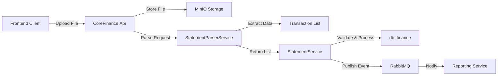
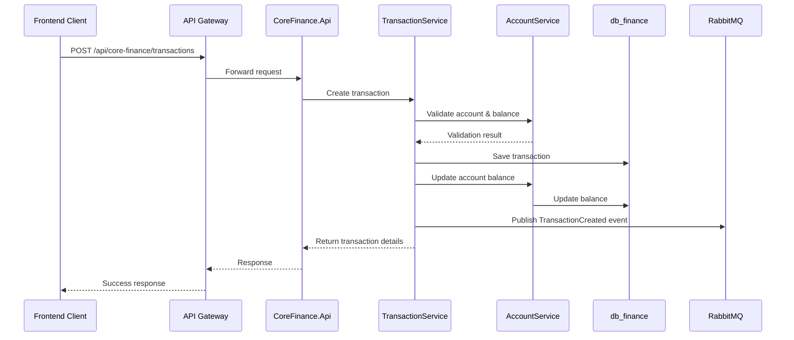
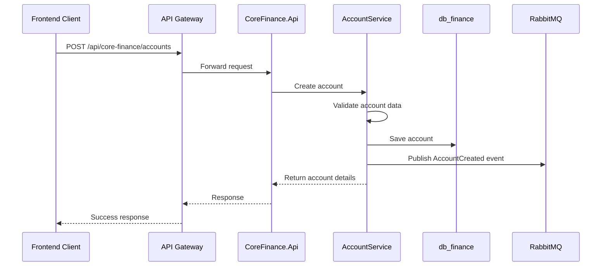

# CoreFinance Service Architecture

## 1. Overview

CoreFinance is a bounded context within the TiHoMo system, responsible for managing financial accounts, transactions, and statements. This service is built following microservices architecture patterns, ensuring independence, scalability, and easy integration with other domains like MoneyManagement and Planning & Investment.

### Primary Objectives
- Financial account management (AccountService)
- Transaction processing (TransactionService)  
- Statement management and import (StatementService)
- Data consistency through event-driven architecture (RabbitMQ)
- Integration with file storage (MinIO) and reporting services

---

## 2. Service Architecture

### 2.1 Microservice Structure

- **CoreFinance.Api**: REST API for account, transaction, and statement CRUD operations
- **CoreFinance.Application**: Business logic, CQRS patterns, validation
- **CoreFinance.Domain**: Domain models, aggregates, business rules
- **CoreFinance.Infrastructure**: Data access (EF Core/PostgreSQL), event publishing, file storage integration
- **CoreFinance.Contracts**: DTOs, contracts for event/message bus communication

### 2.2 Database Design

- **db_finance** (PostgreSQL): Stores accounts, transactions, statements
- EF Core for data access with migration-managed schema
- Snake_case naming convention for database objects

### 2.3 Event-Driven Communication

- **RabbitMQ**: Publishes events such as AccountChanged, TransactionCreated, StatementImported
- Other services (MoneyManagement, Reporting) consume events for data synchronization
- MassTransit framework for message handling

### 2.4 File Storage Integration

- **MinIO**: Stores original statement files, processed files, temporary files
- SDK integration for file operations
- Secure file access with pre-signed URLs

---

## 3. Service Components Detail

### 3.1 AccountService

**Responsibilities:**
- Account CRUD operations
- Balance calculations and updates
- Account validation and authorization
- Account type management (Bank, Wallet, Cash, Credit Card)

**Process Flow:**
1. Receive CRUD requests from API Gateway
2. Validate data and check ownership permissions
3. Apply business rules and constraints
4. Save to db_finance database
5. Publish AccountChanged event to RabbitMQ

### 3.2 TransactionService

**Responsibilities:**
- Transaction creation and management
- Balance impact calculations
- Transaction categorization
- Recurring transaction handling
- Transfer transaction processing

**Process Flow:**
1. Receive transaction creation requests
2. Validate balance, transaction type, and business rules
3. Apply recurring transaction patterns and split transactions
4. Save to db_finance database
5. Update account balances
6. Publish TransactionCreated event to RabbitMQ

### 3.3 StatementService

**Responsibilities:**
- Statement file upload and processing
- Integration with StatementParserService
- Transaction validation and deduplication
- Import status tracking

**Process Flow:**
1. Receive statement files from client via API Gateway
2. Store files in MinIO storage
3. Send files to StatementParserService for processing
4. Receive parsed transaction list
5. Validate and save transactions to db_finance
6. Publish StatementImported event to RabbitMQ

---

## 4. Data Flow & Sequence Diagrams

### 4.1 Import Statement Flow



### 4.2 Transaction Creation Flow



### 4.3 Account Management Flow



---

## 5. Domain Models

### 5.1 Core Entities

**Account Entity:**
```csharp
public class Account : BaseEntity
{
    public string Name { get; set; }
    public AccountType Type { get; set; }
    public string Currency { get; set; }
    public decimal InitialBalance { get; set; }
    public decimal CurrentBalance { get; set; }
    public string UserId { get; set; }
    public bool IsActive { get; set; }
    public List<Transaction> Transactions { get; set; }
}
```

**Transaction Entity:**
```csharp
public class Transaction : BaseEntity
{
    public string AccountId { get; set; }
    public decimal Amount { get; set; }
    public TransactionType Type { get; set; }
    public string CategoryId { get; set; }
    public string Description { get; set; }
    public DateTime TransactionDate { get; set; }
    public string UserId { get; set; }
    public string ReferenceId { get; set; }
    public Account Account { get; set; }
}
```

### 5.2 Value Objects

**Money Value Object:**
```csharp
public class Money : ValueObject
{
    public decimal Amount { get; private set; }
    public string Currency { get; private set; }
    
    public Money(decimal amount, string currency)
    {
        Amount = amount;
        Currency = currency;
    }
}
```

---

## 6. API Endpoints

### 6.1 Account Management

| Method | Endpoint | Description |
|--------|----------|-------------|
| GET | `/api/core-finance/accounts` | Get user accounts |
| POST | `/api/core-finance/accounts` | Create new account |
| GET | `/api/core-finance/accounts/{id}` | Get account details |
| PUT | `/api/core-finance/accounts/{id}` | Update account |
| DELETE | `/api/core-finance/accounts/{id}` | Delete account |

### 6.2 Transaction Management

| Method | Endpoint | Description |
|--------|----------|-------------|
| GET | `/api/core-finance/transactions` | Get transactions with filters |
| POST | `/api/core-finance/transactions` | Create new transaction |
| GET | `/api/core-finance/transactions/{id}` | Get transaction details |
| PUT | `/api/core-finance/transactions/{id}` | Update transaction |
| DELETE | `/api/core-finance/transactions/{id}` | Delete transaction |

### 6.3 Statement Management

| Method | Endpoint | Description |
|--------|----------|-------------|
| POST | `/api/core-finance/statements/import` | Upload and import statement |
| GET | `/api/core-finance/statements` | Get import history |
| GET | `/api/core-finance/statements/{id}` | Get import details |

---

## 7. Event Contracts

### 7.1 Published Events

**AccountCreated Event:**
```csharp
public class AccountCreated
{
    public string AccountId { get; set; }
    public string UserId { get; set; }
    public string Name { get; set; }
    public AccountType Type { get; set; }
    public decimal InitialBalance { get; set; }
    public string Currency { get; set; }
    public DateTime CreatedAt { get; set; }
}
```

**TransactionCreated Event:**
```csharp
public class TransactionCreated
{
    public string TransactionId { get; set; }
    public string AccountId { get; set; }
    public string UserId { get; set; }
    public decimal Amount { get; set; }
    public TransactionType Type { get; set; }
    public string CategoryId { get; set; }
    public DateTime TransactionDate { get; set; }
    public DateTime CreatedAt { get; set; }
}
```

---

## 8. Technology Stack

### 8.1 Backend Technologies
- **.NET 9**: Core framework
- **ASP.NET Core**: Web API framework
- **Entity Framework Core**: ORM with PostgreSQL provider
- **MassTransit**: Message bus integration
- **AutoMapper**: Object mapping
- **FluentValidation**: Input validation

### 8.2 Infrastructure
- **PostgreSQL**: Primary database
- **RabbitMQ**: Message broker
- **MinIO**: File storage
- **Docker**: Containerization

### 8.3 Testing
- **xUnit**: Unit testing framework
- **FluentAssertions**: Assertion library
- **Testcontainers**: Integration testing
- **Bogus**: Test data generation

---

## 9. Security & Validation

### 9.1 Authentication & Authorization
- JWT token validation
- User context extraction
- Resource ownership validation
- Role-based access control

### 9.2 Input Validation
- FluentValidation rules
- Business rule validation
- Data integrity checks
- SQL injection prevention

---

## 10. Performance Considerations

### 10.1 Database Optimization
- Proper indexing strategy
- Query optimization
- Connection pooling
- Read/write separation potential

### 10.2 Caching Strategy
- In-memory caching for frequently accessed data
- Distributed caching for shared data
- Cache invalidation on data changes

---

## 11. Monitoring & Logging

### 11.1 Structured Logging
- Correlation ID tracking
- Request/response logging
- Error tracking with stack traces
- Performance metrics

### 11.2 Health Checks
- Database connectivity
- Message bus connectivity
- File storage accessibility
- External service dependencies

---

## 12. Testing Strategy

### 12.1 Unit Testing
- Domain logic testing
- Service layer testing
- Repository pattern testing
- Event handling testing

### 12.2 Integration Testing
- API endpoint testing
- Database integration testing
- Message bus integration testing
- File storage integration testing

---

This document serves as the comprehensive architectural guide for the CoreFinance service and should be updated as the system evolves.
