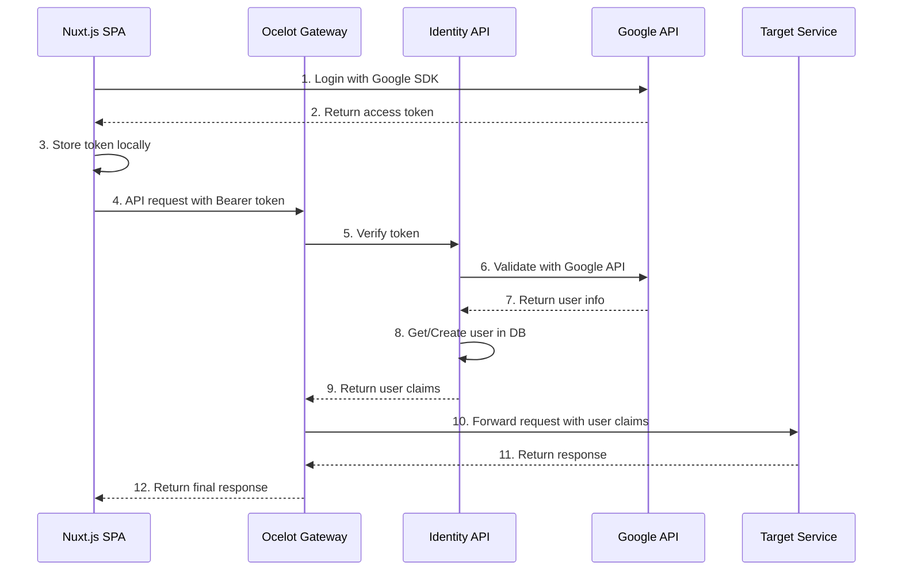
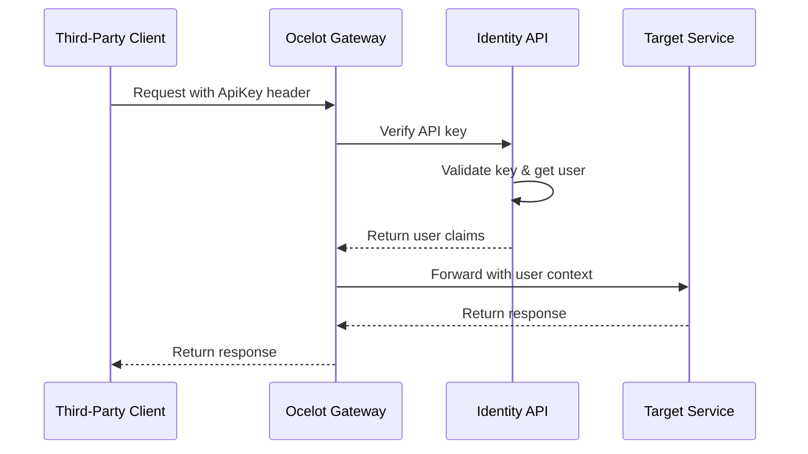

# Identity Service Design

## 1. Service Overview

Identity Service is the core bounded context of the TiHoMo system, responsible for authentication, authorization, and user management. This design focuses on social login integration (Google, Facebook, Apple) with stateless authentication patterns through the API Gateway.

The service has evolved through 4 main phases to become a production-ready service with advanced features:

- **Phase 1**: Basic Authentication & Token Verification  
- **Phase 2**: Refresh Token Management & Security Enhancement
- **Phase 3**: Resilience Patterns & Circuit Breaker Implementation
- **Phase 4**: Monitoring & Observability System

### 1.1 Primary Objectives
- Provide diverse authentication methods (Social Login, API Key)
- Simple user management and authorization
- Stateless authentication with high performance
- Seamless integration with API Gateway
- Ensure security and scalability

### 1.2 Problem Statement

Traditional SSO systems are often complex with:
- Multiple authentication flows (OpenId Connect, IdentityServer4, custom sessions)
- Complex database schema with unnecessary tables
- Complicated redirect flows between multiple services
- Difficult to maintain and debug

### 1.3 Proposed Solution

Simplified design using **stateless token verification** pattern through API Gateway, based on proven patterns from Microsoft eShop and ABP Framework.

## 2. Overall Architecture (Primary Approach)

### 2.1 High-Level Architecture

```
┌─────────────────┐    ┌──────────────────┐    ┌─────────────────┐    ┌──────────────────┐
│   Nuxt.js SPA   │    │ Ocelot Gateway   │    │ Identity API    │    │   Other APIs     │
│                 │    │                  │    │                 │    │ (CoreFinance,    │
│                 │    │                  │    │                 │    │  MoneyMgmt, etc) │
└─────────────────┘    └──────────────────┘    └─────────────────┘    └──────────────────┘
         │                        │                        │                        │
         │ 1. Login Social        │                        │                        │
         │    Get access_token    │                        │                        │
         │                        │                        │                        │
         │ 2. API calls with      │                        │                        │
         │    Authorization:      │                        │                        │
         │    Bearer {token}      │                        │                        │
         └────────────────────────┤                        │                        │
                                  │ 3. Forward to Identity │                        │
                                  │    for token verify    │                        │
                                  └────────────────────────┤                        │
                                                           │ 4. Verify token,       │
                                                           │    get/create user     │
                                                           │                        │
                                                           │ 5. Return user claims  │
                                                           ├────────────────────────┤
                                                           │ 6. Forward to target   │
                                                           │    service with claims │
                                                           └────────────────────────┘
```

### 2.2 Core Components

#### Frontend (Nuxt.js)
```javascript
// plugins/auth.client.js
export default defineNuxtPlugin(() => {
  const { $google, $facebook, $apple } = useNuxtApp()
  
  const login = async (provider) => {
    let result
    switch (provider) {
      case 'google':
        result = await $google.signIn()
        break
      case 'facebook':
        result = await $facebook.login()
        break
      case 'apple':
        result = await $apple.signIn()
        break
    }
    
    // Store access token for API calls
    const authStore = useAuthStore()
    authStore.setToken(result.access_token)
    
    return result
  }
  
  return {
    provide: {
      auth: { login }
    }
  }
})
```

#### API Gateway (Ocelot)
```csharp
// Program.cs
builder.Services.AddAuthentication("Bearer")
    .AddJwtBearer("Bearer", options =>
    {
        options.Authority = "http://localhost:5001"; // Identity API
        options.TokenValidationParameters = new TokenValidationParameters
        {
            ValidateAudience = false,
            ValidateIssuer = false,
            ValidateLifetime = true,
            ClockSkew = TimeSpan.Zero
        };
    });

// Custom middleware for token forwarding
builder.Services.AddHttpClient("identity-verify", client =>
{
    client.BaseAddress = new Uri("http://localhost:5001");
});
```

#### Identity API
```csharp
// Models/User.cs
public class User
{
    public Guid Id { get; set; }
    public string Email { get; set; }
    public string Name { get; set; }
    public string AvatarUrl { get; set; }
    public DateTime CreatedAt { get; set; }
    public DateTime UpdatedAt { get; set; }
    public bool IsActive { get; set; } = true;
    
    public List<UserLogin> Logins { get; set; } = new();
    public List<ApiKey> ApiKeys { get; set; } = new();
}

// Controllers/AuthController.cs
[ApiController]
[Route("api/auth")]
public class AuthController : ControllerBase
{
    private readonly TokenVerificationService _tokenVerificationService;
    
    [HttpPost("verify")]
    public async Task<TokenVerificationResult> VerifyToken([FromBody] VerifyTokenRequest request)
    {
        var result = await _tokenVerificationService.VerifyAsync(request.Token, request.Provider);
        return result;
    }
}
```

### 2.3 Database Schema

```sql
-- Users table
CREATE TABLE Users (
    Id uniqueidentifier PRIMARY KEY DEFAULT NEWID(),
    Email nvarchar(256) NOT NULL,
    Name nvarchar(256) NOT NULL,
    AvatarUrl nvarchar(512),
    CreatedAt datetime2 NOT NULL DEFAULT GETUTCDATE(),
    UpdatedAt datetime2 NOT NULL DEFAULT GETUTCDATE(),
    IsActive bit NOT NULL DEFAULT 1
);

-- User logins (external providers)
CREATE TABLE UserLogins (
    Id uniqueidentifier PRIMARY KEY DEFAULT NEWID(),
    UserId uniqueidentifier NOT NULL,
    Provider nvarchar(50) NOT NULL, -- Google, Facebook, Apple
    ProviderUserId nvarchar(256) NOT NULL,
    CreatedAt datetime2 NOT NULL DEFAULT GETUTCDATE(),
    
    FOREIGN KEY (UserId) REFERENCES Users(Id),
    UNIQUE(Provider, ProviderUserId)
);

-- API Keys for third-party integration
CREATE TABLE ApiKeys (
    Id uniqueidentifier PRIMARY KEY DEFAULT NEWID(),
    UserId uniqueidentifier NOT NULL,
    Name nvarchar(256) NOT NULL,
    HashedKey nvarchar(512) NOT NULL,
    KeyPrefix nvarchar(16) NOT NULL, -- First 8 chars for identification
    Scopes nvarchar(max), -- JSON array of scopes
    Status nvarchar(20) NOT NULL DEFAULT 'Active', -- Active, Revoked, Expired
    CreatedAt datetime2 NOT NULL DEFAULT GETUTCDATE(),
    ExpiresAt datetime2,
    LastUsedAt datetime2,
    UsageCount int NOT NULL DEFAULT 0,
    
    FOREIGN KEY (UserId) REFERENCES Users(Id)
);

-- Indexes
CREATE INDEX IX_Users_Email ON Users(Email);
CREATE INDEX IX_UserLogins_UserId ON UserLogins(UserId);
CREATE INDEX IX_UserLogins_Provider_ProviderUserId ON UserLogins(Provider, ProviderUserId);
CREATE INDEX IX_ApiKeys_UserId ON ApiKeys(UserId);
CREATE INDEX IX_ApiKeys_KeyPrefix ON ApiKeys(KeyPrefix);
```

### 2.4 API Endpoints

**Authentication:**
- `POST /api/auth/verify` - Token verification (internal)
- `POST /api/auth/login/google` - Google login
- `POST /api/auth/login/facebook` - Facebook login  
- `POST /api/auth/login/apple` - Apple login

**User Management:**
- `GET /api/users/me` - Get current user profile
- `GET /api/users/{id}` - Get user by ID
- `PUT /api/users/{id}` - Update user profile

**API Key Management:**
- `POST /api/apikeys` - Create API key
- `GET /api/apikeys` - List user's API keys
- `DELETE /api/apikeys/{id}` - Revoke API key

## 3. Request Flow Analysis

### 3.1 Overall System Flow



### 3.2 Detailed Flow Breakdown

#### Phase 1: User Authentication (Social Login)
```javascript
// Frontend (Nuxt.js)
const loginWithGoogle = async () => {
  // 1. Initiate Google OAuth flow
  const credential = await google.accounts.id.prompt()
  
  // 2. Store token for subsequent API calls
  const authStore = useAuthStore()
  authStore.setToken(credential)
  
  return credential
}
```

#### Phase 2: API Request Flow
```csharp
// Gateway - Authentication Middleware
public class BearerTokenAuthenticationHandler : AuthenticationHandler
{
    protected override async Task<AuthenticateResult> HandleAuthenticateAsync()
    {
        // Extract token from header
        var token = GetTokenFromHeader();
        
        // Verify with Identity service
        var verificationResult = await _identityClient.VerifyTokenAsync(token);
        
        if (verificationResult.IsValid)
        {
            var claims = CreateClaimsFromResult(verificationResult);
            var principal = new ClaimsPrincipal(new ClaimsIdentity(claims, "Bearer"));
            return AuthenticateResult.Success(new AuthenticationTicket(principal, "Bearer"));
        }
        
        return AuthenticateResult.Fail("Invalid token");
    }
}
```

#### Phase 3: Target Service Processing  
```csharp
// CoreFinance.Api - TransactionController
[HttpGet]
[Authorize] // Gateway has verified token and injected claims
public async Task<IActionResult> GetTransactions()
{
    // Gateway has injected user claims into headers:
    // X-User-Id: {userId}
    // X-User-Email: {email}
    var userId = HttpContext.Request.Headers["X-User-Id"];
    
    var transactions = await _transactionService.GetUserTransactionsAsync(userId);
    return Ok(transactions);
}
```

### 3.3 Alternative Flow: API Key Authentication



## 4. Key Advantages

### ✅ Stateless & Scalable
- No server-side sessions
- Gateway can scale horizontally
- Identity service only needs to verify tokens, no state maintenance

### ✅ Security
- Token verification with social provider on each request (or with short TTL caching)
- API keys hashed in database
- Claims injected securely through headers

### ✅ Performance
- Token verification can be cached (5 minute TTL)  
- Single hop to Identity service
- Target services don't need to call Identity service

### ✅ Simplicity
- Eliminates OAuth2/OIDC server complexity
- Straightforward social login flow
- Clear separation of concerns

## 5. Production-Ready Improvements ⚠️ **CRITICAL FIXES NEEDED**

### 5.1 Enhanced Token Verification Strategy 🔥 **HIGH PRIORITY**

**Issue**: Current design verifies Google token on every request - MAJOR performance and security risk.

**Root Cause**: 
```csharp
// ❌ PROBLEMATIC: Current implementation
var googleResponse = await _httpClient.GetAsync(
    $"https://oauth2.googleapis.com/tokeninfo?id_token={request.Token}");
// This calls Google API on EVERY request!
```

**Solution**: Multi-layer validation with local verification and intelligent caching.

```csharp
// ✅ PRODUCTION-READY: Enhanced Token Validation
public class EnhancedTokenVerificationService : ITokenVerificationService
{
    private readonly IMemoryCache _cache;
    private readonly IDistributedCache _distributedCache;
    private readonly HttpClient _httpClient;
    private readonly ILogger<EnhancedTokenVerificationService> _logger;
    
    public async Task<TokenVerificationResult> VerifyTokenAsync(string token, string provider)
    {
        var stopwatch = Stopwatch.StartNew();
        
        try
        {
            // Step 1: Parse JWT locally first (validation without API call)
            var jwt = ParseJwtToken(token);
            if (jwt == null || jwt.ValidTo < DateTime.UtcNow)
            {
                return TokenVerificationResult.Invalid("Token expired or malformed");
            }
            
            // Step 2: Check L1 cache (Memory) - 2 minute TTL
            var cacheKey = $"token_verify:{provider}:{ComputeHash(token)}";
            if (_cache.TryGetValue(cacheKey, out TokenVerificationResult cachedResult))
            {
                _logger.LogDebug("Token verification from L1 cache in {Duration}ms", stopwatch.ElapsedMilliseconds);
                return cachedResult;
            }
            
            // Step 3: Check L2 cache (Redis) - 5 minute TTL
            var distributedResult = await GetFromDistributedCache(cacheKey);
            if (distributedResult != null)
            {
                _cache.Set(cacheKey, distributedResult, TimeSpan.FromMinutes(2));
                _logger.LogDebug("Token verification from L2 cache in {Duration}ms", stopwatch.ElapsedMilliseconds);
                return distributedResult;
            }
            
            // Step 4: Only verify with Google when necessary
            var verificationResult = await VerifyWithGoogleApi(token);
            
            // Cache results if valid
            if (verificationResult.IsValid)
            {
                var cacheDuration = TimeSpan.FromMinutes(2);
                _cache.Set(cacheKey, verificationResult, cacheDuration);
                await _distributedCache.SetStringAsync(cacheKey, 
                    JsonSerializer.Serialize(verificationResult),
                    new DistributedCacheEntryOptions 
                    { 
                        AbsoluteExpirationRelativeToNow = TimeSpan.FromMinutes(5) 
                    });
            }
            
            _logger.LogInformation("Token verification completed in {Duration}ms, Valid: {IsValid}", 
                stopwatch.ElapsedMilliseconds, verificationResult.IsValid);
                
            return verificationResult;
        }
        catch (Exception ex)
        {
            _logger.LogError(ex, "Token verification failed in {Duration}ms", stopwatch.ElapsedMilliseconds);
            return TokenVerificationResult.Invalid("Verification failed");
        }
    }
    
    private JwtSecurityToken ParseJwtToken(string token)
    {
        try
        {
            var handler = new JwtSecurityTokenHandler();
            return handler.ReadJwtToken(token);
        }
        catch
        {
            return null;
        }
    }
    
    private string ComputeHash(string input)
    {
        using var sha256 = SHA256.Create();
        var hash = sha256.ComputeHash(Encoding.UTF8.GetBytes(input));
        return Convert.ToBase64String(hash);
    }
    
    private async Task<TokenVerificationResult> VerifyWithGoogleApi(string token)
    {
        var response = await _httpClient.GetAsync(
            $"https://oauth2.googleapis.com/tokeninfo?id_token={token}");
            
        if (response.IsSuccessStatusCode)
        {
            var content = await response.Content.ReadAsStringAsync();
            var tokenInfo = JsonSerializer.Deserialize<GoogleTokenInfo>(content);
            
            return new TokenVerificationResult
            {
                IsValid = true,
                UserId = tokenInfo.Sub,
                Email = tokenInfo.Email,
                Name = tokenInfo.Name,
                Provider = "Google",
                ExpiresAt = DateTimeOffset.FromUnixTimeSeconds(long.Parse(tokenInfo.Exp)).DateTime
            };
        }
        
        return TokenVerificationResult.Invalid("Google API validation failed");
    }
}

// Enhanced result model
public class TokenVerificationResult
{
    public bool IsValid { get; set; }
    public string UserId { get; set; }
    public string Email { get; set; }
    public string Name { get; set; }
    public string Provider { get; set; }
    public DateTime? ExpiresAt { get; set; }
    public string ErrorCode { get; set; }
    public string ErrorMessage { get; set; }
    
    public static TokenVerificationResult Invalid(string error) 
        => new() { IsValid = false, ErrorMessage = error };
}
```

### 5.2 Optimized User Management Service 🔥 **HIGH PRIORITY**

**Issue**: Database hit on every request to check/create user causes performance bottleneck.

**Solution**: Multi-level caching with upsert pattern instead of check-then-create.

```csharp
// ✅ PRODUCTION-READY: Cached User Service
public class CachedUserService : IUserService
{
    private readonly IMemoryCache _memoryCache;
    private readonly IDistributedCache _distributedCache;
    private readonly IUserRepository _userRepository;
    private readonly ILogger<CachedUserService> _logger;
    
    public async Task<User> GetOrCreateUserAsync(string email, string provider, string providerId)
    {
        // L1 Cache (Memory) - 5 minute TTL for active users
        var userCacheKey = $"user:{provider}:{providerId}";
        if (_memoryCache.TryGetValue(userCacheKey, out User cachedUser))
        {
            return cachedUser;
        }
        
        // L2 Cache (Redis) - 15 minute TTL
        var distributedUser = await GetUserFromDistributedCache(userCacheKey);
        if (distributedUser != null)
        {
            _memoryCache.Set(userCacheKey, distributedUser, TimeSpan.FromMinutes(5));
            return distributedUser;
        }
        
        // Database with UPSERT pattern (atomic operation)
        var user = await _userRepository.UpsertUserAsync(new UserUpsertRequest
        {
            Email = email,
            Provider = provider,
            ProviderId = providerId
        });
        
        // Cache in both layers
        _memoryCache.Set(userCacheKey, user, TimeSpan.FromMinutes(5));
        await CacheUserInDistributedCache(userCacheKey, user, TimeSpan.FromMinutes(15));
        
        _logger.LogInformation("User retrieved/created: {UserId}, Email: {Email}, Provider: {Provider}", 
            user.Id, user.Email, provider);
            
        return user;
    }
    
    private async Task<User> GetUserFromDistributedCache(string key)
    {
        var cachedData = await _distributedCache.GetStringAsync(key);
        if (!string.IsNullOrEmpty(cachedData))
        {
            return JsonSerializer.Deserialize<User>(cachedData);
        }
        return null;
    }
    
    private async Task CacheUserInDistributedCache(string key, User user, TimeSpan expiry)
    {
        await _distributedCache.SetStringAsync(key, 
            JsonSerializer.Serialize(user),
            new DistributedCacheEntryOptions
            {
                AbsoluteExpirationRelativeToNow = expiry
            });
    }
}

// Database Repository with UPSERT
public class UserRepository : IUserRepository
{
    private readonly IdentityDbContext _context;
    
    public async Task<User> UpsertUserAsync(UserUpsertRequest request)
    {
        // Try to find existing user first
        var existingUser = await _context.Users
            .Include(u => u.Logins)
            .FirstOrDefaultAsync(u => u.Logins.Any(l => l.Provider == request.Provider && l.ProviderUserId == request.ProviderId));
            
        if (existingUser != null)
        {
            // Update existing user if needed
            existingUser.Email = request.Email;
            existingUser.UpdatedAt = DateTime.UtcNow;
            await _context.SaveChangesAsync();
            return existingUser;
        }
        
        // Create new user with atomic transaction
        var newUser = new User
        {
            Id = Guid.NewGuid(),
            Email = request.Email,
            Name = request.Email.Split('@')[0], // Default name from email
            CreatedAt = DateTime.UtcNow,
            UpdatedAt = DateTime.UtcNow,
            IsActive = true,
            Logins = new List<UserLogin>
            {
                new UserLogin
                {
                    Provider = request.Provider,
                    ProviderUserId = request.ProviderId,
                    CreatedAt = DateTime.UtcNow
                }
            }
        };
        
        _context.Users.Add(newUser);
        await _context.SaveChangesAsync();
        
        return newUser;
    }
}
```

### 5.3 Refresh Token Management 🔥 **MEDIUM PRIORITY**

**Issue**: Google ID tokens expire in 1 hour, causing users to logout frequently.

**Solution**: Implement automatic token refresh with secure storage and proactive refresh.

```csharp
// ✅ FRONTEND: Auto-refresh token logic
// composables/useAutoRefresh.ts
export const useAutoRefresh = () => {
  const authStore = useAuthStore()
  const refreshInterval = ref<NodeJS.Timeout>()
  
  const startAutoRefresh = () => {
    // Check token expiry every 5 minutes
    refreshInterval.value = setInterval(async () => {
      const token = authStore.token
      if (!token) return
      
      const tokenInfo = parseJWT(token)
      const expiresAt = new Date(tokenInfo.exp * 1000)
      const now = new Date()
      const timeUntilExpiry = expiresAt.getTime() - now.getTime()
      
      // Refresh if token expires in less than 10 minutes
      if (timeUntilExpiry < 10 * 60 * 1000) {
        await refreshTokenIfNeeded()
      }
    }, 5 * 60 * 1000) // Check every 5 minutes
  }
  
  const refreshTokenIfNeeded = async () => {
    try {
      // Use Google's token refresh API
      const result = await $fetch('/api/auth/refresh', {
        method: 'POST',
        headers: {
          'Authorization': `Bearer ${authStore.token}`
        }
      })
      
      if (result.success && result.token) {
        authStore.setToken(result.token)
        console.log('Token refreshed successfully')
      }
    } catch (error) {
      console.error('Token refresh failed:', error)
      // Redirect to login if refresh fails
      await navigateTo('/auth/login')
    }
  }
  
  const stopAutoRefresh = () => {
    if (refreshInterval.value) {
      clearInterval(refreshInterval.value)
    }
  }
  
  return {
    startAutoRefresh,
    stopAutoRefresh,
    refreshTokenIfNeeded
  }
}

// ✅ BACKEND: Refresh token endpoint
[HttpPost("refresh")]
public async Task<ActionResult<RefreshTokenResponse>> RefreshToken()
{
    try
    {
        var currentToken = GetTokenFromHeader();
        var jwt = new JwtSecurityTokenHandler().ReadJwtToken(currentToken);
        
        // Extract user info from current token
        var userId = jwt.Claims.FirstOrDefault(c => c.Type == "sub")?.Value;
        var email = jwt.Claims.FirstOrDefault(c => c.Type == "email")?.Value;
        
        if (string.IsNullOrEmpty(userId) || string.IsNullOrEmpty(email))
        {
            return BadRequest("Invalid token structure");
        }
        
        // Generate new token with fresh expiry
        var newToken = await _tokenService.GenerateTokenAsync(userId, email);
        
        return Ok(new RefreshTokenResponse
        {
            Success = true,
            Token = newToken,
            ExpiresAt = DateTime.UtcNow.AddHours(1)
        });
    }
    catch (Exception ex)
    {
        _logger.LogError(ex, "Token refresh failed");
        return StatusCode(500, new RefreshTokenResponse
        {
            Success = false,
            Error = "Token refresh failed"
        });
    }
}
```

### 5.4 Circuit Breaker & Resilience Patterns 🔥 **MEDIUM PRIORITY**

**Issue**: Single point of failure - if Identity service is down, entire system fails.

**Solution**: Implement circuit breaker with fallback mechanisms and graceful degradation.

```csharp
// ✅ PRODUCTION-READY: Resilient Authentication Service
public class ResilientAuthenticationService : IAuthenticationService
{
    private readonly ICircuitBreaker _identityCircuitBreaker;
    private readonly ITokenVerificationService _primaryService;
    private readonly ILocalJwtValidator _fallbackValidator;
    private readonly ILogger<ResilientAuthenticationService> _logger;
    
    public async Task<AuthenticationResult> AuthenticateAsync(string token)
    {
        try
        {
            // Try primary Identity service with circuit breaker protection
            return await _identityCircuitBreaker.ExecuteAsync(async () =>
            {
                var result = await _primaryService.VerifyTokenAsync(token, "Google");
                
                if (!result.IsValid)
                {
                    throw new AuthenticationException("Token validation failed");
                }
                
                return new AuthenticationResult
                {
                    IsSuccess = true,
                    UserId = result.UserId,
                    Email = result.Email,
                    Claims = CreateClaims(result)
                };
            });
        }
        catch (CircuitBreakerOpenException)
        {
            // Circuit breaker is open - use fallback local validation
            _logger.LogWarning("Identity service circuit breaker OPEN - using fallback validation");
            return await FallbackAuthentication(token);
        }
        catch (Exception ex)
        {
            _logger.LogError(ex, "Primary authentication failed - attempting fallback");
            return await FallbackAuthentication(token);
        }
    }
    
    private async Task<AuthenticationResult> FallbackAuthentication(string token)
    {
        try
        {
            // Fallback 1: Local JWT validation (if we have local tokens)
            var localResult = await _fallbackValidator.ValidateLocalJwtAsync(token);
            if (localResult.IsValid)
            {
                _logger.LogInformation("Fallback authentication successful via local JWT");
                return new AuthenticationResult
                {
                    IsSuccess = true,
                    UserId = localResult.UserId,
                    Email = localResult.Email,
                    Claims = CreateClaims(localResult),
                    IsFallback = true
                };
            }
            
            // Fallback 2: Cached validation result
            var cachedResult = await GetCachedAuthenticationResult(token);
            if (cachedResult != null)
            {
                _logger.LogInformation("Fallback authentication successful via cache");
                return cachedResult;
            }
            
            // All fallbacks failed
            _logger.LogError("All authentication methods failed");
            return AuthenticationResult.Failed("Authentication service unavailable");
        }
        catch (Exception ex)
        {
            _logger.LogError(ex, "Fallback authentication failed");
            return AuthenticationResult.Failed("Authentication failed");
        }
    }
}
```

## 6. Monitoring & Observability

### 6.1 Key Metrics

**Performance Metrics:**
- Token verification duration
- Cache hit rates (L1/L2)
- Database query times
- External API response times

**Business Metrics:**
- User login success rates
- Token refresh rates
- Authentication failure patterns
- API key usage statistics

**Health Metrics:**
- Circuit breaker states
- Service availability
- Database connection health
- External provider connectivity

### 6.2 Health Check Implementation

```csharp
public class IdentityHealthCheck : IHealthCheck
{
    private readonly IdentityDbContext _context;
    private readonly ICircuitBreaker _circuitBreaker;
    
    public async Task<HealthCheckResult> CheckHealthAsync(HealthCheckContext context, CancellationToken cancellationToken = default)
    {
        try
        {
            // Check database connectivity
            await _context.Users.CountAsync(cancellationToken);
            
            // Check circuit breaker state
            var circuitBreakerState = _circuitBreaker.State;
            
            var data = new Dictionary<string, object>
            {
                ["database"] = "healthy",
                ["circuit_breaker_state"] = circuitBreakerState.ToString(),
                ["timestamp"] = DateTime.UtcNow
            };
            
            return HealthCheckResult.Healthy("Identity service is healthy", data);
        }
        catch (Exception ex)
        {
            return HealthCheckResult.Unhealthy("Identity service is unhealthy", ex);
        }
    }
}
```

## 7. Security Considerations

### 7.1 Token Security

- **JWT Validation**: Local parsing before external API calls
- **Secure Caching**: Hashed cache keys to prevent token exposure
- **Short TTL**: Cache expires quickly to limit exposure window
- **Rate Limiting**: Prevent brute force attacks on token verification

### 7.2 API Key Security

- **Hashed Storage**: API keys stored as hashes, never plain text
- **Prefix Identification**: First 8 characters for safe identification
- **Usage Tracking**: Monitor for unusual usage patterns
- **Scope Limitation**: Granular permissions per API key

### 7.3 Privacy Protection

- **PII Minimization**: Only store necessary user information
- **Data Encryption**: Sensitive data encrypted at rest
- **Audit Logging**: Track all authentication events
- **GDPR Compliance**: User data deletion and export capabilities

## 8. Production Readiness Checklist 🎯

### Phase 1: Critical Performance Fixes (Week 1) 🔥
- [ ] **Enhanced Token Verification Service**
  - [ ] Implement JWT local parsing for structure validation
  - [ ] Add L1 (Memory) cache with 2-minute TTL
  - [ ] Add L2 (Redis) cache with 5-minute TTL  
  - [ ] Hash tokens for secure cache keys
  - [ ] Only call Google API on cache miss

- [ ] **Optimized User Service**
  - [ ] Implement multi-level user caching (5min/15min TTL)
  - [ ] Replace check-then-create with atomic upsert pattern
  - [ ] Add proper database indexing on Provider + ProviderUserId
  - [ ] Implement cache invalidation strategies

### Phase 2: User Experience (Week 2) 🔥
- [ ] **Refresh Token Flow**
  - [ ] Frontend auto-refresh logic (check every 5 minutes)
  - [ ] Proactive refresh when token expires in <10 minutes
  - [ ] Backend refresh endpoint with new JWT generation
  - [ ] Graceful handling of refresh failures → redirect to login

### Phase 3: Resilience & Reliability (Week 3) 🔥
- [ ] **Circuit Breaker Implementation**
  - [ ] Circuit breaker for Google API calls (5 failures → 30s open)
  - [ ] Fallback to local JWT validation when available
  - [ ] Fallback to cached authentication results
  - [ ] Graceful degradation with clear error messages

- [ ] **Error Handling & Rate Limiting**
  - [ ] Implement rate limiting per user/IP (100 requests/minute)
  - [ ] Add retry policies with exponential backoff
  - [ ] Proper error codes and user-friendly messages
  - [ ] Session invalidation on security events

### Phase 4: Monitoring & Operations (Week 4) 📊
- [ ] **Comprehensive Monitoring**
  - [ ] Token verification metrics (success rate, duration, cache hit rate)
  - [ ] Database operation metrics (query time, cache hit rate)  
  - [ ] Circuit breaker state monitoring
  - [ ] Social provider API health checks

- [ ] **Observability & Alerting**
  - [ ] Structured logging with correlation IDs
  - [ ] Health check endpoints for all dependencies
  - [ ] Alerts for high error rates (>5%), slow responses (>2s)
  - [ ] Dashboard for authentication metrics

### Phase 5: Security Hardening (Week 5) 🔒
- [ ] **Enhanced Security**
  - [ ] API key rate limiting and usage quotas
  - [ ] CORS policies for production domains
  - [ ] Input validation and sanitization
  - [ ] Secure token storage (HttpOnly cookies for web)
  - [ ] Regular security audits and penetration testing

---

*This design consolidates the complete Identity service architecture with production-ready improvements, performance optimizations, and comprehensive monitoring capabilities for the TiHoMo financial management system.*
