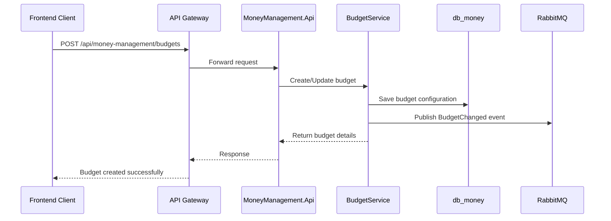
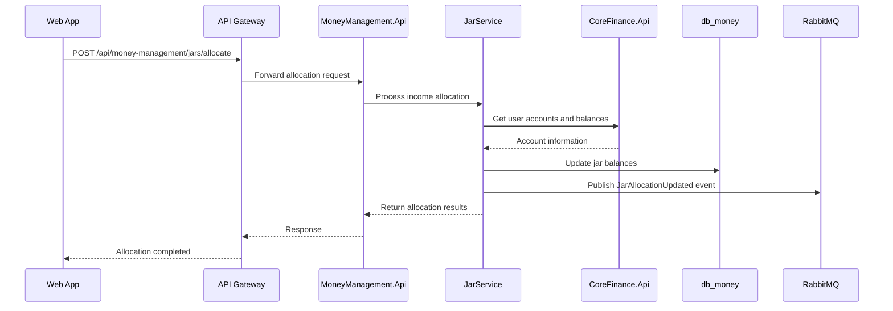
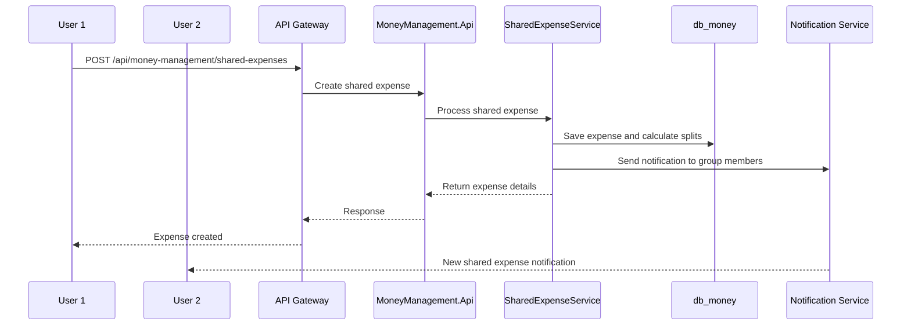

# MoneyManagement Service Architecture

## 1. Overview

MoneyManagement is a critical bounded context within the TiHoMo system, responsible for budget management, SixJars money allocation methodology, and shared expense management. This domain helps users control personal finances through effective planning and expense tracking tools.

### Primary Objectives
- Budget management by spending categories (BudgetService)
- Money allocation using SixJars methodology (JarService)
- Shared expense group management (SharedExpenseService)
- Budget overrun monitoring and alerts
- Integration with CoreFinance for transaction and balance synchronization

---

## 2. Service Architecture

### 2.1 Microservice Structure

- **MoneyManagement.Api**: REST API for budget, jars, and shared expense CRUD operations
- **MoneyManagement.Application**: Business logic, budget calculations, jar allocation algorithms
- **MoneyManagement.Domain**: Domain models, aggregates, business rules for budget management
- **MoneyManagement.Infrastructure**: Data access (EF Core/PostgreSQL), event publishing
- **MoneyManagement.Contracts**: DTOs, contracts for event/message bus communication

### 2.2 Database Design

- **db_money** (PostgreSQL): Stores budgets, jars, shared expenses, allocations
- EF Core for data access with migration-managed schema
- Optimized indexes for budget tracking and jar calculations
- Snake_case naming convention for database objects

### 2.3 Event-Driven Communication

- **RabbitMQ**: Publishes events such as BudgetChanged, JarUpdated, SharedExpenseCreated
- Consumes events from CoreFinance (TransactionCreated) to update budget tracking
- Notifies Reporting service for financial report generation
- MassTransit framework for message handling

### 2.4 Core Services Integration

- **CoreFinance Integration**: Synchronizes transaction data for budget spending tracking
- **Identity Integration**: User context and authorization management
- **Notification Integration**: Alerts when budget limits are exceeded

---

## 3. Service Components Detail

### 3.1 BudgetService

**Primary Responsibilities:**
- Create and manage budget categories (Food, Transport, Entertainment, etc.)
- Track spending against budget allocations
- Generate alerts when budget limits are exceeded
- Analyze spending trends and patterns

**Process Flow:**


### 3.2 JarService (SixJars Methodology)

**SixJars Money Management System:**
- **Necessities (55%)**: Rent, utilities, groceries, essential expenses
- **Education (10%)**: Books, courses, skill development, learning
- **Long-term Savings (10%)**: Emergency fund, retirement, future planning
- **Entertainment (10%)**: Movies, dining out, hobbies, recreation
- **Financial Freedom (10%)**: Investments, passive income, wealth building
- **Give (5%)**: Charity, gifts, donations, giving back

**Primary Responsibilities:**
- Allocate income according to SixJars percentages
- Track balance for each jar category
- Automatic allocation when new income is received
- Adjust allocation ratios based on personal preferences

**Process Flow:**


### 3.3 SharedExpenseService

**Primary Responsibilities:**
- Create and manage expense sharing groups
- Track shared expenses and individual contributions
- Calculate debt settlements between group members
- Generate expense reports and summaries

**Process Flow:**


---

## 4. Domain Models

### 4.1 Budget Management Entities

**Budget Entity:**
```csharp
public class Budget : BaseEntity
{
    public string UserId { get; set; }
    public string CategoryId { get; set; }
    public string Name { get; set; }
    public decimal AllocatedAmount { get; set; }
    public decimal SpentAmount { get; set; }
    public BudgetPeriod Period { get; set; } // Monthly, Quarterly, Yearly
    public DateTime StartDate { get; set; }
    public DateTime EndDate { get; set; }
    public bool IsActive { get; set; }
    public List<BudgetTransaction> Transactions { get; set; }
}
```

**BudgetCategory Entity:**
```csharp
public class BudgetCategory : BaseEntity
{
    public string Name { get; set; }
    public string Description { get; set; }
    public string IconName { get; set; }
    public string ColorCode { get; set; }
    public bool IsSystemCategory { get; set; }
    public string UserId { get; set; } // Null for system categories
}
```

### 4.2 SixJars Entities

**Jar Entity:**
```csharp
public class Jar : BaseEntity
{
    public string UserId { get; set; }
    public JarType Type { get; set; } // Necessities, Education, LongTermSavings, etc.
    public decimal AllocationPercentage { get; set; }
    public decimal CurrentBalance { get; set; }
    public decimal TotalAllocated { get; set; }
    public decimal TotalSpent { get; set; }
    public bool IsActive { get; set; }
    public List<JarTransaction> Transactions { get; set; }
}

public enum JarType
{
    Necessities = 1,
    Education = 2,
    LongTermSavings = 3,
    Entertainment = 4,
    FinancialFreedom = 5,
    Give = 6
}
```

### 4.3 SharedExpense Entities

**SharedExpenseGroup Entity:**
```csharp
public class SharedExpenseGroup : BaseEntity
{
    public string Name { get; set; }
    public string Description { get; set; }
    public string CreatedByUserId { get; set; }
    public List<GroupMember> Members { get; set; }
    public List<SharedExpense> Expenses { get; set; }
    public bool IsActive { get; set; }
}

public class SharedExpense : BaseEntity
{
    public string GroupId { get; set; }
    public string PaidByUserId { get; set; }
    public string Description { get; set; }
    public decimal TotalAmount { get; set; }
    public DateTime ExpenseDate { get; set; }
    public List<ExpenseSplit> Splits { get; set; }
    public SharedExpenseGroup Group { get; set; }
}
```

---

## 5. API Endpoints

### 5.1 Budget Management

| Method | Endpoint | Description |
|--------|----------|-------------|
| GET | `/api/money-management/budgets` | Get user budgets with filters |
| POST | `/api/money-management/budgets` | Create new budget |
| GET | `/api/money-management/budgets/{id}` | Get budget details |
| PUT | `/api/money-management/budgets/{id}` | Update budget |
| DELETE | `/api/money-management/budgets/{id}` | Delete budget |
| GET | `/api/money-management/budgets/{id}/spending` | Get budget spending analysis |

### 5.2 SixJars Management

| Method | Endpoint | Description |
|--------|----------|-------------|
| GET | `/api/money-management/jars` | Get user jars configuration |
| POST | `/api/money-management/jars/allocate` | Allocate income to jars |
| PUT | `/api/money-management/jars/{type}/percentage` | Update jar allocation percentage |
| POST | `/api/money-management/jars/{type}/spend` | Record spending from jar |
| GET | `/api/money-management/jars/{type}/transactions` | Get jar transaction history |

### 5.3 Shared Expenses

| Method | Endpoint | Description |
|--------|----------|-------------|
| GET | `/api/money-management/shared-groups` | Get user's shared expense groups |
| POST | `/api/money-management/shared-groups` | Create new shared group |
| POST | `/api/money-management/shared-groups/{id}/members` | Add member to group |
| POST | `/api/money-management/shared-groups/{id}/expenses` | Add shared expense |
| GET | `/api/money-management/shared-groups/{id}/settlements` | Get debt settlements |

---

## 6. Event Contracts

### 6.1 Published Events

**BudgetCreated Event:**
```csharp
public class BudgetCreated
{
    public string BudgetId { get; set; }
    public string UserId { get; set; }
    public string CategoryId { get; set; }
    public decimal AllocatedAmount { get; set; }
    public BudgetPeriod Period { get; set; }
    public DateTime StartDate { get; set; }
    public DateTime EndDate { get; set; }
    public DateTime CreatedAt { get; set; }
}
```

**JarAllocationUpdated Event:**
```csharp
public class JarAllocationUpdated
{
    public string UserId { get; set; }
    public decimal TotalIncomeAllocated { get; set; }
    public List<JarAllocation> Allocations { get; set; }
    public DateTime AllocatedAt { get; set; }
}

public class JarAllocation
{
    public JarType JarType { get; set; }
    public decimal Amount { get; set; }
    public decimal NewBalance { get; set; }
}
```

### 6.2 Consumed Events

**TransactionCreated (from CoreFinance):**
```csharp
public class TransactionCreated
{
    public string TransactionId { get; set; }
    public string UserId { get; set; }
    public decimal Amount { get; set; }
    public TransactionType Type { get; set; }
    public string CategoryId { get; set; }
    public DateTime TransactionDate { get; set; }
}
```

---

## 7. Business Logic & Algorithms

### 7.1 Budget Tracking Algorithm

```csharp
public class BudgetTrackingService
{
    public async Task<BudgetStatus> UpdateBudgetSpending(string budgetId, decimal amount)
    {
        var budget = await _repository.GetBudgetAsync(budgetId);
        budget.SpentAmount += amount;
        
        var spendingPercentage = (budget.SpentAmount / budget.AllocatedAmount) * 100;
        
        if (spendingPercentage >= 100)
        {
            await _notificationService.SendBudgetExceededAlert(budget);
            return BudgetStatus.Exceeded;
        }
        else if (spendingPercentage >= 80)
        {
            await _notificationService.SendBudgetWarningAlert(budget);
            return BudgetStatus.Warning;
        }
        
        await _repository.UpdateBudgetAsync(budget);
        return BudgetStatus.OnTrack;
    }
}
```

### 7.2 SixJars Allocation Algorithm

```csharp
public class JarAllocationService
{
    private readonly Dictionary<JarType, decimal> _defaultPercentages = new()
    {
        { JarType.Necessities, 0.55m },
        { JarType.Education, 0.10m },
        { JarType.LongTermSavings, 0.10m },
        { JarType.Entertainment, 0.10m },
        { JarType.FinancialFreedom, 0.10m },
        { JarType.Give, 0.05m }
    };

    public async Task<List<JarAllocation>> AllocateIncome(string userId, decimal incomeAmount)
    {
        var userJars = await _repository.GetUserJarsAsync(userId);
        var allocations = new List<JarAllocation>();

        foreach (var jar in userJars)
        {
            var allocationAmount = incomeAmount * jar.AllocationPercentage;
            jar.CurrentBalance += allocationAmount;
            jar.TotalAllocated += allocationAmount;

            allocations.Add(new JarAllocation
            {
                JarType = jar.Type,
                Amount = allocationAmount,
                NewBalance = jar.CurrentBalance
            });
        }

        await _repository.UpdateJarsAsync(userJars);
        return allocations;
    }
}
```

---

## 8. Technology Stack

### 8.1 Backend Technologies
- **.NET 9**: Core framework
- **ASP.NET Core**: Web API framework
- **Entity Framework Core**: ORM with PostgreSQL provider
- **MassTransit**: Message bus integration
- **AutoMapper**: Object mapping
- **FluentValidation**: Input validation

### 8.2 Infrastructure
- **PostgreSQL**: Primary database
- **RabbitMQ**: Message broker
- **Redis**: Distributed caching
- **Docker**: Containerization

### 8.3 Testing
- **xUnit**: Unit testing framework
- **FluentAssertions**: Assertion library
- **Testcontainers**: Integration testing
- **Bogus**: Test data generation

---

## 9. Security & Validation

### 9.1 Authentication & Authorization
- JWT token validation
- User context extraction
- Resource ownership validation
- Group membership validation for shared expenses

### 9.2 Input Validation
- FluentValidation rules
- Business rule validation
- Budget limit validation
- Jar allocation percentage validation (must sum to 100%)

---

## 10. Performance Considerations

### 10.1 Database Optimization
- Proper indexing for budget queries
- Materialized views for spending summaries
- Connection pooling
- Query optimization for jar calculations

### 10.2 Caching Strategy
- Redis caching for frequently accessed budget data
- In-memory caching for jar percentages
- Cache invalidation on budget updates

---

## 11. Monitoring & Logging

### 11.1 Structured Logging
- Correlation ID tracking
- Budget calculation logging
- Performance metrics for jar allocations
- Error tracking with stack traces

### 11.2 Health Checks
- Database connectivity
- Message bus connectivity
- Cache accessibility
- External service dependencies

---

## 12. Testing Strategy

### 12.1 Unit Testing
- Budget calculation logic testing
- Jar allocation algorithm testing
- Shared expense split calculation testing
- Domain model validation testing

### 12.2 Integration Testing
- API endpoint testing
- Database integration testing
- Message bus integration testing
- Event handling testing

---

This document serves as the comprehensive architectural guide for the MoneyManagement service and should be updated as the system evolves.
