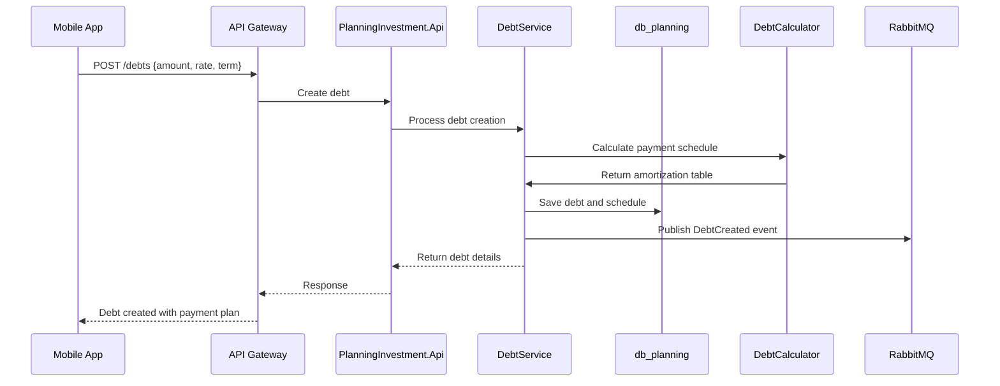
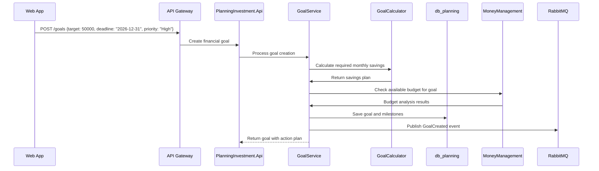
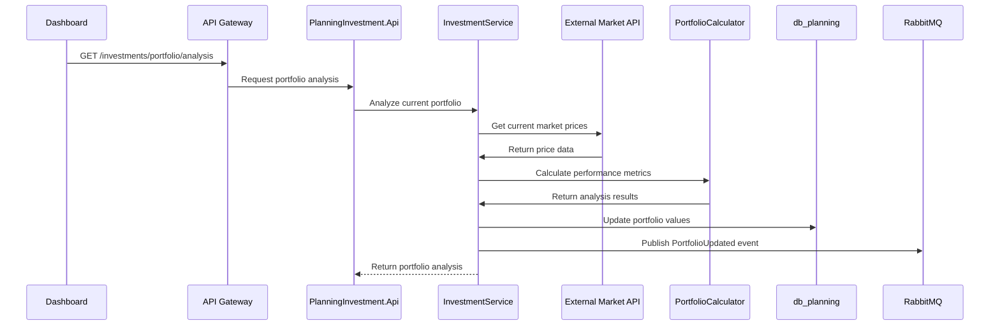

# PlanningInvestment Service Design

## 1. Service Overview

PlanningInvestment is a strategically important bounded context in the TiHoMo system, responsible for managing long-term personal finance aspects. This domain helps users create financial plans, manage debt, and investments to achieve personal financial goals.

### Primary Objectives
- Debt management and payoff planning (DebtService)
- Long-term financial goal management (GoalService)
- Investment management and tracking (InvestmentService)
- Financial analysis and forecasting
- Integration with other domains to provide comprehensive insights

---

## 2. Architecture Overview

### 2.1 Microservice Structure

- **PlanningInvestment.Api**: REST API for CRUD operations on debt, goals, investments
- **PlanningInvestment.Application**: Business logic, financial calculations, planning algorithms
- **PlanningInvestment.Domain**: Domain models, aggregates, financial business rules
- **PlanningInvestment.Infrastructure**: Data access (EF Core/PostgreSQL), event publishing, external API integration
- **PlanningInvestment.Contracts**: DTOs, contracts for event/message bus

### 2.2 Database

- **db_planning** (PostgreSQL): Stores debts, goals, investments, plans, projections
- Uses EF Core with migration-managed schema
- Optimized for complex financial calculations and historical data

### 2.3 Event-Driven Communication

- **RabbitMQ**: Publishes events like DebtUpdated, GoalAchieved, InvestmentPerformanceUpdated
- Consumes events from CoreFinance (transactions) and MoneyManagement (budget, jars)
- Notifies Reporting service to generate financial planning reports

### 2.4 External Integrations

- **Investment APIs**: Real-time stock prices, fund performance data
- **Interest Rate APIs**: Current market rates for debt calculations
- **Economic Data APIs**: Market trends for investment recommendations

---

## 3. Service Layer Architecture

### 3.1 DebtService

**Primary Responsibilities:**
- Manage debt accounts (credit cards, loans, mortgages)
- Calculate payment schedules and interest
- Debt payoff strategies (snowball, avalanche)
- Track progress and early payoff scenarios

**Process Flow:**


**Key Algorithms:**
- **Amortization Calculation**: Monthly payment, principal/interest breakdown
- **Payoff Strategies**: Snowball (smallest balance first) vs Avalanche (highest rate first)
- **Early Payoff Analysis**: Impact of extra payments
- **Debt Consolidation**: Analysis of consolidation benefits

### 3.2 GoalService

**Primary Responsibilities:**
- Manage financial goals (emergency fund, house down payment, retirement)
- Calculate timeline and required savings rate
- Progress tracking and milestone alerts
- Goal prioritization and trade-off analysis

**Process Flow:**


**Key Calculations:**
- **Future Value**: Goal amount with inflation adjustment
- **Required Savings**: Monthly amount needed to reach goal
- **Timeline Analysis**: Realistic deadline based on available funds
- **Compound Growth**: Investment growth projections

### 3.3 InvestmentService

**Primary Responsibilities:**
- Portfolio management and asset allocation
- Performance tracking and analysis
- Risk assessment and diversification recommendations
- Tax-advantaged account optimization (401k, IRA, etc.)

**Process Flow:**


**Investment Features:**
- **Asset Allocation**: Stocks, bonds, real estate, commodities
- **Performance Metrics**: ROI, Sharpe ratio, alpha, beta
- **Risk Analysis**: Portfolio volatility, VaR (Value at Risk)
- **Rebalancing**: Automated suggestions to maintain target allocation

---

## 4. Domain Models & Aggregates

### 4.1 Debt Aggregate

```csharp
public class Debt : AggregateRoot
{
    public int Id { get; private set; }
    public int UserId { get; private set; }
    public string Name { get; private set; } // "Credit Card", "Student Loan"
    public decimal PrincipalAmount { get; private set; }
    public decimal CurrentBalance { get; private set; }
    public decimal InterestRate { get; private set; } // Annual percentage
    public int TermInMonths { get; private set; }
    public decimal MinimumPayment { get; private set; }
    public DateTime StartDate { get; private set; }
    public DebtType Type { get; private set; }
    public DebtStatus Status { get; private set; }
    public List<Payment> PaymentHistory { get; private set; }
    public PaymentSchedule Schedule { get; private set; }
    
    // Business methods
    public void MakePayment(decimal amount, DateTime paymentDate) { }
    public PayoffProjection CalculatePayoffWithExtraPayment(decimal extraAmount) { }
    public decimal GetRemainingInterest() { }
    public int GetRemainingPayments() { }
    public PayoffProjection GetPayoffProjection() { }
}

public enum DebtType
{
    CreditCard,
    StudentLoan,
    Mortgage,
    PersonalLoan,
    AutoLoan,
    Other
}

public class PaymentSchedule : ValueObject
{
    public List<ScheduledPayment> Payments { get; private set; }
    public decimal TotalInterest => Payments.Sum(p => p.InterestAmount);
    public DateTime PayoffDate => Payments.Last().PaymentDate;
}
```

### 4.2 FinancialGoal Aggregate

```csharp
public class FinancialGoal : AggregateRoot
{
    public int Id { get; private set; }
    public int UserId { get; private set; }
    public string Name { get; private set; }
    public string Description { get; private set; }
    public decimal TargetAmount { get; private set; }
    public decimal CurrentAmount { get; private set; }
    public DateTime TargetDate { get; private set; }
    public GoalPriority Priority { get; private set; }
    public GoalCategory Category { get; private set; }
    public GoalStatus Status { get; private set; }
    public List<GoalMilestone> Milestones { get; private set; }
    public SavingsPlan SavingsPlan { get; private set; }
    
    // Business methods
    public void UpdateProgress(decimal contributionAmount) { }
    public decimal GetCompletionPercentage() => CurrentAmount / TargetAmount * 100;
    public TimeSpan GetRemainingTime() => TargetDate - DateTime.Now;
    public decimal GetRequiredMonthlySavings() { }
    public bool IsOnTrack() { }
    public void AdjustTargetDate(DateTime newDate) { }
}

public enum GoalCategory
{
    EmergencyFund,
    Retirement,
    HomeDownPayment,
    Vacation,
    Education,
    Car,
    Investment,
    Other
}

public class SavingsPlan : ValueObject
{
    public decimal MonthlyContribution { get; private set; }
    public decimal RequiredMonthlyAmount { get; private set; }
    public bool IsRealistic => MonthlyContribution >= RequiredMonthlyAmount;
    public DateTime ProjectedCompletionDate { get; private set; }
}
```

### 4.3 Investment Portfolio Aggregate

```csharp
public class InvestmentPortfolio : AggregateRoot
{
    public int Id { get; private set; }
    public int UserId { get; private set; }
    public string Name { get; private set; }
    public List<InvestmentHolding> Holdings { get; private set; }
    public PortfolioAllocation TargetAllocation { get; private set; }
    public PortfolioAllocation CurrentAllocation { get; private set; }
    public List<Transaction> TransactionHistory { get; private set; }
    public PerformanceMetrics Performance { get; private set; }
    
    // Business methods
    public void AddHolding(InvestmentHolding holding) { }
    public void UpdateMarketValues(Dictionary<string, decimal> prices) { }
    public decimal GetTotalValue() => Holdings.Sum(h => h.MarketValue);
    public PortfolioRebalanceRecommendation GetRebalanceRecommendation() { }
    public PerformanceAnalysis AnalyzePerformance(DateTime fromDate) { }
    public RiskMetrics CalculateRiskMetrics() { }
}

public class InvestmentHolding : Entity
{
    public string Symbol { get; private set; }
    public string Name { get; private set; }
    public AssetClass AssetClass { get; private set; }
    public decimal Shares { get; private set; }
    public decimal CostBasis { get; private set; }
    public decimal CurrentPrice { get; private set; }
    public decimal MarketValue => Shares * CurrentPrice;
    public decimal UnrealizedGainLoss => MarketValue - CostBasis;
    public decimal PercentageReturn => (UnrealizedGainLoss / CostBasis) * 100;
}

public enum AssetClass
{
    DomesticStocks,
    InternationalStocks,
    Bonds,
    RealEstate,
    Commodities,
    Cash,
    Cryptocurrency
}
```

---

## 5. Financial Calculation Engines

### 5.1 Debt Calculator Service

```csharp
public class DebtCalculatorService
{
    public PaymentSchedule CalculateAmortizationSchedule(
        decimal principal, 
        decimal annualRate, 
        int termInMonths)
    {
        var monthlyRate = annualRate / 12 / 100;
        var monthlyPayment = CalculateMonthlyPayment(principal, monthlyRate, termInMonths);
        var schedule = new List<ScheduledPayment>();
        var remainingBalance = principal;
        
        for (int month = 1; month <= termInMonths; month++)
        {
            var interestPayment = remainingBalance * monthlyRate;
            var principalPayment = monthlyPayment - interestPayment;
            remainingBalance -= principalPayment;
            
            schedule.Add(new ScheduledPayment
            {
                PaymentNumber = month,
                PaymentDate = DateTime.Now.AddMonths(month),
                PaymentAmount = monthlyPayment,
                PrincipalAmount = principalPayment,
                InterestAmount = interestPayment,
                RemainingBalance = Math.Max(0, remainingBalance)
            });
        }
        
        return new PaymentSchedule(schedule);
    }
    
    public PayoffComparison ComparePayoffStrategies(List<Debt> debts)
    {
        var snowballStrategy = CalculateSnowballStrategy(debts);
        var avalancheStrategy = CalculateAvalancheStrategy(debts);
        
        return new PayoffComparison
        {
            SnowballPayoff = snowballStrategy,
            AvalanchePayoff = avalancheStrategy,
            RecommendedStrategy = avalancheStrategy.TotalInterest < snowballStrategy.TotalInterest 
                ? PayoffStrategy.Avalanche 
                : PayoffStrategy.Snowball
        };
    }
}
```

### 5.2 Goal Planning Calculator

```csharp
public class GoalPlanningCalculatorService
{
    public SavingsPlan CalculateSavingsPlan(decimal targetAmount, DateTime targetDate, decimal currentAmount = 0)
    {
        var monthsRemaining = CalculateMonthsBetween(DateTime.Now, targetDate);
        var amountNeeded = targetAmount - currentAmount;
        var monthlyRequired = amountNeeded / monthsRemaining;
        
        return new SavingsPlan
        {
            MonthlyContribution = monthlyRequired,
            RequiredMonthlyAmount = monthlyRequired,
            ProjectedCompletionDate = targetDate,
            TotalMonthsRequired = monthsRemaining
        };
    }
    
    public GoalProjection CalculateGoalProjection(
        decimal currentAmount, 
        decimal monthlyContribution, 
        decimal expectedReturn, 
        int months)
    {
        var monthlyReturn = expectedReturn / 12 / 100;
        var futureValue = CalculateFutureValueWithContributions(
            currentAmount, monthlyContribution, monthlyReturn, months);
            
        return new GoalProjection
        {
            ProjectedAmount = futureValue,
            TotalContributions = monthlyContribution * months,
            InvestmentGains = futureValue - currentAmount - (monthlyContribution * months),
            MonthsToGoal = months
        };
    }
}
```

### 5.3 Investment Analysis Engine

```csharp
public class InvestmentAnalysisEngine
{
    public PortfolioAnalysis AnalyzePortfolio(InvestmentPortfolio portfolio)
    {
        var totalValue = portfolio.GetTotalValue();
        var returns = CalculateHistoricalReturns(portfolio);
        var riskMetrics = CalculateRiskMetrics(returns);
        
        return new PortfolioAnalysis
        {
            TotalValue = totalValue,
            YearToDateReturn = CalculateYearToDateReturn(portfolio),
            AnnualizedReturn = CalculateAnnualizedReturn(returns),
            Volatility = CalculateVolatility(returns),
            SharpeRatio = CalculateSharpeRatio(returns, riskMetrics.RiskFreeRate),
            MaxDrawdown = CalculateMaxDrawdown(returns),
            DiversificationScore = CalculateDiversificationScore(portfolio),
            RebalanceRecommendations = GetRebalanceRecommendations(portfolio)
        };
    }
    
    public AssetAllocationRecommendation RecommendAllocation(
        int age, 
        RiskTolerance riskTolerance, 
        InvestmentGoals goals)
    {
        // Age-based allocation rule: 100 - age = stock percentage
        var baseStockPercentage = Math.Max(20, 100 - age);
        
        // Adjust based on risk tolerance
        var adjustedStockPercentage = riskTolerance switch
        {
            RiskTolerance.Conservative => baseStockPercentage * 0.7m,
            RiskTolerance.Moderate => baseStockPercentage,
            RiskTolerance.Aggressive => Math.Min(95, baseStockPercentage * 1.2m),
            _ => baseStockPercentage
        };
        
        return new AssetAllocationRecommendation
        {
            DomesticStocks = adjustedStockPercentage * 0.6m,
            InternationalStocks = adjustedStockPercentage * 0.3m,
            EmergingMarkets = adjustedStockPercentage * 0.1m,
            Bonds = 100 - adjustedStockPercentage,
            RealEstate = 5m,
            Commodities = 2m
        };
    }
}
```

---

## 6. API Endpoints

### 6.1 Debt Management

**Debt CRUD:**
- `GET /debts` - Get user's debt list
- `POST /debts` - Create new debt
- `PUT /debts/{id}` - Update debt information
- `DELETE /debts/{id}` - Delete debt
- `POST /debts/{id}/payments` - Record payment

**Debt Analysis:**
- `GET /debts/summary` - Debt portfolio overview
- `GET /debts/payoff-strategies` - Compare snowball vs avalanche
- `GET /debts/{id}/payoff-projection` - Payoff timeline forecast
- `POST /debts/consolidation-analysis` - Analyze consolidation options

### 6.2 Financial Goals

**Goal Management:**
- `GET /goals` - List financial goals
- `POST /goals` - Create new goal
- `PUT /goals/{id}` - Update goal
- `DELETE /goals/{id}` - Delete goal
- `POST /goals/{id}/contributions` - Record contribution

**Goal Planning:**
- `GET /goals/{id}/progress` - Progress details
- `GET /goals/dashboard` - Goal dashboard overview
- `POST /goals/savings-plan` - Create savings plan
- `GET /goals/recommendations` - Goal prioritization suggestions

### 6.3 Investment Management

**Portfolio Operations:**
- `GET /investments/portfolios` - List portfolios
- `POST /investments/portfolios` - Create new portfolio
- `GET /investments/portfolios/{id}` - Portfolio details
- `POST /investments/portfolios/{id}/transactions` - Record transaction

**Investment Analysis:**
- `GET /investments/portfolios/{id}/analysis` - Portfolio performance analysis
- `GET /investments/portfolios/{id}/rebalance` - Rebalance recommendations
- `GET /investments/market-data` - Current market prices
- `POST /investments/allocation-recommendation` - Asset allocation advice

---

## 7. Event Integration & Business Intelligence

### 7.1 Published Events

**Debt Events:**
- `DebtCreated`: New debt added to portfolio
- `DebtPaymentMade`: Payment recorded against debt
- `DebtPaidOff`: Debt fully satisfied
- `DebtPayoffProjectionUpdated`: Timeline changes

**Goal Events:**
- `GoalCreated`: New financial goal established
- `GoalContributionMade`: Progress toward goal
- `GoalMilestoneAchieved`: Milestone reached
- `GoalCompleted`: Target amount reached
- `GoalModified`: Target amount or date changed

**Investment Events:**
- `PortfolioCreated`: New investment portfolio
- `InvestmentTransactionRecorded`: Buy/sell transaction
- `PortfolioRebalanced`: Asset allocation adjusted
- `PortfolioPerformanceUpdated`: Market value changes

### 7.2 Consumed Events

**From CoreFinance:**
- `TransactionCreated`: Categorize as debt payment, goal contribution, or investment
- `AccountBalanceChanged`: Update available funds for goals/investments

**From MoneyManagement:**
- `BudgetUpdated`: Adjust goal savings plans based on budget changes
- `JarBalanceUpdated`: Sync with long-term savings and investment jars

### 7.3 Cross-Domain Intelligence

**Financial Health Scoring:**
```csharp
public class FinancialHealthCalculator
{
    public FinancialHealthScore CalculateScore(int userId)
    {
        var debtToIncomeRatio = CalculateDebtToIncomeRatio(userId);
        var emergencyFundRatio = CalculateEmergencyFundRatio(userId);
        var savingsRate = CalculateSavingsRate(userId);
        var investmentDiversification = CalculateInvestmentDiversification(userId);
        
        var score = new FinancialHealthScore
        {
            DebtScore = ScoreDebtHealth(debtToIncomeRatio),
            EmergencyFundScore = ScoreEmergencyFund(emergencyFundRatio),
            SavingsScore = ScoreSavingsRate(savingsRate),
            InvestmentScore = ScoreInvestmentHealth(investmentDiversification),
            OverallScore = CalculateWeightedScore(...)
        };
        
        return score;
    }
}
```

---

## 8. Performance & Optimization

### 8.1 Calculation Optimization

**Caching Strategy:**
- Portfolio valuations (5 minutes TTL)
- Market data (1 minute TTL for active trading hours)
- Debt amortization schedules (24 hours TTL)
- Goal projections (1 hour TTL)

**Background Processing:**
- Daily portfolio valuation updates
- Monthly goal progress calculations
- Quarterly investment rebalancing analysis
- Annual financial health score recalculation

### 8.2 Database Performance

**Indexes:**
- `IX_Debt_UserId_Status` - Active debt queries
- `IX_Goal_UserId_TargetDate` - Goal timeline queries
- `IX_Investment_UserId_Symbol` - Portfolio lookups
- `IX_Transaction_Date_Type` - Historical analysis

**Partitioning:**
- Investment transaction history by year
- Goal contribution history by quarter
- Market data by symbol and date range

---

## 9. External API Integration

### 9.1 Market Data Integration

**Real-time Price Feeds:**
```csharp
public interface IMarketDataService
{
    Task<Dictionary<string, decimal>> GetCurrentPricesAsync(List<string> symbols);
    Task<List<HistoricalPrice>> GetHistoricalDataAsync(string symbol, DateTime from, DateTime to);
    Task<MarketIndicators> GetMarketIndicatorsAsync();
}

public class AlphaVantageMarketDataService : IMarketDataService
{
    public async Task<Dictionary<string, decimal>> GetCurrentPricesAsync(List<string> symbols)
    {
        // Implementation for Alpha Vantage API
        // Rate limiting, error handling, caching
    }
}
```

### 9.2 Economic Data Integration

**Interest Rates & Economic Indicators:**
- Federal Reserve interest rates
- Inflation data (CPI, PCE)
- Market volatility index (VIX)
- Treasury yield curves

---

## 10. Security & Compliance

### 10.1 Financial Data Security

**Data Encryption:**
- Investment account numbers encrypted at rest
- Portfolio values encrypted in transit
- Debt information uses field-level encryption

**Access Control:**
- Investment data requires enhanced authentication
- Debt information is user-scoped only
- Goal data includes privacy settings

### 10.2 Regulatory Compliance

**Financial Regulations:**
- Investment advice disclaimers
- Risk disclosure requirements
- Data retention policies for financial records
- Audit trail for all financial calculations

---

## 11. Testing Strategy

### 11.1 Financial Calculation Testing

**Unit Tests:**
- Amortization calculation accuracy
- Compound interest calculations
- Portfolio performance metrics
- Risk calculation algorithms

**Property-Based Testing:**
- Debt payoff calculations with various interest rates
- Investment return calculations with market scenarios
- Goal timeline calculations with different contribution patterns

### 11.2 Integration Testing

**External API Testing:**
- Market data feed reliability
- Failover scenarios for data providers
- Rate limiting compliance
- Data accuracy validation

---

## 12. Monitoring & Alerting

### 12.1 Financial Health Monitoring

**Key Metrics:**
- Average debt-to-income ratios
- Goal completion rates
- Portfolio performance vs benchmarks
- User engagement with planning features

### 12.2 System Performance

**Critical Alerts:**
- Market data feed failures
- Calculation engine errors
- Portfolio valuation discrepancies
- Goal milestone notifications

---

*This design consolidates requirements from Memory Bank, overview_v4.md and flowcharts_v4.md. The PlanningInvestment domain provides the foundation for long-term financial planning, debt management, and investment tracking - essential components for comprehensive personal finance management.*
