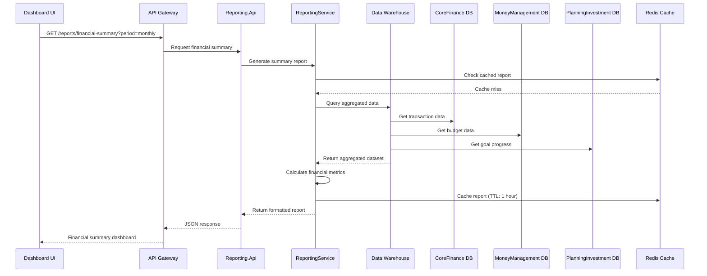
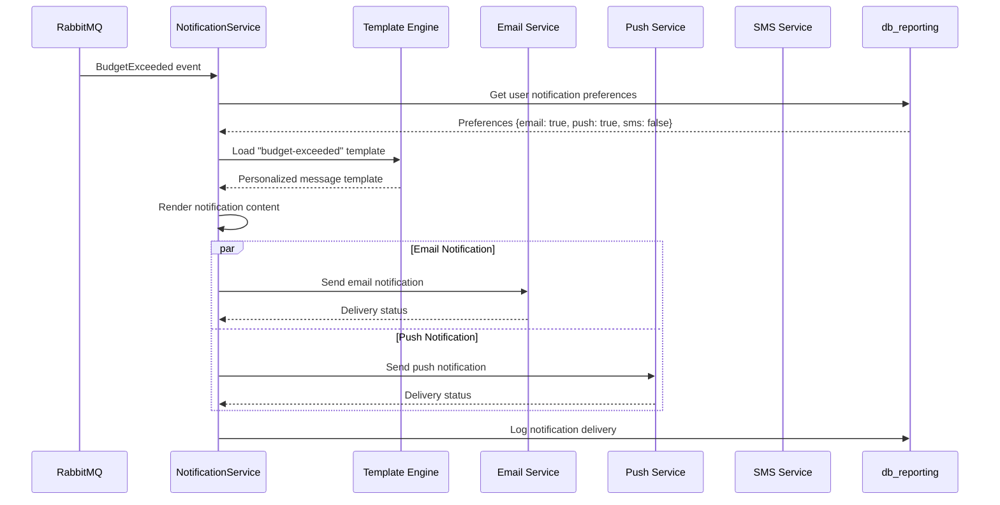
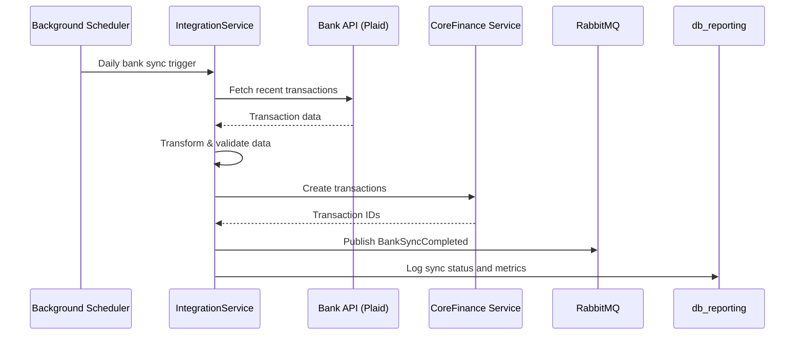
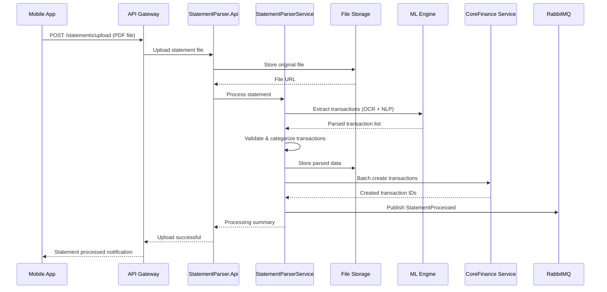

# Reporting & Integration Service Design

## 1. Service Overview

Reporting & Integration is a crucial supporting bounded context in the TiHoMo system, responsible for generating reports, analyzing data, sending notifications, and integrating with external services. This domain serves as a bridge between internal microservices and the external world, while providing comprehensive insights into financial health.

### Primary Objectives
- Generate comprehensive financial reports and analytics (ReportingService)
- Multi-channel user notifications (NotificationService)
- External service integrations (IntegrationService)
- Bank statement parsing and analysis (StatementParserService)
- Data warehouse and business intelligence

---

## 2. Architecture Overview

### 2.1 Microservice Structure

- **Reporting.Api**: REST API for reports, analytics dashboard, data export
- **Notification.Api**: Notification engine with multi-channel delivery
- **Integration.Api**: External service connectors and webhooks
- **StatementParser.Api**: File parsing service with AI/ML capabilities
- **Shared.Application**: Business logic, aggregation algorithms, data processing
- **Shared.Infrastructure**: Data warehouse, event sourcing, file storage, messaging

### 2.2 Database Architecture

- **db_reporting** (PostgreSQL): Aggregated data, reports, analytics, user preferences
- **Data Warehouse** (PostgreSQL/ClickHouse): Historical data, OLAP queries
- **Time Series DB** (InfluxDB): Performance metrics, real-time analytics
- **Document Store** (MongoDB): Parsed statements, unstructured data

### 2.3 Event-Driven Data Pipeline

- **Event Sourcing**: Rebuild state from domain events
- **CQRS**: Read models optimized for reporting
- **Stream Processing**: Real-time aggregation and alerting
- **Data Lake**: Raw data storage for advanced analytics

### 2.4 File Processing Pipeline

- **MinIO**: Object storage for files, parsed data, report exports
- **Message Queues**: Async file processing workflows
- **ML Pipeline**: AI-powered statement parsing and categorization

---

## 3. Service Layer Architecture

### 3.1 ReportingService

**Primary Responsibilities:**
- Aggregate data from all microservices
- Generate financial reports (income statement, balance sheet, cash flow)
- Create interactive dashboards
- Export data (PDF, Excel, CSV)
- Business intelligence and trend analysis

**Process Flow:**


**Report Types:**
- **Income Statement**: Revenue, expenses, net income by period
- **Balance Sheet**: Assets, liabilities, net worth snapshot
- **Cash Flow**: Operating, investing, financing activities
- **Budget Analysis**: Planned vs actual spending by category
- **Goal Progress**: Financial goals achievement tracking
- **Investment Performance**: Portfolio returns, asset allocation
- **Debt Summary**: Outstanding balances, payoff projections

### 3.2 NotificationService

**Primary Responsibilities:**
- Multi-channel notification delivery (email, SMS, push, in-app)
- Notification scheduling and batching
- User preference management
- Template engine for personalized messages
- Delivery tracking and retry logic

**Process Flow:**


**Notification Types:**
- **Budget Alerts**: Overspending, approaching limits
- **Goal Milestones**: Achievement notifications, progress updates
- **Investment Updates**: Portfolio performance, rebalancing suggestions
- **Debt Reminders**: Payment due dates, payoff opportunities
- **Transaction Alerts**: Large transactions, suspicious activity
- **System Notifications**: Account changes, feature announcements

### 3.3 IntegrationService

**Primary Responsibilities:**
- Bank API connections for real-time data sync
- Third-party service integrations (Plaid, Yodlee, etc.)
- Webhook management for external notifications
- API rate limiting and error handling
- Data transformation and validation

**Process Flow:**


**Integration Types:**
- **Banking APIs**: Plaid, Yodlee, Open Banking APIs
- **Investment Platforms**: Brokerage account connections
- **Payment Processors**: Stripe, PayPal webhooks
- **Credit Monitoring**: Credit score updates
- **Tax Software**: Data export for tax preparation

### 3.4 StatementParserService

**Primary Responsibilities:**
- Parse PDF and Excel bank statements
- AI-powered transaction categorization
- OCR for scanned documents
- Data extraction and validation
- Anti-fraud pattern detection

**Process Flow:**


**Parsing Capabilities:**
- **PDF Statements**: Text extraction, table recognition
- **Excel/CSV Files**: Column mapping, data validation
- **Scanned Documents**: OCR with confidence scoring
- **Multi-language Support**: Vietnamese, English statement processing
- **Bank Format Recognition**: Auto-detect bank statement formats

---

## 4. Data Architecture & Analytics

### 4.1 Data Warehouse Design

```sql
-- Fact Tables
CREATE TABLE fact_transactions (
    transaction_id BIGINT PRIMARY KEY,
    user_id INT NOT NULL,
    account_id INT NOT NULL,
    category_id INT NOT NULL,
    amount DECIMAL(15,2) NOT NULL,
    transaction_date DATE NOT NULL,
    created_at TIMESTAMP NOT NULL,
    
    -- Dimension Keys
    date_key INT NOT NULL,
    account_key INT NOT NULL,
    category_key INT NOT NULL
);

CREATE TABLE fact_budget_performance (
    budget_id INT NOT NULL,
    user_id INT NOT NULL,
    category_id INT NOT NULL,
    period_start DATE NOT NULL,
    period_end DATE NOT NULL,
    budgeted_amount DECIMAL(15,2) NOT NULL,
    actual_amount DECIMAL(15,2) NOT NULL,
    variance_amount DECIMAL(15,2) NOT NULL,
    variance_percentage DECIMAL(5,2) NOT NULL
);

-- Dimension Tables
CREATE TABLE dim_date (
    date_key INT PRIMARY KEY,
    date_value DATE NOT NULL,
    year INT NOT NULL,
    month INT NOT NULL,
    quarter INT NOT NULL,
    day_of_week INT NOT NULL,
    is_weekend BOOLEAN NOT NULL
);

CREATE TABLE dim_category (
    category_key INT PRIMARY KEY,
    category_name VARCHAR(100) NOT NULL,
    parent_category VARCHAR(100),
    category_type VARCHAR(50) NOT NULL -- Income, Expense, Transfer
);
```

### 4.2 OLAP Cubes Design

**Financial Performance Cube:**
- Dimensions: Time, User, Category, Account Type
- Measures: Amount, Transaction Count, Budget Variance
- Aggregations: Monthly, Quarterly, Yearly rollups

**Investment Performance Cube:**
- Dimensions: Time, User, Asset Class, Portfolio
- Measures: Market Value, Cost Basis, Return Percentage
- Aggregations: Portfolio-level, Asset class-level performance

### 4.3 Real-time Analytics Pipeline

```csharp
public class RealTimeAnalyticsProcessor
{
    public async Task ProcessTransactionEvent(TransactionCreatedEvent @event)
    {
        // Update real-time spending metrics
        await UpdateSpendingMetrics(@event.UserId, @event.CategoryId, @event.Amount);
        
        // Check budget thresholds
        var budgetStatus = await CheckBudgetThresholds(@event.UserId, @event.CategoryId);
        if (budgetStatus.IsExceeded)
        {
            await PublishBudgetAlert(@event.UserId, budgetStatus);
        }
        
        // Update cash flow projections
        await UpdateCashFlowProjections(@event.UserId);
        
        // Trigger anomaly detection
        await CheckForAnomalousSpending(@event);
    }
}
```

---

## 5. API Endpoints

### 5.1 Reporting APIs

**Report Generation:**
- `GET /reports/financial-summary` - Comprehensive financial overview
- `GET /reports/income-statement` - Revenue and expense analysis
- `GET /reports/cash-flow` - Cash flow statement
- `GET /reports/net-worth` - Asset and liability summary
- `POST /reports/custom` - Custom report builder

**Data Export:**
- `GET /exports/transactions` - Transaction data export
- `GET /exports/budgets` - Budget data export
- `POST /exports/tax-documents` - Tax preparation exports
- `GET /exports/investment-statements` - Investment reports

**Analytics Dashboard:**
- `GET /analytics/spending-trends` - Spending pattern analysis
- `GET /analytics/category-breakdown` - Expense categorization
- `GET /analytics/goal-progress` - Financial goals tracking
- `GET /analytics/budget-performance` - Budget vs actual analysis

### 5.2 Notification APIs

**Notification Management:**
- `GET /notifications` - User notification history
- `POST /notifications/preferences` - Update notification settings
- `POST /notifications/test` - Send test notification
- `DELETE /notifications/{id}` - Mark notification as read

**Subscription Management:**
- `GET /notifications/subscriptions` - Active subscriptions
- `POST /notifications/subscriptions` - Subscribe to notification type
- `DELETE /notifications/subscriptions/{type}` - Unsubscribe

### 5.3 Integration APIs

**External Connections:**
- `GET /integrations/banks` - Connected bank accounts
- `POST /integrations/banks/connect` - Add bank connection
- `POST /integrations/banks/{id}/sync` - Manual sync trigger
- `DELETE /integrations/banks/{id}` - Remove bank connection

**Webhook Management:**
- `GET /integrations/webhooks` - Active webhooks
- `POST /integrations/webhooks` - Register webhook endpoint
- `PUT /integrations/webhooks/{id}` - Update webhook configuration

### 5.4 Statement Parser APIs

**File Processing:**
- `POST /statements/upload` - Upload statement file
- `GET /statements/processing-status/{id}` - Check processing status
- `GET /statements/parsed-data/{id}` - Get parsed transaction data
- `POST /statements/confirm-import` - Confirm and import transactions

**Parser Configuration:**
- `GET /statements/supported-formats` - Supported file formats
- `POST /statements/custom-parser` - Configure custom parser rules
- `GET /statements/parsing-history` - Processing history

---

## 6. Machine Learning & AI Integration

### 6.1 Transaction Categorization

```csharp
public class TransactionCategorizationService
{
    private readonly IMLModel _categorizationModel;
    
    public async Task<CategoryPrediction> PredictCategory(Transaction transaction)
    {
        var features = ExtractFeatures(transaction);
        var prediction = await _categorizationModel.PredictAsync(features);
        
        return new CategoryPrediction
        {
            PredictedCategory = prediction.Category,
            Confidence = prediction.Confidence,
            AlternativeCategories = prediction.Alternatives.Take(3).ToList()
        };
    }
    
    private TransactionFeatures ExtractFeatures(Transaction transaction)
    {
        return new TransactionFeatures
        {
            Description = CleanDescription(transaction.Description),
            Amount = transaction.Amount,
            MerchantName = ExtractMerchantName(transaction.Description),
            DayOfWeek = transaction.Date.DayOfWeek,
            TimeOfDay = transaction.Date.Hour,
            IsRecurring = IsRecurringTransaction(transaction)
        };
    }
}
```

### 6.2 Spending Pattern Analysis

```csharp
public class SpendingPatternAnalyzer
{
    public async Task<SpendingInsights> AnalyzeSpendingPatterns(int userId, DateTime fromDate, DateTime toDate)
    {
        var transactions = await GetUserTransactions(userId, fromDate, toDate);
        
        return new SpendingInsights
        {
            WeeklyPatterns = AnalyzeWeeklyPatterns(transactions),
            MonthlyTrends = AnalyzeMonthlyTrends(transactions),
            CategoryInsights = AnalyzeCategoryPatterns(transactions),
            AnomalousTransactions = DetectAnomalies(transactions),
            SeasonalPatterns = AnalyzeSeasonalSpending(transactions),
            Recommendations = GenerateSpendingRecommendations(transactions)
        };
    }
    
    private List<SpendingRecommendation> GenerateSpendingRecommendations(List<Transaction> transactions)
    {
        var recommendations = new List<SpendingRecommendation>();
        
        // Identify categories with increasing trends
        var increasingCategories = FindIncreasingSpendingCategories(transactions);
        foreach (var category in increasingCategories)
        {
            recommendations.Add(new SpendingRecommendation
            {
                Type = RecommendationType.ReduceSpending,
                Category = category.Name,
                Message = $"Your {category.Name} spending has increased by {category.IncreasePercentage:F1}% this month",
                Severity = category.IncreasePercentage > 20 ? Severity.High : Severity.Medium
            });
        }
        
        return recommendations;
    }
}
```

### 6.3 Fraud Detection

```csharp
public class FraudDetectionService
{
    public async Task<FraudRiskAssessment> AssessTransactionRisk(Transaction transaction)
    {
        var userProfile = await GetUserSpendingProfile(transaction.UserId);
        var riskFactors = new List<RiskFactor>();
        
        // Amount-based analysis
        if (transaction.Amount > userProfile.TypicalTransactionAmount * 10)
        {
            riskFactors.Add(new RiskFactor
            {
                Type = RiskType.UnusualAmount,
                Score = 0.7,
                Description = "Transaction amount significantly higher than usual"
            });
        }
        
        // Location-based analysis
        if (IsUnusualLocation(transaction, userProfile))
        {
            riskFactors.Add(new RiskFactor
            {
                Type = RiskType.UnusualLocation,
                Score = 0.6,
                Description = "Transaction from unusual geographic location"
            });
        }
        
        // Time-based analysis
        if (IsUnusualTime(transaction, userProfile))
        {
            riskFactors.Add(new RiskFactor
            {
                Type = RiskType.UnusualTime,
                Score = 0.4,
                Description = "Transaction at unusual time"
            });
        }
        
        var overallRisk = CalculateOverallRisk(riskFactors);
        
        return new FraudRiskAssessment
        {
            RiskScore = overallRisk,
            RiskLevel = DetermineRiskLevel(overallRisk),
            RiskFactors = riskFactors,
            RecommendedAction = DetermineRecommendedAction(overallRisk)
        };
    }
}
```

---

## 7. Performance & Scalability

### 7.1 Caching Strategy

**Multi-level Caching:**
```csharp
public class ReportCacheService
{
    private readonly IMemoryCache _l1Cache; // In-memory (5 minutes)
    private readonly IDistributedCache _l2Cache; // Redis (1 hour)
    private readonly IBlobCache _l3Cache; // MinIO (24 hours)
    
    public async Task<FinancialReport> GetReportAsync(string reportKey)
    {
        // L1: Memory cache
        if (_l1Cache.TryGetValue(reportKey, out FinancialReport cachedReport))
            return cachedReport;
            
        // L2: Distributed cache
        var serializedReport = await _l2Cache.GetStringAsync(reportKey);
        if (serializedReport != null)
        {
            var report = JsonSerializer.Deserialize<FinancialReport>(serializedReport);
            _l1Cache.Set(reportKey, report, TimeSpan.FromMinutes(5));
            return report;
        }
        
        // L3: Blob cache
        var blobReport = await _l3Cache.GetAsync(reportKey);
        if (blobReport != null)
        {
            var report = JsonSerializer.Deserialize<FinancialReport>(blobReport);
            await _l2Cache.SetStringAsync(reportKey, serializedReport, TimeSpan.FromHours(1));
            _l1Cache.Set(reportKey, report, TimeSpan.FromMinutes(5));
            return report;
        }
        
        return null; // Cache miss - generate report
    }
}
```

### 7.2 Database Optimization

**Read Replicas for Analytics:**
- Master database for write operations
- Read replicas for reporting queries
- Connection string routing based on operation type

**Partitioning Strategy:**
```sql
-- Partition transaction data by month
CREATE TABLE fact_transactions_y2024m01 PARTITION OF fact_transactions
FOR VALUES FROM ('2024-01-01') TO ('2024-02-01');

CREATE TABLE fact_transactions_y2024m02 PARTITION OF fact_transactions
FOR VALUES FROM ('2024-02-01') TO ('2024-03-01');

-- Indexes optimized for analytics workloads
CREATE INDEX CONCURRENTLY idx_fact_transactions_user_date_category 
ON fact_transactions (user_id, transaction_date, category_id) 
INCLUDE (amount);
```

### 7.3 Stream Processing

**Apache Kafka Integration:**
```csharp
public class EventStreamProcessor
{
    private readonly IKafkaConsumer<string, DomainEvent> _consumer;
    
    public async Task ProcessEventStream()
    {
        await foreach (var message in _consumer.Consume())
        {
            try
            {
                switch (message.Value)
                {
                    case TransactionCreatedEvent transactionEvent:
                        await ProcessTransactionEvent(transactionEvent);
                        break;
                        
                    case BudgetUpdatedEvent budgetEvent:
                        await ProcessBudgetEvent(budgetEvent);
                        break;
                        
                    case GoalProgressEvent goalEvent:
                        await ProcessGoalEvent(goalEvent);
                        break;
                }
                
                // Commit offset after successful processing
                await _consumer.CommitAsync(message);
            }
            catch (Exception ex)
            {
                // Send to dead letter queue
                await HandleProcessingError(message, ex);
            }
        }
    }
}
```

---

## 8. Security & Compliance

### 8.1 Data Privacy

**PII Protection:**
```csharp
public class DataAnonymizationService
{
    public FinancialReport AnonymizeReport(FinancialReport report, DataSharingLevel level)
    {
        return level switch
        {
            DataSharingLevel.Internal => report, // No anonymization for internal use
            DataSharingLevel.Analytics => AnonymizeForAnalytics(report),
            DataSharingLevel.Research => AnonymizeForResearch(report),
            DataSharingLevel.Public => AnonymizeForPublic(report)
        };
    }
    
    private FinancialReport AnonymizeForAnalytics(FinancialReport report)
    {
        // Remove direct identifiers, keep behavioral patterns
        report.UserId = HashUserId(report.UserId);
        report.AccountNumbers = report.AccountNumbers.Select(HashAccountNumber).ToList();
        report.MerchantNames = report.MerchantNames.Select(GeneralizeMerchant).ToList();
        
        return report;
    }
}
```

### 8.2 Audit Logging

**Comprehensive Audit Trail:**
```csharp
public class AuditLogger
{
    public async Task LogReportAccess(int userId, string reportType, string ipAddress)
    {
        var auditEntry = new AuditLogEntry
        {
            UserId = userId,
            Action = AuditAction.ReportAccess,
            Resource = reportType,
            IpAddress = ipAddress,
            Timestamp = DateTime.UtcNow,
            UserAgent = GetUserAgent(),
            SessionId = GetSessionId()
        };
        
        await SaveAuditEntry(auditEntry);
        
        // Real-time monitoring for suspicious access patterns
        await CheckAccessPatterns(userId, ipAddress);
    }
}
```

---

## 9. Monitoring & Observability

### 9.1 Business Metrics

**Key Performance Indicators:**
```csharp
public class BusinessMetricsCollector
{
    public async Task CollectDailyMetrics()
    {
        var metrics = new DailyBusinessMetrics
        {
            Date = DateTime.Today,
            ActiveUsers = await CountActiveUsers(),
            ReportsGenerated = await CountReportsGenerated(),
            NotificationsSent = await CountNotificationsSent(),
            StatementsProcessed = await CountStatementsProcessed(),
            IntegrationSyncSuccessRate = await CalculateSyncSuccessRate(),
            AverageReportGenerationTime = await CalculateAverageReportTime(),
            DataProcessingVolume = await CalculateDataVolume()
        };
        
        await SaveMetrics(metrics);
        await SendMetricsToMonitoring(metrics);
    }
}
```

### 9.2 Performance Monitoring

**Response Time Tracking:**
- Report generation times by complexity
- Notification delivery times by channel
- File processing times by file size
- Database query performance metrics

**Resource Utilization:**
- CPU usage during heavy analytics workloads
- Memory usage for large report generation
- Disk I/O for file processing operations
- Network bandwidth for external integrations

---

## 10. Disaster Recovery & Backup

### 10.1 Data Backup Strategy

**Tiered Backup Approach:**
- **Hot Backup**: Real-time replication to standby database
- **Warm Backup**: Daily snapshots to cloud storage
- **Cold Backup**: Weekly archives to long-term storage

**Cross-Region Replication:**
```csharp
public class BackupOrchestrator
{
    public async Task ExecuteDailyBackup()
    {
        // Backup transaction data
        await BackupTable("fact_transactions", BackupType.Incremental);
        
        // Backup user reports
        await BackupTable("user_reports", BackupType.Full);
        
        // Backup notification logs
        await BackupTable("notification_logs", BackupType.Incremental);
        
        // Backup parsed statement files
        await BackupMinIOBucket("statement-files");
        
        // Verify backup integrity
        await VerifyBackupIntegrity();
        
        // Update backup metadata
        await UpdateBackupCatalog();
    }
}
```

### 10.2 Recovery Procedures

**RTO (Recovery Time Objective): 4 hours**
**RPO (Recovery Point Objective): 1 hour**

**Automated Recovery:**
- Database failover to standby replica
- MinIO cluster failover
- Application container restart
- DNS failover to backup region

---

*This design consolidates requirements from Memory Bank, overview_v4.md and flowcharts_v4.md. The Reporting & Integration domain provides comprehensive analytics, intelligent notifications, seamless integrations and powerful statement processing capabilities - essential components for data-driven personal finance management.*
