# Feature Design: Enhanced API Key Management System

## 1. Feature Overview & Business Requirements

### 1.1 Tổng quan tính năng (Feature Overview)
TiHoMo đã có API Key system cơ bản, nhưng cần enhance để đạt production-ready level cho third-party integration. Tính năng này cho phép users tạo và quản lý API keys để integrate với external systems một cách an toàn và hiệu quả.

### 1.2 Business Requirements
- **BR-001**: User có thể tạo multiple API keys với different scopes và expiration dates
- **BR-002**: User có thể quản lý (view, edit, revoke) API keys thông qua web interface
- **BR-003**: API keys phải có comprehensive security features (rate limiting, IP restrictions, scope validation)
- **BR-004**: System phải track và audit tất cả API key usage
- **BR-005**: Third-party developers có thể integrate dễ dàng với proper documentation

### 1.3 Success Criteria
- User có thể tạo API key trong < 30 giây
- Third-party integration có thể hoàn thành trong < 15 phút
- API key security events được audit 100%
- System có thể handle 1000+ API requests per minute per key

## 2. Current State Analysis

### 2.1 Existing Implementation ✅
**Identity Service đã có:**
- `ApiKey` entity với properties: UserId, Name, KeyHash, KeyPrefix, Description, Scopes, Status, ExpiresAt, LastUsedAt, UsageCount
- `ApiKeyService` với methods: Create, Get, Update, Revoke, Delete, Verify
- `ApiKeyRepository` với database operations
- `ApiKeyHasher` service để hash và verify keys
- Authentication middleware trong Gateway
- DTOs cho API key operations

### 2.2 Architecture Strengths
- Secure key generation với SHA-256 hashing
- Proper key prefix system ("pfm_")
- Expiration date support
- Usage tracking
- Integration với existing authentication system

### 2.3 Current Limitations
- Thiếu frontend UI cho API key management
- Chưa có API Controllers để expose endpoints
- Thiếu rate limiting và IP whitelisting
- Chưa có scope-based authorization enforcement
- Thiếu comprehensive audit logging
- Chưa có usage analytics và monitoring

## 3. Gap Analysis & Enhancement Requirements

### 3.1 Backend Enhancements Required
| Component | Current Status | Required Enhancement |
|-----------|---------------|---------------------|
| ApiKey Entity | ✅ Basic properties | ➕ IP whitelist, rate limits, security settings |
| ApiKeyService | ✅ CRUD operations | ➕ Security validation, analytics |
| API Controllers | ❌ Missing | ➕ Full RESTful endpoints |
| Security Middleware | ⚠️ Basic validation | ➕ Rate limiting, scope enforcement |
| Audit Logging | ❌ Missing | ➕ Comprehensive event tracking |

### 3.2 Frontend Requirements
| Component | Status | Description |
|-----------|--------|-------------|
| API Key Management Page | ❌ New | Complete CRUD interface |
| API Key Creation Modal | ❌ New | Form với scopes, expiry, restrictions |
| API Key List Component | ❌ New | Table với status, usage, actions |
| Usage Analytics Dashboard | ❌ New | Charts và statistics |
| Integration Documentation | ❌ New | Developer guides và examples |

## 4. Security Architecture & Implementation

### 4.1 Enhanced Security Model


### 4.2 Security Enhancements

#### 4.2.1 Enhanced ApiKey Entity
```csharp
public class ApiKey : BaseEntity<Guid>
{
    // Existing properties...
    public Guid UserId { get; set; }
    public string Name { get; set; } = string.Empty;
    public string KeyHash { get; set; } = string.Empty;
    public string KeyPrefix { get; set; } = string.Empty;
    public string? Description { get; set; }
    public List<string> Scopes { get; set; } = [];
    public ApiKeyStatus Status { get; set; } = ApiKeyStatus.Active;
    public DateTime? ExpiresAt { get; set; }
    public DateTime? LastUsedAt { get; set; }
    public int UsageCount { get; set; } = 0;
    
    // NEW: Enhanced security properties
    public List<string> IpWhitelist { get; set; } = []; // IP restrictions
    public int RateLimitPerMinute { get; set; } = 100; // Rate limiting
    public int DailyUsageQuota { get; set; } = 10000; // Daily quota
    public ApiKeySecuritySettings SecuritySettings { get; set; } = new();
    
    // Navigation properties
    public virtual User User { get; set; } = null!;
    public virtual ICollection<ApiKeyUsageLog> UsageLogs { get; set; } = [];
}

public class ApiKeySecuritySettings
{
    public bool RequireHttps { get; set; } = true;
    public bool AllowCorsRequests { get; set; } = false;
    public List<string> AllowedOrigins { get; set; } = [];
    public bool EnableUsageAnalytics { get; set; } = true;
    public int MaxRequestsPerSecond { get; set; } = 10;
}
```

#### 4.2.2 Security Validation Steps
1. **Key Format Validation**: Verify "pfm_" prefix và base64 encoding
2. **Hash Verification**: SHA-256 hash comparison
3. **Expiration Check**: Validate against current timestamp
4. **Status Validation**: Check for revoked/suspended keys
5. **User Account Validation**: Verify user is still active
6. **IP Whitelist Check**: Validate client IP against allowed IPs
7. **Rate Limiting**: Check requests per minute/hour/day
8. **Scope Authorization**: Validate required permissions
9. **Usage Quota Check**: Verify daily/monthly limits
10. **Security Settings**: Apply additional restrictions

#### 4.2.3 Rate Limiting Implementation
```csharp
public class ApiKeyRateLimitService
{
    private readonly IDistributedCache _cache;
    private readonly ILogger<ApiKeyRateLimitService> _logger;
    
    public async Task<bool> IsRateLimitExceededAsync(string keyId, int limitPerMinute)
    {
        var key = $"rate_limit:{keyId}:{DateTime.UtcNow:yyyy-MM-dd-HH-mm}";
        var currentCount = await _cache.GetStringAsync(key);
        
        if (int.TryParse(currentCount, out var count) && count >= limitPerMinute)
        {
            return true;
        }
        
        await _cache.SetStringAsync(key, (count + 1).ToString(), 
            new DistributedCacheEntryOptions
            {
                AbsoluteExpirationRelativeToNow = TimeSpan.FromMinutes(1)
            });
            
        return false;
    }
}
```

## 5. API Design & Endpoints

### 5.1 RESTful API Endpoints
```csharp
[ApiController]
[Route("api/[controller]")]
[Authorize] // Require user authentication
public class ApiKeysController : ControllerBase
{
    // GET /api/apikeys - List user's API keys
    [HttpGet]
    public async Task<ActionResult<IEnumerable<ApiKeyResponse>>> GetApiKeys()
    
    // POST /api/apikeys - Create new API key
    [HttpPost]
    public async Task<ActionResult<CreateApiKeyResponse>> CreateApiKey([FromBody] CreateApiKeyRequest request)
    
    // GET /api/apikeys/{id} - Get specific API key
    [HttpGet("{id}")]
    public async Task<ActionResult<ApiKeyResponse>> GetApiKey(Guid id)
    
    // PUT /api/apikeys/{id} - Update API key
    [HttpPut("{id}")]
    public async Task<ActionResult<ApiKeyResponse>> UpdateApiKey(Guid id, [FromBody] UpdateApiKeyRequest request)
    
    // DELETE /api/apikeys/{id} - Revoke API key
    [HttpDelete("{id}")]
    public async Task<ActionResult> RevokeApiKey(Guid id)
    
    // GET /api/apikeys/{id}/usage - Get usage statistics
    [HttpGet("{id}/usage")]
    public async Task<ActionResult<ApiKeyUsageResponse>> GetUsage(Guid id, [FromQuery] UsageQueryRequest request)
    
    // POST /api/apikeys/{id}/rotate - Rotate API key
    [HttpPost("{id}/rotate")]
    public async Task<ActionResult<CreateApiKeyResponse>> RotateApiKey(Guid id)
}
```

### 5.2 Enhanced DTOs
```csharp
public class CreateApiKeyRequest
{
    public string Name { get; set; } = string.Empty;
    public string? Description { get; set; }
    public DateTime? ExpiresAt { get; set; }
    public List<string> Scopes { get; set; } = [];
    
    // NEW: Enhanced security options
    public List<string> IpWhitelist { get; set; } = [];
    public int RateLimitPerMinute { get; set; } = 100;
    public int DailyUsageQuota { get; set; } = 10000;
    public ApiKeySecuritySettings SecuritySettings { get; set; } = new();
}

public class ApiKeyResponse
{
    public Guid Id { get; set; }
    public string Name { get; set; } = string.Empty;
    public string KeyPrefix { get; set; } = string.Empty;
    public string? Description { get; set; }
    public List<string> Scopes { get; set; } = [];
    public ApiKeyStatus Status { get; set; }
    public DateTime CreatedAt { get; set; }
    public DateTime? ExpiresAt { get; set; }
    public DateTime? LastUsedAt { get; set; }
    public int UsageCount { get; set; }
    
    // NEW: Enhanced information
    public List<string> IpWhitelist { get; set; } = [];
    public int RateLimitPerMinute { get; set; }
    public int DailyUsageQuota { get; set; }
    public int TodayUsageCount { get; set; }
    public ApiKeySecuritySettings SecuritySettings { get; set; } = new();
    public string? RawKey { get; set; } // Only returned during creation
}

public class ApiKeyUsageResponse
{
    public Guid ApiKeyId { get; set; }
    public int TotalRequests { get; set; }
    public int SuccessfulRequests { get; set; }
    public int FailedRequests { get; set; }
    public DateTime FirstUsed { get; set; }
    public DateTime LastUsed { get; set; }
    public List<UsageStatistic> DailyUsage { get; set; } = [];
    public List<EndpointUsage> TopEndpoints { get; set; } = [];
}
```

## 6. Frontend Design & User Experience

### 6.1 Page Structure
```
/settings/api-keys
├── ApiKeyManagement.vue (Main page)
├── components/
│   ├── ApiKeyList.vue (Table với keys)
│   ├── ApiKeyCreateModal.vue (Creation form)
│   ├── ApiKeyEditModal.vue (Edit form)
│   ├── ApiKeyDetailsModal.vue (View details)
│   ├── ApiKeyUsageChart.vue (Usage analytics)
│   ├── ScopeSelector.vue (Scope selection)
│   └── SecuritySettingsForm.vue (Security options)
├── composables/
│   ├── useApiKeys.ts (API key operations)
│   ├── useApiKeyValidation.ts (Validation logic)
│   └── useApiKeyUsage.ts (Usage analytics)
└── types/
    └── api-key.ts (TypeScript types)
```

### 6.2 User Experience Flow


### 6.3 Key UI Components

#### 6.3.1 API Key List Component
```vue
<template>
  <div class="api-key-list">
    <div class="header">
      <h2>API Keys</h2>
      <button @click="showCreateModal = true" class="btn-primary">
        Create New Key
      </button>
    </div>
    
    <div class="table-wrapper">
      <table class="api-key-table">
        <thead>
          <tr>
            <th>Name</th>
            <th>Key Prefix</th>
            <th>Scopes</th>
            <th>Status</th>
            <th>Last Used</th>
            <th>Usage</th>
            <th>Actions</th>
          </tr>
        </thead>
        <tbody>
          <tr v-for="key in apiKeys" :key="key.id">
            <td>{{ key.name }}</td>
            <td><code>{{ key.keyPrefix }}***</code></td>
            <td>
              <div class="scopes">
                <span v-for="scope in key.scopes" :key="scope" class="scope-tag">
                  {{ scope }}
                </span>
              </div>
            </td>
            <td>
              <span :class="statusClass(key.status)">
                {{ key.status }}
              </span>
            </td>
            <td>{{ formatDate(key.lastUsedAt) }}</td>
            <td>
              <div class="usage-info">
                <span>{{ key.usageCount }} total</span>
                <span>{{ key.todayUsageCount }}/{{ key.dailyUsageQuota }} today</span>
              </div>
            </td>
            <td>
              <div class="actions">
                <button @click="viewDetails(key)" class="btn-secondary">
                  View
                </button>
                <button @click="editKey(key)" class="btn-secondary">
                  Edit
                </button>
                <button @click="revokeKey(key)" class="btn-danger">
                  Revoke
                </button>
              </div>
            </td>
          </tr>
        </tbody>
      </table>
    </div>
  </div>
</template>
```

#### 6.3.2 API Key Creation Modal
```vue
<template>
  <Modal v-model="show" title="Create New API Key" size="large">
    <form @submit.prevent="createKey">
      <div class="form-section">
        <h3>Basic Information</h3>
        <div class="form-group">
          <label>Name *</label>
          <input v-model="form.name" type="text" required />
        </div>
        <div class="form-group">
          <label>Description</label>
          <textarea v-model="form.description" rows="3"></textarea>
        </div>
        <div class="form-group">
          <label>Expiration Date</label>
          <input v-model="form.expiresAt" type="datetime-local" />
        </div>
      </div>
      
      <div class="form-section">
        <h3>Permissions</h3>
        <ScopeSelector v-model="form.scopes" />
      </div>
      
      <div class="form-section">
        <h3>Security Settings</h3>
        <div class="form-group">
          <label>Rate Limit (requests per minute)</label>
          <input v-model.number="form.rateLimitPerMinute" type="number" min="1" max="1000" />
        </div>
        <div class="form-group">
          <label>Daily Usage Quota</label>
          <input v-model.number="form.dailyUsageQuota" type="number" min="1" />
        </div>
        <div class="form-group">
          <label>IP Whitelist (optional)</label>
          <textarea v-model="ipWhitelistText" placeholder="Enter IP addresses, one per line"></textarea>
        </div>
      </div>
      
      <div class="form-actions">
        <button type="button" @click="show = false" class="btn-secondary">
          Cancel
        </button>
        <button type="submit" class="btn-primary" :disabled="!isFormValid">
          Create API Key
        </button>
      </div>
    </form>
  </Modal>
</template>
```

## 7. Database Schema Enhancements

### 7.1 Migration Script
```sql
-- Add new columns to ApiKeys table
ALTER TABLE "ApiKeys" 
ADD COLUMN "IpWhitelist" jsonb DEFAULT '[]',
ADD COLUMN "RateLimitPerMinute" integer DEFAULT 100,
ADD COLUMN "DailyUsageQuota" integer DEFAULT 10000,
ADD COLUMN "SecuritySettings" jsonb DEFAULT '{}',
ADD COLUMN "TodayUsageCount" integer DEFAULT 0,
ADD COLUMN "LastResetDate" timestamp DEFAULT CURRENT_TIMESTAMP;

-- Create ApiKeyUsageLogs table
CREATE TABLE "ApiKeyUsageLogs" (
    "Id" uuid PRIMARY KEY DEFAULT gen_random_uuid(),
    "ApiKeyId" uuid NOT NULL REFERENCES "ApiKeys"("Id") ON DELETE CASCADE,
    "RequestPath" varchar(500) NOT NULL,
    "HttpMethod" varchar(10) NOT NULL,
    "StatusCode" integer NOT NULL,
    "ResponseTime" integer NOT NULL, -- milliseconds
    "ClientIp" varchar(45) NOT NULL,
    "UserAgent" varchar(1000),
    "RequestTimestamp" timestamp NOT NULL DEFAULT CURRENT_TIMESTAMP,
    "CreatedAt" timestamp NOT NULL DEFAULT CURRENT_TIMESTAMP
);

-- Create indexes for performance
CREATE INDEX "IX_ApiKeyUsageLogs_ApiKeyId" ON "ApiKeyUsageLogs"("ApiKeyId");
CREATE INDEX "IX_ApiKeyUsageLogs_RequestTimestamp" ON "ApiKeyUsageLogs"("RequestTimestamp");
CREATE INDEX "IX_ApiKeys_IpWhitelist" ON "ApiKeys" USING gin("IpWhitelist");
```

### 7.2 Entity Framework Configuration
```csharp
// In IdentityDbContext.cs
protected override void OnModelCreating(ModelBuilder modelBuilder)
{
    // Enhanced ApiKey configuration
    modelBuilder.Entity<ApiKey>(entity =>
    {
        // Existing configuration...
        
        // NEW: Enhanced properties
        entity.Property(e => e.IpWhitelist)
            .HasConversion(
                v => JsonSerializer.Serialize(v, (JsonSerializerOptions)null),
                v => JsonSerializer.Deserialize<List<string>>(v, (JsonSerializerOptions)null) ?? new List<string>())
            .HasColumnType("jsonb");
            
        entity.Property(e => e.SecuritySettings)
            .HasConversion(
                v => JsonSerializer.Serialize(v, (JsonSerializerOptions)null),
                v => JsonSerializer.Deserialize<ApiKeySecuritySettings>(v, (JsonSerializerOptions)null) ?? new ApiKeySecuritySettings())
            .HasColumnType("jsonb");
            
        entity.HasIndex(e => e.IpWhitelist).HasMethod("gin");
    });
    
    // ApiKeyUsageLog configuration
    modelBuilder.Entity<ApiKeyUsageLog>(entity =>
    {
        entity.ToTable("ApiKeyUsageLogs");
        entity.HasKey(e => e.Id);
        
        entity.Property(e => e.RequestPath).HasMaxLength(500).IsRequired();
        entity.Property(e => e.HttpMethod).HasMaxLength(10).IsRequired();
        entity.Property(e => e.ClientIp).HasMaxLength(45).IsRequired();
        entity.Property(e => e.UserAgent).HasMaxLength(1000);
        
        entity.HasOne(e => e.ApiKey)
            .WithMany(a => a.UsageLogs)
            .HasForeignKey(e => e.ApiKeyId)
            .OnDelete(DeleteBehavior.Cascade);
            
        entity.HasIndex(e => e.ApiKeyId);
        entity.HasIndex(e => e.RequestTimestamp);
    });
}
```

## 8. Integration Patterns

### 8.1 Authentication Flow

```mermaid
sequenceDiagram
    participant Client
    participant Gateway
    participant Identity
    participant CoreFinance
    participant Database
    
    Client->>Gateway: Request với API Key Header
    Gateway->>Identity: Validate API Key
    Identity->>Database: Check Key Hash
    Database-->>Identity: Key Info + User Info
    Identity->>Identity: Validate IP, Rate Limit, Scopes
    Identity-->>Gateway: Validation Result
    Gateway->>CoreFinance: Forward Request với User Context
    CoreFinance-->>Gateway: Response
    Gateway->>Identity: Log Usage
    Gateway-->>Client: Response
```


### 8.2 Enhanced Authentication Middleware
```csharp
public class EnhancedApiKeyAuthenticationMiddleware
{
    private readonly RequestDelegate _next;
    private readonly IApiKeyService _apiKeyService;
    private readonly IApiKeyRateLimitService _rateLimitService;
    private readonly ILogger<EnhancedApiKeyAuthenticationMiddleware> _logger;
    
    public async Task InvokeAsync(HttpContext context)
    {
        var apiKey = ExtractApiKey(context);
        if (string.IsNullOrEmpty(apiKey))
        {
            await _next(context);
            return;
        }
        
        try
        {
            // 1. Validate API key format
            if (!IsValidApiKeyFormat(apiKey))
            {
                await WriteUnauthorizedResponse(context, "Invalid API key format");
                return;
            }
            
            // 2. Verify API key
            var verificationResult = await _apiKeyService.VerifyApiKeyAsync(apiKey);
            if (!verificationResult.IsValid)
            {
                await WriteUnauthorizedResponse(context, verificationResult.Message);
                return;
            }
            
            // 3. Check IP whitelist
            if (!await ValidateClientIp(context, verificationResult.ApiKeyId))
            {
                await WriteForbiddenResponse(context, "IP address not whitelisted");
                return;
            }
            
            // 4. Check rate limiting
            if (await _rateLimitService.IsRateLimitExceededAsync(verificationResult.ApiKeyId))
            {
                await WriteRateLimitResponse(context, "Rate limit exceeded");
                return;
            }
            
            // 5. Validate scopes
            if (!ValidateScopes(context, verificationResult.Scopes))
            {
                await WriteForbiddenResponse(context, "Insufficient permissions");
                return;
            }
            
            // 6. Set user context
            SetUserContext(context, verificationResult);
            
            // 7. Process request
            await _next(context);
            
            // 8. Log usage
            await LogApiKeyUsage(context, verificationResult.ApiKeyId);
        }
        catch (Exception ex)
        {
            _logger.LogError(ex, "Error processing API key authentication");
            await WriteErrorResponse(context, "Internal server error");
        }
    }
}
```

## 9. Testing Strategy

### 9.1 Unit Tests
```csharp
[TestClass]
public class EnhancedApiKeyServiceTests
{
    [TestMethod]
    public async Task CreateApiKeyAsync_WithSecuritySettings_ShouldCreateSuccessfully()
    {
        // Arrange
        var request = new CreateApiKeyRequest
        {
            Name = "Test Key",
            Scopes = ["read", "write"],
            IpWhitelist = ["192.168.1.1", "10.0.0.0/8"],
            RateLimitPerMinute = 50,
            DailyUsageQuota = 5000
        };
        
        // Act
        var result = await _apiKeyService.CreateApiKeyAsync(_testUserId, request);
        
        // Assert
        result.Should().NotBeNull();
        result.Name.Should().Be("Test Key");
        result.IpWhitelist.Should().Contain("192.168.1.1");
        result.RateLimitPerMinute.Should().Be(50);
    }
    
    [TestMethod]
    public async Task VerifyApiKeyAsync_WithIpRestriction_ShouldValidateCorrectly()
    {
        // Test IP validation logic
    }
    
    [TestMethod]
    public async Task VerifyApiKeyAsync_WithRateLimit_ShouldRespectLimits()
    {
        // Test rate limiting logic
    }
}
```

### 9.2 Integration Tests
```csharp
[TestClass]
public class ApiKeyControllerIntegrationTests : IntegrationTestBase
{
    [TestMethod]
    public async Task CreateApiKey_WithValidRequest_ShouldReturn201()
    {
        // Arrange
        var request = new CreateApiKeyRequest
        {
            Name = "Integration Test Key",
            Scopes = ["read"]
        };
        
        // Act
        var response = await AuthenticatedClient.PostAsJsonAsync("/api/apikeys", request);
        
        // Assert
        response.StatusCode.Should().Be(HttpStatusCode.Created);
        var result = await response.Content.ReadFromJsonAsync<CreateApiKeyResponse>();
        result.Should().NotBeNull();
        result.RawKey.Should().StartWith("pfm_");
    }
}
```

### 9.3 Security Tests
```csharp
[TestClass]
public class ApiKeySecurityTests
{
    [TestMethod]
    public async Task ApiKeyAuthentication_WithInvalidIp_ShouldReturn403()
    {
        // Test IP whitelisting
    }
    
    [TestMethod]
    public async Task ApiKeyAuthentication_ExceedingRateLimit_ShouldReturn429()
    {
        // Test rate limiting
    }
    
    [TestMethod]
    public async Task ApiKeyAuthentication_WithInsufficientScopes_ShouldReturn403()
    {
        // Test scope validation
    }
}
```

## 10. Implementation Roadmap

### 10.1 Phase 1: Backend Foundation (Week 1-2)
**Sprint 1.1: Database & Domain Enhancements**
- [ ] Create database migration cho enhanced ApiKey properties
- [ ] Add ApiKeyUsageLog entity và configuration
- [ ] Update ApiKey entity với new properties
- [ ] Create enhanced DTOs và validation

**Sprint 1.2: Enhanced Services**
- [ ] Enhance ApiKeyService với security validation
- [ ] Implement ApiKeyRateLimitService
- [ ] Implement ApiKeyUsageTrackingService
- [ ] Add comprehensive audit logging

**Sprint 1.3: API Controllers**
- [ ] Create ApiKeysController với full CRUD endpoints
- [ ] Implement usage statistics endpoints
- [ ] Add API key rotation functionality
- [ ] Implement proper error handling và validation

### 10.2 Phase 2: Security & Middleware (Week 2-3)
**Sprint 2.1: Enhanced Authentication Middleware**
- [ ] Enhance existing ApiKeyAuthenticationMiddleware
- [ ] Implement IP validation logic
- [ ] Implement rate limiting checks
- [ ] Add scope-based authorization

**Sprint 2.2: Security Services**
- [ ] Implement Redis-based rate limiting
- [ ] Add IP whitelist validation
- [ ] Implement usage quota tracking
- [ ] Add security event logging

### 10.3 Phase 3: Frontend Implementation (Week 3-4)
**Sprint 3.1: Core Components**
- [ ] Create API Key Management page
- [ ] Implement ApiKeyList component
- [ ] Create ApiKeyCreateModal component
- [ ] Add ApiKeyEditModal component

**Sprint 3.2: Advanced Features**
- [ ] Implement usage analytics dashboard
- [ ] Add scope selector component
- [ ] Create security settings form
- [ ] Implement API key details modal

**Sprint 3.3: Integration & Polish**
- [ ] Integrate với existing authentication flow
- [ ] Add proper error handling và validation
- [ ] Implement responsive design
- [ ] Add loading states và animations

### 10.4 Phase 4: Documentation & Testing (Week 4-5)
**Sprint 4.1: Testing**
- [ ] Write comprehensive unit tests
- [ ] Implement integration tests
- [ ] Add security testing
- [ ] Performance testing

**Sprint 4.2: Documentation**
- [ ] Create API integration guide
- [ ] Write code examples cho popular languages
- [ ] Document security best practices
- [ ] Create troubleshooting guide

### 10.5 Phase 5: Deployment & Monitoring (Week 5-6)
**Sprint 5.1: Production Preparation**
- [ ] Setup monitoring và alerting
- [ ] Configure production security settings
- [ ] Prepare deployment scripts
- [ ] Create rollback procedures

**Sprint 5.2: Go-Live**
- [ ] Deploy to staging environment
- [ ] Conduct user acceptance testing
- [ ] Deploy to production
- [ ] Monitor và optimize performance

## 11. Success Metrics & KPIs

### 11.1 Technical Metrics
- **API Key Creation Time**: < 30 seconds
- **API Request Response Time**: < 200ms (95th percentile)
- **System Uptime**: > 99.9%
- **Security Event Detection**: 100% audit coverage

### 11.2 User Experience Metrics
- **Time to First Integration**: < 15 minutes
- **User Satisfaction Score**: > 4.5/5
- **Support Ticket Reduction**: 50% fewer API-related tickets
- **Developer Onboarding Time**: < 30 minutes

### 11.3 Security Metrics
- **Security Incident Response Time**: < 5 minutes
- **Failed Authentication Rate**: < 1%
- **Rate Limit Effectiveness**: > 99% malicious request blocking
- **Audit Log Completeness**: 100% coverage

## 12. Risk Assessment & Mitigation

### 12.1 Technical Risks
| Risk | Impact | Probability | Mitigation |
|------|--------|-------------|------------|
| Performance degradation | High | Medium | Implement caching, optimize queries |
| Security vulnerabilities | High | Low | Security testing, code review |
| Database migration issues | Medium | Low | Comprehensive testing, rollback plan |
| Integration complexity | Medium | Medium | Phased rollout, thorough testing |

### 12.2 Business Risks
| Risk | Impact | Probability | Mitigation |
|------|--------|-------------|------------|
| User adoption resistance | Medium | Low | User training, clear documentation |
| Third-party integration issues | High | Medium | Comprehensive testing, support docs |
| Compliance requirements | High | Low | Security audit, compliance review |

## 13. Conclusion

Enhanced API Key Management system sẽ transform TiHoMo từ một internal application thành một platform có thể integrate với third-party systems một cách an toàn và hiệu quả. Với comprehensive security features, user-friendly interface, và robust monitoring, system này sẽ enable business growth và partnership opportunities.

**Key Benefits:**
- 🔒 **Enhanced Security**: Multi-layer security với rate limiting, IP restrictions, scope validation
- 🚀 **Developer Experience**: Easy integration với comprehensive documentation
- 📊 **Comprehensive Analytics**: Detailed usage tracking và monitoring
- 🔧 **Easy Management**: User-friendly interface cho API key lifecycle management
- 📈 **Scalability**: Built để handle high-volume API traffic

**Next Steps:**
1. Review và approve design document
2. Begin Phase 1 implementation
3. Setup project tracking và monitoring
4. Prepare development environment
5. Start backend foundation development 