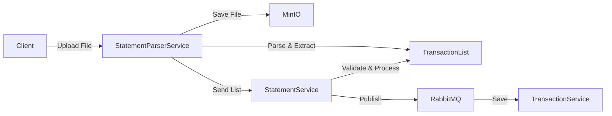
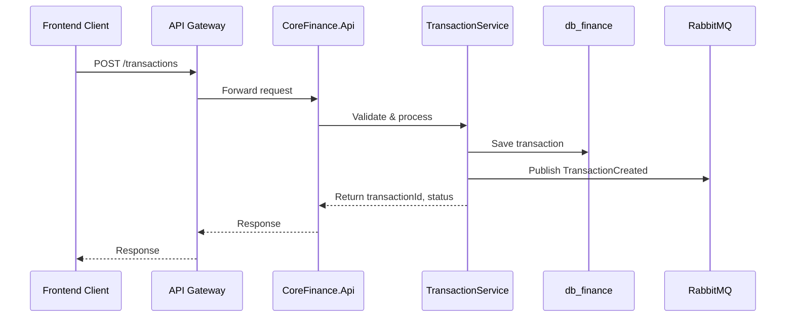

# CoreFinance Design Document

## 1. Tổng quan CoreFinance

CoreFinance là bounded context thuộc hệ thống TiHoMo, chịu trách nhiệm quản lý tài khoản, giao dịch, và sao kê tài chính cá nhân. Dịch vụ này được xây dựng theo kiến trúc microservices, đảm bảo tính độc lập, mở rộng và dễ tích hợp với các domain khác như MoneyManagement, Planning & Investment.

### Mục tiêu chính
- Quản lý tài khoản tài chính (AccountService)
- Xử lý giao dịch (TransactionService)
- Quản lý và import sao kê (StatementService)
- Đảm bảo tính nhất quán dữ liệu qua event-driven (RabbitMQ)
- Tích hợp với hệ thống lưu trữ file (MinIO) và các dịch vụ phân tích báo cáo

---

## 2. Kiến trúc tổng thể

### 2.1 Microservice Structure

- **CoreFinance.Api**: REST API cho các thao tác CRUD tài khoản, giao dịch, sao kê
- **CoreFinance.Application**: Business logic, CQRS, validation
- **CoreFinance.Domain**: Domain models, aggregates, business rules
- **CoreFinance.Infrastructure**: Data access (EF Core/PostgreSQL), event publishing, file storage integration
- **CoreFinance.Contracts**: DTOs, contracts cho event/message bus

### 2.2 Database

- **db_finance** (PostgreSQL): Lưu trữ tài khoản, giao dịch, sao kê
- Sử dụng EF Core, migration quản lý schema

### 2.3 Event-Driven Communication

- **RabbitMQ**: Publish các event như AccountChanged, TransactionCreated, StatementImported
- Các service khác (MoneyManagement, Reporting) consume event để đồng bộ dữ liệu

### 2.4 File Storage

- **MinIO**: Lưu trữ file sao kê gốc, file đã xử lý, file tạm
- Tích hợp qua SDK hoặc HTTP API

---

## 3. Flow chi tiết các service

### 3.1 AccountService

- Nhận CRUD request từ API Gateway
- Validate dữ liệu, kiểm tra quyền sở hữu
- Lưu vào db_finance
- Publish event AccountChanged lên RabbitMQ

### 3.2 TransactionService

- Nhận request tạo giao dịch
- Validate số dư, loại giao dịch, áp dụng rule (recurring, split, fee)
- Lưu vào db_finance
- Publish TransactionCreated lên RabbitMQ

### 3.3 StatementService

- Nhận file sao kê từ client qua API Gateway
- Gửi file sang StatementParserService (MinIO)
- Nhận danh sách giao dịch đã parse, validate và lưu vào db_finance
- Publish StatementImported lên RabbitMQ

---

## 4. Luồng xử lý dữ liệu & sequence diagram

### 4.1 Import Statement Flow

### 4.2 Transaction Creation Flow

---

## 5. API Endpoints (dự kiến)

- `POST /accounts` - Tạo tài khoản mới
- `GET /accounts` - Lấy danh sách tài khoản
- `POST /transactions` - Tạo giao dịch mới
- `GET /transactions` - Lấy lịch sử giao dịch
- `POST /statements/import` - Import file sao kê
- `GET /statements` - Lấy danh sách sao kê

---

## 6. Patterns & Best Practices

- **Clean Architecture**: Tách biệt domain, application, infrastructure
- **CQRS**: Command/Query separation cho các thao tác phức tạp
- **Event Sourcing** (option cho reporting): Lưu event để tái tạo trạng thái
- **Unit/Integration Test**: Đảm bảo mỗi flow đều có test
- **DTO rõ ràng**: Input/output qua API đều dùng DTO
- **Saga/Outbox**: Đảm bảo transaction consistency khi cần

---

## 7. Security & Validation

- **Authentication**: JWT Bearer từ Identity domain
- **Authorization**: Kiểm tra quyền sở hữu tài khoản/giao dịch
- **Validation**: FluentValidation cho DTO, DataAnnotations cho model

---

## 8. Monitoring & Logging

- **Health Check**: /health endpoint kiểm tra DB, MinIO, RabbitMQ
- **Structured Logging**: Sử dụng Serilog, log correlationId
- **Audit Log**: Lưu lịch sử thay đổi tài khoản/giao dịch

---

## 9. Deployment & DevOps

- **Docker Compose**: Cho local development
- **Kubernetes**: Cho production
- **CI/CD**: Tự động test, build, deploy

---

## 10. Lưu ý triển khai

- Đảm bảo transaction consistency với các flow quan trọng
- Tích hợp chặt chẽ với API Gateway (Ocelot)
- Đảm bảo các event publish đúng chuẩn, có retry/dead letter
- Tất cả API expose OpenAPI/Swagger

---

*Bản thiết kế này tổng hợp từ Memory Bank, overview_v4.md và flowcharts_v4.md. Nếu cần chi tiết về từng service, vui lòng tham khảo các tài liệu thành phần hoặc liên hệ nhóm kiến trúc.*
