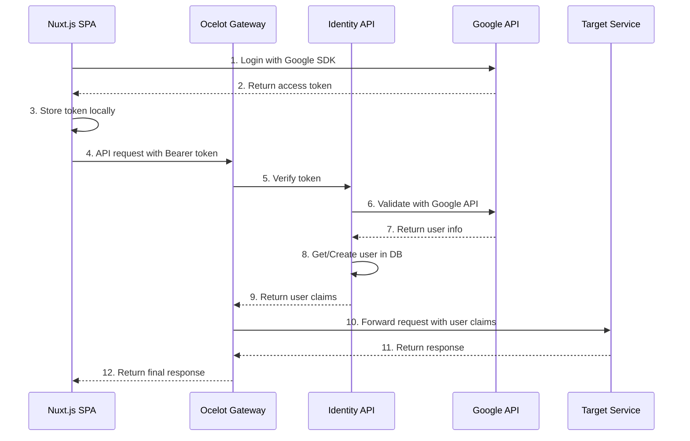
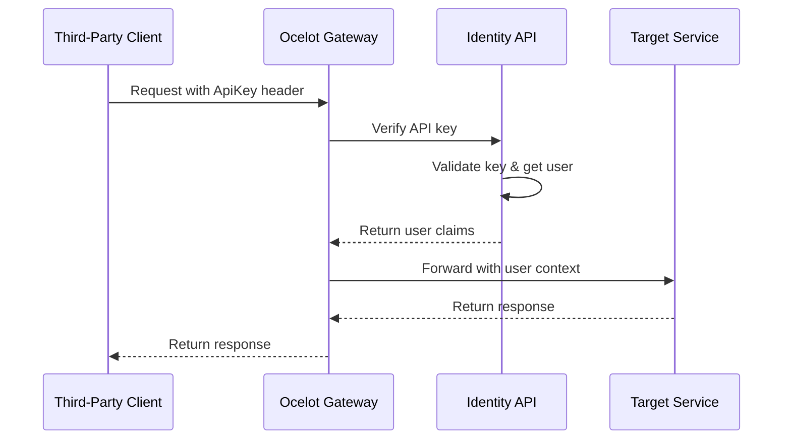
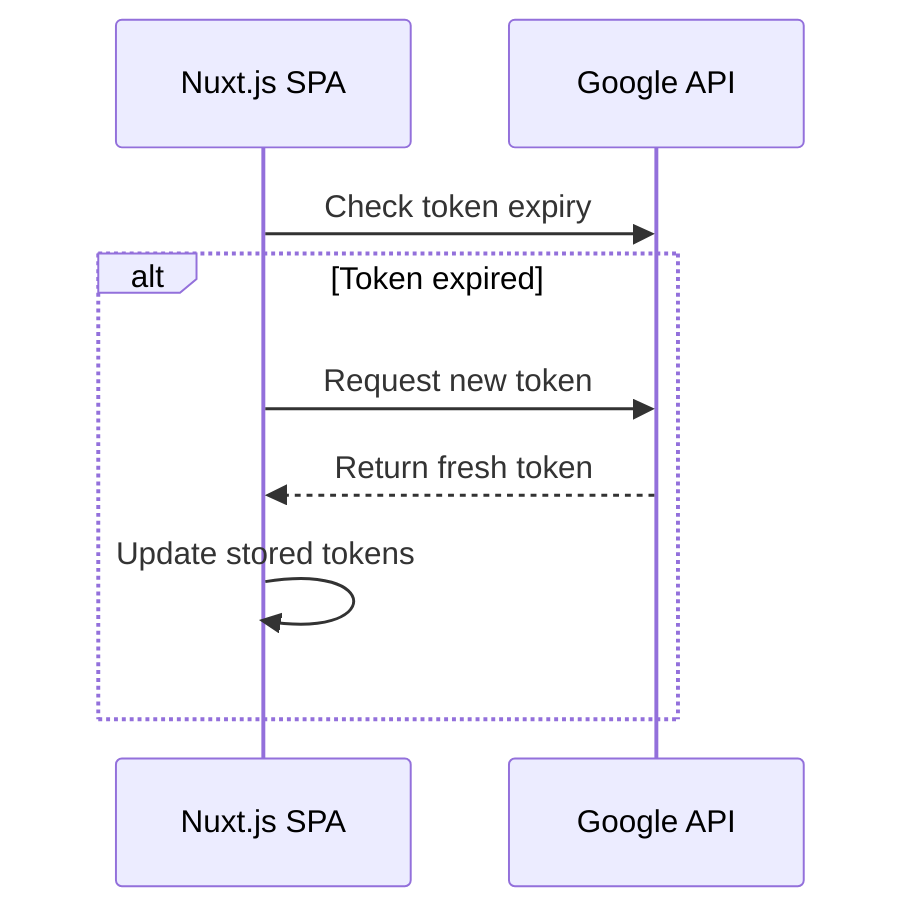
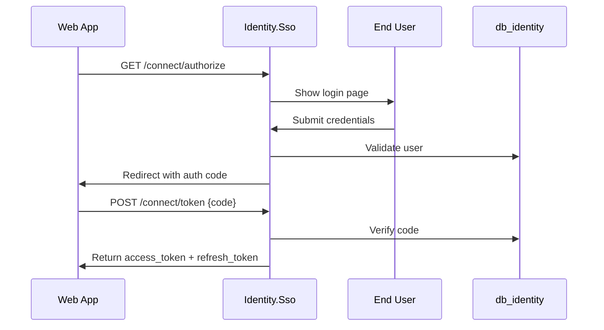

# Identity Service - Complete Design Document

## 1. Overview

Identity Service là bounded context cốt lõi của hệ thống TiHoMo, chịu trách nhiệm xác thực, phân quyền và quản lý người dùng. Thiết kế này tập trung vào social login integration (Google, Facebook, Apple) với stateless authentication pattern thông qua API Gateway.

### 1.1 Mục tiêu chính
- Cung cấp xác thực đa dạng (Social Login, API Key)
- Quản lý người dùng và phân quyền đơn giản
- Stateless authentication với high performance
- Tích hợp seamless với API Gateway
- Đảm bảo bảo mật và khả năng scale

### 1.2 Problem Statement

Hệ thống SSO truyền thống thường phức tạp với:
- Multiple authentication flows (OpenId Connect, IdentityServer4, custom sessions)
- Complex database schema với nhiều bảng không cần thiết
- Complicated redirect flows giữa multiple services
- Khó maintain và debug

### 1.3 Proposed Solution

Simplified design sử dụng pattern **stateless token verification** thông qua API Gateway, dựa trên proven patterns từ Microsoft eShop và ABP Framework.

## 2. Kiến trúc tổng quan (Primary Approach)

### 2.1 High-Level Architecture

```
┌─────────────────┐    ┌──────────────────┐    ┌─────────────────┐    ┌──────────────────┐
│   Nuxt.js SPA   │    │ Ocelot Gateway   │    │ Identity API    │    │   Other APIs     │
│                 │    │                  │    │                 │    │ (CoreFinance,    │
│                 │    │                  │    │                 │    │  MoneyMgmt, etc) │
└─────────────────┘    └──────────────────┘    └─────────────────┘    └──────────────────┘
         │                        │                        │                        │
         │ 1. Login Social        │                        │                        │
         │    Get access_token    │                        │                        │
         │                        │                        │                        │
         │ 2. API calls with      │                        │                        │
         │    Authorization:      │                        │                        │
         │    Bearer {token}      │                        │                        │
         └────────────────────────┤                        │                        │
                                  │ 3. Forward to Identity │                        │
                                  │    for token verify    │                        │
                                  └────────────────────────┤                        │
                                                           │ 4. Verify token,       │
                                                           │    get/create user     │
                                                           │                        │
                                                           │ 5. Return user claims  │
                                                           ├────────────────────────┤
                                                           │ 6. Forward to target   │
                                                           │    service with claims │
                                                           └────────────────────────┘
```

### 2.2 Core Components

#### Frontend (Nuxt.js)
```javascript
// plugins/auth.client.js
export default defineNuxtPlugin(() => {
  const { $google, $facebook, $apple } = useNuxtApp()
  
  const login = async (provider) => {
    let result
    switch (provider) {
      case 'google':
        result = await $google.signIn()
        break
      case 'facebook':
        result = await $facebook.login()
        break
      case 'apple':
        result = await $apple.signIn()
        break
    }
    
    // Store access token for API calls
    const authStore = useAuthStore()
    authStore.setToken(result.access_token)
    
    return result
  }
  
  return {
    provide: {
      auth: { login }
    }
  }
})
```

#### API Gateway (Ocelot)
```csharp
// Program.cs
builder.Services.AddAuthentication("Bearer")
    .AddJwtBearer("Bearer", options =>
    {
        options.Authority = "http://localhost:5001"; // Identity API
        options.TokenValidationParameters = new TokenValidationParameters
        {
            ValidateAudience = false,
            ValidateIssuer = false,
            ValidateLifetime = true,
            ClockSkew = TimeSpan.Zero
        };
    });

// Custom middleware for token forwarding
builder.Services.AddHttpClient("identity-verify", client =>
{
    client.BaseAddress = new Uri("http://localhost:5001");
});
```

#### Identity API
```csharp
// Models/User.cs
public class User
{
    public Guid Id { get; set; }
    public string Email { get; set; }
    public string Name { get; set; }
    public string AvatarUrl { get; set; }
    public DateTime CreatedAt { get; set; }
    public DateTime UpdatedAt { get; set; }
    public bool IsActive { get; set; } = true;
    
    public List<UserLogin> Logins { get; set; } = new();
    public List<ApiKey> ApiKeys { get; set; } = new();
}

// Controllers/AuthController.cs
[ApiController]
[Route("api/auth")]
public class AuthController : ControllerBase
{
    private readonly TokenVerificationService _tokenVerificationService;
    
    [HttpPost("verify")]
    public async Task<TokenVerificationResult> VerifyToken([FromBody] VerifyTokenRequest request)
    {
        var result = await _tokenVerificationService.VerifyAsync(request.Token, request.Provider);
        return result;
    }
}
```

### 2.3 Database Schema

```sql
-- Users table
CREATE TABLE Users (
    Id uniqueidentifier PRIMARY KEY DEFAULT NEWID(),
    Email nvarchar(256) NOT NULL,
    Name nvarchar(256) NOT NULL,
    AvatarUrl nvarchar(512),
    CreatedAt datetime2 NOT NULL DEFAULT GETUTCDATE(),
    UpdatedAt datetime2 NOT NULL DEFAULT GETUTCDATE(),
    IsActive bit NOT NULL DEFAULT 1
);

-- User logins (external providers)
CREATE TABLE UserLogins (
    Id uniqueidentifier PRIMARY KEY DEFAULT NEWID(),
    UserId uniqueidentifier NOT NULL,
    Provider nvarchar(50) NOT NULL, -- Google, Facebook, Apple
    ProviderUserId nvarchar(256) NOT NULL,
    CreatedAt datetime2 NOT NULL DEFAULT GETUTCDATE(),
    
    FOREIGN KEY (UserId) REFERENCES Users(Id),
    UNIQUE(Provider, ProviderUserId)
);

-- API Keys for third-party integration
CREATE TABLE ApiKeys (
    Id uniqueidentifier PRIMARY KEY DEFAULT NEWID(),
    UserId uniqueidentifier NOT NULL,
    Name nvarchar(256) NOT NULL,
    HashedKey nvarchar(512) NOT NULL,
    KeyPrefix nvarchar(16) NOT NULL, -- First 8 chars for identification
    Scopes nvarchar(max), -- JSON array of scopes
    Status nvarchar(20) NOT NULL DEFAULT 'Active', -- Active, Revoked, Expired
    CreatedAt datetime2 NOT NULL DEFAULT GETUTCDATE(),
    ExpiresAt datetime2,
    LastUsedAt datetime2,
    UsageCount int NOT NULL DEFAULT 0,
    
    FOREIGN KEY (UserId) REFERENCES Users(Id)
);

-- Indexes
CREATE INDEX IX_Users_Email ON Users(Email);
CREATE INDEX IX_UserLogins_UserId ON UserLogins(UserId);
CREATE INDEX IX_UserLogins_Provider_ProviderUserId ON UserLogins(Provider, ProviderUserId);
CREATE INDEX IX_ApiKeys_UserId ON ApiKeys(UserId);
CREATE INDEX IX_ApiKeys_KeyPrefix ON ApiKeys(KeyPrefix);
```

### 2.4 API Endpoints

**Authentication:**
- `POST /api/auth/verify` - Token verification (internal)
- `POST /api/auth/login/google` - Google login
- `POST /api/auth/login/facebook` - Facebook login  
- `POST /api/auth/login/apple` - Apple login

**User Management:**
- `GET /api/users/me` - Get current user profile
- `GET /api/users/{id}` - Get user by ID
- `PUT /api/users/{id}` - Update user profile

**API Key Management:**
- `POST /api/apikeys` - Create API key
- `GET /api/apikeys` - List user's API keys
- `DELETE /api/apikeys/{id}` - Revoke API key

## 3. Request Flow Analysis

### 3.1 Overall System Flow



### 3.2 Detailed Flow Breakdown

#### Phase 1: User Authentication (Social Login)
```javascript
// Frontend (Nuxt.js)
const loginWithGoogle = async () => {
  // 1. Initiate Google OAuth flow
  const credential = await google.accounts.id.prompt()
  
  // 2. Store token for subsequent API calls
  const authStore = useAuthStore()
  authStore.setToken(credential)
  
  return credential
}
```

#### Phase 2: API Request Flow
```csharp
// Gateway - Authentication Middleware
public class BearerTokenAuthenticationHandler : AuthenticationHandler
{
    protected override async Task<AuthenticateResult> HandleAuthenticateAsync()
    {
        // Extract token from header
        var token = GetTokenFromHeader();
        
        // Verify with Identity service
        var verificationResult = await _identityClient.VerifyTokenAsync(token);
        
        if (verificationResult.IsValid)
        {
            var claims = CreateClaimsFromResult(verificationResult);
            var principal = new ClaimsPrincipal(new ClaimsIdentity(claims, "Bearer"));
            return AuthenticateResult.Success(new AuthenticationTicket(principal, "Bearer"));
        }
        
        return AuthenticateResult.Fail("Invalid token");
    }
}
```

#### Phase 3: Target Service Processing  
```csharp
// CoreFinance.Api - TransactionController
[HttpGet]
[Authorize] // Gateway đã verify token và inject claims
public async Task<IActionResult> GetTransactions()
{
    // Gateway đã inject user claims vào headers:
    // X-User-Id: {userId}
    // X-User-Email: {email}
    var userId = HttpContext.Request.Headers["X-User-Id"];
    
    var transactions = await _transactionService.GetUserTransactionsAsync(userId);
    return Ok(transactions);
}
```

### 3.3 Alternative Flow: API Key Authentication



## 4. Key Advantages

### ✅ Stateless & Scalable
- Không có server-side sessions
- Gateway có thể scale horizontally
- Identity service chỉ cần verify token, không maintain state

### ✅ Security
- Token verification với social provider mỗi request (hoặc với caching TTL ngắn)
- API key được hash trong database
- Claims được inject an toàn qua headers

### ✅ Performance
- Token verification có thể được cache (5 phút TTL)  
- Single hop tới Identity service
- Target services không cần gọi Identity service

### ✅ Simplicity
- Loại bỏ OAuth2/OIDC server complexity
- Straight-forward social login flow
- Clear separation of concerns

## 5. Error Handling & Edge Cases

### 5.1 Token Refresh Flow


### 5.2 Rate Limiting & Abuse Prevention
- Gateway implements rate limiting per IP/user
- Identity service tracks failed verification attempts  
- API keys có usage quotas và rate limits

## 6. Alternative Architecture (Complex Approach - Reference)

### 6.1 Dual Service Architecture

**Identity.Sso (Port 5217) - SSO Server:**
- Single Sign-On server cho OAuth2/OIDC flows
- Login/Register/Consent pages với Razor Views
- Cookie-based authentication cho UI sessions
- Target Users: End users thông qua browser interface

**Identity.Api (Port 5228) - Management API:**
- REST API để quản lý users, roles, API keys  
- JWT Bearer tokens và API Key authentication
- Target Users: Applications, admins, third-party integrations

### 6.2 OAuth2/OIDC Flows


## 7. Production-Ready Improvements

### 7.1 Multi-Layer Token Validation Strategy

**Issue**: Verifying with Google on every request is inefficient and creates external dependency risk.

**Solution**: Implement multi-layer validation with local verification and intelligent caching.

```csharp
public class EnhancedTokenValidationService
{
    private readonly IMemoryCache _cache;
    private readonly IGoogleTokenValidator _googleValidator;
    private readonly ILocalTokenValidator _localValidator;
    
    public async Task<TokenValidationResult> ValidateAsync(string token, string provider)
    {
        // Layer 1: Check cache first
        var cacheKey = $"token:{provider}:{ComputeHash(token)}";
        if (_cache.TryGetValue(cacheKey, out TokenValidationResult cachedResult))
        {
            return cachedResult;
        }
        
        // Layer 2: Local validation (if we have local JWT)
        var localResult = await _localValidator.ValidateAsync(token);
        if (localResult.IsValid)
        {
            _cache.Set(cacheKey, localResult, TimeSpan.FromMinutes(5));
            return localResult;
        }
        
        // Layer 3: External provider validation
        var externalResult = await _googleValidator.ValidateAsync(token);
        if (externalResult.IsValid)
        {
            _cache.Set(cacheKey, externalResult, TimeSpan.FromMinutes(5));
        }
        
        return externalResult;
    }
}
```

### 7.2 Comprehensive Refresh Token Management

**Issue**: Google ID tokens expire in 1 hour without proper refresh mechanism.

**Solution**: Implement automatic token refresh with secure storage and error handling.

```csharp
public class RefreshTokenService
{
    private readonly IDistributedCache _cache;
    private readonly IGoogleTokenProvider _googleProvider;
    
    public async Task<RefreshTokenResult> RefreshTokenAsync(string refreshToken)
    {
        try
        {
            var result = await _googleProvider.RefreshAsync(refreshToken);
            
            // Store new tokens securely
            await _cache.SetStringAsync($"access_token:{result.UserId}", 
                result.AccessToken, 
                new DistributedCacheEntryOptions
                {
                    AbsoluteExpirationRelativeToNow = TimeSpan.FromMinutes(55) // 5min buffer
                });
                
            return result;
        }
        catch (Exception ex)
        {
            // Log and handle refresh failure
            _logger.LogError(ex, "Token refresh failed for user");
            return RefreshTokenResult.Failed();
        }
    }
}
```

### 7.3 Circuit Breaker & Resilience Patterns

**Issue**: Single points of failure and external service dependencies.

**Solution**: Implement circuit breaker, fallback strategies, and timeout management.

```csharp
public class ResilientAuthenticationService
{
    private readonly ICircuitBreaker _googleCircuitBreaker;
    private readonly IFallbackTokenValidator _fallbackValidator;
    
    public async Task<AuthenticationResult> AuthenticateAsync(string token)
    {
        try
        {
            // Try primary authentication with circuit breaker
            return await _googleCircuitBreaker.ExecuteAsync(async () =>
            {
                return await _primaryValidator.ValidateAsync(token);
            });
        }
        catch (CircuitBreakerOpenException)
        {
            // Circuit breaker is open, use fallback
            _logger.LogWarning("Google authentication circuit breaker open, using fallback");
            return await _fallbackValidator.ValidateAsync(token);
        }
    }
}

// Circuit Breaker Configuration
public class CircuitBreakerOptions
{
    public int FailureThreshold { get; set; } = 5;
    public TimeSpan RetryTimeout { get; set; } = TimeSpan.FromSeconds(30);
    public TimeSpan SamplingDuration { get; set; } = TimeSpan.FromMinutes(2);
}
```

### 7.4 Performance Optimization & Multi-Level Caching

**Issue**: Database queries on every request causing performance bottlenecks.

**Solution**: Implement layered caching strategy with different TTLs.

```csharp
public class CachedUserService
{
    private readonly IMemoryCache _l1Cache; // In-memory cache
    private readonly IDistributedCache _l2Cache; // Redis cache
    private readonly IUserRepository _repository;
    
    public async Task<User> GetUserByIdAsync(Guid userId)
    {
        // L1 Cache (Memory) - 1 minute TTL
        var cacheKey = $"user:{userId}";
        if (_l1Cache.TryGetValue(cacheKey, out User cachedUser))
        {
            return cachedUser;
        }
        
        // L2 Cache (Redis) - 10 minute TTL
        var distributedUser = await _l2Cache.GetStringAsync(cacheKey);
        if (!string.IsNullOrEmpty(distributedUser))
        {
            var user = JsonSerializer.Deserialize<User>(distributedUser);
            _l1Cache.Set(cacheKey, user, TimeSpan.FromMinutes(1));
            return user;
        }
        
        // Database fallback
        var dbUser = await _repository.GetByIdAsync(userId);
        if (dbUser != null)
        {
            // Cache in both layers
            _l1Cache.Set(cacheKey, dbUser, TimeSpan.FromMinutes(1));
            await _l2Cache.SetStringAsync(cacheKey, 
                JsonSerializer.Serialize(dbUser),
                new DistributedCacheEntryOptions
                {
                    AbsoluteExpirationRelativeToNow = TimeSpan.FromMinutes(10)
                });
        }
        
        return dbUser;
    }
}
```

## 8. Monitoring & Observability

### 8.1 Key Metrics
- Token verification success/failure rates
- API key usage statistics  
- Response times cho verification calls
- Social provider API health

### 8.2 Logging Strategy
```csharp
// Structured logging trong Identity service
_logger.LogInformation("Token verification", new {
    Provider = request.Provider,
    UserId = result.UserId,
    Duration = stopwatch.ElapsedMilliseconds,
    Success = result.IsValid
});

// API Key usage logging
_logger.LogInformation("API key used", new {
    KeyId = apiKey.Id,
    UserId = apiKey.UserId,
    Endpoint = context.Request.Path,
    UserAgent = context.Request.Headers.UserAgent
});
```

## 9. Security Considerations

### 9.1 Token Security
- Always verify tokens with provider APIs or use cached validation
- Implement token expiry checks và automatic refresh
- Use HTTPS only for token transmission
- Store tokens securely (HttpOnly cookies for web, secure storage for mobile)

### 9.2 API Key Security  
- Generate cryptographically secure random keys (32 bytes minimum)
- Store only SHA256 hash in database, never plaintext
- Support key rotation và expiration policies
- Implement rate limiting per API key
- Log all API key usage for auditing

### 9.3 CORS & CSP Configuration
```csharp
// CORS for frontend integration
builder.Services.AddCors(options =>
{
    options.AddPolicy("AllowFrontend", policy =>
    {
        policy.WithOrigins("http://localhost:3000", "https://yourdomain.com")
              .AllowAnyHeader()
              .AllowAnyMethod()
              .AllowCredentials();
    });
});
```

## Conclusion

Thiết kế Identity Service này cung cấp một authentication solution đơn giản, an toàn và có thể scale được. Bằng cách sử dụng stateless token verification pattern, chúng ta đạt được:

1. **Easier maintenance** - ít components phức tạp để manage
2. **Better performance** - stateless verification với intelligent caching  
3. **Enhanced security** - direct verification với social providers
4. **Developer experience** - clear và predictable flows
5. **Production ready** - với resilience patterns và monitoring

Flow này phù hợp với modern microservices architecture và social authentication patterns được sử dụng rộng rãi trong industry.

---
**Created**: December 2024  
**Last Updated**: January 2025
