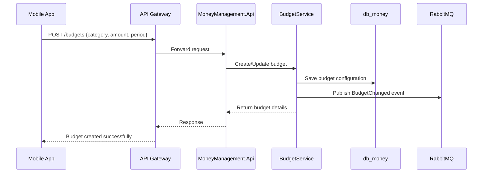
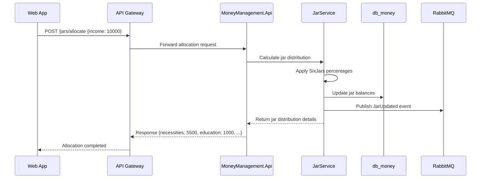
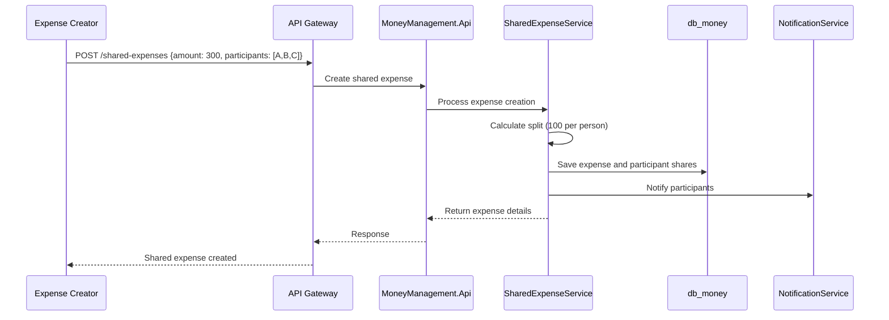

# MoneyManagement Design Document

## 1. Tổng quan MoneyManagement

MoneyManagement là bounded context quan trọng của hệ thống TiHoMo, chịu trách nhiệm quản lý ngân sách, phân bổ tiền theo phương pháp SixJars và quản lý chi tiêu chia sẻ. Domain này giúp người dùng kiểm soát tài chính cá nhân thông qua các công cụ lập kế hoạch và theo dõi chi tiêu hiệu quả.

### Mục tiêu chính
- Quản lý ngân sách theo danh mục chi tiêu (BudgetService)
- Phân bổ tiền theo phương pháp SixJars (JarService)
- Quản lý chi tiêu chia sẻ nhóm (SharedExpenseService)
- Theo dõi và cảnh báo vượt ngân sách
- Tích hợp với CoreFinance để đồng bộ giao dịch và số dư

---

## 2. Kiến trúc tổng thể

### 2.1 Microservice Structure

- **MoneyManagement.Api**: REST API cho các thao tác CRUD budget, jars, shared expenses
- **MoneyManagement.Application**: Business logic, budget calculation, jar allocation algorithms
- **MoneyManagement.Domain**: Domain models, aggregates, business rules cho budget management
- **MoneyManagement.Infrastructure**: Data access (EF Core/PostgreSQL), event publishing
- **MoneyManagement.Contracts**: DTOs, contracts cho event/message bus

### 2.2 Database

- **db_money** (PostgreSQL): Lưu trữ budgets, jars, shared expenses, allocations
- Sử dụng EF Core, migration quản lý schema
- Optimized indexes cho budget tracking và jar calculations

### 2.3 Event-Driven Communication

- **RabbitMQ**: Publish các event như BudgetChanged, JarUpdated, SharedExpenseCreated
- Consume events từ CoreFinance (TransactionCreated) để update budget tracking
- Notify Reporting service để tạo báo cáo tài chính

### 2.4 Core Services Integration

- **CoreFinance Integration**: Đồng bộ transaction data để track budget spending
- **Identity Integration**: User context và authorization
- **Notification Integration**: Alerts khi vượt ngân sách

---

## 3. Flow chi tiết các service

### 3.1 BudgetService

**Primary Responsibilities:**
- Tạo và quản lý budget categories (Food, Transport, Entertainment, etc.)
- Theo dõi chi tiêu so với budget
- Cảnh báo khi vượt ngân sách
- Phân tích xu hướng chi tiêu

**Flow xử lý:**


### 3.2 JarService (SixJars Method)

**SixJars Methodology:**
- **Necessities (55%)**: Rent, utilities, groceries
- **Education (10%)**: Books, courses, skill development
- **Long-term Savings (10%)**: Emergency fund, retirement
- **Entertainment (10%)**: Movies, dining out, hobbies
- **Financial Freedom (10%)**: Investments, passive income
- **Give (5%)**: Charity, gifts, donations

**Primary Responsibilities:**
- Phân bổ thu nhập theo tỷ lệ SixJars
- Theo dõi số dư từng jar
- Tự động allocation khi có thu nhập mới
- Điều chỉnh tỷ lệ theo preference cá nhân

**Flow xử lý:**


### 3.3 SharedExpenseService

**Primary Responsibilities:**
- Tạo và quản lý group expenses
- Tính toán chia sẻ chi phí theo participants
- Theo dõi ai đã trả, ai còn nợ
- Integration với payment systems

**Flow xử lý:**


---

## 4. Domain Models & Aggregates

### 4.1 Budget Aggregate

```csharp
public class Budget : AggregateRoot
{
    public int Id { get; private set; }
    public int UserId { get; private set; }
    public string Category { get; private set; }
    public decimal AllocatedAmount { get; private set; }
    public decimal SpentAmount { get; private set; }
    public BudgetPeriod Period { get; private set; } // Monthly, Weekly, Yearly
    public DateTime StartDate { get; private set; }
    public DateTime EndDate { get; private set; }
    public bool IsActive { get; private set; }
    
    // Business methods
    public void UpdateSpending(decimal amount) { }
    public decimal GetRemainingAmount() => AllocatedAmount - SpentAmount;
    public bool IsOverBudget() => SpentAmount > AllocatedAmount;
    public decimal GetSpendingPercentage() => SpentAmount / AllocatedAmount * 100;
}
```

### 4.2 SixJars Aggregate

```csharp
public class SixJars : AggregateRoot
{
    public int Id { get; private set; }
    public int UserId { get; private set; }
    public JarConfiguration Configuration { get; private set; }
    public List<JarBalance> Balances { get; private set; }
    
    public void AllocateIncome(decimal income)
    {
        // Apply percentages and update balances
    }
    
    public void SpendFromJar(JarType jarType, decimal amount)
    {
        // Deduct from specific jar
    }
}

public class JarBalance : ValueObject
{
    public JarType Type { get; private set; }
    public decimal Balance { get; private set; }
    public decimal Percentage { get; private set; }
}

public enum JarType
{
    Necessities,
    Education,
    LongTermSavings,
    Entertainment,
    FinancialFreedom,
    Give
}
```

### 4.3 SharedExpense Aggregate

```csharp
public class SharedExpense : AggregateRoot
{
    public int Id { get; private set; }
    public int CreatorId { get; private set; }
    public string Description { get; private set; }
    public decimal TotalAmount { get; private set; }
    public DateTime ExpenseDate { get; private set; }
    public List<ExpenseParticipant> Participants { get; private set; }
    public ExpenseStatus Status { get; private set; }
    
    public void AddParticipant(int userId, decimal shareAmount) { }
    public void MarkPaid(int userId, decimal amount) { }
    public decimal GetUserBalance(int userId) { }
    public bool IsFullySettled() { }
}
```

---

## 5. API Endpoints

### 5.1 Budget Management

**Budget CRUD:**
- `GET /budgets` - Lấy danh sách budget của user
- `POST /budgets` - Tạo budget mới
- `PUT /budgets/{id}` - Cập nhật budget
- `DELETE /budgets/{id}` - Xóa budget
- `GET /budgets/{id}/spending` - Chi tiết spending vs budget

**Budget Analytics:**
- `GET /budgets/summary` - Tổng quan tất cả budgets
- `GET /budgets/alerts` - Cảnh báo vượt budget
- `GET /budgets/trends` - Xu hướng chi tiêu theo thời gian

### 5.2 SixJars Management

**Jar Operations:**
- `GET /jars` - Lấy thông tin tất cả jars
- `POST /jars/allocate` - Phân bổ thu nhập vào jars
- `POST /jars/spend` - Chi tiêu từ jar cụ thể
- `PUT /jars/configuration` - Điều chỉnh tỷ lệ jars
- `GET /jars/history` - Lịch sử giao dịch jars

**Jar Analytics:**
- `GET /jars/summary` - Tổng quan số dư các jars
- `GET /jars/recommendations` - Gợi ý tối ưu allocation

### 5.3 Shared Expenses

**Expense Management:**
- `GET /shared-expenses` - Danh sách shared expenses
- `POST /shared-expenses` - Tạo shared expense mới
- `GET /shared-expenses/{id}` - Chi tiết expense
- `POST /shared-expenses/{id}/payments` - Ghi nhận thanh toán
- `PUT /shared-expenses/{id}/settle` - Settle expense

**Expense Analytics:**
- `GET /shared-expenses/balance` - Số dư nợ/có với friends
- `GET /shared-expenses/statistics` - Thống kê group spending

---

## 6. Event Integration & Messaging

### 6.1 Published Events

**Budget Events:**
- `BudgetCreated`: New budget established
- `BudgetUpdated`: Budget amount/category changed
- `BudgetExceeded`: Spending exceeded budget limit
- `BudgetAlertTriggered`: Warning when approaching limit

**SixJars Events:**
- `IncomeAllocated`: New income distributed to jars
- `JarSpendingRecorded`: Money spent from specific jar
- `JarConfigurationChanged`: User modified jar percentages
- `JarBalanceUpdated`: Jar balance changed

**SharedExpense Events:**
- `SharedExpenseCreated`: New group expense created
- `ExpenseParticipantAdded`: New participant joined expense
- `ExpensePaymentRecorded`: Payment made by participant
- `ExpenseFullySettled`: All participants paid their share

### 6.2 Consumed Events

**From CoreFinance:**
- `TransactionCreated`: Update budget spending and jar balances
- `AccountBalanceChanged`: Sync available money for allocation

**From Identity:**
- `UserProfileUpdated`: Update user preferences
- `UserDeactivated`: Archive user's money management data

---

## 7. Business Rules & Algorithms

### 7.1 Budget Tracking Algorithm

```csharp
public class BudgetTrackingService
{
    public async Task UpdateBudgetSpending(TransactionCreatedEvent transaction)
    {
        var budget = await GetBudgetByCategory(transaction.Category);
        if (budget != null)
        {
            budget.UpdateSpending(transaction.Amount);
            
            if (budget.IsOverBudget())
            {
                await PublishBudgetExceededEvent(budget);
            }
            else if (budget.GetSpendingPercentage() > 80)
            {
                await PublishBudgetAlertEvent(budget);
            }
        }
    }
}
```

### 7.2 SixJars Allocation Algorithm

```csharp
public class SixJarsAllocationService
{
    private readonly Dictionary<JarType, decimal> _defaultPercentages = new()
    {
        { JarType.Necessities, 0.55m },
        { JarType.Education, 0.10m },
        { JarType.LongTermSavings, 0.10m },
        { JarType.Entertainment, 0.10m },
        { JarType.FinancialFreedom, 0.10m },
        { JarType.Give, 0.05m }
    };
    
    public JarAllocationResult AllocateIncome(decimal income, JarConfiguration config = null)
    {
        var percentages = config?.CustomPercentages ?? _defaultPercentages;
        var result = new JarAllocationResult();
        
        foreach (var jarType in Enum.GetValues<JarType>())
        {
            var amount = income * percentages[jarType];
            result.Allocations[jarType] = Math.Round(amount, 2);
        }
        
        return result;
    }
}
```

### 7.3 Shared Expense Split Calculation

```csharp
public class ExpenseSplitCalculator
{
    public List<ParticipantShare> CalculateEqualSplit(decimal totalAmount, List<int> participantIds)
    {
        var sharePerPerson = Math.Round(totalAmount / participantIds.Count, 2);
        var remainder = totalAmount - (sharePerPerson * participantIds.Count);
        
        var shares = participantIds.Select((id, index) => new ParticipantShare
        {
            UserId = id,
            Amount = sharePerPerson + (index == 0 ? remainder : 0) // Add remainder to first person
        }).ToList();
        
        return shares;
    }
    
    public List<ParticipantShare> CalculateCustomSplit(decimal totalAmount, Dictionary<int, decimal> customShares)
    {
        // Implementation for custom percentage splits
    }
}
```

---

## 8. Performance & Optimization

### 8.1 Caching Strategy

**Redis Caching:**
- Budget summaries (15 minutes TTL)
- Jar balances (5 minutes TTL)
- Shared expense calculations (30 minutes TTL)
- User spending patterns (1 hour TTL)

### 8.2 Database Optimization

**Indexes:**
- `IX_Budget_UserId_Period` - Fast budget retrieval
- `IX_JarBalance_UserId_Type` - Efficient jar lookups
- `IX_SharedExpense_Participants` - Quick expense sharing queries
- `IX_Transaction_Category_Date` - Budget tracking optimization

### 8.3 Async Processing

**Background Jobs:**
- Daily budget recalculation
- Monthly jar rebalancing
- Expense reminder notifications
- Budget alert processing

---

## 9. Security & Validation

### 9.1 Authorization Rules

**Budget Access:**
- Users can only access their own budgets
- Admin users can view aggregate budget statistics
- API keys require "budget:read" or "budget:write" scopes

**SixJars Access:**
- Jar configurations are user-specific
- No cross-user jar access allowed
- Allocation history requires authentication

**SharedExpense Access:**
- Only participants can view expense details
- Only creator can modify expense
- Payment recording requires participant validation

### 9.2 Input Validation

**Budget Validation:**
- Amount must be positive
- Category must be from predefined list
- Period dates must be valid and future-dated

**Jar Validation:**
- Allocation percentages must sum to 100%
- Jar balances cannot go negative
- Income amount must be positive

**SharedExpense Validation:**
- Total amount must equal sum of participant shares
- All participants must be valid users
- Expense description required and non-empty

---

## 10. Monitoring & Analytics

### 10.1 Health Checks

- `/health` endpoint
- Database connectivity (db_money)
- RabbitMQ event bus connectivity
- Redis cache availability
- External service dependencies

### 10.2 Key Metrics

**Budget Metrics:**
- Budget adherence rate by category
- Most exceeded budget categories
- Average spending vs budget ratio
- User budget creation trends

**SixJars Metrics:**
- Average jar allocation percentages
- Most/least used jar types
- Income allocation frequency
- Jar balance distribution

**SharedExpense Metrics:**
- Average expense amount per group
- Settlement time (creation to full payment)
- Most active expense creators
- Payment completion rates

### 10.3 Business Intelligence

**Dashboard Analytics:**
- Real-time spending vs budget comparison
- Jar balance trends over time
- Shared expense settlement patterns
- User engagement with money management features

---

## 11. Testing Strategy

### 11.1 Unit Tests

**Service Layer:**
- Budget calculation logic
- SixJars allocation algorithms
- Shared expense split calculations
- Event publishing mechanisms

**Domain Models:**
- Aggregate business rules
- Value object validations
- Domain event generation

### 11.2 Integration Tests

**API Endpoints:**
- Budget CRUD operations
- Jar allocation flows
- Shared expense management
- Event consumption from CoreFinance

**Database Operations:**
- Complex budget queries
- Jar balance updates
- Multi-user shared expenses

### 11.3 Performance Tests

**Load Testing:**
- High-volume budget updates
- Concurrent jar allocations
- Large group expense calculations
- Event processing throughput

---

## 12. Deployment & DevOps

### 12.1 Container Configuration

**Docker Setup:**
- Multi-stage builds for optimal image size
- Health check integration
- Environment-specific configurations
- Database migration automation

### 12.2 Scaling Strategy

**Horizontal Scaling:**
- Stateless service design
- Load balancer compatibility
- Database connection pooling
- Redis cache cluster support

**Auto-scaling Triggers:**
- CPU utilization > 70%
- Memory usage > 80%
- Request queue depth > 100
- Response time > 2 seconds

---

## 13. Future Enhancements

### 13.1 Advanced Features

**AI-Powered Insights:**
- Predictive budget recommendations
- Spending pattern analysis
- Anomaly detection in expenses
- Personal financial advice

**Social Features:**
- Expense splitting with external users
- Budget sharing with family members
- Group challenges and goals
- Community spending insights

### 13.2 Integration Opportunities

**Bank Integration:**
- Real-time transaction categorization
- Automatic budget updates
- Bank balance synchronization
- Investment account tracking

**Third-party Services:**
- Payment processor integration
- Receipt scanning and categorization
- Bill reminder services
- Financial goal tracking tools

---

*Bản thiết kế này tổng hợp từ Memory Bank, overview_v4.md và flowcharts_v4.md. MoneyManagement domain cung cấp foundation mạnh mẽ cho việc quản lý tài chính cá nhân thông qua budget tracking, SixJars methodology và shared expense management.*
