# Personal Finance Management System - Flow Charts & Architecture Diagrams

## 1. High-Level Microservices Architecture

```mermaid
flowchart TB
  subgraph "Client Layer"
    FE[Web Frontend<br/>React/Angular<br/>Port 3000]
    Mobile[Mobile App<br/>React Native/Flutter]
    ThirdParty[Third Party Apps<br/>API Integration]
  end

  subgraph "Infrastructure Layer"
    subgraph "API Gateway"
      Gateway[Ocelot Gateway<br/>Load Balancer<br/>Port 5000]
      GW_Auth[JWT Middleware]
      GW_CORS[CORS Policy]
      GW_Rate[Rate Limiting]
      GW_Log[Request Logging]
    end
    
    subgraph "Message Bus"
      RabbitMQ[RabbitMQ<br/>Event Broker<br/>Port 5672]
      EventEx[Event Exchange<br/>tihomo.events]
      DeadLetter[Dead Letter Queue]
    end
    
    subgraph "File Storage"
      MinIO[MinIO<br/>Object Storage<br/>Port 9000]
      Buckets[statements/<br/>reports/<br/>backups/]
    end
  end

  subgraph "Microservices Layer"    subgraph "Identity & Access - Domain"
      IdentityAPI[Identity.Api<br/>Social Auth & User Management<br/>Port 5228]
      IdentityDB[(PostgreSQL<br/>db_identity<br/>Port 5432)]
    end

    subgraph "Core Finance - Domain"
      CoreAPI[CoreFinance.Api<br/>Accounts & Transactions<br/>Port 5001]
      CoreWorker[CoreFinance.Worker<br/>Background Jobs]
      CoreDB[(PostgreSQL<br/>db_finance<br/>Port 5433)]
    end

    subgraph "Money Management - Domain"
      MoneyAPI[MoneyManagement.Api<br/>Budgets & SixJars<br/>Port 5002]
      MoneyWorker[MoneyManagement.Worker<br/>Budget Alerts]
      MoneyDB[(PostgreSQL<br/>db_money<br/>Port 5434)]
    end

    subgraph "Planning & Investment - Domain"
      PlanAPI[PlanningInvestment.Api<br/>Goals & Debts<br/>Port 5003]
      PlanWorker[PlanningInvestment.Worker<br/>Goal Tracking]
      PlanDB[(PostgreSQL<br/>db_planning<br/>Port 5435)]
    end

    subgraph "Reporting & Integration - Domain"
      ReportAPI[Reporting.Api<br/>Analytics & Exports<br/>Port 5004]
      ReportWorker[Reporting.Worker<br/>Data Aggregation]
      ReportDB[(PostgreSQL<br/>db_reporting<br/>Port 5436)]
    end
  end

  %% Client to Gateway
  FE --> Gateway
  Mobile --> Gateway
  ThirdParty --> Gateway

  %% Gateway Middleware Pipeline
  Gateway --> GW_CORS
  GW_CORS --> GW_Auth
  GW_Auth --> GW_Rate
  GW_Rate --> GW_Log
  %% Gateway to Services
  GW_Log --> IdentityAPI
  GW_Log --> CoreAPI
  GW_Log --> MoneyAPI
  GW_Log --> PlanAPI
  GW_Log --> ReportAPI

  %% Services to Databases
  IdentityAPI --> IdentityDB
  CoreAPI --> CoreDB
  MoneyAPI --> MoneyDB
  PlanAPI --> PlanDB
  ReportAPI --> ReportDB

  %% Event-Driven Communication
  IdentityAPI -.->|User Events| RabbitMQ
  CoreAPI -.->|Transaction Events| RabbitMQ
  MoneyAPI -.->|Budget Events| RabbitMQ
  PlanAPI -.->|Goal Events| RabbitMQ
  ReportAPI -.->|Report Events| RabbitMQ

  RabbitMQ -.-> CoreWorker
  RabbitMQ -.-> MoneyWorker
  RabbitMQ -.-> PlanWorker
  RabbitMQ -.-> ReportWorker

  %% File Storage Integration
  CoreAPI --> MinIO
  ReportAPI --> MinIO

  %% Styling
  classDef clientLayer fill:#e1f5fe
  classDef gatewayLayer fill:#f3e5f5
  classDef serviceLayer fill:#e8f5e8
  classDef dataLayer fill:#fff3e0
  classDef messageLayer fill:#fce4ec

  class FE,Mobile,ThirdParty clientLayer
  class Gateway,GW_Auth,GW_CORS,GW_Rate,GW_Log gatewayLayer
  class IdentityAPI,CoreAPI,MoneyAPI,PlanAPI,ReportAPI serviceLayer
  class IdentityDB,CoreDB,MoneyDB,PlanDB,ReportDB,MinIO dataLayer
  class RabbitMQ,EventEx,DeadLetter messageLayer
```

## 2. Ocelot API Gateway - Detailed Configuration & Routing

```mermaid
flowchart TB
  subgraph "Client Requests"
    WebReq[Web App Request<br/>https://frontend.com]
    MobileReq[Mobile App Request<br/>iOS/Android]
    APIReq[Third Party API<br/>API Key Auth]
  end

  subgraph "Ocelot Gateway - Port 5000"
    subgraph "Middleware Pipeline (Order Matters)"
      direction TB
      Middleware1[1. Exception Handling]
      Middleware2[2. HTTPS Redirection]
      Middleware3[3. CORS Policy]
      Middleware4[4. Request Logging]
      Middleware5[5. Rate Limiting]
      Middleware6[6. JWT Authentication]
      Middleware7[7. Authorization Policy]
      Middleware8[8. Request/Response Caching]
      Middleware9[9. Load Balancing]
      
      Middleware1 --> Middleware2
      Middleware2 --> Middleware3
      Middleware3 --> Middleware4
      Middleware4 --> Middleware5
      Middleware5 --> Middleware6
      Middleware6 --> Middleware7
      Middleware7 --> Middleware8
      Middleware8 --> Middleware9
    end
    
    subgraph "Route Configuration (ocelot.json)"
      direction TB
        subgraph "Authentication Routes"
        AuthRoute[/api/auth/* → Identity.Api:5228<br/>Social Login & Token Auth<br/>No Auth Required]
        ApiKeyRoute[/api/apikeys/* → Identity.Api:5228<br/>API Key Management<br/>Requires: Valid JWT]
      end
      
      subgraph "API Routes (JWT Required)"
        UserRoute[/api/users/* → Identity.Api:5228<br/>User Management<br/>Requires: User Role]
        AdminRoute[/api/admin/* → Identity.Api:5228<br/>Admin Operations<br/>Requires: Admin Role]
        CoreRoute[/api/finance/* → CoreFinance.Api:5001<br/>Accounts & Transactions<br/>Requires: Valid JWT]
        MoneyRoute[/api/money/* → MoneyManagement.Api:5002<br/>Budgets & SixJars<br/>Requires: Valid JWT]
        PlanRoute[/api/planning/* → PlanningInvestment.Api:5003<br/>Goals & Investments<br/>Requires: Valid JWT]
        ReportRoute[/api/reporting/* → Reporting.Api:5004<br/>Analytics & Reports<br/>Requires: Valid JWT]
      end
      
      subgraph "Special Routes"
        ApiKeyRoute[/api/external/* → Multiple Services<br/>API Key Authentication<br/>Rate Limited: 1000/hour]
        WebhookRoute[/webhooks/* → Reporting.Api:5004<br/>Bank Integration<br/>IP Whitelist Only]
      end
    end
    
    subgraph "Load Balancing & Health Checks"
      direction TB
      HealthCheck[Health Check Endpoints<br/>/health]
      ServiceDiscovery[Service Discovery<br/>Consul/Manual Config]
      LoadBalancer[Round Robin<br/>Least Connections<br/>Weighted Distribution]
    end
  end
  subgraph "Downstream Services"
    direction TB
    IdentityAPI[Identity.Api:5228]
    CoreAPI[CoreFinance.Api:5001]
    MoneyAPI[MoneyManagement.Api:5002]
    PlanAPI[PlanningInvestment.Api:5003]
    ReportAPI[Reporting.Api:5004]
  end

  %% Request Flow
  WebReq --> Middleware1
  MobileReq --> Middleware1
  APIReq --> Middleware1
    %% Route Mapping
  Middleware9 --> AuthRoute
  Middleware9 --> UserRoute
  Middleware9 --> AdminRoute
  Middleware9 --> CoreRoute
  Middleware9 --> MoneyRoute
  Middleware9 --> PlanRoute
  Middleware9 --> ReportRoute
  Middleware9 --> ApiKeyRoute
  Middleware9 --> WebhookRoute
  
  %% Health & Discovery
  HealthCheck --> ServiceDiscovery
  ServiceDiscovery --> LoadBalancer
  LoadBalancer --> Middleware9
  
  %% Downstream Routing
  AuthRoute --> IdentityAPI
  UserRoute --> IdentityAPI
  AdminRoute --> IdentityAPI
  ApiKeyRoute --> IdentityAPI
  CoreRoute --> CoreAPI
  MoneyRoute --> MoneyAPI
  PlanRoute --> PlanAPI
  ReportRoute --> ReportAPI
  ApiKeyRoute --> IdentityAPI
  ApiKeyRoute --> CoreAPI
  ApiKeyRoute --> MoneyAPI
  WebhookRoute --> ReportAPI

  %% Styling
  classDef clientStyle fill:#e3f2fd
  classDef middlewareStyle fill:#f3e5f5
  classDef routeStyle fill:#e8f5e8
  classDef serviceStyle fill:#fff3e0

  class WebReq,MobileReq,APIReq clientStyle
  class Middleware1,Middleware2,Middleware3,Middleware4,Middleware5,Middleware6,Middleware7,Middleware8,Middleware9 middlewareStyle
  class SSORoute,AuthRoute,UserRoute,AdminRoute,CoreRoute,MoneyRoute,PlanRoute,ReportRoute,ApiKeyRoute,WebhookRoute routeStyle
  class IdentitySSO,IdentityAPI,CoreAPI,MoneyAPI,PlanAPI,ReportAPI serviceStyle
```

## 3. Identity & Access Services - Simplified Architecture

```mermaid
flowchart TB
  subgraph "Client Applications"
    WebApp[Web Frontend<br/>Nuxt.js SPA<br/>Social Login]
    MobileApp[Mobile App<br/>Native Application<br/>Social Login]
    ThirdPartyApp[Third Party<br/>External Integration<br/>API Key Auth]
    AdminPanel[Admin Dashboard<br/>Management UI<br/>Enhanced Permissions]
  end

  subgraph "Ocelot Gateway :5000"
    Gateway[Token Verification<br/>& Route Mapping]
  end

  subgraph "Identity Service - Simplified"
    subgraph "Identity.Api - Port 5228 (Single Service)"
      direction TB
      
      subgraph "Social Authentication"
        GoogleAuth[Google OAuth2<br/>Token Verification]
        FacebookAuth[Facebook Login<br/>Token Verification]
        AppleAuth[Apple Sign-In<br/>Token Verification]
      end
      
      subgraph "Authentication API"
        LoginAPI[POST /api/auth/login<br/>Traditional Login]
        SocialAPI[POST /api/auth/social<br/>Social Login Verification]
        RefreshAPI[POST /api/auth/refresh<br/>Token Refresh]
        LogoutAPI[POST /api/auth/logout<br/>Token Revocation]
      end
      
      subgraph "User Management API"
        UsersAPI[GET|POST|PUT /api/users<br/>User CRUD Operations]
        ProfileAPI[GET|PUT /api/users/me<br/>Profile Management]
        PasswordAPI[POST /api/users/change-password<br/>Password Change]
      end
      
      subgraph "API Key Management"
        ApiKeysAPI[GET|POST|PUT|DELETE /api/apikeys<br/>API Key Lifecycle]
        VerifyAPI[GET /api/apikeys/verify<br/>Key Verification]
      end
    end

    subgraph "Database Layer"
      IdentityDB[(PostgreSQL<br/>db_identity<br/>Users, ApiKeys, UserLogins)]
    end
  end
        UsersAPI[/api/users/*<br/>CRUD Operations]
        ProfileAPI[/api/users/profile<br/>User Profile]
        PasswordAPI[/api/users/password<br/>Password Management]
        PreferencesAPI[/api/users/preferences<br/>User Settings]
      end
      
      subgraph "Administration API"
        RolesAPI[/api/roles/*<br/>Role Management]
        PermissionsAPI[/api/permissions/*<br/>Permission Control]
        ApiKeysAPI[/api/apikeys/*<br/>API Key Management]
        AuditAPI[/api/audit/*<br/>Security Audit Logs]
      end
    end

    subgraph "Shared Business Logic Layer"
      direction TB
    %% Connection Flow
  WebApp -->|Social Auth Tokens| Gateway
  MobileApp -->|Social Auth Tokens| Gateway
  ThirdPartyApp -->|API Key| Gateway
  AdminPanel -->|JWT Bearer| Gateway

  %% Gateway Routing
  Gateway -->|Token Verification| IdentityAPI
  Gateway -->|/api/auth/*| LoginAPI
  Gateway -->|/api/auth/*| SocialAPI
  Gateway -->|/api/users/*| UsersAPI
  Gateway -->|/api/apikeys/*| ApiKeysAPI

  %% Social Authentication Flow
  WebApp --> GoogleAuth
  WebApp --> FacebookAuth
  WebApp --> AppleAuth
  
  %% Service Dependencies
  GoogleAuth --> IdentityDB
  FacebookAuth --> IdentityDB
  AppleAuth --> IdentityDB
  LoginAPI --> IdentityDB
  SocialAPI --> IdentityDB
  UsersAPI --> IdentityDB
  ApiKeysAPI --> IdentityDB

  %% External Integration
  VerifyAPI -.->|Token Validation| Gateway

  %% Styling
  classDef clientStyle fill:#e3f2fd
  classDef serviceStyle fill:#e8f5e8
  classDef dataStyle fill:#fff3e0

  class WebApp,MobileApp,ThirdPartyApp,AdminPanel clientStyle
  class GoogleAuth,FacebookAuth,AppleAuth,LoginAPI,SocialAPI,UsersAPI,ApiKeysAPI serviceStyle
  class IdentityDB dataStyle
```
  TokenEndpoint --> AuthService
  UserInfoEndpoint --> UserService
  LoginUI --> AuthService
  RegisterUI --> UserService

  %% API Service Dependencies
  LoginAPI --> AuthService
  RefreshAPI --> JwtService
  UsersAPI --> UserService
  RolesAPI --> RoleService
  ApiKeysAPI --> ApiKeyService

  %% Service to Service Communication
  AuthService --> UserService
  AuthService --> JwtService
  AuthService --> SessionService
  UserService --> PasswordService
  RoleService --> PermissionsAPI
  ApiKeyService --> AuditService

  %% Data Access
  AuthService --> IdentityDB
  UserService --> IdentityDB
  RoleService --> IdentityDB
  ApiKeyService --> IdentityDB
  AuditService --> IdentityDB

  %% Database Tables
  IdentityDB --> Users
  IdentityDB --> Roles
  IdentityDB --> Permissions
  IdentityDB --> ApiKeys
  IdentityDB --> RefreshTokens
  IdentityDB --> AuditLogs

  %% External Dependencies
  SessionService --> Redis
  AuthService -.->|User Events| RabbitMQ
  UserService -.->|Profile Events| RabbitMQ
  AuditService -.->|Security Events| RabbitMQ

  %% Styling
  classDef clientStyle fill:#e3f2fd
  classDef ssoStyle fill:#f3e5f5
  classDef apiStyle fill:#e8f5e8
  classDef serviceStyle fill:#fff3e0
  classDef dataStyle fill:#fce4ec

  class WebApp,MobileApp,ThirdPartyApp,AdminPanel clientStyle
  class AuthorizeEndpoint,TokenEndpoint,UserInfoEndpoint,LoginUI,RegisterUI ssoStyle
  class LoginAPI,RefreshAPI,UsersAPI,RolesAPI,ApiKeysAPI apiStyle
  class AuthService,UserService,RoleService,ApiKeyService,JwtService serviceStyle
  class IdentityDB,Users,Roles,Permissions,ApiKeys dataStyle
```

## 4. Event-Driven Architecture - RabbitMQ Message Bus


## 5. Statement Import & Processing Flow - MinIO Integration


## 6. Sequence Diagrams - Detailed Service Interactions

### 6.1 Social Login Flow (Simplified)


### 6.2 API Key Authentication Flow


### 6.3 API Key Authentication & Validation Flow


### 6.4 Transaction Creation with Balance Update Flow

```mermaid
sequenceDiagram
    participant Client as Frontend Client
    participant Gateway as Ocelot Gateway
    participant CoreAPI as CoreFinance.Api
    participant TxSvc as TransactionService
    participant AccSvc as AccountService
    participant ValidatorSvc as ValidationService
    participant RabbitMQ as Message Bus
    participant CoreDB as Core Database
    participant MoneyWorker as Money.Worker
    participant ReportWorker as Report.Worker

    Note over Client,ReportWorker: End-to-End Transaction Processing with Event Propagation

    Client->>Gateway: POST /api/finance/transactions
    Note right of Client: {accountId, amount: -50.00, description: "Grocery Store", category: "Food"}
    
    Gateway->>Gateway: Validate JWT + extract user claims
    Gateway->>CoreAPI: Forward request with user context
    CoreAPI->>TxSvc: CreateTransactionAsync(request, userId)
    
    TxSvc->>AccSvc: ValidateAccountOwnershipAsync(accountId, userId)
    AccSvc->>CoreDB: Check account ownership
    CoreDB-->>AccSvc: Ownership confirmed
    AccSvc-->>TxSvc: Validation passed
    
    TxSvc->>ValidatorSvc: ValidateTransactionRules(transaction)
    ValidatorSvc->>ValidatorSvc: Check business rules (daily limits, account balance)
    ValidatorSvc->>CoreDB: Get account current balance
    CoreDB-->>ValidatorSvc: Current balance: $1,250.00
    ValidatorSvc->>ValidatorSvc: Validate sufficient funds ($1,250 - $50 = $1,200 ✓)
    ValidatorSvc-->>TxSvc: Validation successful
    
    TxSvc->>CoreDB: BEGIN TRANSACTION
    TxSvc->>CoreDB: INSERT transaction (id, account_id, amount, description, category, created_at)
    TxSvc->>AccSvc: UpdateAccountBalanceAsync(accountId, -50.00)
    AccSvc->>CoreDB: UPDATE accounts SET balance = balance - 50.00 WHERE id = ?
    TxSvc->>CoreDB: COMMIT TRANSACTION
    
    TxSvc->>RabbitMQ: Publish TransactionCreated event
    Note right of RabbitMQ: {transactionId, accountId, amount, category, userId, timestamp}
    
    TxSvc-->>CoreAPI: Transaction created successfully
    CoreAPI-->>Gateway: {transactionId: "tx_12345", newBalance: 1200.00}
    Gateway-->>Client: Transaction response
    
    par Parallel Event Processing
        RabbitMQ->>MoneyWorker: Process budget impact
        MoneyWorker->>MoneyWorker: Update category budget spending
        MoneyWorker->>MoneyWorker: Check budget thresholds
        MoneyWorker->>RabbitMQ: Publish BudgetUpdated event
    and
        RabbitMQ->>ReportWorker: Update analytics
        ReportWorker->>ReportWorker: Aggregate spending data
        ReportWorker->>ReportWorker: Update dashboard metrics
        ReportWorker->>RabbitMQ: Publish AnalyticsUpdated event
    end
```



### 6.5 SixJars Money Allocation & Budget Tracking Flow


### 6.6 Shared Expense Management Flow


### 6.7 Financial Goal Achievement Tracking Flow


### 6.8 Recurring Transaction Automation Flow

```mermaid
sequenceDiagram
    participant Scheduler as Background Scheduler
    participant RecTxWorker as RecurringTx.Worker
    participant RecTxSvc as RecurringTransactionService
    participant TxSvc as TransactionService
    participant ValidatorSvc as ValidationService
    participant RabbitMQ as Message Bus
    participant PlanDB as Planning Database
    participant CoreDB as Core Database
    participant NotificationSvc as NotificationService

    Note over Scheduler,NotificationSvc: Automated Recurring Transaction Processing

    Scheduler->>RecTxWorker: Daily cron trigger (00:00 UTC)
    RecTxWorker->>RecTxSvc: ProcessDueTransactionsAsync()
    
    RecTxSvc->>PlanDB: SELECT recurring_transactions WHERE next_execution <= NOW() AND active = true
    PlanDB-->>RecTxSvc: List of due transactions (rent, subscriptions, savings transfers)
    
    loop For each due recurring transaction
        RecTxSvc->>RecTxSvc: Check business rules
        Note right of RecTxSvc: Validate account status, sufficient funds, execution window
        
        RecTxSvc->>ValidatorSvc: ValidateRecurringExecution(recurringTx)
        ValidatorSvc->>CoreDB: Check source account balance
        CoreDB-->>ValidatorSvc: Account balance: $2,500
        ValidatorSvc->>ValidatorSvc: Validate sufficient funds for $1,200 rent payment
        
        alt Validation Successful
            ValidatorSvc-->>RecTxSvc: Validation passed
            RecTxSvc->>TxSvc: CreateTransactionAsync(transaction)
            TxSvc->>CoreDB: Execute transaction (rent payment)
            TxSvc->>RabbitMQ: Publish TransactionCreated event
            
            RecTxSvc->>RecTxSvc: Calculate next execution date
            Note right of RecTxSvc: Next monthly rent: 2025-07-01
            
            RecTxSvc->>PlanDB: UPDATE recurring_transactions SET next_execution = ?, last_execution = NOW()
            RecTxSvc->>RabbitMQ: Publish RecurringTransactionExecuted event
            
        else Validation Failed (Insufficient Funds)
            ValidatorSvc-->>RecTxSvc: Insufficient funds
            RecTxSvc->>PlanDB: UPDATE recurring_transactions SET failed_attempts = failed_attempts + 1
            RecTxSvc->>RabbitMQ: Publish RecurringTransactionFailed event
            
            alt Max Retries Reached (3 attempts)
                RecTxSvc->>PlanDB: UPDATE recurring_transactions SET status = 'suspended'
                RecTxSvc->>RabbitMQ: Publish RecurringTransactionSuspended event
                RabbitMQ->>NotificationSvc: Send urgent notification
                NotificationSvc->>NotificationSvc: "⚠️ Recurring payment suspended: Rent - Insufficient funds"
            else Retry Later
                RecTxSvc->>RecTxSvc: Schedule retry in 24 hours
                RecTxSvc->>PlanDB: UPDATE next_execution = NOW() + INTERVAL '1 day'
                RabbitMQ->>NotificationSvc: Send retry notification
                NotificationSvc->>NotificationSvc: "Recurring payment failed, will retry tomorrow: Rent"
            end
        end
    end
    
    RecTxSvc->>RabbitMQ: Publish RecurringTransactionBatchProcessed event
    Note right of RabbitMQ: {processedCount: 15, successCount: 14, failedCount: 1, suspendedCount: 0}
    
    RabbitMQ->>NotificationSvc: Send daily summary (if any issues)
    NotificationSvc->>NotificationSvc: "Daily recurring transactions processed: 14 successful, 1 retry scheduled"
```



### 6.9 Real-time Analytics & Dashboard Updates Flow


### 6.10 Cross-Service Communication - Complete Transaction Lifecycle


## 7. Error Handling & Resilience Patterns

### 7.1 Circuit Breaker & Retry Pattern Implementation


### 7.2 Data Consistency & Transaction Management


## 8. Security Architecture & Data Flow

