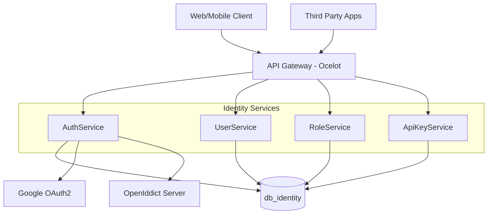
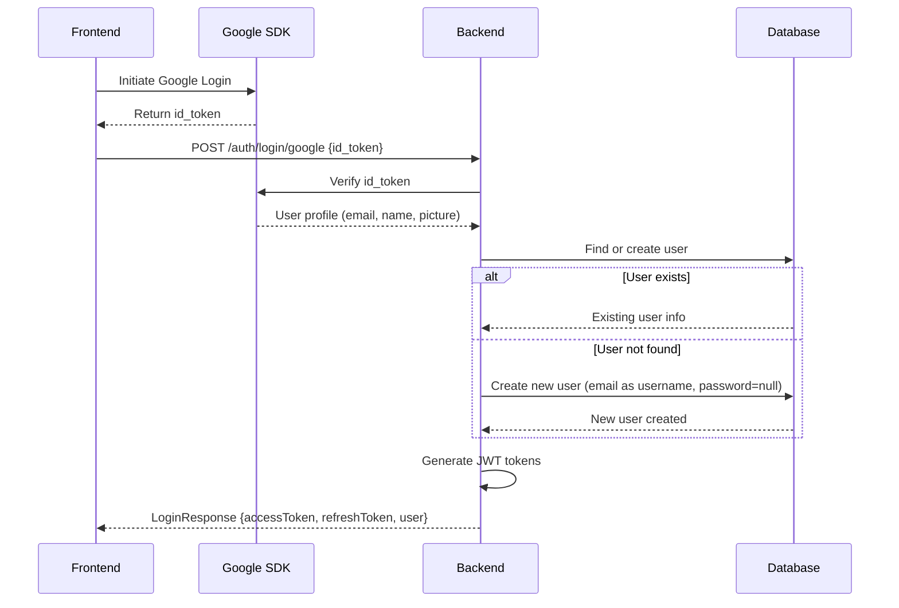
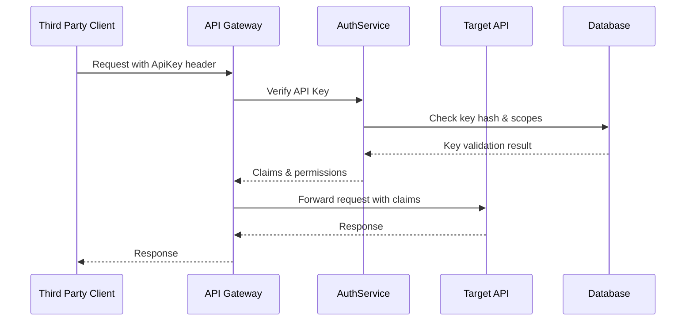
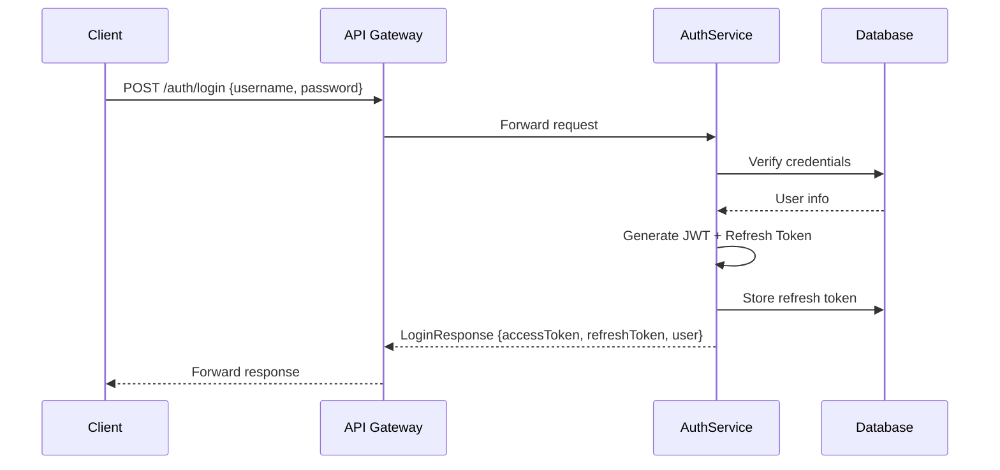
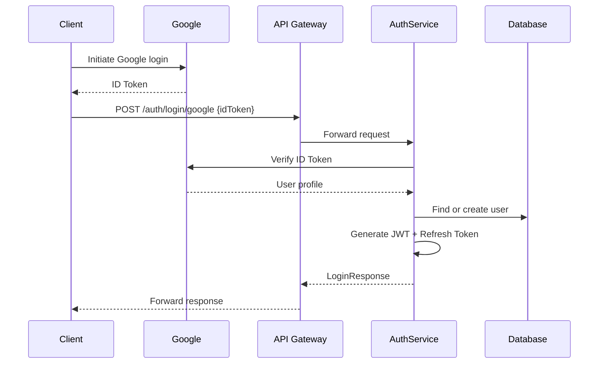
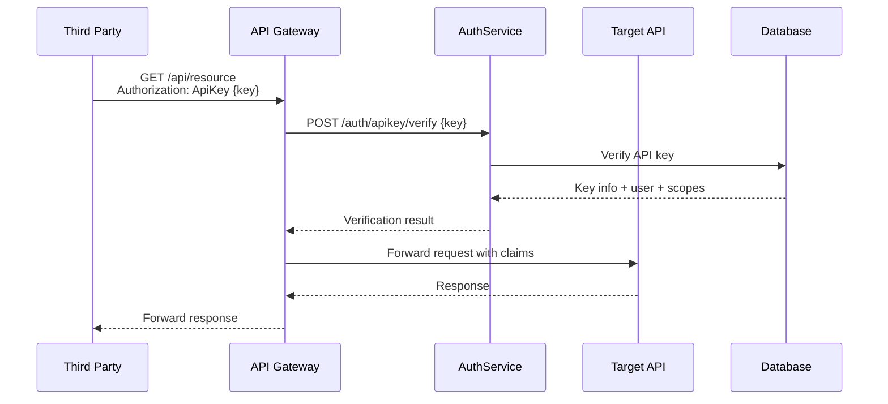
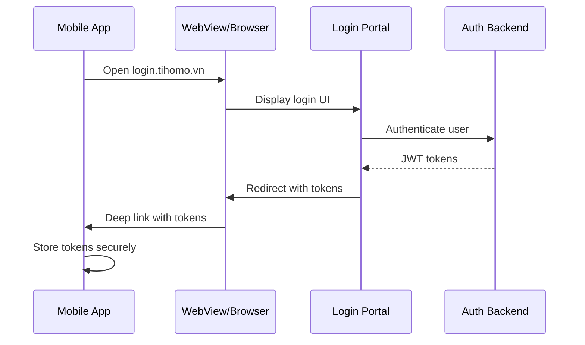

# Identity & Access - Detailed Design Document

## 1. Tổng quan

Bounded Context: **Identity & Access** chịu trách nhiệm về xác thực, phân quyền, và quản lý truy cập người dùng trong toàn hệ thống. Thiết kế này bổ sung thêm:

* Đăng nhập bằng Google (OAuth2 - Google Identity Platform)
* Cấp phát và quản lý API Key để bên thứ 3 tích hợp
* Đóng vai trò trung tâm xác thực (Login Hub) cho toàn bộ hệ sinh thái gồm:
  * Web client
  * Mobile app (iOS, Android, Flutter)
  * Bên thứ ba sử dụng API tích hợp

Tất cả các API nội bộ và bên ngoài đều có thể truy cập bằng JWT token của user sau khi đăng nhập (bao gồm cả login truyền thống và Google). API Key được sử dụng như một phương thức bổ sung cho tích hợp server-to-server.

### 1.1 Mục đích
Identity & Access bounded context chịu trách nhiệm về:
- Xác thực và phân quyền người dùng (Authentication & Authorization)
- Quản lý danh tính và thông tin người dùng (Identity Management)
- Cấp phát và quản lý API Keys cho tích hợp bên thứ 3
- Đóng vai trò trung tâm xác thực (Authentication Hub) cho toàn hệ sinh thái

### 1.2 Phạm vi hỗ trợ
- **Web Application**: Nuxt 3 frontend
- **Mobile Applications**: iOS, Android, Flutter
- **Third-party Integration**: API Keys for server-to-server communication
- **Internal Services**: Service-to-service authentication

### 1.3 Các phương thức xác thực
1. **Traditional Login**: Username/Password với JWT tokens
2. **Google OAuth2**: Đăng nhập bằng Google Identity Platform
3. **API Key Authentication**: Cho tích hợp server-to-server
4. **Service-to-Service**: mTLS hoặc shared secrets (future)

## 2. Kiến trúc tổng quan và Thành phần chính

### 2.1 High-level Architecture


### 2.2 Database Schema Overview
```sql
-- Users table
users (id, email, username, password_hash, full_name, avatar_url, is_active, 
       google_id, is_google_linked, google_sub_id, created_at, updated_at, last_login_at)

-- Roles table
roles (id, name, description, permissions, created_at, updated_at)

-- User Roles mapping
user_roles (user_id, role_id, assigned_at, assigned_by)

-- API Keys table
api_keys (id, user_id, name, hashed_key, scopes, status, 
          created_at, expires_at, last_used_at, usage_count)

-- Refresh Tokens table (OpenIddict)
openiddict_tokens (id, application_id, subject, type, payload, ...)
```

### 2.3 AuthService

Xác thực người dùng nội bộ bằng tài khoản/mật khẩu, tích hợp OpenIddict để phát hành JWT tokens, hỗ trợ OAuth2 Login (Google), và xác thực bằng API Key.

#### 2.3.1 Endpoint liên quan:
- `POST /auth/login` - Đăng nhập truyền thống
- `POST /auth/login/google` - Đăng nhập bằng Google OAuth2
- `POST /auth/token/refresh` - Làm mới JWT token
- `POST /auth/apikey/verify` - Xác thực API Key (internal)
- `POST /auth/link-google` - Liên kết tài khoản Google với account nội bộ
- `POST /auth/logout` - Đăng xuất và thu hồi token

### 2.4 UserService

Quản lý thông tin người dùng (họ tên, email, trạng thái, metadata...) với hỗ trợ tích hợp Google.

#### 2.4.1 Hành vi đặc biệt với Google Login:
- **Đăng nhập Google lần đầu:**
  - Nếu chưa tồn tại user → tự động tạo tài khoản mới với email làm username
  - Mật khẩu để `null`
  - Tài khoản có thể thêm mật khẩu sau nếu muốn login trực tiếp bằng hệ thống
- **Liên kết Google với tài khoản nội bộ:**
  - UI cung cấp nút "Liên kết với Google"
  - Sau khi liên kết, có thể login bằng cả Google hoặc mật khẩu hệ thống

#### 2.4.2 Endpoint:
- `GET /users/me` - Lấy thông tin user hiện tại
- `GET /users/{id}` - Lấy thông tin user theo ID
- `PUT /users/{id}` - Cập nhật thông tin user
- `GET /users/by-email/{email}` - Tìm user theo email
- `POST /users/{id}/set-password` - Đặt mật khẩu cho user (dành cho user login bằng Google)

### 2.5 RoleService

Quản lý Role/Claim/Permission trong hệ thống.

#### 2.5.1 Endpoint:
- `GET /roles` - Lấy danh sách roles
- `POST /roles` - Tạo role mới
- `POST /roles/{id}/assign-user` - Gán role cho user
- `GET /roles/{id}/permissions` - Lấy danh sách permissions của role

### 2.6 ApiKeyService (mới)

Tạo và quản lý API Keys cho tích hợp bên thứ 3.

#### 2.6.1 Tính năng:
- Tạo và quản lý API Keys
- Hỗ trợ phân quyền cho từng API Key (scopes)
- Quản lý trạng thái key (active, revoked, expired)
- Theo dõi usage và audit log

#### 2.6.2 Endpoint:
- `POST /apikeys` - Tạo API Key mới
- `GET /apikeys/{id}` - Lấy thông tin API Key
- `GET /apikeys/by-user/{userId}` - Lấy danh sách API Keys của user
- `DELETE /apikeys/{id}` - Xóa API Key
- `PATCH /apikeys/{id}/revoke` - Thu hồi API Key

## 3. Đăng nhập bằng Google

### 3.1 Luồng xử lý



### 3.2 Hành vi đặc biệt:

- **Nếu user chưa có tài khoản:** tự động tạo mới với email làm username, password `null`
- **Nếu user đã có tài khoản với email này:** 
  - Cấp JWT (nếu đăng ký trước đó bằng Google)
  - Yêu cầu liên kết (nếu chưa liên kết Google)
- **User có thể cập nhật mật khẩu** để dùng hệ thống login nội bộ sau này (qua UI)

### 3.3 Cấu hình

- Dùng OpenIddict + Google OAuth2 Client
- Cấu hình:
  - `GoogleClientId`
  - `GoogleClientSecret`
  - `AllowedRedirectUris`

## 4. API Key Authentication

### 4.1 Header Format

```
Authorization: ApiKey {key}
```

### 4.2 Policy-based Authorization

- Các controller có thể yêu cầu `[Authorize(Policy = "RequireApiKey")]`
- Middleware kiểm tra key trong Redis/Database
- Gán Claim vào principal để phân quyền

### 4.3 API Key Security Flow



## 3. Chi tiết các Services

### 3.1 AuthService - Xác thực

#### 3.1.1 Chức năng chính
- Xác thực người dùng bằng username/password
- Tích hợp Google OAuth2 login
- Phát hành và quản lý JWT tokens
- Xác thực API Keys
- Token refresh và revocation

#### 3.1.2 API Endpoints
```csharp
[Route("api/[controller]")]
public class AuthController : ControllerBase
{
    // Traditional login
    [HttpPost("login")]
    public async Task<LoginResponse> LoginAsync(LoginRequest request)

    // Google OAuth2 login
    [HttpPost("login/google")]
    public async Task<LoginResponse> GoogleLoginAsync(GoogleLoginRequest request)

    // Refresh token
    [HttpPost("token/refresh")]
    public async Task<RefreshTokenResponse> RefreshTokenAsync(RefreshTokenRequest request)

    // Logout
    [HttpPost("logout")]
    public async Task<IActionResult> LogoutAsync(LogoutRequest request)

    // API Key verification (internal use)
    [HttpPost("apikey/verify")]
    public async Task<ApiKeyVerificationResponse> VerifyApiKeyAsync(string apiKey)
}
```

#### 3.1.3 Domain Models
```csharp
public class User : BaseEntity<Guid>
{
    public string Email { get; set; } = string.Empty;
    public string Username { get; set; } = string.Empty;
    public string PasswordHash { get; set; } = string.Empty;
    public string FullName { get; set; } = string.Empty;
    public string? AvatarUrl { get; set; }
    public bool IsActive { get; set; } = true;
    public string? GoogleId { get; set; }
    public DateTime? LastLoginAt { get; set; }
    
    // Navigation properties
    public virtual ICollection<UserRole> UserRoles { get; set; } = [];
    public virtual ICollection<ApiKey> ApiKeys { get; set; } = [];
}

public class RefreshToken : BaseEntity<Guid>
{
    public Guid UserId { get; set; }
    public string Token { get; set; } = string.Empty;
    public DateTime ExpiresAt { get; set; }
    public bool IsRevoked { get; set; }
    public string? RevokedBy { get; set; }
    public DateTime? RevokedAt { get; set; }
    
    public virtual User User { get; set; } = null!;
}
```

#### 3.1.4 DTOs
```csharp
public record LoginRequest(string UsernameOrEmail, string Password);
public record GoogleLoginRequest(string IdToken);
public record LoginResponse(string AccessToken, string RefreshToken, 
                           DateTime ExpiresAt, UserProfile User);

public record RefreshTokenRequest(string RefreshToken);
public record RefreshTokenResponse(string AccessToken, string RefreshToken, DateTime ExpiresAt);

public record UserProfile(Guid Id, string Email, string FullName, 
                         string? AvatarUrl, List<string> Roles);
```

#### 3.1.5 Google OAuth2 Integration
```csharp
public class GoogleAuthService : IGoogleAuthService
{
    private readonly GoogleJsonWebSignature.Payload _googlePayload;
    
    public async Task<GoogleUserInfo> VerifyGoogleTokenAsync(string idToken)
    {
        var payload = await GoogleJsonWebSignature.ValidateAsync(idToken, 
            new GoogleJsonWebSignature.ValidationSettings
            {
                Audience = new[] { _googleClientId }
            });
            
        return new GoogleUserInfo
        {
            GoogleId = payload.Subject,
            Email = payload.Email,
            FullName = payload.Name,
            AvatarUrl = payload.Picture,
            IsEmailVerified = payload.EmailVerified
        };
    }
}
```

### 3.2 UserService - Quản lý người dùng

#### 3.2.1 Chức năng chính
- CRUD operations cho User entity
- Profile management
- User search và filtering
- User status management (active/inactive)

#### 3.2.2 API Endpoints
```csharp
[Route("api/[controller]")]
public class UsersController : ControllerBase
{
    [HttpGet("me")]
    [Authorize]
    public async Task<UserProfileResponse> GetCurrentUserAsync()

    [HttpGet("{id:guid}")]
    [Authorize(Policy = "RequireUser")]
    public async Task<UserDetailResponse> GetUserByIdAsync(Guid id)

    [HttpGet("by-email/{email}")]
    [Authorize(Policy = "RequireAdmin")]
    public async Task<UserDetailResponse> GetUserByEmailAsync(string email)

    [HttpPut("{id:guid}")]
    [Authorize(Policy = "RequireUser")]
    public async Task<IActionResult> UpdateUserAsync(Guid id, UpdateUserRequest request)

    [HttpGet]
    [Authorize(Policy = "RequireAdmin")]
    public async Task<PagedResponse<UserListItem>> GetUsersAsync([FromQuery] UserFilterRequest filter)
}
```

#### 3.2.3 DTOs
```csharp
public record UserDetailResponse(Guid Id, string Email, string Username, 
                                string FullName, string? AvatarUrl, bool IsActive,
                                DateTime CreatedAt, DateTime? LastLoginAt,
                                List<RoleResponse> Roles);

public record UpdateUserRequest(string FullName, string? AvatarUrl);

public record UserFilterRequest : BaseFilterRequest
{
    public string? Email { get; init; }
    public string? FullName { get; init; }
    public bool? IsActive { get; init; }
}
```

### 3.3 RoleService - Quản lý vai trò

#### 3.3.1 Domain Models
```csharp
public class Role : BaseEntity<Guid>
{
    public string Name { get; set; } = string.Empty;
    public string Description { get; set; } = string.Empty;
    public List<string> Permissions { get; set; } = [];
    
    public virtual ICollection<UserRole> UserRoles { get; set; } = [];
}

public class UserRole : BaseEntity<Guid>
{
    public Guid UserId { get; set; }
    public Guid RoleId { get; set; }
    public DateTime AssignedAt { get; set; }
    public Guid? AssignedBy { get; set; }
    
    public virtual User User { get; set; } = null!;
    public virtual Role Role { get; set; } = null!;
}
```

#### 3.3.2 API Endpoints
```csharp
[Route("api/[controller]")]
public class RolesController : ControllerBase
{
    [HttpGet]
    [Authorize(Policy = "RequireAdmin")]
    public async Task<List<RoleResponse>> GetRolesAsync()

    [HttpPost]
    [Authorize(Policy = "RequireAdmin")]
    public async Task<RoleResponse> CreateRoleAsync(CreateRoleRequest request)

    [HttpPost("{roleId:guid}/assign-user")]
    [Authorize(Policy = "RequireAdmin")]
    public async Task<IActionResult> AssignUserToRoleAsync(Guid roleId, AssignUserToRoleRequest request)

    [HttpGet("{roleId:guid}/permissions")]
    [Authorize(Policy = "RequireAdmin")]
    public async Task<List<string>> GetRolePermissionsAsync(Guid roleId)
}
```

### 3.4 ApiKeyService - Quản lý API Keys

#### 3.4.1 Domain Models
```csharp
public class ApiKey : BaseEntity<Guid>
{
    public Guid UserId { get; set; }
    public string Name { get; set; } = string.Empty;
    public string KeyHash { get; set; } = string.Empty; // SHA256 hashed
    public List<string> Scopes { get; set; } = []; // JSON array
    public ApiKeyStatus Status { get; set; } = ApiKeyStatus.Active;
    public DateTime? ExpiresAt { get; set; }
    public DateTime? LastUsedAt { get; set; }
    public int UsageCount { get; set; } = 0;
    
    public virtual User User { get; set; } = null!;
}

public enum ApiKeyStatus
{
    Active = 1,
    Revoked = 2,
    Expired = 3
}
```

#### 3.4.2 API Endpoints
```csharp
[Route("api/[controller]")]
public class ApiKeysController : ControllerBase
{
    [HttpPost]
    [Authorize]
    public async Task<CreateApiKeyResponse> CreateApiKeyAsync(CreateApiKeyRequest request)

    [HttpGet("{id:guid}")]
    [Authorize]
    public async Task<ApiKeyDetailResponse> GetApiKeyAsync(Guid id)

    [HttpGet("by-user/{userId:guid}")]
    [Authorize(Policy = "RequireUserOrAdmin")]
    public async Task<List<ApiKeyListItem>> GetUserApiKeysAsync(Guid userId)

    [HttpDelete("{id:guid}")]
    [Authorize]
    public async Task<IActionResult> DeleteApiKeyAsync(Guid id)

    [HttpPatch("{id:guid}/revoke")]
    [Authorize]
    public async Task<IActionResult> RevokeApiKeyAsync(Guid id)
}
```

#### 3.4.3 DTOs
```csharp
public record CreateApiKeyRequest(string Name, List<string> Scopes, DateTime? ExpiresAt);
public record CreateApiKeyResponse(Guid Id, string Name, string ApiKey, // Only shown once!
                                  List<string> Scopes, DateTime CreatedAt, DateTime? ExpiresAt);

public record ApiKeyDetailResponse(Guid Id, string Name, List<string> Scopes,
                                  ApiKeyStatus Status, DateTime CreatedAt, 
                                  DateTime? ExpiresAt, DateTime? LastUsedAt, int UsageCount);
```

## 4. Authentication & Authorization Flows

### 4.1 Traditional Login Flow


### 4.2 Google OAuth2 Login Flow


### 4.3 API Key Authentication Flow


## 5. Database Schema Chi tiết

### 5.1 Bảng users
- `email` (unique) - Email người dùng  
- `password_hash` (nullable) - Mật khẩu đã hash (nullable cho user login bằng Google)
- `is_google_linked` (bool) - Đã liên kết với Google hay chưa
- `google_sub_id` (nullable) - Google Subject ID để liên kết

### 5.2 Bảng roles, user_roles
- Quản lý phân quyền dựa trên role
- Many-to-many relationship giữa users và roles

### 5.3 Bảng api_keys
- `id` - Primary key
- `user_id` - Foreign key tới users
- `hashed_key` - API key đã hash (SHA256)
- `name` - Tên mô tả cho API key
- `scopes` - JSON array chứa các quyền
- `status` - Trạng thái (active, revoked, expired)
- `created_at` - Ngày tạo
- `expired_at` - Ngày hết hạn

## 6. Bảo mật

### 6.1 API Key Security
- API Key được hash (SHA256 hoặc tương tự)
- Chỉ hiển thị key **một lần duy nhất** khi tạo
- Hạn sử dụng, giới hạn quyền trên từng key
- Theo dõi audit log và cảnh báo nếu key bị lạm dụng

### 6.2 Password Security
- BCrypt hashing với work factor 12
- Password complexity requirements
- Account lockout after failed attempts
- Password history to prevent reuse

### 6.3 JWT Security
- Short-lived access tokens (30 minutes)
- Secure refresh token storage
- Token rotation on refresh
- Proper token validation

## 7. Tương tác với các service khác

- Các service gọi nội bộ qua JWT hoặc mTLS
- Bên thứ 3 gọi qua API Key
- AuthService cung cấp JWKS endpoint cho xác minh chữ ký

## 8. UI Login Portal (SSO)

### 8.1 Subdomain và Giao diện
- **Subdomain riêng:** `https://login.tihomo.vn`
- **Giao diện bao gồm:**
  - Login với email/password hoặc Google
  - Đăng ký user mới (signup)
  - Quên mật khẩu, reset mật khẩu
  - Liên kết với Google nếu chưa liên kết
  - Quản lý API Key (create, revoke, xem usage)
  - Đổi mật khẩu nếu user login bằng Google

### 8.2 Công nghệ
- **Frontend:** Vue 3 và dùng template và các UI có sẵn trong phần app nuxt
- **Mobile Support:** Đảm bảo login flow hỗ trợ WebView và Deep Link cho mobile Flutter

### 8.3 Login Flow cho Mobile


## 9. Future Enhancements

### 9.1 Additional OAuth Providers
- Hỗ trợ thêm các provider OAuth2 (Facebook, Apple)
- Microsoft Azure AD integration
- LinkedIn authentication

### 9.2 Advanced API Key Features
- Rate limit theo key
- Scope-based API permission
- Audit log UI cho key usage
- API key rotation và versioning

### 9.3 Security Enhancements
- Multi-Factor Authentication (MFA)
- Device fingerprinting
- Geolocation-based access control
- Risk-based authentication

### 5.1 JWT Configuration
```csharp
public class JwtOptions
{
    public string Issuer { get; set; } = string.Empty;
    public string Audience { get; set; } = string.Empty;
    public string SecretKey { get; set; } = string.Empty;
    public int AccessTokenExpirationMinutes { get; set; } = 30;
    public int RefreshTokenExpirationDays { get; set; } = 7;
}
```

### 5.2 OpenIddict Configuration
```csharp
public static class OpenIddictConfiguration
{
    public static IServiceCollection AddOpenIddictServices(this IServiceCollection services, 
        IConfiguration configuration)
    {
        services.AddOpenIddict()
            .AddCore(options =>
            {
                options.UseEntityFrameworkCore()
                       .UseDbContext<IdentityDbContext>();
            })
            .AddServer(options =>
            {
                options.SetTokenEndpointUris("/connect/token")
                       .SetIntrospectionEndpointUris("/connect/introspect");

                options.RegisterScopes(Scopes.Email, Scopes.Profile, Scopes.Roles);

                options.AllowPasswordFlow()
                       .AllowRefreshTokenFlow();

                options.UseAspNetCore()
                       .EnableTokenEndpointPassthrough();
            });

        return services;
    }
}
```

### 5.3 API Key Security
```csharp
public class ApiKeyHasher
{
    public static string HashApiKey(string plainKey)
    {
        using var sha256 = SHA256.Create();
        var bytes = Encoding.UTF8.GetBytes(plainKey);
        var hash = sha256.ComputeHash(bytes);
        return Convert.ToBase64String(hash);
    }

    public static string GenerateApiKey()
    {
        var bytes = new byte[32];
        using var rng = RandomNumberGenerator.Create();
        rng.GetBytes(bytes);
        return Convert.ToBase64String(bytes);
    }
}
```

### 5.4 Authorization Policies
```csharp
public static class AuthorizationPolicies
{
    public const string RequireUser = "RequireUser";
    public const string RequireAdmin = "RequireAdmin";
    public const string RequireApiKey = "RequireApiKey";
    public const string RequireUserOrAdmin = "RequireUserOrAdmin";

    public static void ConfigurePolicies(AuthorizationOptions options)
    {
        options.AddPolicy(RequireUser, policy =>
            policy.RequireAuthenticatedUser()
                  .RequireClaim(ClaimTypes.NameIdentifier));

        options.AddPolicy(RequireAdmin, policy =>
            policy.RequireAuthenticatedUser()
                  .RequireRole("Admin"));

        options.AddPolicy(RequireApiKey, policy =>
            policy.RequireAuthenticatedUser()
                  .RequireClaim("ApiKey"));

        options.AddPolicy(RequireUserOrAdmin, policy =>
            policy.RequireAuthenticatedUser()
                  .RequireAssertion(context =>
                      context.User.HasClaim(ClaimTypes.NameIdentifier, context.Resource?.ToString() ?? "") ||
                      context.User.IsInRole("Admin")));
    }
}
```

## 6. Database Design

### 6.1 Entity Framework Configuration
```csharp
public class IdentityDbContext : DbContext
{
    public DbSet<User> Users { get; set; }
    public DbSet<Role> Roles { get; set; }
    public DbSet<UserRole> UserRoles { get; set; }
    public DbSet<ApiKey> ApiKeys { get; set; }
    public DbSet<RefreshToken> RefreshTokens { get; set; }

    protected override void OnModelCreating(ModelBuilder modelBuilder)
    {
        // User configuration
        modelBuilder.Entity<User>(entity =>
        {
            entity.HasKey(e => e.Id);
            entity.HasIndex(e => e.Email).IsUnique();
            entity.HasIndex(e => e.Username).IsUnique();
            entity.HasIndex(e => e.GoogleId).IsUnique();
            
            entity.Property(e => e.Email).HasMaxLength(256).IsRequired();
            entity.Property(e => e.Username).HasMaxLength(50).IsRequired();
            entity.Property(e => e.FullName).HasMaxLength(200).IsRequired();
            entity.Property(e => e.GoogleId).HasMaxLength(100);
            entity.Property(e => e.AvatarUrl).HasMaxLength(500);
        });

        // ApiKey configuration
        modelBuilder.Entity<ApiKey>(entity =>
        {
            entity.HasKey(e => e.Id);
            entity.HasIndex(e => e.KeyHash).IsUnique();
            
            entity.Property(e => e.Scopes)
                  .HasConversion(
                      v => JsonSerializer.Serialize(v, (JsonSerializerOptions?)null),
                      v => JsonSerializer.Deserialize<List<string>>(v, (JsonSerializerOptions?)null) ?? []);
            
            entity.HasOne(e => e.User)
                  .WithMany(u => u.ApiKeys)
                  .HasForeignKey(e => e.UserId)
                  .OnDelete(DeleteBehavior.Cascade);
        });

        // UserRole many-to-many configuration
        modelBuilder.Entity<UserRole>(entity =>
        {
            entity.HasKey(e => new { e.UserId, e.RoleId });
            
            entity.HasOne(e => e.User)
                  .WithMany(u => u.UserRoles)
                  .HasForeignKey(e => e.UserId);
                  
            entity.HasOne(e => e.Role)
                  .WithMany(r => r.UserRoles)
                  .HasForeignKey(e => e.RoleId);
        });

        base.OnModelCreating(modelBuilder);
    }
}
```

### 6.2 Migration Strategy
```csharp
// Initial migration will create:
// - users table with google_id column
// - roles table with permissions JSON column
// - user_roles junction table
// - api_keys table with scopes JSON column
// - refresh_tokens table for OpenIddict
// - openiddict_* tables for token management
```

## 7. Integration với các Services khác

### 7.1 API Gateway Integration (Ocelot)
```json
{
  "Routes": [
    {
      "DownstreamPathTemplate": "/api/{everything}",
      "DownstreamScheme": "https",
      "DownstreamHostAndPorts": [
        {
          "Host": "identity-service",
          "Port": 5001
        }
      ],
      "UpstreamPathTemplate": "/identity/{everything}",
      "UpstreamHttpMethod": [ "GET", "POST", "PUT", "DELETE" ],
      "AuthenticationOptions": {
        "AuthenticationProviderKey": "Bearer",
        "AllowedScopes": []
      }
    }
  ],
  "GlobalConfiguration": {
    "BaseUrl": "https://api-gateway:5000"
  }
}
```

### 7.2 Service-to-Service Authentication
```csharp
public class ServiceAuthenticationMiddleware
{
    public async Task InvokeAsync(HttpContext context, RequestDelegate next)
    {
        // Check for JWT token first
        if (context.Request.Headers.ContainsKey("Authorization"))
        {
            var authHeader = context.Request.Headers["Authorization"].FirstOrDefault();
            
            if (authHeader?.StartsWith("Bearer ") == true)
            {
                // Standard JWT authentication
                await next(context);
                return;
            }
            
            if (authHeader?.StartsWith("ApiKey ") == true)
            {
                // API Key authentication
                var apiKey = authHeader.Substring("ApiKey ".Length);
                var isValid = await _apiKeyService.ValidateApiKeyAsync(apiKey);
                
                if (!isValid)
                {
                    context.Response.StatusCode = 401;
                    return;
                }
            }
        }
        
        await next(context);
    }
}
```

## 8. Testing Strategy

### 8.1 Unit Tests Structure
```
Identity.Application.Tests/
├── AuthServiceTests/
│   ├── AuthServiceTests.LoginAsync.cs
│   ├── AuthServiceTests.GoogleLoginAsync.cs
│   └── AuthServiceTests.RefreshTokenAsync.cs
├── UserServiceTests/
│   ├── UserServiceTests.CreateUserAsync.cs
│   └── UserServiceTests.UpdateUserAsync.cs
├── ApiKeyServiceTests/
│   ├── ApiKeyServiceTests.CreateAsync.cs
│   └── ApiKeyServiceTests.ValidateAsync.cs
└── Helpers/
    └── TestHelpers.cs
```

### 8.2 Test Examples
```csharp
public partial class AuthServiceTests
{
    [Fact]
    public async Task LoginAsync_WithValidCredentials_ShouldReturnLoginResponse()
    {
        // Arrange
        var request = new LoginRequest("testuser", "password123");
        var user = new User { Email = "test@example.com", Username = "testuser" };
        
        _mockUserRepository.Setup(x => x.GetByUsernameOrEmailAsync(It.IsAny<string>()))
                          .ReturnsAsync(user);
        _mockPasswordHasher.Setup(x => x.VerifyPassword(It.IsAny<string>(), It.IsAny<string>()))
                          .Returns(true);

        // Act
        var result = await _authService.LoginAsync(request);

        // Assert
        result.Should().NotBeNull();
        result.AccessToken.Should().NotBeNullOrEmpty();
        result.User.Email.Should().Be(user.Email);
    }
}
```

## 9. Deployment & Configuration

### 9.1 Environment Configuration
```yaml
# appsettings.json
{
  "ConnectionStrings": {
    "DefaultConnection": "Host=postgres;Database=db_identity;Username=identity_user;Password=${DB_PASSWORD}"
  },
  "Jwt": {
    "Issuer": "https://api.tihomo.local",
    "Audience": "tihomo-api",
    "SecretKey": "${JWT_SECRET_KEY}",
    "AccessTokenExpirationMinutes": 30,
    "RefreshTokenExpirationDays": 7
  },
  "Google": {
    "ClientId": "${GOOGLE_CLIENT_ID}",
    "ClientSecret": "${GOOGLE_CLIENT_SECRET}"
  },
  "ApiKeys": {
    "DefaultExpirationDays": 365,
    "MaxKeysPerUser": 10
  }
}
```

### 9.2 Docker Configuration
```dockerfile
FROM mcr.microsoft.com/dotnet/aspnet:9.0 AS base
WORKDIR /app
EXPOSE 5001

FROM mcr.microsoft.com/dotnet/sdk:9.0 AS build
WORKDIR /src
COPY ["Identity.Api/Identity.Api.csproj", "Identity.Api/"]
COPY ["Identity.Application/Identity.Application.csproj", "Identity.Application/"]
COPY ["Identity.Domain/Identity.Domain.csproj", "Identity.Domain/"]
COPY ["Identity.Infrastructure/Identity.Infrastructure.csproj", "Identity.Infrastructure/"]

RUN dotnet restore "Identity.Api/Identity.Api.csproj"
COPY . .
WORKDIR "/src/Identity.Api"
RUN dotnet build "Identity.Api.csproj" -c Release -o /app/build

FROM build AS publish
RUN dotnet publish "Identity.Api.csproj" -c Release -o /app/publish

FROM base AS final
WORKDIR /app
COPY --from=publish /app/publish .
ENTRYPOINT ["dotnet", "Identity.Api.dll"]
```

## 10. Monitoring & Observability

### 10.1 Health Checks
```csharp
public class IdentityServiceHealthCheck : IHealthCheck
{
    private readonly IdentityDbContext _context;
    
    public async Task<HealthCheckResult> CheckHealthAsync(HealthCheckContext context, 
        CancellationToken cancellationToken = default)
    {
        try
        {
            await _context.Database.CanConnectAsync(cancellationToken);
            return HealthCheckResult.Healthy("Identity database is healthy");
        }
        catch (Exception ex)
        {
            return HealthCheckResult.Unhealthy("Identity database is unhealthy", ex);
        }
    }
}
```

### 10.2 Metrics
```csharp
public static class IdentityMetrics
{
    private static readonly Counter<long> LoginAttempts = 
        Meter.CreateCounter<long>("identity_login_attempts_total");
    
    private static readonly Counter<long> ApiKeyUsage = 
        Meter.CreateCounter<long>("identity_apikey_usage_total");
    
    private static readonly Histogram<double> AuthenticationDuration = 
        Meter.CreateHistogram<double>("identity_authentication_duration_seconds");

    public static void RecordLoginAttempt(string method, bool success)
    {
        LoginAttempts.Add(1, new KeyValuePair<string, object?>("method", method),
                             new KeyValuePair<string, object?>("success", success));
    }
}
```

## 11. Security Considerations

### 11.1 Security Best Practices
- **Password Security**:
  - Minimum 8 characters, complexity requirements
  - BCrypt hashing with work factor 12
  - Password history to prevent reuse
  - Account lockout after failed attempts

- **JWT Security**:
  - Short-lived access tokens (30 minutes)
  - Secure refresh token storage
  - Token rotation on refresh
  - Proper token validation

- **API Key Security**:
  - SHA256 hashing of keys
  - Key rotation capability
  - Scope-based permissions
  - Usage monitoring and rate limiting

- **Data Protection**:
  - Encrypt sensitive data at rest
  - HTTPS for all communications
  - Secure headers (HSTS, CSP, etc.)
  - Input validation and sanitization

### 11.2 Compliance & Auditing
- **Audit Logging**:
  - All authentication events
  - API key creation/usage
  - Role assignments
  - Failed access attempts

- **Data Privacy**:
  - GDPR compliance for EU users
  - Data retention policies
  - Right to deletion
  - Data portability

## 12. Future Enhancements

### 12.1 Planned Features
- **Multi-Factor Authentication (MFA)**:
  - TOTP (Time-based One-Time Password)
  - SMS verification
  - Email verification
  - Backup codes

- **Additional OAuth Providers**:
  - Facebook Login
  - Apple Sign In
  - Microsoft Azure AD
  - LinkedIn

- **Advanced Security Features**:
  - Device fingerprinting
  - Geolocation-based access
  - Behavioral analytics
  - Risk-based authentication

- **User Management UI**:
  - Admin dashboard for user management
  - Self-service API key management
  - User activity monitoring
  - Role management interface

### 12.2 Scalability Improvements
- **Caching Strategy**:
  - Redis for session management
  - JWT blacklist caching
  - User profile caching
  - API key validation caching

- **Database Optimization**:
  - Read replicas for user lookups
  - Partitioning for audit logs
  - Indexing optimization
  - Connection pooling

- **High Availability**:
  - Multi-region deployment
  - Load balancing
  - Circuit breakers
  - Graceful degradation

## 13. Implementation Priority

### Phase 1: Core Setup (Week 1)
- Project structure với Clean Architecture
- Database setup với PostgreSQL
- Basic User entity và authentication

### Phase 2: Traditional Auth (Week 2)
- Username/Password authentication
- JWT token generation
- Basic authorization policies

### Phase 3: Google OAuth (Week 3)
- Google OAuth2 integration
- User account linking
- Profile synchronization

### Phase 4: API Keys (Week 4)
- API Key management system
- Scope-based authorization
- Usage tracking

### Phase 5: Advanced Features (Week 5)
- Refresh token mechanism
- Role management
- Security hardening

---

**Document Version**: 1.0  
**Created**: December 2024 