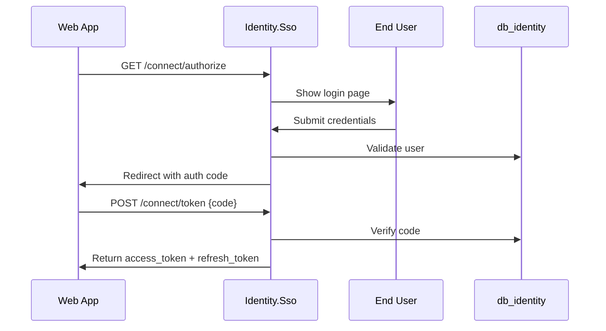
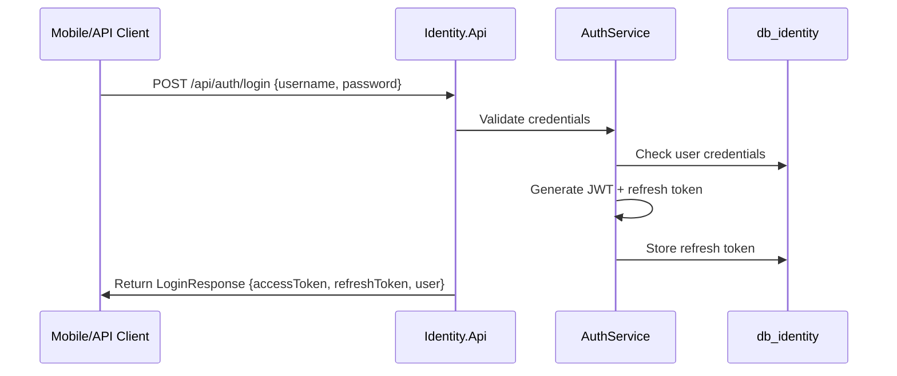
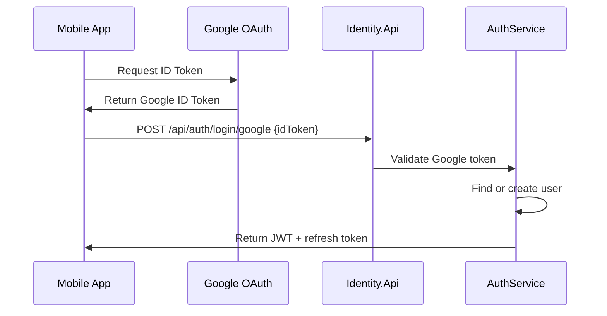
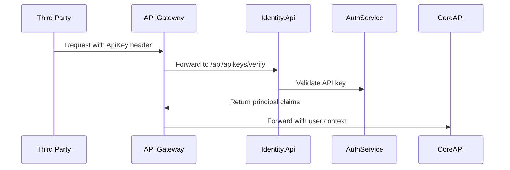
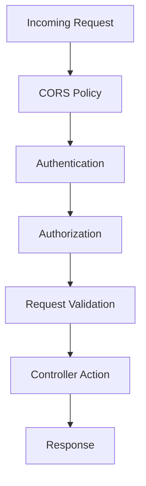

# Identity & Access Design Document

## 1. Tổng quan Identity & Access

Identity & Access là bounded context cốt lõi của hệ thống TiHoMo, chịu trách nhiệm xác thực, phân quyền và quản lý người dùng. Domain này được thiết kế theo kiến trúc microservices với hai service chính, đảm bảo tách biệt rõ ràng giữa SSO flows và management operations.

### Mục tiêu chính
- Cung cấp xác thực đa dạng (username/password, Google OAuth2, API Key)
- Quản lý người dùng, vai trò, phân quyền (RBAC, claims, policy)
- Phát hành và xác thực JWT, refresh token, OpenIddict SSO
- Tích hợp API Gateway và event-driven architecture
- Đảm bảo bảo mật, logging, validation cao cấp

---

## 2. Kiến trúc tổng thể

### 2.1 Dual Service Architecture

**Identity.Sso (Port 5217) - SSO Server:**
- **Purpose**: Single Sign-On server cho OAuth2/OIDC flows
- **UI Components**: Login/Register/Consent pages với Razor Views
- **Controllers**: ConnectController (OAuth2 endpoints), AuthController (UI authentication)
- **Authentication**: Cookie-based cho UI sessions
- **Target Users**: End users thông qua browser interface

**Identity.Api (Port 5228) - Management API:**
- **Purpose**: REST API để quản lý users, roles, API keys
- **UI Components**: Swagger/OpenAPI documentation only
- **Controllers**: AuthController (Direct API auth), ApiKeysController, UsersController, RolesController
- **Authentication**: JWT Bearer tokens và API Key authentication
- **Target Users**: Applications, admins, third-party integrations

### 2.2 Shared Infrastructure

- **Database**: db_identity (PostgreSQL) - shared giữa 2 projects
- **Business Logic**: AuthService, UserService, RoleService, ApiKeyService
- **Infrastructure**: Repositories, password hashing, JWT services
- **Event Bus**: RabbitMQ integration cho user events

### 2.3 Database Schema

**Core Tables:**
- `Users`: User profiles, credentials, metadata
- `Roles`: Role definitions, permissions
- `UserRoles`: Many-to-many mapping
- `ApiKeys`: API key management, scopes, usage tracking
- `RefreshTokens`: Token lifecycle management
- `AuditLogs`: Security audit trail

---

## 3. Authentication & Authorization Flows

### 3.1 Identity.Sso (SSO Server) - OAuth2/OIDC Flows

**Authorization Code Flow:**

**SSO Endpoints:**
- `/connect/authorize` - Authorization endpoint
- `/connect/token` - Token exchange endpoint
- `/connect/userinfo` - User information endpoint
- `/.well-known/openid-configuration` - Discovery document

### 3.2 Identity.Api (REST API) - Direct Authentication

**Traditional Login Flow:**

**Google OAuth2 Flow:**

**API Key Authentication:**

---

## 4. Service Layer Architecture

### 4.1 AuthService (Core Authentication)

**Responsibilities:**
- Credential validation (password, Google token)
- JWT generation và validation
- Refresh token lifecycle management
- Session management
- Password hashing và verification

**Key Methods:**
- `LoginAsync(LoginRequest)` - Traditional login
- `LoginWithGoogleAsync(GoogleLoginRequest)` - OAuth2 login
- `RefreshTokenAsync(RefreshTokenRequest)` - Token refresh
- `LogoutAsync(LogoutRequest)` - Token revocation
- `ValidateTokenAsync(string token)` - JWT validation

### 4.2 UserService (User Management)

**Responsibilities:**
- User CRUD operations
- Profile management
- Password change workflows
- User existence validation
- Role assignment

**Key Methods:**
- `GetUserAsync(int userId)` - Get user profile
- `CreateUserAsync(CreateUserRequest)` - User registration
- `UpdateUserAsync(UpdateUserRequest)` - Profile updates
- `ChangePasswordAsync(ChangePasswordRequest)` - Password management
- `GetUserRolesAsync(int userId)` - Role retrieval

### 4.3 RoleService (Role & Permission Management)

**Responsibilities:**
- Role CRUD operations
- Permission management
- Role assignment to users
- Authorization policy support

**Key Methods:**
- `GetRolesAsync()` - List all roles
- `CreateRoleAsync(CreateRoleRequest)` - Role creation
- `AssignRoleToUserAsync(int userId, int roleId)` - Role assignment
- `GetUserPermissionsAsync(int userId)` - Permission resolution

### 4.4 ApiKeyService (API Key Management)

**Responsibilities:**
- API key generation và revocation
- Scope-based access control
- Usage tracking và rate limiting
- Key validation và authentication

**Key Methods:**
- `GenerateApiKeyAsync(CreateApiKeyRequest)` - Key generation
- `ValidateApiKeyAsync(string key)` - Key validation
- `RevokeApiKeyAsync(int keyId)` - Key revocation
- `GetUserApiKeysAsync(int userId)` - User's keys
- `TrackApiKeyUsageAsync(int keyId)` - Usage logging

---

## 5. API Endpoints

### 5.1 Identity.Sso Endpoints

**OAuth2/OIDC:**
- `GET /connect/authorize` - Authorization endpoint
- `POST /connect/token` - Token exchange
- `GET /connect/userinfo` - User information
- `POST /connect/logout` - SSO logout

**UI Endpoints:**
- `GET /auth/login` - Login page
- `POST /auth/login` - Process login
- `GET /auth/register` - Registration page
- `POST /auth/register` - Process registration

### 5.2 Identity.Api Endpoints

**Authentication:**
- `POST /api/auth/login` - Traditional login
- `POST /api/auth/login/google` - Google OAuth login
- `POST /api/auth/token/refresh` - Refresh token
- `POST /api/auth/logout` - Logout

**User Management:**
- `GET /api/users/me` - Current user profile
- `PUT /api/users/me` - Update profile
- `POST /api/users/change-password` - Change password
- `GET /api/users` - List users (admin)

**Role Management:**
- `GET /api/roles` - List roles (admin)
- `POST /api/roles` - Create role (admin)
- `PUT /api/roles/{id}` - Update role (admin)
- `DELETE /api/roles/{id}` - Delete role (admin)

**API Key Management:**
- `GET /api/apikeys` - User's API keys
- `POST /api/apikeys` - Generate new key
- `DELETE /api/apikeys/{id}` - Revoke key
- `GET /api/apikeys/verify/{key}` - Verify key (internal)

---

## 6. Authorization & Security

### 6.1 RBAC (Role-Based Access Control)

**Built-in Roles:**
- `User`: Basic authenticated user
- `Admin`: System administrator
- `ApiUser`: API-only access

**Authorization Policies:**
- `RequireUser`: Authenticated user required
- `RequireAdmin`: Admin role required
- `RequireApiKey`: Valid API key required
- `RequireUserOrAdmin`: Either user or admin

### 6.2 Security Middleware Pipeline

### 6.3 Token Management

**JWT Configuration:**
- Issuer: Identity.Api
- Audience: TiHoMo microservices
- Expiry: 15 minutes (access token), 7 days (refresh token)
- Claims: UserId, Roles, Permissions, ApiKeyId (if applicable)

**Refresh Token Strategy:**
- Sliding expiration
- Single-use tokens
- Automatic cleanup of expired tokens

---

## 7. Event-Driven Integration

### 7.1 Published Events

**User Events:**
- `UserRegistered`: New user sign-up
- `UserProfileUpdated`: Profile changes
- `UserPasswordChanged`: Security events
- `UserRoleAssigned`: Permission changes

**Authentication Events:**
- `UserLoggedIn`: Successful login
- `UserLoggedOut`: Logout events
- `LoginFailed`: Failed authentication attempts
- `ApiKeyGenerated`: New API key created

**Security Events:**
- `SuspiciousActivity`: Security violations
- `ApiKeyRevoked`: Key management events

### 7.2 Event Consumers

Listen for events from other domains để maintain user context:
- Transaction events → Update user activity metrics
- Budget events → Sync user preferences
- Report events → Track user engagement

---

## 8. Integration Points

### 8.1 API Gateway Integration

**Ocelot Routes:**
- `/sso/*` → Identity.Sso
- `/api/auth/*` → Identity.Api
- `/api/users/*` → Identity.Api
- `/api/roles/*` → Identity.Api
- `/api/apikeys/*` → Identity.Api

**Middleware:**
- JWT Bearer authentication
- API Key validation
- Rate limiting per user/key

### 8.2 External Integrations

**Google OAuth2:**
- Client ID/Secret configuration
- Scope: email, profile, openid
- Token validation via Google APIs

**Email Services (future):**
- Registration confirmation
- Password reset workflows
- Security notifications

---

## 9. Monitoring & Observability

### 9.1 Health Checks

- `/health` endpoint
- Database connectivity check
- External service dependencies (Google OAuth)
- Event bus connectivity (RabbitMQ)

### 9.2 Logging & Auditing

**Structured Logging:**
- Request/response logging
- Security event logging
- Performance metrics
- Error tracking

**Audit Trail:**
- User authentication attempts
- Permission changes
- API key usage
- Admin actions

### 9.3 Metrics & Alerting

**Key Metrics:**
- Authentication success/failure rates
- Token refresh patterns
- API key usage statistics
- User registration trends

---

## 10. Deployment & DevOps

### 10.1 Containerization

**Docker Images:**
- `identity-sso:latest` - SSO server
- `identity-api:latest` - Management API

**Environment Variables:**
- Database connection strings
- JWT signing keys
- Google OAuth credentials
- CORS origins

### 10.2 Configuration Management

**appsettings.json:**
- Database configuration
- JWT settings
- OAuth provider settings
- Logging configuration

**Secrets Management:**
- JWT signing keys in Azure Key Vault
- Database passwords
- External API credentials

---

## 11. Testing Strategy

### 11.1 Unit Tests

- Service layer logic
- Password hashing/validation
- JWT generation/validation
- Policy authorization

### 11.2 Integration Tests

- OAuth2 flows end-to-end
- API authentication scenarios
- Database integration
- Event publishing

### 11.3 Security Testing

- Authentication bypass attempts
- Token manipulation tests
- SQL injection prevention
- CORS policy validation

---

## 12. Performance Considerations

### 12.1 Caching Strategy

**Redis Caching:**
- User session data
- API key validation cache
- Role/permission cache
- JWT blacklist (for logout)

### 12.2 Scalability

**Horizontal Scaling:**
- Stateless service design
- Database connection pooling
- Load balancer compatibility

**Performance Optimizations:**
- Async/await patterns
- Database query optimization
- Lazy loading strategies

---

## 13. Migration & Deployment Strategy

### 13.1 Database Migrations

- EF Core migrations
- Seed data for default roles
- Index optimization
- Backward compatibility

### 13.2 Zero-Downtime Deployment

- Blue-green deployment strategy
- Health check integration
- Graceful shutdown handling
- Database migration coordination

---

*Bản thiết kế này tổng hợp từ Memory Bank, overview_v4.md và flowcharts_v4.md. Identity & Access là foundation cho toàn bộ hệ thống TiHoMo, đảm bảo security và user experience tối ưu.*
