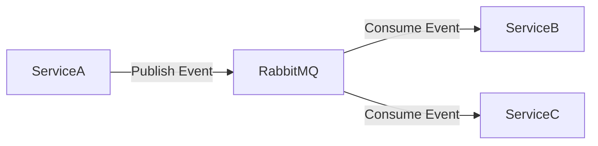
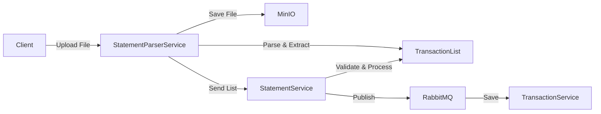

# TiHoMo System Architecture v4

## 1. Tổng quan hệ thống

Hệ thống TiHoMo được thiết kế theo kiến trúc microservices, với các bounded context rõ ràng và độc lập. Mỗi service có database riêng và giao tiếp thông qua API Gateway và message bus.

## 2. Các Bounded Context và Microservices

### 2.1 Identity & Access
- **Identity.Sso** (Port 5217): SSO Server với UI, OpenIddict OAuth2/OIDC provider
- **Identity.Api** (Port 5228): Pure REST API cho user/role/API key management (không có UI)
- **Shared Services**: AuthService, UserService, RoleService, ApiKeyService
- **Database**: db_identity (PostgreSQL)

### 2.2 Core Finance
- **AccountService**: Quản lý tài khoản
- **TransactionService**: Xử lý giao dịch
- **StatementService**: Quản lý sao kê và import từ danh sách giao dịch
- **Database**: db_finance (PostgreSQL)

### 2.3 Money Management
- **BudgetService**: Quản lý ngân sách
- **JarService**: Quản lý SixJars
- **SharedExpenseService**: Quản lý chi tiêu chia sẻ
- **Database**: db_money (PostgreSQL)

### 2.4 Planning & Investment
- **DebtService**: Quản lý khoản nợ
- **GoalService**: Quản lý mục tiêu tài chính
- **InvestmentService**: Quản lý đầu tư
- **Database**: db_planning (PostgreSQL)

### 2.5 Reporting & Integration
- **ReportingService**: Tạo báo cáo và phân tích
- **NotificationService**: Gửi thông báo
- **IntegrationService**: Kết nối với các dịch vụ bên ngoài
- **StatementParserService**: Phân tích và trích xuất dữ liệu từ file sao kê
- **Database**: db_reporting (PostgreSQL)

## 2.x Flow chi tiết các BE Microservice

### 2.1 Identity & Access (Identity Service)
#### 2.1.1 Tổng quan
**Gồm 2 project chính:**
- **Identity.Sso** (Port 5217): SSO Server với UI cho login/consent/register, OpenIddict OAuth2/OIDC provider
- **Identity.Api** (Port 5228): Pure REST API cho quản lý user, role, API key (không có UI)

**Kiến trúc:**
- **Shared Infrastructure**: Cùng sử dụng IdentityDbContext, repositories, và business services
- **Separation of Concerns**: SSO xử lý OAuth flows, API xử lý management operations
- **Database**: db_identity (PostgreSQL) - shared giữa 2 projects

**Chức năng:**
- Cung cấp xác thực (username/password, Google OAuth2, API Key)
- Quản lý người dùng, vai trò, phân quyền (RBAC, claims, policy)  
- Phát hành và xác thực JWT, refresh token, OpenIddict SSO
- Tích hợp API Gateway (Ocelot), event bus (RabbitMQ)
- Đảm bảo bảo mật, logging, validation, OpenAPI

#### 2.1.2 Project Architecture & Responsibilities

**Identity.Sso (Port 5217) - SSO Server:**
- **Purpose**: Single Sign-On server cho OAuth2/OIDC flows
- **UI Components**: Login/Register/Consent pages với Razor Views
- **Controllers**: 
  - `ConnectController` - OAuth2 endpoints (/connect/authorize, /connect/token, /connect/userinfo)
  - `AuthController` - UI authentication (login/register pages)
- **Authentication**: Cookie-based cho UI sessions
- **Target Users**: End users thông qua browser interface

**Identity.Api (Port 5228) - Management API:**
- **Purpose**: REST API để quản lý users, roles, API keys
- **UI Components**: Swagger/OpenAPI documentation only
- **Controllers**: 
  - `AuthController` - Direct API authentication (JWT login, Google OAuth)
  - `UsersController` - User profile management
  - `RolesController` - Role management (admin only)
  - `ApiKeysController` - API key lifecycle management
- **Authentication**: JWT Bearer tokens và API Key authentication
- **Target Users**: Applications, admins, third-party integrations

**Shared Components:**
- **Database**: Cùng sử dụng IdentityDbContext với PostgreSQL
- **Business Logic**: AuthService, UserService, RoleService, ApiKeyService
- **Infrastructure**: Repositories, password hashing, JWT services

#### 2.1.3 Authentication & Authorization Flows
**A. Identity.Sso (SSO Server) - OAuth2/OIDC Flows:**
- **Authorization Flow:**
  1. Client redirect tới /connect/authorize → Identity.Sso
  2. Hiển thị login UI nếu chưa authenticated
  3. User đăng nhập → tạo authorization code
  4. Redirect về client với authorization code
- **Token Exchange:**
  1. Client gửi authorization code tới /connect/token
  2. Identity.Sso verify code, trả access token + refresh token
- **SSO Endpoints:**
  - `/connect/authorize` - Authorization endpoint
  - `/connect/token` - Token endpoint  
  - `/connect/userinfo` - User info endpoint
  - `/connect/logout` - Logout endpoint
  - `/.well-known/openid-configuration` - Discovery document

**B. Identity.Api (REST API) - Direct Authentication:**
- **Login truyền thống:**
  1. Client gửi POST /api/auth/login {username, password} → Identity.Api
  2. AuthService xác thực user, sinh JWT + refresh token
  3. Lưu refresh token vào DB, trả LoginResponse (accessToken, refreshToken, user)
- **Google OAuth2:**
  1. Client lấy Google ID Token → POST /api/auth/login/google {idToken} → Identity.Api
  2. AuthService verify Google ID Token, tìm hoặc tạo user
  3. Sinh JWT + refresh token, trả LoginResponse
- **API Key:**
  1. Client gửi request với header `Authorization: ApiKey {key}`
  2. API Gateway hoặc middleware gọi GET /api/apikeys/verify/{key}
  3. Nếu hợp lệ, gán claim vào principal, forward request
- **Refresh Token:**
  1. Client gửi POST /api/auth/token/refresh {refreshToken}
  2. AuthService kiểm tra refresh token, sinh access token mới
- **Logout:**
  1. Client gửi POST /api/auth/logout {refreshToken}
  2. AuthService revoke refresh token trong DB

#### 2.1.4 User & Role Management (Identity.Api)
- **UserService:** CRUD user, đổi mật khẩu, kiểm tra tồn tại, phân trang, validate password, lấy roles
  - `GET /api/users/me` - Get current user profile
  - `PUT /api/users/me` - Update current user
  - `POST /api/users/change-password` - Change password
- **RoleService:** CRUD role, gán/xóa role cho user, lấy quyền, kiểm tra tồn tại
  - `GET /api/roles` - List all roles (admin only)
  - `POST /api/roles` - Create role (admin only)
  - `PUT /api/roles/{id}` - Update role (admin only)
- **ApiKeyService:** Tạo, thu hồi, kiểm tra, tracking usage, scope-based
  - `GET /api/apikeys` - Get user's API keys
  - `POST /api/apikeys` - Create new API key
  - `PUT /api/apikeys/{id}` - Update API key
  - `POST /api/apikeys/{id}/revoke` - Revoke API key
  - `GET /api/apikeys/verify/{key}` - Verify API key (internal)

#### 2.1.5 Authorization Policies & Middleware
- **RBAC:** Role-based access control, policy-based (RequireUser, RequireAdmin, RequireApiKey, RequireUserOrAdmin)
- **Middleware:**
  - JWT Bearer authentication
  - API Key authentication (custom middleware)
  - Global exception handling
  - FluentValidation cho DTO
- **OpenIddict:**
  - SSO endpoints: /connect/authorize, /connect/token, /connect/userinfo, /connect/logout
  - Scopes: email, profile, roles, offline_access
  - Discovery: /.well-known/openid-configuration

#### 2.1.6 Logging, Monitoring, OpenAPI
- **Logging:** Structured logging, ELK/EFK, audit log đăng nhập/thay đổi
- **Validation:** FluentValidation, DataAnnotations
- **OpenAPI:** Swagger UI, XML comments cho controller/model
- **Health Check:** /health endpoint, kiểm tra DB, external dependencies

#### 2.1.7 Integration & Communication
- **Database Sharing**: Cả 2 projects cùng truy cập db_identity
- **Service Layer**: Shared business logic qua Application layer
- **Cross-Project Scenarios**:
  - User đăng ký qua Identity.Sso → có thể quản lý qua Identity.Api
  - API Key tạo qua Identity.Api → có thể xác thực cho cả 2 projects
  - SSO login thành công → có thể access Identity.Api với JWT token
- **Deployment**: Có thể deploy độc lập hoặc cùng docker-compose

#### 2.1.8 Deployment & DevOps
- **Docker Compose, Kubernetes**
- **CI/CD:** Automated test, build, deploy
- **CORS:** Policy cho frontend, SSO, API
- **Security:** HTTPS, CORS, security headers, penetration test

### Core Finance
#### AccountService
1. Client gửi CRUD request → API Gateway → AccountService
2. Validate dữ liệu, kiểm tra quyền sở hữu
3. Lưu vào db_finance
4. Publish event AccountChanged lên RabbitMQ
5. Trả trạng thái

#### TransactionService
1. Nhận request tạo giao dịch → validate số dư, loại giao dịch
2. Áp dụng rule (recurring, split, fee)
3. Lưu vào db_finance
4. Publish TransactionCreated lên RabbitMQ
5. Trả transactionId, trạng thái

#### StatementService
1. Client upload file sao kê → API Gateway → StatementService
2. StatementService gửi file sang StatementParserService (MinIO)
3. StatementParserService parse file, trả về danh sách giao dịch
4. StatementService validate, lưu vào db_finance
5. Publish StatementImported lên RabbitMQ

### Money Management
#### BudgetService
1. Client gửi CRUD request → API Gateway → BudgetService
2. Validate quyền, dữ liệu
3. Lưu vào db_money
4. Publish BudgetChanged lên RabbitMQ
5. Trả trạng thái

#### JarService (SixJars)
1. Client gửi request phân bổ tiền vào 6 hũ → API Gateway → JarService
2. JarService tính toán tỷ lệ, validate tổng số tiền
3. Lưu vào db_money
4. Publish JarUpdated lên RabbitMQ
5. Trả trạng thái, số dư từng hũ

#### SharedExpenseService
1. Client tạo chi tiêu nhóm, thêm participants → API Gateway → SharedExpenseService
2. Tính toán chia sẻ, validate số tiền, quyền
3. Lưu vào db_money
4. Publish SharedExpenseCreated lên RabbitMQ
5. Trả trạng thái, chi tiết chia sẻ

### Planning & Investment
#### DebtService, GoalService, InvestmentService
1. Client gửi CRUD request → API Gateway → Service
2. Validate dữ liệu, kiểm tra quyền
3. Lưu vào db_planning
4. Publish event lên RabbitMQ
5. Trả trạng thái, chi tiết

### Reporting & Integration
#### ReportingService
1. Client gửi request tạo báo cáo → API Gateway → ReportingService
2. ReportingService truy vấn dữ liệu từ các DB khác (read-only, event sourcing)
3. Sinh báo cáo, lưu vào db_reporting
4. Trả về file/reportId

#### NotificationService
1. Nhận event từ RabbitMQ
2. Xác định loại thông báo, kênh gửi (email, push, SMS)
3. Gửi thông báo cho user

#### IntegrationService
1. Nhận request tích hợp (đồng bộ bank, import dữ liệu)
2. Gọi API bên ngoài, xử lý response
3. Lưu kết quả vào db_reporting hoặc db_finance
4. Publish IntegrationCompleted lên RabbitMQ

## 3. Kiến trúc giao tiếp

### 3.1 API Gateway (Ocelot)
- Định tuyến request đến các service
- Xác thực và phân quyền
- Rate limiting và circuit breaking
- API versioning

### 3.2 Message Bus (RabbitMQ)
- Xử lý các sự kiện bất đồng bộ
- Đảm bảo tính nhất quán dữ liệu
- Hỗ trợ retry và dead letter queue

### 3.3 Event Flow

## 4. Xử lý dữ liệu

### 4.1 Import Statement Flow (Updated)

### 4.2 Data Synchronization
- Event-driven synchronization
- Change Data Capture (CDC)
- Dual-write pattern với fallback

## 5. Bảo mật

### 5.1 Authentication
- OpenID Connect
- JWT tokens
- OAuth 2.0

### 5.2 Authorization
- Role-based access control (RBAC)
- Claims-based authorization
- Policy-based authorization

## 6. Monitoring & Logging

### 6.1 Health Checks
- Service health endpoints
- Database connectivity
- External service dependencies

### 6.2 Metrics
- Prometheus metrics
- Grafana dashboards
- Custom business metrics

### 6.3 Logging
- Centralized logging (ELK/EFK)
- Structured logging
- Correlation IDs

## 7. Deployment & DevOps

### 7.1 Containerization
- Docker containers
- Docker Compose cho development
- Kubernetes cho production

### 7.2 CI/CD
- Automated testing
- Container registry
- Deployment automation

### 7.3 Infrastructure
- Infrastructure as Code
- Cloud-native design
- Auto-scaling

## 8. Lộ trình triển khai

### 8.1 Phase 1: Core Services
- Identity & Access
- Core Finance
- Basic Reporting

### 8.2 Phase 2: Money Management
- Budget Management
- SixJars
- Shared Expenses

### 8.3 Phase 3: Planning & Investment
- Debt Management
- Financial Goals
- Investment Tracking

### 8.4 Phase 4: Advanced Features
- Advanced Reporting
- External Integrations
- AI/ML Features
- Statement Parser

## 9. Best Practices

### 9.1 Development
- Clean Architecture
- Domain-Driven Design
- SOLID principles
- Unit testing
- Integration testing

### 9.2 Operations
- Blue-Green deployment
- Canary releases
- Feature flags
- Disaster recovery
- Backup strategies

### 9.3 Security
- Regular security audits
- Dependency scanning
- Penetration testing
- Security headers
- Data encryption

## 10. Flow tổng hợp & lưu ý triển khai
- Mỗi flow đều có unit/integration test
- Sử dụng DTO rõ ràng cho input/output
- Áp dụng CQRS cho service phức tạp (ReportingService)
- Đảm bảo transaction consistency với Saga/Outbox nếu cần
- Tất cả service expose OpenAPI/Swagger