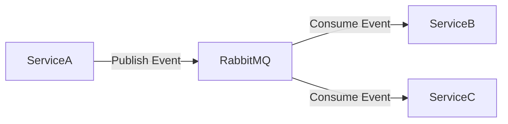
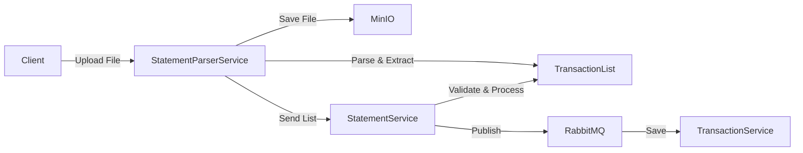

# TiHoMo System Architecture v4

## 1. Tổng quan hệ thống

Hệ thống TiHoMo được thiết kế theo kiến trúc microservices, với các bounded context rõ ràng và độc lập. Mỗi service có database riêng và giao tiếp thông qua API Gateway và message bus.

## 2. Các Bounded Context và Microservices

### 2.1 Identity & Access (Simplified)
- **Identity.Api** (Port 5228): Single service cho social auth, user management, API key management
- **Social Providers**: Google, Facebook, Apple authentication integration
- **Token Management**: JWT generation, refresh token handling
- **Database**: db_identity (PostgreSQL)

### 2.2 Core Finance
- **AccountService**: Quản lý tài khoản
- **TransactionService**: Xử lý giao dịch
- **StatementService**: Quản lý sao kê và import từ danh sách giao dịch
- **Database**: db_finance (PostgreSQL)

### 2.3 Money Management
- **BudgetService**: Quản lý ngân sách
- **JarService**: Quản lý SixJars
- **SharedExpenseService**: Quản lý chi tiêu chia sẻ
- **Database**: db_money (PostgreSQL)

### 2.4 Planning & Investment
- **DebtService**: Quản lý khoản nợ
- **GoalService**: Quản lý mục tiêu tài chính
- **InvestmentService**: Quản lý đầu tư
- **Database**: db_planning (PostgreSQL)

### 2.5 Reporting & Integration
- **ReportingService**: Tạo báo cáo và phân tích
- **NotificationService**: Gửi thông báo
- **IntegrationService**: Kết nối với các dịch vụ bên ngoài
- **StatementParserService**: Phân tích và trích xuất dữ liệu từ file sao kê
- **Database**: db_reporting (PostgreSQL)

## 2.x Flow chi tiết các BE Microservice

### 2.1 Identity & Access (Simplified Design)
#### 2.1.1 Tổng quan
**Single Service Architecture:**
- **Identity.Api** (Port 5228): Unified service cho authentication, user management, và API key management
- **No SSO Server**: Loại bỏ complexity của OAuth2/OIDC server riêng biệt
- **Social Login Focus**: Tập trung vào Google, Facebook, Apple authentication

**Kiến trúc:**
- **Stateless Authentication**: Token verification thay vì server-side sessions
- **Social Provider Integration**: Direct integration với Google/Facebook/Apple APIs
- **API Gateway Integration**: Token verification thông qua gateway middleware
- **Database**: db_identity (PostgreSQL) - đơn giản hóa schema

**Chức năng:**
- Social authentication (Google, Facebook, Apple)
- Traditional username/password authentication
- User profile management
- API key lifecycle management
- Token verification cho API Gateway
- Security audit logging

#### 2.1.2 Simplified Architecture & Responsibilities

**Identity.Api (Port 5228) - Unified Service:**
- **Purpose**: All-in-one authentication và user management service
- **Authentication Methods**: 
  - Social login token verification
  - Traditional username/password
  - API key authentication
- **Controllers**: 
  - `AuthController` - Authentication endpoints (login, social verify, refresh, logout)
  - `UsersController` - User profile management
  - `ApiKeysController` - API key lifecycle management
- **Token Handling**: JWT generation, refresh token management, token verification
- **Target Users**: Web apps, mobile apps, third-party integrations

#### 2.1.3 Authentication Flows (Simplified)

**A. Social Login Flow:**
1. Client authenticates với social provider (Google/Facebook/Apple)
2. Client receives ID token từ social provider
3. Client gửi token tới POST /api/auth/social → Identity.Api
4. Identity.Api verifies token với social provider
5. Identity.Api tạo user record (nếu chưa có) và return JWT
6. Client sử dụng JWT cho subsequent API calls

**B. API Gateway Integration:**
1. Client gửi request với Authorization: Bearer {jwt} header
2. Gateway calls Identity.Api để verify token
3. Identity.Api validates JWT và return user claims
4. Gateway forwards request tới target service với user context

**C. API Key Authentication:**
1. Client gửi request với Authorization: ApiKey {key} header
2. Gateway calls Identity.Api để verify API key
3. Identity.Api validates key và return associated user/scopes
4. Gateway forwards request với API user context

**Shared Components:**
- **Database**: Cùng sử dụng IdentityDbContext với PostgreSQL
- **Business Logic**: AuthService, UserService, RoleService, ApiKeyService
- **Infrastructure**: Repositories, password hashing, JWT services

#### 2.1.3 Authentication & Authorization Flows
**A. Identity.Sso (SSO Server) - OAuth2/OIDC Flows:**
- **Authorization Flow:**
  1. Client redirect tới /connect/authorize → Identity.Sso
  2. Hiển thị login UI nếu chưa authenticated
  3. User đăng nhập → tạo authorization code
  4. Redirect về client với authorization code
- **Token Exchange:**
  1. Client gửi authorization code tới /connect/token
  2. Identity.Sso verify code, trả access token + refresh token
- **SSO Endpoints:**
  - `/connect/authorize` - Authorization endpoint
  - `/connect/token` - Token endpoint  
  - `/connect/userinfo` - User info endpoint
  - `/connect/logout` - Logout endpoint
  - `/.well-known/openid-configuration` - Discovery document

**B. Identity.Api (REST API) - Direct Authentication:**
- **Login truyền thống:**
  1. Client gửi POST /api/auth/login {username, password} → Identity.Api
  2. AuthService xác thực user, sinh JWT + refresh token
  3. Lưu refresh token vào DB, trả LoginResponse (accessToken, refreshToken, user)
- **Google OAuth2:**
  1. Client lấy Google ID Token → POST /api/auth/login/google {idToken} → Identity.Api
  2. AuthService verify Google ID Token, tìm hoặc tạo user#### 2.1.4 API Endpoints (Simplified)

**Authentication Endpoints:**
- `POST /api/auth/login` - Traditional username/password login
- `POST /api/auth/social` - Social login token verification
- `POST /api/auth/refresh` - Refresh access token
- `POST /api/auth/logout` - Logout và revoke token
- `GET /api/auth/verify` - Token verification (for API Gateway)

**User Management:**
- `GET /api/users/me` - Get current user profile
- `PUT /api/users/me` - Update current user profile
- `POST /api/users/change-password` - Change password

**API Key Management:**
- `GET /api/apikeys` - List user's API keys
- `POST /api/apikeys` - Create new API key
- `PUT /api/apikeys/{id}` - Update API key (scope, name)
- `DELETE /api/apikeys/{id}` - Revoke API key
- `GET /api/apikeys/verify/{key}` - Verify API key (internal, for Gateway)

#### 2.1.5 Database Schema (Simplified)

**Users Table:**
- id, email, name, provider, provider_id, created_at, updated_at, is_active

**UserLogins Table (Social Auth):**
- id, user_id, provider, provider_user_id, created_at

**ApiKeys Table:**
- id, user_id, name, key_prefix, key_hash, scope, created_at, expires_at, is_revoked

**RefreshTokens Table:**
- id, user_id, token_hash, expires_at, created_at, is_revoked

#### 2.1.6 Security & Integration

**Security Features:**
- JWT token generation với expiration
- Secure API key generation (SHA256 hashing)
- Social provider token verification
- Rate limiting protection
- Audit logging for security events

**API Gateway Integration:**
- Stateless token verification
- User claims injection into request headers
- API key scope-based authorization
- Standardized error responses

**External Integration:**
- Google OAuth2 API for token verification
- Facebook Graph API for profile validation
- Apple Sign-In token verification
- Extensible for additional social providers

#### 2.1.7 Deployment Configuration
- **Single Service**: Identity.Api chạy trên port 5228
- **Database**: PostgreSQL với connection pooling
- **Environment Variables**: Social provider credentials, JWT secrets
- **Docker Support**: Container-ready với health checks
- **Monitoring**: Structured logging, metrics endpoints

### Core Finance
#### AccountService
1. Client gửi CRUD request → API Gateway → AccountService
2. Validate dữ liệu, kiểm tra quyền sở hữu
3. Lưu vào db_finance
4. Publish event AccountChanged lên RabbitMQ
5. Trả trạng thái

#### TransactionService
1. Nhận request tạo giao dịch → validate số dư, loại giao dịch
2. Áp dụng rule (recurring, split, fee)
3. Lưu vào db_finance
4. Publish TransactionCreated lên RabbitMQ
5. Trả transactionId, trạng thái

#### StatementService
1. Client upload file sao kê → API Gateway → StatementService
2. StatementService gửi file sang StatementParserService (MinIO)
3. StatementParserService parse file, trả về danh sách giao dịch
4. StatementService validate, lưu vào db_finance
5. Publish StatementImported lên RabbitMQ

### Money Management
#### BudgetService
1. Client gửi CRUD request → API Gateway → BudgetService
2. Validate quyền, dữ liệu
3. Lưu vào db_money
4. Publish BudgetChanged lên RabbitMQ
5. Trả trạng thái

#### JarService (SixJars)
1. Client gửi request phân bổ tiền vào 6 hũ → API Gateway → JarService
2. JarService tính toán tỷ lệ, validate tổng số tiền
3. Lưu vào db_money
4. Publish JarUpdated lên RabbitMQ
5. Trả trạng thái, số dư từng hũ

#### SharedExpenseService
1. Client tạo chi tiêu nhóm, thêm participants → API Gateway → SharedExpenseService
2. Tính toán chia sẻ, validate số tiền, quyền
3. Lưu vào db_money
4. Publish SharedExpenseCreated lên RabbitMQ
5. Trả trạng thái, chi tiết chia sẻ

### Planning & Investment
#### DebtService, GoalService, InvestmentService
1. Client gửi CRUD request → API Gateway → Service
2. Validate dữ liệu, kiểm tra quyền
3. Lưu vào db_planning
4. Publish event lên RabbitMQ
5. Trả trạng thái, chi tiết

### Reporting & Integration
#### ReportingService
1. Client gửi request tạo báo cáo → API Gateway → ReportingService
2. ReportingService truy vấn dữ liệu từ các DB khác (read-only, event sourcing)
3. Sinh báo cáo, lưu vào db_reporting
4. Trả về file/reportId

#### NotificationService
1. Nhận event từ RabbitMQ
2. Xác định loại thông báo, kênh gửi (email, push, SMS)
3. Gửi thông báo cho user

#### IntegrationService
1. Nhận request tích hợp (đồng bộ bank, import dữ liệu)
2. Gọi API bên ngoài, xử lý response
3. Lưu kết quả vào db_reporting hoặc db_finance
4. Publish IntegrationCompleted lên RabbitMQ

## 3. Kiến trúc giao tiếp

### 3.1 API Gateway (Ocelot)
- Định tuyến request đến các service
- Xác thực và phân quyền
- Rate limiting và circuit breaking
- API versioning

### 3.2 Message Bus (RabbitMQ)
- Xử lý các sự kiện bất đồng bộ
- Đảm bảo tính nhất quán dữ liệu
- Hỗ trợ retry và dead letter queue

### 3.3 Event Flow

## 4. Xử lý dữ liệu

### 4.1 Import Statement Flow (Updated)

### 4.2 Data Synchronization
- Event-driven synchronization
- Change Data Capture (CDC)
- Dual-write pattern với fallback

## 5. Bảo mật

### 5.1 Authentication
- OpenID Connect
- JWT tokens
- OAuth 2.0

### 5.2 Authorization
- Role-based access control (RBAC)
- Claims-based authorization
- Policy-based authorization

## 6. Monitoring & Logging

### 6.1 Health Checks
- Service health endpoints
- Database connectivity
- External service dependencies

### 6.2 Metrics
- Prometheus metrics
- Grafana dashboards
- Custom business metrics

### 6.3 Logging
- Centralized logging (ELK/EFK)
- Structured logging
- Correlation IDs

## 7. Deployment & DevOps

### 7.1 Containerization
- Docker containers
- Docker Compose cho development
- Kubernetes cho production

### 7.2 CI/CD
- Automated testing
- Container registry
- Deployment automation

### 7.3 Infrastructure
- Infrastructure as Code
- Cloud-native design
- Auto-scaling

## 8. Lộ trình triển khai

### 8.1 Phase 1: Core Services
- Identity & Access
- Core Finance
- Basic Reporting

### 8.2 Phase 2: Money Management
- Budget Management
- SixJars
- Shared Expenses

### 8.3 Phase 3: Planning & Investment
- Debt Management
- Financial Goals
- Investment Tracking

### 8.4 Phase 4: Advanced Features
- Advanced Reporting
- External Integrations
- AI/ML Features
- Statement Parser

## 9. Best Practices

### 9.1 Development
- Clean Architecture
- Domain-Driven Design
- SOLID principles
- Unit testing
- Integration testing

### 9.2 Operations
- Blue-Green deployment
- Canary releases
- Feature flags
- Disaster recovery
- Backup strategies

### 9.3 Security
- Regular security audits
- Dependency scanning
- Penetration testing
- Security headers
- Data encryption

## 10. Flow tổng hợp & lưu ý triển khai
- Mỗi flow đều có unit/integration test
- Sử dụng DTO rõ ràng cho input/output
- Áp dụng CQRS cho service phức tạp (ReportingService)
- Đảm bảo transaction consistency với Saga/Outbox nếu cần
- Tất cả service expose OpenAPI/Swagger