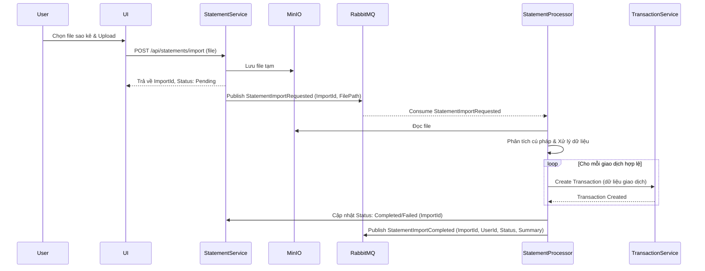
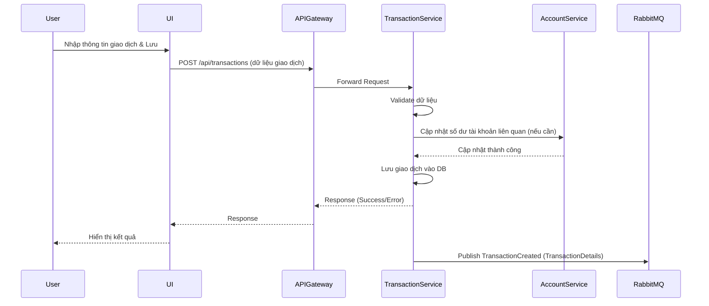

# Tài liệu Thiết kế Phân tích Nghiệp vụ (BA Design) - TiHoMo

## 1. Executive Summary

Tài liệu này mô tả thiết kế phân tích nghiệp vụ cho hệ thống Quản lý Tài chính Cá nhân (TiHoMo). Hệ thống được xây dựng theo kiến trúc microservices, sử dụng n8n làm engine điều phối workflow (dựa trên `projectbrief.md`), nhằm mục đích tự động hóa quy trình, tích hợp linh hoạt các dịch vụ, và cung cấp trải nghiệm quản lý tài chính toàn diện cho người dùng. Mục tiêu chính là giải quyết các vấn đề về kết nối hệ thống, đơn giản hóa quản lý tài chính và tăng hiệu suất (dựa trên `productContext.md` và `projectbrief.md`).

## 2. Business Context & Background

*   **Lý do dự án tồn tại:** Nhu cầu tự động hóa các quy trình nghiệp vụ tài chính cá nhân, giảm thiểu lỗi thủ công và tăng hiệu suất quản lý tài chính (`productContext.md`).
*   **Vấn đề cần giải quyết:** Khó khăn trong việc tổng hợp dữ liệu từ nhiều nguồn (ngân hàng, ví điện tử), theo dõi chi tiêu, lập ngân sách, đặt mục tiêu tài chính và quản lý các khoản đầu tư/nợ một cách hiệu quả. Cần kết nối nhiều hệ thống và đơn giản hóa việc xây dựng workflow quản lý (`productContext.md`).
*   **Môi trường nghiệp vụ:** (Cần bổ sung thông tin chi tiết về đối tượng người dùng mục tiêu, các quy trình nghiệp vụ hiện tại nếu có, và các đối thủ cạnh tranh).

## 3. Scope & Objectives

### 3.1 Scope
*   Xây dựng hệ thống TiHoMo dựa trên kiến trúc microservices được mô tả trong `design/architech_design/overview_v4.md`.
*   Bao gồm các bounded context: Identity & Access, Core Finance, Money Management, Planning & Investment, Reporting & Integration.
*   Tích hợp các dịch vụ bên ngoài (ngân hàng, ví điện tử - cần xác định cụ thể).
*   Cung cấp giao diện người dùng (web/mobile - cần xác định) để quản lý tài chính.
*   Hỗ trợ import sao kê ngân hàng.
*   Cung cấp báo cáo tài chính cơ bản và nâng cao.
*   Đảm bảo bảo mật, khả năng mở rộng và bảo trì (`projectbrief.md`).

### 3.2 Objectives
*   **OBJ-1:** Cung cấp một nền tảng tập trung để quản lý tất cả các tài khoản tài chính.
*   **OBJ-2:** Tự động hóa việc phân loại giao dịch và tạo báo cáo chi tiêu.
*   **OBJ-3:** Cho phép người dùng đặt và theo dõi ngân sách (budget) và mục tiêu tài chính (goal).
*   **OBJ-4:** Hỗ trợ quản lý nợ và các khoản đầu tư.
*   **OBJ-5:** Đảm bảo tính bảo mật và riêng tư cho dữ liệu tài chính người dùng.
*   **OBJ-6:** Cung cấp giao diện người dùng trực quan, dễ sử dụng (`productContext.md`, `projectbrief.md`).
*   **OBJ-7:** Giảm thời gian quản lý tài chính thủ công > 50% (Cần định lượng cụ thể hơn).
*   **OBJ-8:** Tăng tỷ lệ người dùng đạt được mục tiêu tài chính > 20% (Cần định lượng cụ thể hơn).

## 4. Functional Requirements

(Phần này cần được chi tiết hóa dựa trên user stories hoặc yêu cầu nghiệp vụ cụ thể. Dưới đây là các nhóm yêu cầu dựa trên kiến trúc)

### 4.1 Identity & Access (AuthService, UserService, RoleService)
*   **FR-IA-1:** Người dùng có thể đăng ký tài khoản mới. (Acceptance Criteria: Cần email/số điện thoại, mật khẩu; xác thực email/số điện thoại).
*   **FR-IA-2:** Người dùng có thể đăng nhập bằng email/mật khẩu. (AC: Xác thực thành công trả về token; xử lý sai mật khẩu, khóa tài khoản).
*   **FR-IA-3:** Người dùng có thể khôi phục mật khẩu. (AC: Gửi link/code reset qua email/số điện thoại).
*   **FR-IA-4:** Quản trị viên có thể quản lý người dùng (thêm, sửa, xóa, khóa/mở khóa).
*   **FR-IA-5:** Hệ thống hỗ trợ phân quyền dựa trên vai trò (ví dụ: User, Admin).

### 4.2 Core Finance (AccountService, TransactionService, StatementService)
*   **FR-CF-1:** Người dùng có thể thêm/sửa/xóa các tài khoản tài chính (ngân hàng, ví, tiền mặt, thẻ tín dụng). (AC: Cần nhập tên tài khoản, loại tài khoản, số dư ban đầu, đơn vị tiền tệ).
*   **FR-CF-2:** Người dùng có thể ghi nhận giao dịch thủ công (thu, chi, chuyển khoản). (AC: Cần nhập ngày, số tiền, tài khoản nguồn/đích, danh mục, ghi chú).
*   **FR-CF-3:** Hệ thống có thể import sao kê từ các ngân hàng được hỗ trợ (định dạng file: CSV, Excel - cần xác định cụ thể). (AC: Tự động nhận diện định dạng, khớp giao dịch, thông báo lỗi nếu có).
*   **FR-CF-4:** Hệ thống tự động/cho phép người dùng phân loại giao dịch. (AC: Đề xuất danh mục dựa trên lịch sử/quy tắc; cho phép tạo danh mục tùy chỉnh).
*   **FR-CF-5:** Người dùng có thể xem lịch sử giao dịch theo tài khoản, thời gian, danh mục.

### 4.3 Money Management (BudgetService, JarService, SharedExpenseService)
*   **FR-MM-1:** Người dùng có thể tạo/sửa/xóa ngân sách theo danh mục, theo tháng/quý/năm. (AC: Nhập danh mục, số tiền, chu kỳ; hiển thị tiến độ thực hiện ngân sách).
*   **FR-MM-2:** Hệ thống hỗ trợ mô hình quản lý tài chính (ví dụ: 6 Hũ - SixJars). (AC: Cho phép phân bổ thu nhập vào các hũ; theo dõi chi tiêu theo từng hũ).
*   **FR-MM-3:** Người dùng có thể tạo nhóm và quản lý chi tiêu chung. (AC: Mời thành viên, ghi nhận chi tiêu, tự động tính toán công nợ giữa các thành viên).

### 4.4 Planning & Investment (DebtService, GoalService, InvestmentService)
*   **FR-PI-1:** Người dùng có thể ghi nhận và theo dõi các khoản nợ (vay, trả góp). (AC: Nhập thông tin chủ nợ, số tiền vay, lãi suất, kỳ hạn; nhắc lịch trả nợ).
*   **FR-PI-2:** Người dùng có thể tạo và theo dõi các mục tiêu tài chính (mua nhà, mua xe, nghỉ hưu). (AC: Nhập tên mục tiêu, số tiền cần, thời hạn; gợi ý số tiền cần tiết kiệm định kỳ).
*   **FR-PI-3:** Người dùng có thể ghi nhận và theo dõi các khoản đầu tư (cổ phiếu, trái phiếu, quỹ, bất động sản). (AC: Nhập thông tin tài sản, số lượng, giá mua; cập nhật giá trị thị trường - có thể cần tích hợp API).
*   **FR-PI-4:** Người dùng có thể tạo và quản lý các mẫu giao dịch định kỳ (recurring transaction template) bao gồm thông tin về tên, mô tả, số tiền, loại giao dịch, danh mục, tài khoản, ngày bắt đầu, tần suất, và thời hạn. (AC: Cần nhập các thông tin cơ bản và quy tắc lặp lại).
*   **FR-PI-5:** Hệ thống tự động sinh ra các giao dịch dự kiến (expected transactions) dựa trên mẫu giao dịch định kỳ để dự báo dòng tiền trong tương lai. (AC: Giao dịch dự kiến được sinh ra đúng lịch trình và hiển thị trong báo cáo kế hoạch tiền mặt).
*   **FR-PI-6:** Người dùng có thể liên kết các giao dịch thực tế với giao dịch dự kiến tương ứng. (AC: Cập nhật trạng thái giao dịch dự kiến khi có giao dịch thực tế tương ứng).
*   **FR-PI-7:** Hệ thống hiển thị thông báo khi có giao dịch định kỳ sắp đến hạn hoặc đã quá hạn mà chưa được ghi nhận. (AC: Thông báo được gửi đúng thời điểm qua các kênh đã cấu hình).

### 4.5 Reporting & Integration (ReportingService, NotificationService, IntegrationService)
*   **FR-RI-1:** Hệ thống cung cấp các báo cáo tài chính cơ bản (tổng quan tài sản, dòng tiền, thu chi theo danh mục). (AC: Cho phép lọc theo thời gian, tài khoản; hiển thị biểu đồ).
*   **FR-RI-2:** Hệ thống cung cấp các báo cáo phân tích nâng cao (phân tích chi tiêu, so sánh kỳ, dự báo). (AC: Cần định nghĩa cụ thể các chỉ số và dạng biểu đồ).
*   **FR-RI-3:** Hệ thống gửi thông báo cho người dùng (sắp đến hạn trả nợ, vượt ngân sách, đạt mục tiêu). (AC: Cấu hình kênh thông báo: in-app, email, push notification).
*   **FR-RI-4:** Hệ thống tích hợp với các dịch vụ bên ngoài (ví dụ: API ngân hàng để lấy sao kê tự động - cần xác định cụ thể).

## 5. Non-Functional Requirements

*   **NFR-1 (Performance):** Thời gian phản hồi của các API chính (đăng nhập, xem giao dịch, xem báo cáo) phải dưới 2 giây với 1000 người dùng đồng thời. Import sao kê 1000 dòng phải hoàn thành dưới 30 giây.
*   **NFR-2 (Scalability):** Hệ thống phải có khả năng mở rộng (scale-out) từng microservice độc lập để đáp ứng lượng người dùng tăng gấp 10 lần trong 2 năm tới.
*   **NFR-3 (Availability):** Độ sẵn sàng của hệ thống phải đạt 99.9% (ngoại trừ thời gian bảo trì định kỳ có thông báo trước). API Gateway và các Core service phải có cơ chế HA (High Availability).
*   **NFR-4 (Security):**
    *   Tuân thủ các tiêu chuẩn bảo mật OWASP Top 10.
    *   Mã hóa dữ liệu nhạy cảm (mật khẩu, token, thông tin tài chính) cả khi lưu trữ (at rest) và truyền đi (in transit).
    *   Xác thực và phân quyền chặt chẽ (OpenID Connect, JWT, RBAC).
    *   Có cơ chế chống tấn công phổ biến (XSS, CSRF, SQL Injection).
    *   Logging và giám sát các hành vi truy cập bất thường.
*   **NFR-5 (Maintainability):** Code phải tuân theo Clean Architecture, SOLID, có unit test và integration test coverage > 80%. Có tài liệu kiến trúc và API đầy đủ. (`systemPatterns.md`)
*   **NFR-6 (Usability):** Giao diện người dùng phải trực quan, dễ học và dễ sử dụng cho đối tượng người dùng mục tiêu (`productContext.md`, `projectbrief.md`). Thời gian hoàn thành các tác vụ chính (ghi giao dịch, xem báo cáo) không quá 3 bước.
*   **NFR-7 (Reliability):** Dữ liệu tài chính phải được đảm bảo tính toàn vẹn và nhất quán, ngay cả khi có lỗi xảy ra (sử dụng transaction, event-driven sync, retry mechanism). Có cơ chế backup và restore dữ liệu định kỳ (`systemPatterns.md`).
*   **NFR-8 (Compliance):** (Cần xác định các quy định về tài chính, bảo mật dữ liệu cần tuân thủ tại thị trường mục tiêu, ví dụ: GDPR, PCI DSS nếu có xử lý thẻ).

## 6. Solution Overview & Architecture

(Dựa trên `design/architech_design/overview_v4.md` và `systemPatterns.md`)

### 6.1 Tổng quan kiến trúc
Hệ thống TiHoMo được thiết kế theo kiến trúc microservices, bao gồm các bounded context chính: Identity & Access, Core Finance, Money Management, Planning & Investment, Reporting & Integration. Mỗi service có database riêng (PostgreSQL) và giao tiếp không đồng bộ qua Message Bus (RabbitMQ) hoặc đồng bộ qua API Gateway (Ocelot).

### 6.2 Sơ đồ kiến trúc tổng thể
```mermaid
graph TD
    subgraph User Interface
        UI[Web/Mobile App]
    end

    subgraph Infrastructure
        APIGateway[API Gateway (Ocelot)]
        MessageBus[Message Bus (RabbitMQ)]
        DB_Identity[(db_identity)]
        DB_Finance[(db_finance)]
        DB_Money[(db_money)]
        DB_Planning[(db_planning)]
        DB_Reporting[(db_reporting)]
        MinIO[(File Storage)]
    end

    subgraph Services
        subgraph Identity & Access
            AuthSvc[AuthService]
            UserSvc[UserService]
            RoleSvc[RoleService]
        end
        subgraph Core Finance
            AccSvc[AccountService]
            TransSvc[TransactionService]
            StmtSvc[StatementService]
            StmtProcessor[Statement Processor]
        end
        subgraph Money Management
            BudgetSvc[BudgetService]
            JarSvc[JarService]
            SharedExpSvc[SharedExpenseService]
        end
        subgraph Planning & Investment
            DebtSvc[DebtService]
            GoalSvc[GoalService]
            InvestSvc[InvestmentService]
        end
        subgraph Reporting & Integration
            ReportSvc[ReportingService]
            NotifySvc[NotificationService]
            IntegSvc[IntegrationService]
        end
    end

    UI --> APIGateway

    APIGateway --> AuthSvc
    APIGateway --> UserSvc
    APIGateway --> RoleSvc
    APIGateway --> AccSvc
    APIGateway --> TransSvc
    APIGateway --> StmtSvc
    APIGateway --> BudgetSvc
    APIGateway --> JarSvc
    APIGateway --> SharedExpSvc
    APIGateway --> DebtSvc
    APIGateway --> GoalSvc
    APIGateway --> InvestSvc
    APIGateway --> ReportSvc

    AuthSvc --> DB_Identity
    UserSvc --> DB_Identity
    RoleSvc --> DB_Identity

    AccSvc --> DB_Finance
    TransSvc --> DB_Finance
    StmtSvc --> DB_Finance
    StmtSvc --> MinIO
    StmtSvc --> MessageBus

    StmtProcessor -- Consume --> MessageBus
    StmtProcessor --> TransSvc

    BudgetSvc --> DB_Money
    JarSvc --> DB_Money
    SharedExpSvc --> DB_Money

    DebtSvc --> DB_Planning
    GoalSvc --> DB_Planning
    InvestSvc --> DB_Planning

    ReportSvc --> DB_Reporting
    NotifySvc -- Consume --> MessageBus
    IntegSvc -- Consume --> MessageBus
    IntegSvc --> ReportSvc # Example: update report after integration
    
    # Event publishing (examples)
    TransSvc -- Publish Event --> MessageBus
    GoalSvc -- Publish Event --> MessageBus
    UserSvc -- Publish Event --> MessageBus

    # Event consumption (examples)
    ReportSvc -- Consume Event --> MessageBus
    NotifySvc -- Consume Event --> MessageBus
    BudgetSvc -- Consume Event --> MessageBus # e.g., update budget on transaction


```

### 6.3 Công nghệ chính
*   **Backend:** .NET Core (C#), ASP.NET Core
*   **API Gateway:** Ocelot
*   **Message Bus:** RabbitMQ
*   **Database:** PostgreSQL
*   **Containerization:** Docker, Kubernetes (cho production)
*   **Authentication:** OpenIddict
*   **File Storage:** MinIO
*   **Logging/Monitoring:** ELK/EFK, Prometheus, Grafana
*   **(Frontend):** (Cần xác định - ví dụ: React, Angular, Vue, Blazor)

### 6.4 Lựa chọn giải pháp (Ví dụ)
*   **Import sao kê:**
    *   **Option 1: Manual Upload:** Người dùng tải file CSV/Excel lên. (Pros: Đơn giản triển khai. Cons: Thủ công, phụ thuộc định dạng ngân hàng). Effort: Low.
    *   **Option 2: Direct Bank API Integration (Open Banking):** Kết nối trực tiếp qua API ngân hàng. (Pros: Tự động, real-time. Cons: Phức tạp, chi phí cao, cần tuân thủ quy định Open Banking). Effort: High.
    *   **Option 3: Third-party Aggregator:** Sử dụng dịch vụ trung gian (Plaid, Yodlee). (Pros: Hỗ trợ nhiều ngân hàng, chuẩn hóa dữ liệu. Cons: Chi phí dịch vụ, phụ thuộc bên thứ ba). Effort: Medium.
    *   **Recommendation:** Bắt đầu với Option 1, lên kế hoạch cho Option 2/3 trong tương lai.

## 7. Data Models & Process Flows

### 7.1 Data Models (Sơ lược)
*   **User:** UserId, Email, PasswordHash, FullName, CreatedAt, IsActive.
*   **Account:** AccountId, UserId, AccountName, AccountType (Bank, Wallet, Cash), Currency, InitialBalance, CurrentBalance, CreatedAt.
*   **Transaction:** TransactionId, AccountId, UserId, Amount, Type (Income, Expense, Transfer), TransactionDate, CategoryId, Notes, IsImported, LinkedTransactionId (for transfers).
*   **Category:** CategoryId, UserId, Name, ParentCategoryId, Type (Income, Expense).
*   **Budget:** BudgetId, UserId, CategoryId, Amount, Period (Monthly, Quarterly, Yearly), StartDate, EndDate.
*   **Goal:** GoalId, UserId, Name, TargetAmount, CurrentAmount, TargetDate, Description.
*   **StatementImport:** ImportId, UserId, FileName, FilePath (MinIO), Status (Pending, Processing, Completed, Failed), ImportDate, RawData.

(Cần chi tiết hóa các model khác và mối quan hệ giữa chúng)

### 7.2 Process Flows (Ví dụ)

**Luồng Import Sao kê (Manual Upload):**


**Luồng Ghi nhận Giao dịch Thủ công:**

(Cần bổ sung các luồng quy trình quan trọng khác như: Đăng ký, Đăng nhập, Tạo Ngân sách, Tạo Mục tiêu, v.v.)

## 8. UI/UX Mockups

(Phần này cần được bổ sung bởi đội ngũ thiết kế UI/UX. Nên bao gồm wireframes hoặc mockups cho các màn hình chính: Dashboard, Quản lý Tài khoản, Danh sách Giao dịch, Tạo Giao dịch, Báo cáo, Ngân sách, Mục tiêu.)

*   **Mockup-1:** Dashboard chính (Tổng quan tài sản, chi tiêu gần đây, tiến độ ngân sách/mục tiêu).
*   **Mockup-2:** Màn hình quản lý tài khoản.
*   **Mockup-3:** Màn hình danh sách và lọc giao dịch.
*   **Mockup-4:** Màn hình báo cáo (biểu đồ thu chi).
*   **Mockup-5:** Màn hình tạo/quản lý ngân sách.

## 9. Risks, Assumptions & Dependencies

### 9.1 Risks
*   **RISK-1:** Khó khăn trong việc tích hợp với API của các ngân hàng/ví điện tử khác nhau (định dạng, độ ổn định, chi phí). Mitigation: Bắt đầu với import thủ công, đánh giá kỹ các lựa chọn tích hợp tự động.
*   **RISK-2:** Người dùng lo ngại về bảo mật dữ liệu tài chính cá nhân. Mitigation: Áp dụng các biện pháp bảo mật mạnh mẽ, minh bạch về chính sách dữ liệu.
*   **RISK-3:** Yêu cầu nghiệp vụ thay đổi thường xuyên trong quá trình phát triển. Mitigation: Quy trình quản lý thay đổi linh hoạt (Agile), BA làm việc sát với stakeholder.
*   **RISK-4:** Hiệu năng hệ thống không đáp ứng khi lượng dữ liệu lớn. Mitigation: Thiết kế tối ưu database, query; sử dụng caching; thực hiện performance testing sớm.
*   **RISK-5:** Phụ thuộc vào các dịch vụ bên thứ ba (nếu sử dụng aggregator). Mitigation: Có kế hoạch dự phòng, đánh giá SLA của nhà cung cấp.

### 9.2 Assumptions
*   **ASSUMP-1:** Người dùng có kiến thức cơ bản về quản lý tài chính cá nhân.
*   **ASSUMP-2:** Dữ liệu sao kê từ các nguồn là chính xác và đủ thông tin cần thiết.
*   **ASSUMP-3:** API Gateway và Message Bus đủ khả năng xử lý tải dự kiến.
*   **ASSUMP-4:** Các microservices có thể được phát triển và triển khai độc lập.

### 9.3 Dependencies
*   **DEP-1:** Thiết kế UI/UX phải được hoàn thành trước khi bắt đầu phát triển frontend.
*   **DEP-2:** Cần có môi trường staging mô phỏng production để kiểm thử tích hợp.
*   **DEP-3:** Phụ thuộc vào hạ tầng Cloud/Server để triển khai.
*   **DEP-4:** Phụ thuộc vào các thư viện/framework (.NET Core, RabbitMQ Client, Ocelot, etc.).
*   **DEP-5:** (Nếu tích hợp) Phụ thuộc vào tài liệu và sự ổn định của API/dịch vụ bên ngoài.

## 10. Appendices

*   **Appendix A:** Bảng chú giải thuật ngữ (Glossary).
*   **Appendix B:** Danh sách các bên liên quan (Stakeholders).
*   **Appendix C:** User Stories chi tiết (nếu có).
*   **Appendix D:** Đặc tả API chi tiết (link tới Swagger/OpenAPI docs).

---
*Tài liệu này được tạo dựa trên `design/architech_design/overview_v4.md` và các tệp trong Memory Bank.*
*Cần bổ sung và chi tiết hóa các phần yêu cầu nghiệp vụ, UI/UX, và các quyết định thiết kế cụ thể hơn.* 