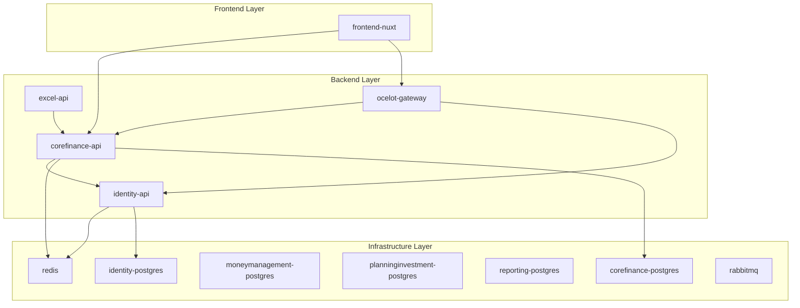

# TiHoMo Deployment Guide - Service-Specific Deployment

## Overview

Hệ thống deploy mới của TiHoMo đã được tách thành các workflow riêng biệt để tối ưu thời gian deploy và tránh việc block giữa các services. Thay vì deploy toàn bộ hệ thống cùng lúc, giờ đây bạn có thể:

- Deploy từng service riêng lẻ
- Deploy theo nhóm services (infrastructure, backend, frontend)  
- Quản lý dependencies tự động
- Rollback nhanh chóng khi có lỗi

## 🏗️ Kiến trúc Deploy mới

### 1. Service Categories & Dependencies



### 2. Deployment Workflows

#### 🔄 Available Workflows

1. **`deploy-infrastructure.yml`** - Deploy databases, Redis, RabbitMQ
2. **`deploy-backend-services.yml`** - Deploy APIs và Gateway  
3. **`deploy-frontend.yml`** - Deploy Nuxt frontend
4. **`deploy-orchestrator.yml`** - Master workflow điều phối tất cả

## 🚀 Cách sử dụng

### Manual Deployment via GitHub Actions

#### A. Deploy Orchestrator (Recommended)

1. Vào **Actions** tab trên GitHub
2. Chọn **"TiHoMo Deployment Orchestrator"**
3. Click **"Run workflow"**
4. Chọn options:

```yaml
deployment_type: 
  - full-system          # Deploy tất cả
  - infrastructure-only  # Chỉ databases, Redis, RabbitMQ  
  - backend-only         # Chỉ APIs
  - frontend-only        # Chỉ frontend
  - specific-service     # Chỉ services cụ thể

environment: development|staging|production
specific_services: "identity-api,frontend-nuxt"  # Nếu chọn specific-service
force_rebuild: true|false
```

#### B. Deploy Individual Components

**Deploy Infrastructure:**
```yaml
Workflow: deploy-infrastructure.yml
Options:
  environment: development|staging|production
  force_rebuild: true|false
```

**Deploy Backend Services:**
```yaml
Workflow: deploy-backend-services.yml  
Options:
  environment: development|staging|production
  services: "all" hoặc "identity-api,corefinance-api,excel-api,ocelot-gateway"
  force_rebuild: true|false
  skip_infrastructure_check: true|false
```

**Deploy Frontend:**
```yaml
Workflow: deploy-frontend.yml
Options:
  environment: development|staging|production
  force_rebuild: true|false
  skip_backend_check: true|false
```

### Local Script Deployment

Sử dụng script `scripts/deploy-single-service.sh`:

```bash
# Deploy single service
./scripts/deploy-single-service.sh identity-api

# Deploy với environment và force rebuild
./scripts/deploy-single-service.sh frontend-nuxt production true

# Xem help
./scripts/deploy-single-service.sh --help
```

## 🔧 Dependency Management

### Automatic Dependency Handling

Hệ thống tự động xử lý dependencies:

1. **Pre-deployment check**: Kiểm tra dependencies có running không
2. **Stop dependents**: Stop các services phụ thuộc trước khi deploy
3. **Deploy service**: Deploy service được chọn
4. **Restart dependents**: Khởi động lại các services đã stop

### Example: Deploy CoreFinance API

```bash
# Khi deploy corefinance-api, hệ thống sẽ:

1. Check: identity-postgres, corefinance-postgres, redis, identity-api đang chạy
2. Stop: excel-api, ocelot-gateway, frontend-nuxt (vì phụ thuộc corefinance-api)
3. Deploy: corefinance-api mới
4. Restart: excel-api, ocelot-gateway (frontend không auto restart để tránh conflict)
```

## ⚡ Deployment Scenarios

### 1. Fix Bug trong Identity API

```bash
# Chỉ deploy identity-api
gh workflow run deploy-backend-services.yml \
  -f environment=production \
  -f services=identity-api \
  -f force_rebuild=true
```

**What happens:**
- Stop: corefinance-api, excel-api, ocelot-gateway, frontend-nuxt
- Deploy: identity-api mới
- Restart: corefinance-api, excel-api, ocelot-gateway
- Manual: Khởi động frontend sau khi đã test backend

### 2. Update Frontend UI

```bash
# Chỉ deploy frontend
gh workflow run deploy-frontend.yml \
  -f environment=production \
  -f force_rebuild=true
```

**What happens:**
- Check: ocelot-gateway, corefinance-api đang running
- Stop: frontend-nuxt hiện tại
- Deploy: frontend-nuxt mới
- Health check: Kiểm tra frontend kết nối được backend

### 3. Database Migration

```bash
# Deploy infrastructure với rebuild
gh workflow run deploy-infrastructure.yml \
  -f environment=production \
  -f force_rebuild=true
```

**What happens:**
- Deploy databases với backup tự động
- Không ảnh hưởng đến APIs đang chạy
- Manual: Deploy backend sau khi migration xong

### 4. Full System Deploy (Zero Downtime)

```bash
# Deploy toàn bộ hệ thống
gh workflow run deploy-orchestrator.yml \
  -f deployment_type=full-system \
  -f environment=production \
  -f force_rebuild=false
```

**What happens:**
1. Deploy infrastructure (databases, Redis, RabbitMQ)
2. Deploy backend APIs theo thứ tự dependency  
3. Deploy frontend
4. Comprehensive health check
5. Send Discord notification

## 🏥 Health Checks & Rollback

### Automatic Health Checks

Mỗi service được deploy sẽ có health check tự động:

- **APIs**: `GET /health` endpoint
- **Frontend**: HTTP response check
- **Redis**: `PING` command
- **RabbitMQ**: `rabbitmq-diagnostics ping`
- **Databases**: Connection test

### Manual Rollback

Nếu có lỗi, rollback bằng cách:

```bash
# Rollback về commit trước đó
git revert <commit-hash>
git push origin <branch>

# Hoặc deploy lại với commit cũ
gh workflow run deploy-orchestrator.yml \
  -f deployment_type=specific-service \
  -f specific_services=identity-api \
  -f force_rebuild=true
```

## 📊 Monitoring & Notifications

### Discord Notifications

Mỗi deployment sẽ gửi notification với:
- ✅ Success/❌ Failed status
- 📊 Deployment info (environment, services, commit)
- 🏗️ Component status (Infrastructure, Backend, Frontend)
- 🔗 Access URLs
- 📋 Link to detailed logs

### Health Check Reports

Comprehensive health check bao gồm:
- Service status check
- API connectivity test  
- Resource usage monitoring
- Integration test (frontend ↔ backend)

## 🎯 Best Practices

### 1. Development Workflow

```bash
# 1. Develop & test locally
make dev

# 2. Deploy to development environment
gh workflow run deploy-orchestrator.yml \
  -f deployment_type=specific-service \
  -f specific_services=identity-api \
  -f environment=development

# 3. Test trên development
# 4. Deploy to production
gh workflow run deploy-orchestrator.yml \
  -f deployment_type=specific-service \
  -f specific_services=identity-api \
  -f environment=production
```

### 2. Emergency Fixes

```bash
# Hot fix cho production
gh workflow run deploy-backend-services.yml \
  -f environment=production \
  -f services=corefinance-api \
  -f force_rebuild=true \
  -f skip_infrastructure_check=true
```

### 3. Scheduled Maintenance

```bash
# Full system maintenance
gh workflow run deploy-orchestrator.yml \
  -f deployment_type=full-system \
  -f environment=production \
  -f force_rebuild=true \
  -f skip_health_checks=false
```

## ⚠️ Important Notes

### 1. Environment Variables

Đảm bảo các environment variables được cấu hình đúng trong GitHub Secrets:
- Database passwords
- JWT secrets  
- OAuth client IDs
- Redis/RabbitMQ passwords

### 2. Branch Strategy

- `master` → `production` environment
- `develop` → `development` environment
- Manual trigger có thể override environment

### 3. Service Dependencies

**Critical dependencies phải running trước:**
- APIs → Databases, Redis
- Frontend → Gateway, APIs
- Gateway → Identity API, CoreFinance API

### 4. Backup Strategy

- Infrastructure deployment tự động backup databases
- Rollback bằng cách deploy commit cũ
- Keep 5 most recent backups

## 🔍 Troubleshooting

### Common Issues

1. **Dependencies not running**
   ```bash
   # Fix: Deploy infrastructure first
   gh workflow run deploy-infrastructure.yml
   ```

2. **Build failed**
   ```bash
   # Fix: Force rebuild without cache
   gh workflow run deploy-* -f force_rebuild=true
   ```

3. **Health check failed**
   ```bash
   # Fix: Check service logs
   docker compose logs <service-name>
   ```

4. **Port conflicts**
   ```bash
   # Fix: Update port configuration in GitHub Variables
   ```

### Debug Commands

```bash
# Check service status
docker compose ps

# View service logs  
docker compose logs <service-name>

# Manual health check
docker compose exec <service-name> curl http://localhost:8080/health

# Resource usage
docker stats
```

---

## 🎉 Benefits of New System

1. **⚡ Faster deployments** - Deploy chỉ services cần thiết
2. **🔒 Reduced risk** - Tách biệt services giảm impact lỗi
3. **🔄 Better dependency management** - Tự động handle dependencies
4. **📊 Better monitoring** - Chi tiết status từng component
5. **🚀 Zero downtime** - Rolling deployment strategy
6. **💬 Better communication** - Discord notifications chi tiết

Với hệ thống mới này, việc deploy TiHoMo trở nên linh hoạt và đáng tin cậy hơn rất nhiều!